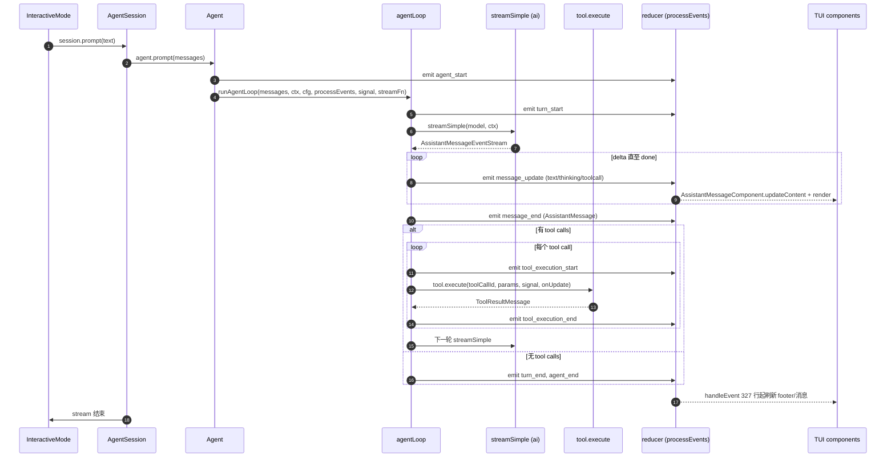
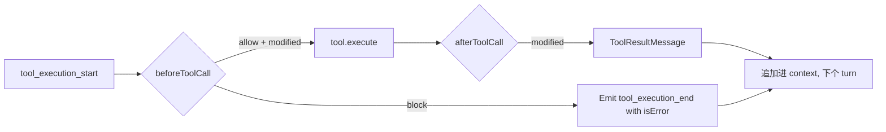

# 04 · 核心运行时：Agent / AgentLoop / Harness

> 本章回答："一次 prompt 在 pi 里是怎么跑起来的，又是怎么结束的？"
> 关键词：reducer、turn-by-turn 状态机、lane、append-only record log。

## 4.1 总览：四类对象

`packages/agent/src/` 中存在四种对象的清晰分层：

- **`Agent`**（`agent.ts`）：有状态的对外封装。持有 `AgentState` 与运行队列。对外暴露 `run / continue / abort / queue`。
- **`agentLoop` / `agentLoopContinue`**（`agent-loop.ts`）：无状态的 turn-by-turn 状态机。它**只发事件、不保存消息**，状态维护全交给 `Agent.processEvents`。
- **`AgentLoopConfig`**：把 `streamFunction / convertToLlm / beforeToolCall / afterToolCall / transformSystemPrompt / onPayload / onResponse` 等钩子打包，作为上层注入点。
- **`AgentHarness`**（`harness/agent-harness.ts`）：契约表面 + reducer 签名。当前实例化实现是 `harness/reducer.ts` 配 `harness/session/jsonl/storage.ts`。



> 这张图说明什么：核心是一个 **reducer-only side-effect producer** 的模式。`agentLoop` 完全不知道自己发出的事件被谁消费；reducer 也不知道 turn 之间的协议。两者通过 `AgentEvent` 解耦。

## 4.2 `Agent` 的 reducer：不可变状态 + 单写者

`packages/agent/src/agent.ts:544-591` 的 `processEvents`：

```ts
private async processEvents(event: AgentEvent): Promise<void> {
    switch (event.type) {
        case "message_start":
            this._state.streamingMessage = event.message;
            break;
        case "message_update":
            this._state.streamingMessage = event.message;
            break;
        case "message_end":
            this._state.streamingMessage = undefined;
            this._state.messages.push(event.message);
            break;
        case "tool_execution_start": {
            const pendingToolCalls = new Set(this._state.pendingToolCalls);
            pendingToolCalls.add(event.toolCallId);
            this._state.pendingToolCalls = pendingToolCalls;
            break;
        }
        // tool_execution_end 用相同模式 delete
        case "turn_end":
            if (event.message.role === "assistant" && event.message.errorMessage) {
                this._state.errorMessage = event.message.errorMessage;
            }
            break;
        case "agent_end":
            this._state.streamingMessage = undefined;
            break;
    }
    // ... 派发给 listeners（带 signal）
}
```

### 4.2.1 用户视角

你不会直接碰到 reducer，但你的体验就靠它：

- 流式输出"实时刷新"靠 `message_update` + `AgentSession` 的事件订阅推到 `AssistantMessageComponent.updateContent`。
- "Ctrl+C 中断当前" 靠 `app.clear` 触发 abort，`processEvents` 收 `agent_end` 后 UI 自动复原。
- "工具在跑时 status 显示 Working" 来自 `tool_execution_start` 切换 `WorkingStatusIndicator`。

### 4.2.2 开发者视角

要点：

- **`pendingToolCalls` 使用 copy-on-write**——`new Set(this._state.pendingToolCalls)` 再 `add/delete`，保证旧 state 引用在 reducer 调用链上不变。这是**单写者 reducer** 的关键。
- **`messages` 数组是可变但有 setter 包装**（`packages/agent/src/types.ts:340-345`）。注意，`agent-loop.ts:319-323, 336-337, 349-353, 365-367` 在流式期间会就地写入同一数组——这是 streaming 的"性能性"特例，不破坏 reducer 的概念边界，但**不是严格的 Elm-style 不可变**。
- **`activeRun` + `AbortController`** 持有并发控制：每次 `runPromptMessages` 创建新的 `AbortController`，对 listener 用 signal。

### 4.2.3 架构师视角

reducer 模式的两个收益：

1. **可序列化**：`messages` 历史随时可以序列化（事实也确实如此——`session/jsonl/storage.ts` 把每条 `AgentMessage` 写盘）。
2. **可校验**：`agent-loop.ts:319-353` 的"覆盖式更新"是 streaming 期间唯一一处直接 mutating，但保留的 contract 是"消息一旦 `message_end` 就不可变"。这与持久层契约一致。

设计上的取舍：完全 immutability 会在流式期间每字一字生成新对象，对 LLM 流（每 token 一次 delta）代价过高。所以项目允许 mutating 一个数组，前提是**单写者**（reducer），其他所有路径都视为只读。

## 4.3 `agentLoop` 与 `runLoop` 的状态机

`packages/agent/src/agent-loop.ts` 的关键结构：

- `runAgentLoop`（:95-117）：emit `agent_start` 与 `turn_start`，把 prompt 写入 context，构造 wrapper stream，调用 `runLoop`。
- `runLoop`（:155-275）：流式 provider 输出、解析 tool_calls、并行触发 `beforeToolCall` → `tool.execute` → `afterToolCall`、把 `ToolResultMessage` 追加进 context、决定是否继续 turn，最后 emit `agent_end`。
- `streamAssistantResponse`（:281-371）：把 `AssistantMessageEventStream` 映射到 `AgentEvent`（`message_start / message_update(message, assistantMessageEvent) / message_end`）；特别是在 `done` 或 `error` 时调用 `response.result()` 拿到 `finalMessage` 再 emit `message_end`。

### 4.3.1 用户视角

"为什么流式输出能逐字前进而 tool call 又能在中途插入？"

- provider 给我们的 `AssistantMessageEventStream` 把 assistant message **与正在进行的 delta 合并**回同一个 `AssistantMessage` 对象（`:314-353`），所以 `message_update` 携带的 `message` 字段始终是"最新的逐步长 message"。
- reducer 收到 `message_start` 时创建 `streamingComponent = new AssistantMessageComponent(undefined, ...)`（`interactive-mode.ts:3130-3141`），后续 `message_update` 调 `streamingComponent.updateContent(streamingMessage, true)` 持续刷新。

### 4.3.2 开发者视角

如果要在自定义 hook 里接事件，最常见的三处：

1. `beforeToolCall(ctx)` / `afterToolCall(ctx, result)` — `AgentLoopConfig` 中可注入。这允许扩展拦截/改写/拒绝工具调用与结果。
2. `transformSystemPrompt(ctx)` — 改写发给 LLM 的 system prompt。
3. `onPayload(streamPayload, signal)` / `onResponse(streamResponse, signal)` — 把 wire-level 事件向上抛（agent-session 的 `before_provider_payload / after_provider_response` 监听来自这里）。

### 4.3.3 架构师视角

`agent-loop.ts:319-353` 直接 mutating `_state.messages` 是**有意为之的单写者让步**：

- 流式期间 LLM 一次 turn 平均会产生 50-200 个 `text_delta`。如果坚持 immutability，每次 delta 都新建整个消息数组，对 GC 非常不友好。
- 项目通过**类型契约 + 测试**保证"未到 `message_end` 不可被任何其他路径读取到这条消息"——`Agent.processEvents` 收 `message_start` 后才在 reducer 内部逐步进入 lifecycle，其他人只能在 reducer 跑完后通过 `streamingMessage` 引用看到。
- 这是性能 vs 严格的明确权衡。第 5 章会看到持久层仍然能依赖"`message_end` 后不可变"这个不变量。

## 4.4 事件联合：`AgentEvent`

`packages/agent/src/types.ts:428-443`：

```ts
export type AgentEvent =
    | { type: "agent_start" }
    | { type: "agent_end"; messages: AgentMessage[] }
    | { type: "turn_start" }
    | { type: "turn_end"; message: AgentMessage; toolResults: ToolResultMessage[] }
    | { type: "message_start"; message: AgentMessage }
    | { type: "message_update"; message: AgentMessage; assistantMessageEvent: AssistantMessageEvent }
    | { type: "message_end"; message: AgentMessage }
    | { type: "tool_execution_start"; toolCallId: string; toolName: string; args: any }
    | { type: "tool_execution_update"; toolCallId: string; toolName: string; args: any; partialResult: any }
    | { type: "tool_execution_end"; toolCallId: string; toolName: string; result: any; isError: boolean };
```

10 段事件，三层嵌套（agent / turn / message）+ 三个 tool 事件。判别字段 `type` 在所有事件都存在。

### 4.4.1 用户视角

整个 TUI 是这个事件联合的镜像：

- `agent_start` → 切到 Working。
- `message_start`/`update`/`end` → AssistantMessageComponent 生命周期。
- `tool_execution_*` → ToolExecutionComponent 生命周期。
- `agent_end` → 切回 Idle，清除 streaming refs。

### 4.4.2 开发者视角

写扩展时几乎不直接消费 `AgentEvent`——你消费 `extension EventBus` 上的`agent_start / turn_end / message_end / tool_call / tool_result` 等。`AgentSession._emitExtensionEvent`（`:726-807`）是把这两层事件打通的地方，它把 `AgentEvent` 翻译成扩展侧的 `ExtensionEvent`，必要时并发触发 `before_tool_call / after_tool_call` 等。

### 4.4.3 架构师视角

判别联合 + `message_update.assistantMessageEvent` 字段是这套设计的两个关键：

1. **判别字段**让下游无需 `instanceof` 即可分支。
2. **携带原始 provider 事件**让扩展/UI 可以做"provider-level"的视图（比如在 UI 里显示 thinking delta 的特殊样式，又不丢失 type）。

## 4.5 Harness 的 lane 与 outcome 联合

`packages/agent/src/harness/agent-harness.ts:152-160`：

```ts
export interface LaneInfo {
    name: string;
    leafId: string | null;
    operation: null | {
        id: string;
        kind: "run" | "compaction" | "navigation";
        status: "running" | "suspending" | "aborting";
    };
}
```

而 `agent-harness.ts:89-131` 是 7 个 outcome 联合：

```ts
export type RunOutcome =
    | { kind: "completed"; leafId; finalEntryId; finalMessage }
    | { kind: "aborted";  leafId; finalEntryId; finalMessage }
    | { kind: "failed";   leafId; error; finalEntryId?; finalMessage? }
    | { kind: "suspended"; leafId; finalEntryId; deferred: DeferredHandle };

export type CompactionOutcome = … ; // completed / declined / aborted / failed
export type NavigationOutcome = … ; // completed / declined / aborted / failed
```

每种 outcome 还配套对应 `*Rejected`（即拒绝路径，如 `LaneBusy`、`MissingIdentities`、`NoActiveRun`、`HarnessFault`），用 `ResultValue<T, E>` 包装。

### 4.5.1 用户视角

你不会直接接触 Harness。但你能看到的"取消"、"重试"、"分支"行为都从一个 outcome 联合上来：

- 按 `Escape`（`app.interrupt`）发 abort → 当前 run 收到 `Aborted` 联合。
- 自动 compaction 跑完后 → UI 插入 `CompactionSummaryMessageComponent`。
- 项目信任过期的状态下 suspend → 进程不会爆栈，下次启动时 resume。

### 4.5.2 开发者视角

要扩展 harness 行为：

- 在 `runner.emit*` 钩子里插入逻辑（例如 `emitBeforeAgentStart`，详见第 6 章）。
- **不要**绕开 reducer 自己 mutate `AgentState`。所有持久的 lane 状态都从 record log 重放。
- `OperationKind = "run" | "compaction" | "navigation"` 是**封闭联合**——新增 kind 需要同时改类型 + 运行时的 lane-map，编译期会拒绝拼写错误。

### 4.5.3 架构师视角

`LaneBusy`、`MissingIdentities` 等标签化错误（TaggedError）在 `agent-harness.ts:28-33` 用 `class … extends TaggedError("LaneBusy")<…> {}` 的形态定义。这样上层可以 `error instanceof LaneBusy` 模式匹配，同时类型上仍能保证 exhaustive 拒绝分支。

`RecordLogCorruption` 在 `reducer.ts:22-44` 列举：`multiple_open_operations` / `unknown_operation` / `record_after_finish` / `non_consecutive_attempt` / `bad_signature` / 等。这些是**运行时校验 + 类型系统不变量**的复合防护层。

## 4.6 工具钩子：`beforeToolCall` / `afterToolCall`

`AgentLoopConfig` 中可注入：

- `beforeToolCall(ctx)`：可拒绝、改写参数或返回错误。
- `afterToolCall(ctx, result)`：可改写结果或附加元数据。
- `transformSystemPrompt`：修改发给 LLM 的 system prompt。

第 7 章详细说明工具设计与执行语义；这里讲它在主循环里的位置——



> 这张图说明什么：**任何 policy 都不应写进工具里**，而是写进钩子里。工具只负责"做这件事"，"允不允许做"交给 hook 决定。这是扩展生态可塑性强的根本原因。

## 4.7 用户视角下的"为什么"

- 取消为什么瞬时生效？reducer 的 abort signal 在 listener 上同步可见，UI 在下个 tick 就把状态切回。
- 工具在跑时为什么 status 变 Working？`tool_execution_start` 切到 `WorkingStatusIndicator`；`tool_execution_end` 切回。
- 同一个 prompt 怎么跑到一半被 user 插队？`steeringQueue` / `followUpQueue` 在 `agent.ts:125-159, 231-280` 中维护，runLoop 内每轮判断并消耗。这就是为什么 Ctrl+C 之后你接着打字，下一 turn 会拼上去。

## 4.8 架构师视角下的"为什么"

- 单写者 reducer 模式 + 单向事件流让持久层可以脱钩：存什么、什么时候存，都由 reducer 的下游订阅决定。
- lane 与 outcome 是把"并发"概念"显式化"的设计：避免使用 Promise 竞态，改成判别 + state machine。
- provider wire 事件通过 `assistantMessageEvent` 透传出来，UI 既能拿到 final message，又能拿到底层事件去做特殊样式。这避免了把"raw"信息在 `AgentMessage` 上硬塞字段。
