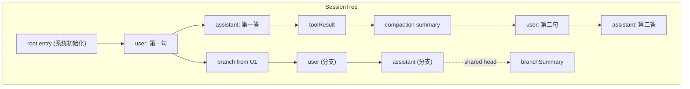
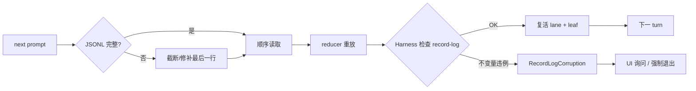

# 05 · 会话与持久化

> 一次会话从触发到死亡的整个生命周期，以及它如何在磁盘上落地。

## 5.1 三种持久形态

- **JSONL append-only**（默认）：`packages/agent/src/harness/session/jsonl/storage.ts`。每条 mutation 一次 `appendFile`，按 tail promise chain 串行化。
- **SQLite**：可选 backend，位于 `packages/session-backends/sqlite-node/`；按 session_id / leaf 索引提供更高效的"按范围读取"。
- **In-memory**：`packages/agent/src/harness/session/jsonl/inmemory-repo.ts`，测试与早期开发用。

> 三种形态都暴露同一个抽象 `SessionRepo`（`packages/agent/src/harness/session/types.ts`），而 `JSONL storage` 与 `SQLite storage` 是同 `SessionRepo` 的两个后端。

## 5.2 会话节点与树

- **`SessionEntry`**：一条记录，四种类型之一：
  - `message`：`UserMessage` / `AssistantMessage` / `ToolResultMessage`
  - `compaction`：`CompactionEntry`
  - `branchSummary`：`BranchSummaryEntry`
  - `custom`：扩展注册的任意 JSON
- **`SessionTree`**：以 `SessionEntry` 为节点的有向图。任何节点都可以成为新分支的祖先。
- **`Leaf`**：当前选中的 entry id（指针），状态全部存在 record-log，UI 只关心 leaf。



> 这张图说明什么：会话不是线性链表，而是树。用户在第 N 句处 fork 出去后，新分支与老分支共享历史头节点（这是为什么 record log 是 append-only 而树是逻辑视图）。`/tree` 切换 leaf，`/fork` 在任意 entry 上分叉新分支。

## 5.3 Append-only JSONL 的具体写入

`packages/agent/src/harness/session/jsonl/storage.ts:258-265`：

```ts
private appendQueue: Promise<unknown> = Promise.resolve();

private async appendMutation(mutation: SessionMutation): Promise<void> {
    this.appendQueue = this.appendQueue.then(() =>
        fileResult(
            await this.fs.appendFile(this.metadata.path, encodeMutation(mutation)),
            `Failed to append session ${this.metadata.path}`,
        ),
    );
    return this.appendQueue;
}
```

要点：

- 用 `appendQueue` 把 `appendFile` 串行化，**写顺序**由这个 promise chain 决定。
- `encodeMutation` 把 mutation 编码成单行 JSON（无内嵌换行），保证一行一 mutation。
- 失败统一走 `fileResult(...)`，错误带有 session path 作为上下文。

读侧：`storage.ts:64-105` 在启动时按行扫描，找到最后一个完整行（terminated by `\n`），把半截尾部**截断或修补**——这是为什么可以承受断电 / SIGKILL。

## 5.4 持久化与恢复流程



> 这张图说明什么：**append-only + reducer 重放**是为什么崩溃后能"无缝恢复"的关键——磁盘上只有 mutation，没有最终 state，重放 = 重新推导出 state。

## 5.5 reducer 重放：可恢复与不可恢复

`packages/agent/src/harness/reducer.ts:22-44`：

```ts
type RecordLogCorruptionReason =
    | "multiple_open_operations"
    | "unknown_operation"
    | "record_after_finish"
    | "non_consecutive_attempt"
    | "bad_signature"
    | ...;
```

每条记录被 reducer 读取后做两类校验：

1. **结构性**：`record.after(prevRecord)` 是否是合法后继？
2. **签名性**（当 session 加密时）：hash 与签名是否一致？

不可恢复的 corruption 会把整个 session 标 red，用户能在 TUI 看到一个 dangling banner。

### 5.5.1 用户视角

- `/session` 显示当前 session 元信息 + 统计：tokens、cost、message 数、最后 cache hit。这与 footer 的左半部分同源。
- 启动 / `pi --resume`：上一会话 reload，timeline 还原。
- 跨设备同步：因为是 append-only 文件，`git`、`iCloud Drive`、`restic` 都能直接同步。

### 5.5.2 开发者视角

写扩展如果需要持久化自定义数据：

- 优先用 `registerCustomMessage` + `appendEntry`（`extensions/types.ts:1316`）— 自动获得 JSONL 持久化与 session 同步。
- 仅在不得不写大量非结构化数据时，才直接拿 session 路径自己处理——但要保持 append-only。
- **不要**修改既有 entry。`SessionRepo` 不暴露 mutation API；只能 append。

### 5.5.3 架构师视角

为什么不直接写 SQLite？两个理由：

1. **append-only 文件的恢复性是 O(n)**——任何 reader 顺着扫描就能复原，不需要额外 fsync / WAL checkpoint。
2. **跨进程同步**（git、iCloud、rsync）天然兼容。SQLite 跨进程的"最安全"做法要 `BEGIN IMMEDIATE` 锁，对人类桌面同步不友好。

代价：按范围查询（"给我 entry #1024-2048"）要扫盘。SQLite 后端的设计正是为此存在——用户在 settings 里切换到 SQLite 时，无须改应用代码。

## 5.6 /tree / /fork / /resume 在底层是怎么做的

- `/tree`（`interactive-mode.ts:4952-5091` + `core/agent-session.ts:navigateTree`）：调 `runtime.emitBeforeTree`，跑 `TreeSelectorComponent`，用户选定 leaf 后由 reducer 改 `currentLeaf`，事件 `session_tree` 发出，所有订阅者（footer、status、扩展）同步。
- `/fork`（`interactive-mode.ts:4893-4929` + `core/agent-session.ts:fork` + `runtime.emitBeforeFork:149`）：在选定 entry 上分叉出新的 leaf ID；旧 leaf 不变。
- `/resume`（`interactive-mode.ts:5093-5129` + `runtime.switchSession`）：从历史 metadata 列表里读 session 文件，构造 `Session`，把 record-log 重放。

## 5.7 边界与陷阱

- `SessionInfoChanged` 事件（`agent-session.ts:2883-2888`）由 `setSessionName` 触发——这是为什么扩展可以用 `/name` 重命名后立即显示新标题。
- `runtimeHost.setBeforeSessionInvalidate` + `runtime.emitBeforeSwitch` + `runtime.emitBeforeFork`：所有"切换 session"的事件都先 emit 钩子，让扩展有时间清理（如断开外部资源），再执行切换。
- `message_end` 之前不要尝试持久化那条消息——`sessionEntry` 的写入往往与 reducer 的 `message_end` 在同一帧。

## 5.8 小结

- 会话结构 = 节点树 + record-log 持久化。
- append-only 是恢复简单性的来源；代价是范围查询慢（SQLite 后端可补）。
- 扩展作者写 `appendEntry` / `CustomMessage`，不要碰原始 JSONL。
