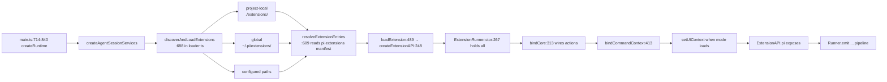
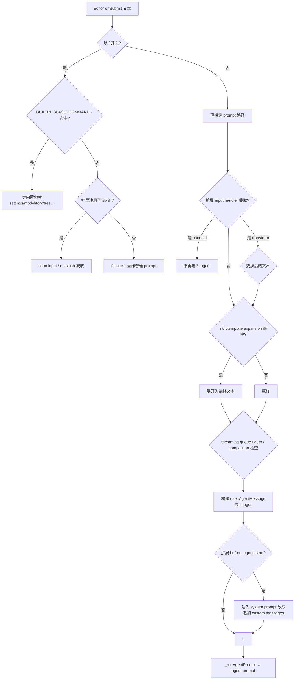

# 06 · 扩展系统

> 本章是整本手册最厚的一章：完整描述 pi 的扩展 host、API 表面、生命周期、合并规则，以及 5 个示例扩展的拆解。
> 关键词：`ExtensionAPI` / `RegisteredTool` / `wrapper` / `runner` / `loader`。

## 6.1 设计动机

`CONTRIBUTING.md` 的开篇原则：

> pi's core is minimal. If your feature does not belong in the core, it should be an extension.

理由：

1. **核心稳定性优先**：扩展改不动 main turn reducer / 持久化路径。
2. **可演化**：新增能力靠扩展开启，不需要 fork pi。
3. **沙箱边界**：所有写操作经 `ExtensionAPI`，避免裸改文件系统。

`packages/coding-agent/examples/extensions/` 已经给出 5 个示例，本章都会拆解。

## 6.2 公共契约：`types.ts`

`packages/coding-agent/src/core/extensions/types.ts`（约 1700 行）声明约 100 个公开类型/接口/函数。下列分组按"读者使用频次"排序。

### 6.2.1 UI 上下文

```ts
interface ExtensionUIContext {
    select(opts): Promise<string|string[]|undefined>;        // 通用的 string options 选择器
    confirm(opts): Promise<boolean|undefined>;               // Yes/No
    input(opts): Promise<string|undefined>;                  // 单行输入
    notify(opts): void;                                      // 状态行
    onTerminalInput(handler): void;                          // 原始 stdin 订阅（TUI）
    setStatus(key, text|undefined): void;                    // footer 状态槽
    setWorkingMessage/text/visible/indicator(...): void;     // 控制 streaming 指示器
    setHiddenThinkingLabel(text): void;                      // 覆盖 "[thought]" 标签
    setWidget(key, content|string[]|factory, opts?): void;   // 在编辑区上下嵌入组件
    setFooter/setHeader(...): void;                          // 完全替换；undefined 还原
    setTitle(text): void;                                    // terminal window title
    custom(factory, opts?): Promise<{dispose()}>;            // 真 overlay 入口
    pasteToEditor(text): void;
    setEditorText(text): void;
    getEditorText(): string;
    editor: EditorComponent;                                 // 直接拿
    addAutocompleteProvider(factory): void;
    setEditorComponent(factory): void;
    getEditorComponent(): EditorComponent;
    getAllThemes(): Theme[];
    getTheme(name): Theme;
    setTheme(name): void;
    getToolsExpanded(): boolean;
    setToolsExpanded(b): void;
}
```

> 这 22 个方法分三档：① 直接驱动（`select / confirm / input / notify`）、② 编辑器集成（`setEditorText` 簇）、③ 完全 UI 控制（`custom / setWidget / setFooter`）。**只有 `custom` 才能进真 overlay stack**。

### 6.2.2 ExtensionContext / ExtensionCommandContext

`ExtensionContext`（types.ts:307）：

```ts
interface ExtensionContext {
    ui: ExtensionUIContext;
    mode: "tui" | "rpc" | "json" | "print";
    hasUI: boolean;
    cwd: string;
    sessionManager: SessionManager;
    modelRegistry: ModelRegistry;
    model: Model;
    scopedModels: Model[];
    thinkingLevel: ThinkingLevel;
    isIdle(): boolean;
    isProjectTrusted(): boolean;
    signal: AbortSignal;
    abort(reason?): void;
    hasPendingMessages(): boolean;
    shutdown(): Promise<void>;
    getContextUsage(): ContextUsage;
    compact(opts?: CompactOptions): Promise<void>;
    getSystemPrompt(): string;
}
```

`ExtensionCommandContext extends ExtensionContext`（types.ts:353）：额外加 `getSystemPromptOptions / waitForIdle / newSession / fork / navigateTree / switchSession / reload`。

### 6.2.3 工具类型

`ToolDefinition`（types.ts:449）：

```ts
interface ToolDefinition {
    name: string;
    label: string;
    description: string;
    promptSnippet?: string;
    promptGuidelines?: string;
    parameters: TSchema;            // TypeBox
    constrainedSampling?: { ... };
    renderShell?: ComponentFactory;
    prepareArguments?(args, signal): Promise<unknown>;
    executionMode?: "sequential" | "parallel";
    execute(toolCallId, params, signal?, onUpdate?): Promise<ToolResultMessage | { content, details }>;
    renderCall(args, ctx): Component;
    renderResult(result, ctx): Component;
}
```

`defineTool(...)`（types.ts:508）identity helper，保留参数类型推导。

### 6.2.4 ExtensionAPI 表面

`pi.*`（types.ts:1198-1434）注册的接口大致分四组：

```ts
// 1) 事件订阅：36 个 on() 重载，覆盖每个 ExtensionEvent
// 2) 注册：registerTool / registerCommand / registerShortcut / registerFlag /
//          registerMessageRenderer / registerMarkdownTransformer / registerEntryRenderer
// 3) 动作：sendMessage / sendUserMessage / appendEntry / setSessionName / setLabel /
//          exec / getActiveTools / getAllTools / setActiveTools / getCommands /
//          setModel / setThinkingLevel
// 4) Provider：registerProvider（含 name+config 或完整 Provider 重载）/ unregisterProvider
//    events: EventBus
```

### 6.2.5 Resource 入口

`ExtensionFactory`（types.ts:1518）：`(pi: ExtensionAPI) => void | Promise<void>`。
`InlineExtension`（types.ts:1520）：factory 或 `{name, factory, hidden?}`。

## 6.3 生命周期：discover → load → merge → emit



> 这张图说明什么：扩展在 services 阶段加载、在 main TUI 启动前一切就绪。`bindCore` 把"动作"分发给共享 runtime，`setUIContext` 等模式装载时再注入 UI。注意：**`runner.registerTool` 调用 trigger `runtime.refreshTools`**（loader.ts:269），下次 prompt 会重建工具注册表。

## 6.4 合并规则（Runner）

`packages/coding-agent/src/core/extensions/runner.ts`：

| 注册项 | 冲突规则 | 来源行号 |
| --- | --- | --- |
| `tool` | **first-wins**（同名工具只保留先注册，Map.has 检查） | `:450-458` |
| `flag` | **first-wins** | `:473-481` |
| `shortcut` | **later-wins** + `ResourceDiagnostic` 警告 | `:494-536` |
| `command` | **dedupe 后缀**（重复名会得到 `name:2` `name:3` 等等） | `:602-630` |
| `message renderer` | **first-wins** | `:579` |
| `entry renderer` | **first-wins** | `:592` |
| `markdown transformer` | **链式**（多个 transform 顺序生效） | `:588` |
| `handler` | **链式**（await 一组 handler，合并结果） | `:801-` |

## 6.5 Prompt 决策树：`AgentSession.prompt`

`packages/coding-agent/src/core/agent-session.ts:1116-1273` 的实际处理顺序。本图覆盖你输入 `/edit src/foo.ts` 到底会怎样：



> 这张图说明什么：**`BUILTIN_SLASH_COMMANDS` 不含 `/edit`**（见 `slash-commands.ts:18-41`），所以扩展也没注册时，`/edit src/foo.ts` 会原样进 LLM，让模型自主决定调用 `edit` 工具。这是用户在 cookbook 里必须知道的一个误区。

## 6.6 工具 Wrapper：`wrapRegisteredTool`

`packages/coding-agent/src/core/extensions/wrapper.ts:16` 委托给 `packages/coding-agent/src/core/tools/tool-definition-wrapper.ts:5`：

```ts
function wrapRegisteredTool(registeredTool, runner) {
    return {
        name: registeredTool.name,
        label: registeredTool.label,
        description: registeredTool.description,
        parameters: registeredTool.parameters,
        constrainedSampling: registeredTool.constrainedSampling,
        prepareArguments: registeredTool.prepareArguments,
        executionMode: registeredTool.executionMode ?? "sequential",
        execute: async (toolCallId, params, signal, onUpdate) => {
            const ctx = runner.createContext(...);
            const result = await registeredTool.execute(toolCallId, params, signal, onUpdate, ctx);
            // detect newly activated tools
            if (newlyActivatedToolNames(result)) {
                return { ...result, addedToolNames };
            }
            return result;
        },
    };
}
```

要点：

- **复制** 8 个字段：`name / label / description / parameters / constrainedSampling / prepareArguments / executionMode / execute`。
- **略去** 5 个 prompt 与渲染字段：`promptSnippet / promptGuidelines / renderShell / renderCall / renderResult`。
- **附加** `addedToolNames`：执行后激活的工具名集合，是 deferred tools 端到端路径的关键。
- 渲染字段通过 `AgentSession.getToolDefinition`（`:917`）走完全路径，仅在 TUI / HTML 导出阶段查询——agent-core 不需要它们。

## 6.7 事件总线：12 个最常用事件

| 事件 | 时机 | 典型用途 |
| --- | --- | --- |
| `session_start` (562) | 每次 session 装载 | 资源扫描、状态初始化 |
| `session_shutdown` (616) | 即将 reload/quit/切换 | 清理外部资源 |
| `agent_start` / `agent_end` (712/717) | 一个 run 的边界 | 流式指示器/通知 |
| `turn_start` / `turn_end` (728/735) | 一次 LLM 调用的边界 | 重置每轮的临时缓存 |
| `tool_call` (904) | 工具调用前 | block / mutate args |
| `tool_result` (965) | 工具完成后 | 改写 / 注入 usage |
| `input` (831) | user 文本进入前 | transform / handled |
| `before_agent_start` (699) | 即将发系统提示 | 注入 custom messages、调整 system prompt |
| `context` (670) | LLM 调用前的 messages | 改写 / 截断 |
| `model_select` / `thinking_level_select` (794/802) | 模型/思考切换 | 同步配置 |
| `session_before_compact` / `session_compact` (592/605) | compact 前后 | 自定义压缩策略 |
| `resources_discover` (544) | 启动或 reload | 声明 skill/prompt/theme 路径 |

事件载荷与 result 类型完整定义见 `types.ts:670-1122`，例如：

```ts
type ToolCallEventResult = { block?: ToolCallBlockReason; reason?: string; terminate?: boolean };
type MessageEndEventResult = { message?: AgentMessage };  // 必须保持相同 role
type BeforeAgentStartEventResult = { systemPrompt?: string; messages?: CustomMessage[] };
```

`runner.emitMessageEnd:835` **强制校验** result.message 与原 message 同 role，否则抛错。

### 6.7.1 用户视角

- `tool_call` 钩子 + `block: true` 是扩展实现"禁止危险命令"的官方方式。
- `session_shutdown` 钩子允许扩展在退出前关闭本地句柄（文件锁、临时进程）。
- `before_agent_start` 钩子是"塞上下文"的常用入口，比改写 system prompt 更精确。

### 6.7.2 开发者视角

```ts
pi.on("tool_call", async (event, ctx) => {
    if (event.toolName === "bash" && /rm\s+-rf/.test(event.input.command)) {
        return { block: true, reason: "dangerous rm -rf rejected" };
    }
});

pi.on("before_agent_start", async (event, ctx) => {
    return {
        systemPrompt: event.systemPrompt + "\n\n当前项目规约：…",
    };
});
```

### 6.7.3 架构师视角

事件总线的设计选择：

1. **事件路径 = 钩子路径**：所有"想影响 agent 行为"的扩展都通过事件总线——没有第二个钩子系统。
2. **判别联合 result 类型**：result 类型在编译期检查"你能返回什么"，如 `ToolCallEventResult` 明确告诉你三种阻塞方式。
3. **handler 是链式还是 first-wins**：runner 中按事件类型决定。`tool_call` 与 `tool_result` 是 first-block（首个 `block: true` 终止）；`input` 是 transform 链；`session_*` 多数是 first-wins。

## 6.8 UI 模式覆盖

| 方法 | TUI | RPC | Print / JSON |
| --- | --- | --- | --- |
| `select / confirm / input / editor` | 普通 | `extension_ui_request` RPC | no-op |
| `notify / setStatus / setTitle / setEditorText / setWidget(strings)` | 普通 | fire-and-forget RPC | no-op |
| `setWidget(component factory)` | 普通 | no-op | no-op |
| `setFooter / setHeader / setWorking* / setHiddenThinkingLabel / setEditorComponent` | 普通 | no-op（返回值/操作均落空） | no-op |
| `custom / getAllThemes / setTheme / addAutocompleteProvider` | 普通 | no-op | no-op |
| `getEditorText / pasteToEditor` | 普通 | fire-and-forget RPC | no-op |

详细映射：`modes/interactive/interactive-mode.ts:2344 (createExtensionUIContext)` 与 `modes/rpc/rpc-mode.ts:136`。

> 第三种 UI 形态：**first-time setup / 启动期 trust / 缺 cwd 选择器**走 `cli/startup-ui.ts:133-161 showStartupSelector`，它**单独构造**一个 startup TUI（在 main InteractiveMode 之前），用同样的 `ProcessTerminal + TuiMainScreen + KeybindingsManager + theme` 但**直接挂载 `ExtensionSelectorComponent`**，不走 `showSelector` 也不走 overlay stack。这是项目刻意区分的第三种 UI 形态——不在你的 `pi` 交互期内，但 `cli/project-trust.ts:6-52` 与 `main.ts:660-665` 都会走它。

## 6.9 示例：`with-deps` 完整拆解

`packages/coding-agent/examples/extensions/with-deps/`：

```json
// package.json
{
    "name": "pi-extension-with-deps",
    "private": true,
    "version": "0.84.1",
    "type": "module",
    "pi": { "extensions": ["./index.ts"] },
    "dependencies": { "ms": "2.1.3" },
    "devDependencies": { "@types/ms": "2.1.0" }
}
```

```ts
// index.ts
import type { ExtensionAPI } from "@earendil-works/pi-coding-agent";
import ms from "ms";
import { Type } from "typebox";

export default function (pi: ExtensionAPI) {
    pi.registerTool({
        name: "parse_duration",
        label: "Parse Duration",
        description: "Parse a human-readable duration string …",
        parameters: Type.Object({
            duration: Type.String(),
        }),
        execute: async (_toolCallId, params) => {
            const result = ms(params.duration as ms.StringValue);
            if (result === undefined) {
                throw new Error(`Invalid duration: "${params.duration}"`);
            }
            return {
                content: [{ type: "text", text: `${params.duration} = ${result} milliseconds` }],
                details: {},
            };
        },
    });
}
```

要点：

- `pi.extensions` 是 `pi-manifest.ts:16` 的 `readPiManifest` 读取的字段。值是相对包根的入口路径。
- `ms 2.1.3` 是直连 npm 依赖；loader 的 `VIRTUAL_MODULES`（loader.ts:448）不包含 `ms`，所以 jiti 落到扩展自己的 `node_modules`，做到依赖隔离。
- `typebox` 是 `VIRTUAL_MODULES` 提供的，从 host 包复用——避免每个扩展重新打包。
- `execute` 抛错被 agent-core 转成 `isError: true` ToolResultMessage，并经过 `afterToolCall` 钩子。

## 6.10 其他示例速览

- `custom-provider-anthropic/`：通过 `registerProvider` 注入私有 Anthropic 实例。注意 `ProviderConfig.oauth.usesCallbackServer` 已被弃用（types.ts:1476 `@deprecated`），仅保留 source 兼容。
- `custom-provider-gitlab-duo/`：同上，私有 GitLab Duo。
- `sandbox/` / `gondolin/`：把工具与 `!` bash 命令路由到 micro-VM，通过 `runner.emitUserBash:955` 与 `emitToolCall` 钩子改写执行路径。
- `rpc-extension-ui.ts`：通过 RPC 在 host TUI 弹出 overlay，仅在 RPC 模式下可用。

## 6.11 已知限制与陷阱

- **Wrapper 不携带渲染字段**——agent-core 看不到 `renderCall / renderResult`。如果扩展要自定义 TUI 渲染，必须通过 `AgentSession.getToolDefinition`（`:917`）走 tool-display-only 路径。
- **`registerTool` 触发 `runtime.refreshTools`**（loader.ts:269），下次 prompt 会重建工具注册表——大量注册时谨慎。
- **session 失效后扩展句柄不可用**：`pi.newSession / fork / switchSession` 后捕获的 `pi` 与命令 `ctx` 都会在调用时抛"runtime invalidated"（loader.ts:205-212 / runner.ts:543-550 / agent-session.ts:849-851）。需要做跨 session 工作时用 `withSession`（types.ts:393-403）。
- **`tool_call` 钩子中 mutate `event.input` 不会重新做 schema 校验**（types.ts:901-902），后续 handler 看到 mutation 后的对象，**没有再校验**。
- **已弃用但仍兼容**：`ProviderConfig.oauth.usesCallbackServer`（types.ts:1476）已 deprecated。当前 OAuth 流程忽略该字段，但旧扩展可继续声明。
- **import 别名**：扩展应该从 `@earendil-works/pi-coding-agent` 引入；旧版 `@marioze-works/*` 仍可通过 `VIRTUAL_MODULES` 解析（loader.ts:65-72），但新代码统一用新命名空间。
- **No customModal / customQuestion**：搜索整个 `core/extensions+examples`，没有 `customModal` 或 `customQuestion` 符号。扩展作者应使用 `ui.custom(factory, { overlay: true })` 或直接复用 `ui.select / confirm / input`。

## 6.12 用户视角下的"为什么"

- 为什么你在终端用一个 `/login` 会看到 3 步的 LoginDialog？因为 `core/modes/interactive/components/login-dialog.ts` 是默认的 provider auth UI，扩展可注册同名替换。
- 为什么扩展能"拦截"某些危险命令？因为它能 `pi.on('tool_call', ...)` 返回 `{ block: true, ... }`——`runner.emitToolCall:932-948` 短路处理。
- 为什么 TUI 在我重启后会"全屏覆盖"？因为 `TuiAltScreen`（`modes/interactive/interactive-mode.ts:342-350`）会进入 alt-screen；退出 alt 用 `TuiMainScreen`。

## 6.13 架构师视角下的"为什么"

- **事件总线 = 钩子中心化**——policy / tool / UI 三个传统混沌领域的边界，靠一个统一判别联合 + 链式合并规则就能撑住。
- **Wrapper 的字段不对称是有意的**：agent-core 要保持极简，所以 5 个 prompt/渲染字段下沉到 ToolDefinition 层。这让 agent-core 可以被任何"非 TUI 客户端"复用，比如 RPC server 直接重发 agent-core 事件而不依赖 TUI 组件。
- **`addedToolNames` 是 deferred-tools 兼容钉**：与 e47b8e3 引入的 native `tool_reference`（anthropic-messages.ts:939-1024, 1081-1114）配对，确保当某个工具激活"扩展工具集合"时，下一轮 LLM 调用能看到完整 schema。
