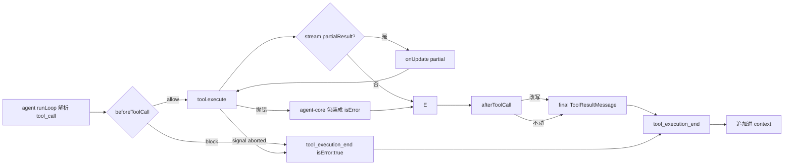

# 07 · 工具系统

> pi 的可执行原子单位。本章讲清楚一个工具从注册到结果返回的全过程，以及它和 file mutation queue 的协作。

## 7.1 两种工具类型

| 类型 | 字段数 | 适用场景 | 文件位置 |
| --- | --- | --- | --- |
| `AgentTool` | 8（见下） | 注册到 agent-core；执行 | `packages/agent/src/types.ts:385-400` |
| `ToolDefinition` | 13（含 5 个渲染字段） | 扩展使用；可被 TUI 渲染、HTML 导出 | `packages/coding-agent/src/core/extensions/types.ts:449-497` |

`AgentTool`：

```ts
interface AgentTool<TSchema extends TSchema = TSchema> {
    name: string;
    label: string;
    description: string;
    parameters: TSchema;
    execute(
        toolCallId: string,
        params: Static<TSchema>,
        signal?: AbortSignal,
        onUpdate?: (partial: ToolResultMessage) => void,
    ): Promise<ToolResultMessage | { content: Content[]; details: unknown }>;
}
```

> **参数顺序**：`(toolCallId, params, signal?, onUpdate?)`。**注意**：早期文档里把这个签名写成 `(toolCallId, params, _onUpdate, _ctx)`，那是 2024-Q1 重构前的形态。当前源码与 AGENTS.md 都强制新签名。

`ToolDefinition` 多出的 5 个字段：
- `promptSnippet`
- `promptGuidelines`
- `constrainedSampling`
- `prepareArguments(args, signal)`
- `renderShell / renderCall / renderResult`
- `executionMode?: "sequential" | "parallel"`

这些字段只在 TUI / HTML 导出时使用。`wrapRegisteredTool` 不把它们带到 `AgentTool`，所以 agent-core 永远看不到它们。

## 7.2 内置工具表

| 工具 | 文件 | 行为 |
| --- | --- | --- |
| `read` | `core/tools/read.ts` | 读文件（offset/limit、image 输出） |
| `write` | `core/tools/write.ts` | 创建/覆盖文件，参与 `file-mutation-queue` |
| `edit` | `core/tools/edit.ts` | 基于唯一锚点的精确替换；`edit-diff.ts` 提供 diff 渲染 |
| `bash` | `core/tools/bash.ts` | 执行 shell：前/后台、timeout、信号、截断、`!`/`!!` 模式 |
| `grep` | `core/tools/grep.ts` | ripgrep 风格（include/exclude/正则） |
| `find` | `core/tools/find.ts` | 文件名查找 |
| `ls` | `core/tools/ls.ts` | 目录列表 |
| `truncate` | `core/tools/truncate.ts` | 长输出截断；与所有命令配合 |

辅助模块：
- `file-mutation-queue.ts`：跨工具序列化文件变更。
- `output-accumulator.ts`：流式 stdout/stderr 累积到 turn 边界。
- `utils/shell.ts`：子进程树清理（`killTrackedDetachedChildren`）。

## 7.3 工具上下文与钩子

`AgentLoopConfig` 中可注入（不是工具内部，是 agent 注入）：

- `beforeToolCall(ctx)`：可拒绝、改写参数或返回错误。
- `afterToolCall(ctx, result)`：可改写结果或附加元数据。
- `transformSystemPrompt`：修改发给 LLM 的 system prompt。

`ctx` 含当前会话的所有信息：`cwd / message / agent / signal / toolCallId / parameters / toolName`。

## 7.4 工具执行生命周期



> 这张图说明什么：**抛错 → isError**。任何工具实现都可以 throw，agent-core 会捕获并 `isError: true` 不会中断 turn。同理 `signal.aborted` 也走相同错误路径。

## 7.5 Bash 执行的细节

`core/tools/bash.ts` 是用户最常打交道的工具，所以实现暴露了多个旋钮：

- **timeout**：默认 60s，可被工具调用覆盖。
- **前台 / 后台**：`&` 风格意味着返回后台 task id，`onUpdate` 持续拿到输出。
- **`!` / `!!` 模式**：编辑器的 `setupEditorSubmitHandler` 把它分流到 `handleBashCommand`，不经 `session.prompt`。
- **工作目录**：基于 session cwd + `$HOME` 解析。
- **信号**：SIGINT 透传到子进程；`utils/shell.ts:killTrackedDetachedChildren` 清理进程树。
- **白名单**：由扩展或父 `AgentLoop` 的 `beforeToolCall` 决定——工具本身不做 allow/deny。

## 7.6 文件变更一致性

`core/tools/file-mutation-queue.ts` 的设计目标：

> **写、删、改、移动不分先后**，但 disk 上必须**串行发生**，且**失败时不留半截状态**。

```ts
class FileMutationQueue {
    queue: Promise<unknown> = Promise.resolve();
    run<T>(op: () => Promise<T>): Promise<T> {
        this.queue = this.queue.then(op, op);
        return this.queue;
    }
}
```

约束：

- 每个写入工具（`write / edit / mv / rm/??`）都把操作 `run()` 进去。
- 抛错时下一个 op 仍跑；错误都附在 promise chain 里，避免破坏顺序。
- 跨工具的"先读后写"在工具内部协调——不在 queue API 上调度。

## 7.7 输出截断与累积

- `core/tools/truncate.ts`：把单条消息可见长度限制为 N 行 / M 字节。截断点保留 marker（如 `[truncated] …`）。
- `core/tools/output-accumulator.ts`：流式 stdout/stderr 在 turn 边界聚合。`onUpdate` 在 streaming 时持续 emit。
- 与 `Event` 接口一致：`tool_execution_update` 带 `partialResult`，`tool_execution_end` 带 final。

## 7.8 工具调用与 mutating args

`agent-session.ts:479-533` 的 `_installAgentToolHooks` 把 agent 的 `beforeToolCall / afterToolCall` 接给 runner：

```ts
agent.beforeToolCall = async (ctx) => {
    const result = await runner.emitToolCall({
        toolName: ctx.toolName,
        toolCallId: ctx.toolCallId,
        input: ctx.parameters,  // mutable in place
    }, runnerContext);
    if (result?.block) {
        return { block: result.block, reason: result.reason };
    }
    return { block: false, modifiedParameters: ctx.parameters };
};
```

⚠ `event.input` 是 **`any`**，扩展**直接 mutating in place**。types.ts:901-902 的注释明示"没有 revalidation"——后续 handler 看到的是 mutation 后的对象，不重新跑 schema。

## 7.9 `addedToolNames` 与 deferred tools 端到端

commit e47b8e3 引入的新机制。`packages/agent/src/types.ts:369`：

```ts
interface AgentToolResult {
    content: Content[];
    details: unknown;
    addedToolNames?: string[];     // 执行后激活的工具名
}
```

`wrapper.ts:24-34` 检测：

```ts
const beforeActive = currentActiveTools();
const result = await registeredTool.execute(...);
const afterActive = currentActiveTools();
if (afterActive.size > beforeActive.size) {
    result.addedToolNames = [...afterActive].filter(n => !beforeActive.has(n));
}
```

`anthropic-messages.ts:939-1024, 1081-1114` 在下一轮把 `addedToolNames` 注入 native `tool_reference`，让模型正确调它们。这条路径**仅在客户端用 Anthropic model 时走 native**，其它 provider 通常走通用 schema-merge。详见 [08-llm-providers.md](08-llm-providers.md)。

## 7.10 用户视角下的"为什么"

- 为什么 edit 总是给我 "Anchor not found"？因为 agent 把唯一字符串当作锚点；如果模型给出的锚点在文件里出现 0 次或 ≥2 次，会失败。
- 为什么大文件 cat 出来是 [truncated]？`truncate.ts` 主动截断，让你看到头尾。
- 为什么后台 `bash sleep 1000 &` 不会卡住 TUI？因为 `bash.ts:31-64` 的 shell setup 把它放进 tracked detached 子进程，主进程不等它返回。

## 7.11 架构师视角下的"为什么"

- **工具类型刻意非对称**：agent-core 用 8 字段的 `AgentTool`；TUI 用 13 字段的 `ToolDefinition`。wrapper 不复制渲染字段——这让 agent-core 永远不会被"展示"绑架，可以嵌入到任何无 TUI 客户端（RPC server / CI）。
- **错误路径走同一通道**：抛错、`isError: true`、abort 都最终变成 `ToolResultMessage.isError: true`，再由 hook 处理。这把"工具失败"统一为 LLM 可见的事实，不引入额外类型。
- **`file-mutation-queue` 是显式串行化器**：可以扩展为多 lane（per directory 等），但**默认不分流**——单 queue 即保证跨工具顺序。
