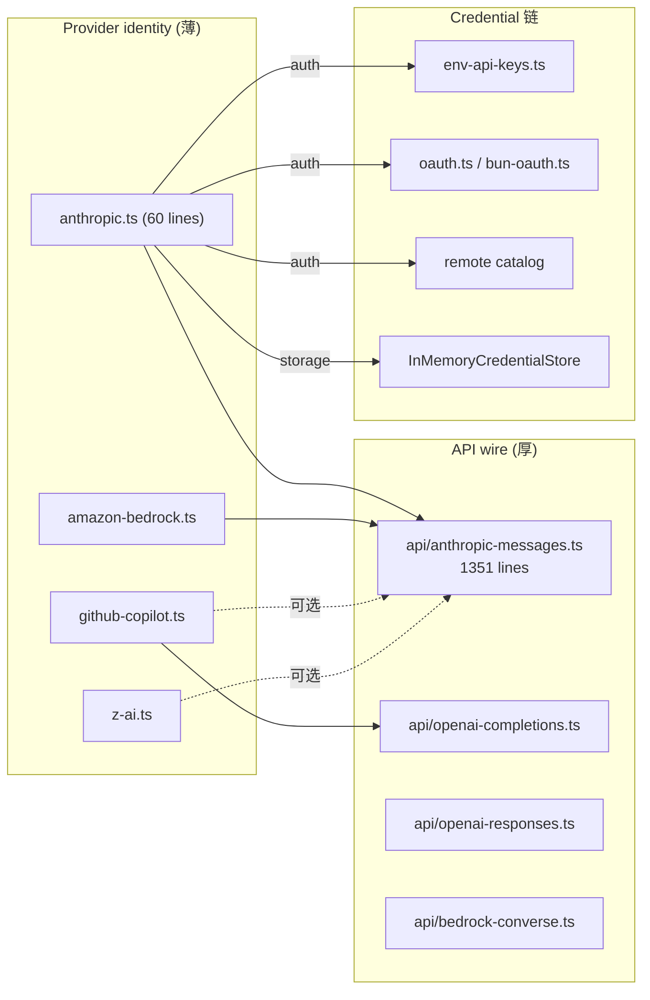
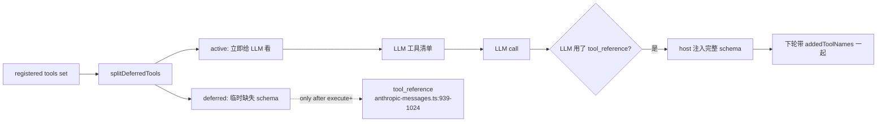

# 08 · LLM 适配层：`ai` 包

> 本章讲清楚 pi 怎么把 39+ 家 LLM 厂商统一成一个 `streamSimple`，以及它和 providers catalogue、auth、deferred tools 的关系。

## 8.1 包结构

```
packages/ai/src/
├── types.ts                        # Provider / Model / Context / Message / Usage / Api
├── models.ts                       # 模型目录入口
├── models.generated.ts             # 生成产物 — 不要手编
├── image-models.ts / image-models.generated.ts
├── images.ts / images-api-registry.ts
├── providers/                      # 每个 provider 一个适配器 + 模型目录
│   ├── anthropic.ts                # 60 行 identity
│   ├── anthropic.models.ts         # 模型目录（部分由 generate-models.ts 生成）
│   ├── openai.ts / openai.models.ts
│   ├── google.ts / google.models.ts
│   ├── amazon-bedrock.ts           # 共享 anthropic-messages API
│   ├── github-copilot.ts           # 共享 openai-completions 或 anthropic-messages
│   ├── faux.ts                     # CI 用的伪 provider
│   └── …                          # 40+ providers
├── api/                            # 协议级流
│   ├── anthropic-messages.ts       # 1351 行 wire 实现
│   ├── openai-completions.ts
│   ├── openai-responses.ts
│   ├── bedrock-converse.ts
│   └── …                          # 自动加 .lazy.ts shim
├── auth/                           # 鉴权解析、凭证存储、OAuth
│   ├── context.ts / resolve.ts / credential-store.ts / types.ts
├── oauth.ts / bun-oauth.ts         # Node / Bun OAuth
├── env-api-keys.ts                 # 所有 provider API key 的环境变量名
├── session-resources.ts            # tool-result 中的 image / file 引用
├── images.ts / images-api-registry.ts
└── utils/deferred-tools.ts         # NEW (commit e47b8e3)
```

## 8.2 三个关键抽象

`packages/ai/src/types.ts`：

```ts
type Provider<Api> = {
    id: string;
    name: string;
    baseUrl: string;
    auth?: ProviderAuth;       // { apiKey, oauth }
    models: Model<Api>[];
    api: ApiStreamFnMap[Api];
};

type Model<Api> = {
    id: string;
    name: string;
    api: Api;                        // 'openai-completions' | 'openai-responses' | 'anthropic-messages' | …
    provider: string;
    baseUrl: string;
    reasoning: boolean;
    input: ('text' | 'image')[];
    cost: ModelCostRates;
    contextWindow: number;
    maxTokens: number;
};

type Context = { systemPrompt?: string; messages: Message[] };

type AssistantMessageEventStream = EventStream<AssistantMessageEvent, AssistantMessage>;
```

`streamSimple(model, context, options)` 是统一入口，调用方只传 `model + context + options`，转换在 `api/*.ts` 中 lazy 完成。

## 8.3 Provider / API 双层 + 凭证链



> 这张图说明什么：**identity 与 wire 分离**——`anthropic-messages` API 同时被 Anthropic、AWS Bedrock、GitHub Copilot、z.ai 共用，4 个 provider 各自定义 baseUrl / auth。这一 seam 让新增 provider 时**不需要重写 wire 协议**。

举例（`packages/ai/src/providers/anthropic.ts:43-59`）：

```ts
export function anthropicProvider(): Provider<"anthropic-messages"> {
    return createProvider({
        id: "anthropic",
        name: "Anthropic",
        baseUrl: "https://api.anthropic.com",
        auth: {
            apiKey: anthropicApiKeyAuth(),
            oauth: lazyOAuth({
                name: "Anthropic (Claude Pro/Max)",
                isSubscription: true,
                load: loadAnthropicOAuth,
            }),
        },
        models: Object.values(ANTHROPIC_MODELS),
        api: anthropicMessagesApi(),
    });
}
```

## 8.4 凭证解析优先级

`packages/ai/src/auth/resolve.ts` 把四类凭证源归并成 `Credential`：

1. **环境变量**：`ANTHROPIC_API_KEY` / `ANTHROPIC_OAUTH_TOKEN` 等，`env-api-keys.ts` 统一常量。
2. **显式 flag**：`--api-key` 等（`coding-agent/core/main.ts:807-816`）。
3. **OAuth 持久化**：浏览器或本地回调。
4. **远程目录**：`models.dev/api.json` 等。

优先级：**显式 > 环境变量 > OAuth > 远程**（细节见 `auth/resolve.ts:80-124`）。

## 8.5 模型目录（generated）

`models.generated.ts` 是脚本生成的**纯 plumbing**——一行模型数据都没有，只是把 39 个 `*.models.ts` 的 `MODELS` 记录聚合成一个 union。它自带 marker：

```ts
// This file is auto-generated by scripts/generate-models.ts
// Do not edit manually - run 'npm run generate-models' to update
```

**`scripts/generate-models.ts`** 抓三处：

1. `https://models.dev/api.json`（社区上游）
2. live per-provider：
   - `https://integrate.api.nvidia.com/v1/models`
   - `https://openrouter.ai/api/v1/models`
   - `https://ai-gateway.vercel.sh/v1/models`
3. 本地 override 表（`generate-models.ts:241-460`）：如 `NVIDIA_NIM_UNSUPPORTED_MODELS`、`ZAI_GLM52_THINKING_LEVEL_MAP`、`OPENAI_GPT_56_STANDARD_COSTS`、`GITHUB_COPILOT_THINKING_LEVEL_OVERRIDES`。

> 数据流通：`generate-models.ts` 抓上游 + 应用 override → 写 `src/providers/data/*.json` 与 `models.generated.ts` → `npm run check:model-data` 校验每条 `MODELS.id` 都有对应 JSON。

`refreshModels` 流程由 `RefreshModelsContext` 包装，把凭证、storage 快照、signal、是否联网打包传入每个 provider。

## 8.6 Faux Provider（CI 专用）

`packages/ai/src/providers/faux.ts`：

- 零网络。
- 可编程地决定性发出 assistant 回复与 tool calls。
- `packages/coding-agent/test/suite/harness.ts` 基于它构建。
- **测试不需要真实 API key、付费 token 或网络**。回归测试放 `test/suite/regressions/<issue>-<slug>.test.ts`。

## 8.7 Deferred Tools（commit e47b8e3 引入，handbook 之前缺失）

`packages/ai/src/utils/deferred-tools.ts:8-39`：

```ts
export interface AgentToolResultWithAddedTools extends AgentToolResult {
    addedToolNames?: string[];
}

export function splitDeferredTools(
    tools: RegisteredTool[],
    activeNames: Set<string>,
): { active: RegisteredTool[]; deferred: RegisteredTool[] };
```



> 这张图说明什么：**只有部分工具在工具清单里给 LLM 看到**，其余用 `tool_reference` 留 placeholder；模型真用的时候 host 端注入完整 schema。`anthropic-messages.ts:939-1024, 1081-1114` 编码这个机制，它在与 wrapper 的 `addedToolNames` 配对后形成完整闭环。

> 之前的版本里**没有任何**关于 deferred tools 的描述，这是新功能。当前 handbook 不应再遗漏。

## 8.8 鉴权：API Key / OAuth / Remote

`auth/resolve.ts` 把所有凭证源归并成 `Credential`。`InMemoryCredentialStore` 是默认 store；存 OAuth token 与 user metadata，可被持久化 adapter 替换。

- `oauth.ts`：Node + 浏览器形态的 OAuth 流程，含 PKCE / device flow / localhost callback。
- `bun-oauth.ts`：Bun binary 形态（用 Bun 的内置 HTTP server）。
- `env-api-keys.ts`：列出所有 provider API key 的环境变量名（新增 key 时同步更新 `pi-test.sh --no-env` 的 `unset` 列表）。

## 8.9 图像与文件资源

- `images-api-registry.ts` 与 `image-models.ts` 把图像生成（text-to-image / edit）统一为 Provider 模型抽象；首批适配 OpenRouter 与 Vercel AI Gateway。
- `session-resources.ts` 处理 tool-result 中嵌入的 image / file 资源引用，做 MIME 检测 / 体积限制 / base64 / provider 上传。

## 8.10 用户视角

- 模型选择：CLI 启动时若发现多 provider / 多 model，进入对应 selector（详见 [11-tui.md](11-tui.md)）。
- OAuth 流程：选择 `Provider → auth type → URL 弹出 → 浏览器回调 → token 持久化`。
- 凭证传递：环境变量优先级最低；如装 Ollama，本地 HTTP endpoint 不需要 key。
- 当前跑哪家的模型：footer 的 right side 显示 `provider/model`，切换时 `model_select` 事件广播。

## 8.11 开发者视角

- 加 provider 时改 `generate-models.ts` 的抓取器；新增 catalog 不需要手编 `*.models.ts`。
- 改 wire 协议时改 `api/<api>.ts`；要兼顾所有共享 provider。
- `lazy.ts` shim 保证 `@anthropic-ai/sdk` / `openai` 等重 SDK 只在选定 provider 时才 require。
- 测试：用 `faux.ts` 而非真 provider。

## 8.12 架构师视角

- **Provider/API 双层**把 identity（稳定、低成本）与 wire（多变、笨重）切开，使"换 baseUrl、加 OAuth"不用动 wire，"加 streaming event type"不用动 provider。
- **生成 = 单一职责**。`generate-models.ts` 是 catalog 的唯一入口；手写 override 表只覆盖已知错误的修正，注释说明为什么（vendor 修了但 upstream 没同步，例如 2026-07-30 GPT-5.6 Terra/Luna 改价）。
- **`deferred-tools` 是把"工具集超大导致 LLM schema 撑爆"问题前移到 Anthropic wire 层**的做法。`splitDeferredTools` 让 LLM 工具清单随上下文动态收缩，再用 native `tool_reference` 反向注入 schema。这是面向未来"agent 工具集合可达上千"的前瞻设计。
- **lazy 加载**：每一个 `api/<api>.lazy.ts` shim 让 startup 不需要 import 所有 SDK。`@earendil-works/pi-coding-agent` 启动时间由"它实际用到的 providers"决定。
