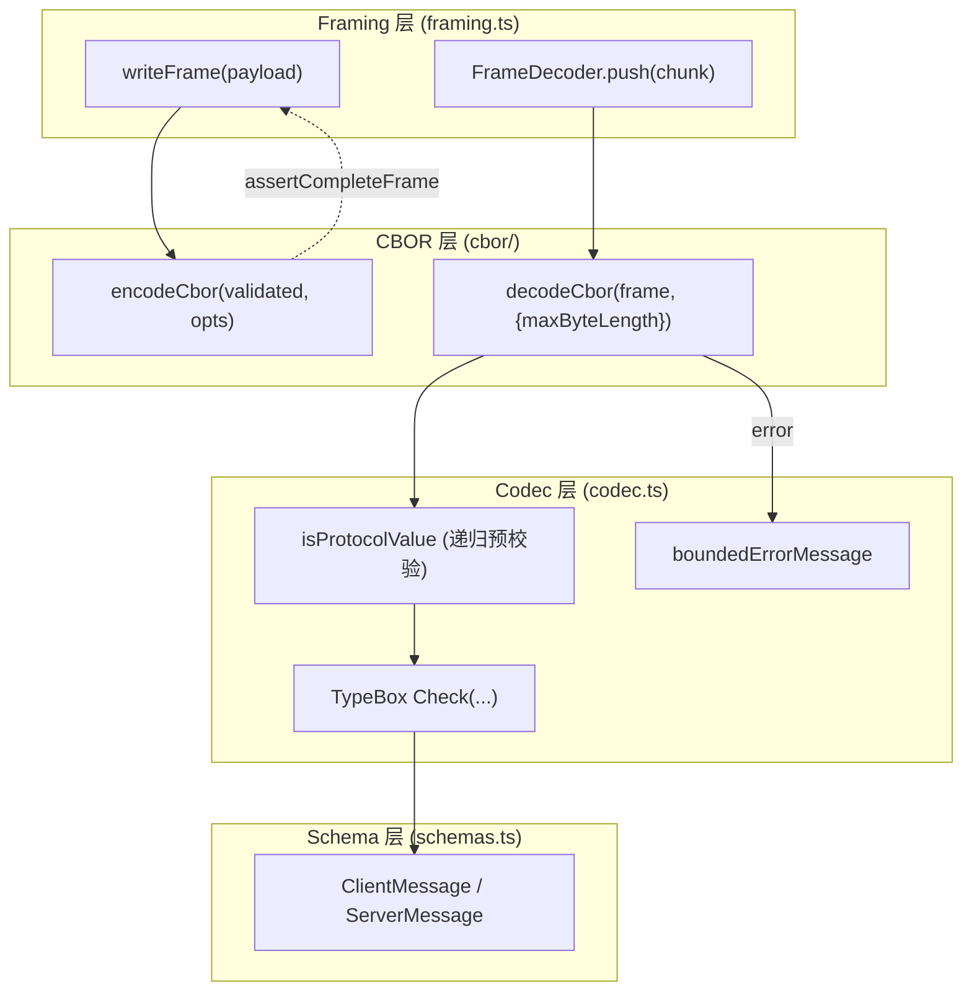
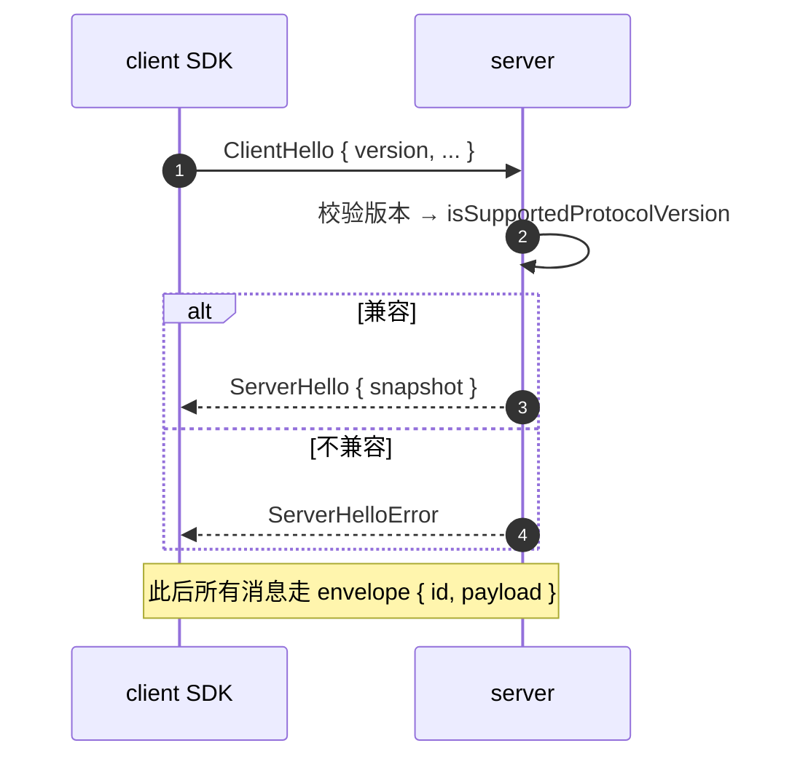
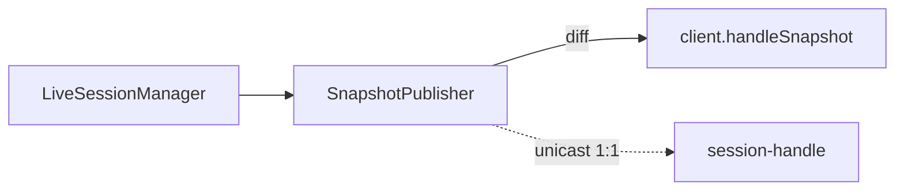

# 09 · 协议层：CBOR + Framing + TypeBox

> pi 的 wire protocol 是自实现的 CBOR 编码 + length-prefix framing + TypeBox schemas。它故意避开了 npm 上的 `cbor` 包以控依赖、控大小、控版本。

## 9.1 包边界

```
packages/protocol/src/
├── codec.ts            # 编解码 + 验证 + bounded error
├── framing.ts          # length-prefix framing + FrameDecoder
├── schemas.ts          # 所有消息的 TypeBox schema
└── cbor/
    ├── encoder.ts      # 自实现
    ├── decoder.ts
    └── …
```

> **协议层不知道 agent / UI 存在**——它的唯一契约是 `ClientMessage` / `ServerMessage` 两个 schema 联合，外加 `PROTOCOL_VERSION`。

## 9.2 协议栈



> 这张图说明什么：**三层防御**——framing 限定最大帧长、codec 限定错误消息长度、TypeBox 在解码后做 schema 校验。任何一层失败都会把 stream 标记为 failed，且永不复活。

## 9.3 MAX_UINT32 三层防护

`packages/protocol/src/framing.ts:28-39` 在编码侧：

```ts
if (payload.byteLength > MAX_UINT32) {
    throw new RangeError("Frame payload exceeds the unsigned 32-bit length limit");
}
```

`framing.ts:19-25` 在配置构造时：

```ts
const value = options?.maxFrameLength ?? DEFAULT_MAX_FRAME_LENGTH;
if (!Number.isSafeInteger(value) || value < 0 || value > MAX_UINT32) {
    throw new RangeError(...);
}
```

`framing.ts:88-93` 在解码侧看到非法长度前缀立即 `fail()`：

```ts
if (frameLength > this.maxFrameLength) {
    this.fail(`Frame length ${frameLength} exceeds configured limit of ${this.maxFrameLength}`);
}
```

`MAX_UINT32 = 0xffff_ffff`；默认 `DEFAULT_MAX_FRAME_LENGTH = 16 MiB`。内存按 `PAYLOAD_BLOCK_SIZE = 64 KiB` 分块预分配，不会被恶意 client 用超大声称长度搞 OOM。

> 行为一旦 `fail()`：**该 decoder 永远抛 `FrameError`**。`push()` / `end()` 也抛。后续所有消息会被拒收，连接要么 drops 要么 handshake 重建，**永不复位同步**。这是 poison-pill 设计。

## 9.4 Bounded Error

`packages/protocol/src/codec.ts:102-115`：

```ts
push(chunk: Uint8Array): T[] {
    if (this.failed) throw new ProtocolValidationError(`${this.kind} message decoder has failed`);
    try {
        for (const frame of this.frames.push(chunk)) {
            messages.push(this.parse(decodeCbor(frame, { maxByteLength: this.maxFrameLength })));
        }
        return messages;
    } catch (error) {
        this.failed = true;
        if (error instanceof ProtocolValidationError) throw error;
        throw new ProtocolValidationError(`Invalid ${this.kind} protocol frame: ${boundedErrorMessage(error)}`);
    }
}
```

`boundedErrorMessage`（`codec.ts:55-58`）把任意 error message 截断到 500 字符上限：

```ts
function boundedErrorMessage(error: unknown): string {
    if (!(error instanceof Error)) return "Unknown codec error";
    return error.message.length <= 500 ? error.message : `${error.message.slice(0, 497)}...`;
}
```

> 这把"Crafted payload 能塞巨型 error message 反射到上层"的攻击面限制在 500 字节。

## 9.5 校验前的预校验：`isProtocolValue`

`codec.ts:25-39`：

```ts
function isProtocolValue(value, ancestors): boolean {
    if (value === null || typeof value !== "object") return true;
    if (ancestors.has(value)) return false; // 防环
    const proto = Object.getPrototypeOf(value);
    if (proto !== Object.prototype && proto !== Array.prototype) return false; // 防 prototype pollution
    // 递归 child
}
```

> 这步**在 TypeBox Check 之前**——避免攻击者构造"通过 schema 但深递归/非 plain"的对象让 TypeBox 炸栈。

## 9.6 握手



- `PROTOCOL_VERSION` 是显式常量。
- `isSupportedProtocolVersion` 是握手兼容的唯一判定。
- 兼容后的消息都按 envelope `{ id, payload }` 走 request/response。

## 9.7 ServerHello 与 snapshot

握手成功后 server 立刻把当前状态发来——这是 client 启动时不需要"先请求所有 session"的原因。`packages/server/src/snapshots.ts` 周期性发布 state diff：

- `LiveSessionManager` 维护活跃 session 集合。
- `ServerSnapshotPublisher` 周期性计算 diff 推送给订阅者。
- 客户端订阅 `snapshot` 消息后，`session-handle.ts` 维护本地副本。



> 注意：snapshot 是**周期性**而非"事件驱动"——这样能在 server 端简化 flush 逻辑，客户端总能等到下一个 tick。

## 9.8 用户视角

- **零网络变更**——你看不见这个协议。它只在第三方 IDE / chat 想嵌入 pi 时才会用。
- **失败隔离**——任何 framing 错误都会让该连接一次性 drop，**不会污染其它连接**。

## 9.9 开发者视角

- 手写扩展直接用 `client SDK`，不需要碰 CBOR。
- 写新 wire 协议？新增 `ClientMessage / ServerMessage` 变体，改 `schemas.ts`，更新 `PROTOCOL_VERSION`。
- 测试 CBOR 编码：`packages/protocol/test/` 包含 round-trip 测试。

## 9.10 架构师视角

- **三层防御是不得不做的设计**——远程协议天然暴露在攻击面下，pi 选择把风险压在三层冗余而不是 trust first。
- **CBOR 与 JSON**——选 CBOR 是因为大 `AgentMessage[]` 数组在 wire 上体积显著变小；binary 编码同时也让"人类调试"困难。strict-object schema 保证解码后必校验，两层叠加优势。
- **Poison-pill decoder**——避免"re-sync 协议"。比起 TCP 那种简单断流重连，wire 协议要么 drop 连接要么重新 handshake，绝不试图从中间点同步。这是协议层故意偏严的策略。
- **snapshot 周期性推送**——server 把"我现在状态是什么"周期性广播，避免 client race 条件。代价是网络放大约 ~10%，换来 server flush 简化。
- **CBOR 自实现、不用 npm cbor**——可控依赖、可控大小、可控版本。这与"shinkwrap + pinned-deps"的项目哲学一致（见 [17-deployment.md](17-deployment.md)）。

## 9.11 与 client / server 的协作

- `packages/client` 把握手、消息分发、错误恢复封装为 `Connection`。
- `packages/server` 把 `PiServer` + `LiveSessionManager` + `ServerSnapshotPublisher` 一起组装。
- 详细状态机、第 10 章展开。
