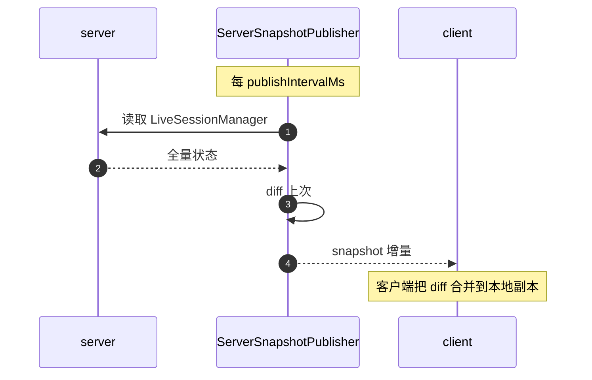

# 10 · 客户端 / 服务端

> 当你的 IDE、chat 应用或 CI 想"嵌入 pi 而不起新进程"时，client/server 是入口。本章描述这条对端路径。

## 10.1 全景

```
   ┌──────────────┐    ┌────────────────────┐    ┌──────────────┐
   │   pi client  │◀──▶│  protocol (CBOR)    │◀──▶│  pi server   │
   │ (Node SDK)   │    │  length-prefixed    │    │  (多 session)│
   └──────────────┘    └────────────────────┘    └──────────────┘
                          packages/protocol
```

**注意区分**：
- **本 client/server**：`packages/client` + `packages/server`，走 CBOR + framing，是真正的远程/同机进程间协议。
- **CLI 内嵌的 RPC 模式**：`packages/coding-agent/src/modes/rpc/` 走 line-delimited JSON。不与本章重叠，详见 [16-print-rpc.md](16-print-rpc.md)。

## 10.2 客户端（`packages/client`）

```
src/
├── client.ts             # 高层 Client 封装
├── connection.ts         # 握手 + 消息分发 + 状态机
├── transport.ts          # 抽象字节传输
├── unix.ts               # Unix Domain Socket 实现（默认）
├── state.ts              # 本地副本 / diff 同步
├── promise.ts            # request/response 关联
├── session-handle.ts     # 单 session 的句柄
├── errors.ts             # PiDisconnectedError / PiServerError / toError
└── types.ts
```

`connection.ts` 把 `Connection` 类封装一切：

```ts
new Connection({
    transportFactory: myTransport,         // unix / tcp / in-memory
    onHandshake: snapshot => { ... },
    onMessage: msg => { ... },
    onStateChange: state => { ... },
});
```

### 10.2.1 状态机

`Connection` 维护一个二元状态：`Connected | Disconnected`，外加 `handshake_sent | handshake_done` 两个内部旗标。重连策略：

- 检测到 `ProtocolValidationError` 或 transport 层断开 → 进入 Disconnected。
- 可配置自动重试 + 指数回退。
- 重连成功后**不重新握手**——snapshot 由周期性推送负责。

### 10.2.2 request/response

`promise.ts` 用单次递增 id 把 request/response 关联；`client.ts` 把"业务调用"翻译成 request：

```ts
const result = await client.request('session.list', { filter });
```

error 路径：服务端返回 `ServerError`，被 `errors.ts:toError` 转 `PiServerError`；transport 断开 → `PiDisconnectedError`。

## 10.3 服务端（`packages/server`）

```
src/
├── server.ts             # PiServer 主类
├── listener.ts           # 业务回调（onUserMessage, onSlashCommand）注入
├── sessions.ts           # LiveSessionManager
├── snapshots.ts          # ServerSnapshotPublisher
├── connection.ts         # server 侧 Connection
├── errors.ts / protocol.ts / types.ts
└── transports/           # server 端 unix 等传输
```

`PiServer`：

```ts
new PiServer({
    maxConcurrentConnections,
    handshakeTimeoutMs: 5_000,
    publishIntervalMs: 1_000,
    onUserMessage: async (sessionId, text) => { ... },
    onSlashCommand: async (sessionId, command) => { ... },
});
```

- 接受任意数量的 `Connection`。
- 用 `LiveSessionManager` 维护当前活跃 session 集合。
- 用 `ServerSnapshotPublisher` 每 `publishIntervalMs` 推一次 diff snapshot。
- `DEFAULT_HANDSHAKE_TIMEOUT_MS = 5_000` 防慢握手攻击。
- 幂等关闭：`closePromise` 与 `closing` 标志确保多次 `close()` 不出问题。

### 10.3.1 LiveSessionManager

把"哪个 session 还在跑、跑哪些 turn"集中维护。Snapshot 输出包括：

- session 元信息（id / cwd / leafId / 创建时间）
- 每 session 的最近 N 条 entry 摘要
- 进程级资源（model usage、cost）
- 锁定名单（lane 持有者）

### 10.3.2 snapshot vs event

`ServerSnapshotPublisher` 把 server 的"全量状态"周期性推送；与 agent 内部 `AgentEvent` 不同，snapshot 是**收敛视图**。两者在客户端合并：本地 watch agent event 即时更新 UI，用 snapshot 校正漂移。



## 10.4 已知的不完整：`AgentHarness` 桩

`packages/agent/src/harness/agent-harness.ts:347-507` 是一段以 `HarnessNotImplemented` 为主的 stub。它定义了契约与 run/compact/navigate 的 outcome 联合，但没有完整 live implementation。

**当前状态**：

- `packages/agent` 里 `agentHarness` 类存在。
- `packages/server` 的 `LiveSessionManager` 与 `ServerSnapshotPublisher` 直接用 `ai` 包的 `streamSimple`，**绕开 `agent`**，自己重做"live session 的 reducer"。这就是为什么 `server/package.json` 直接依赖 `@earendil-works/pi-ai` 而不依赖 `agent`——见 [03-architecture.md](03-architecture.md) §3.7 的 3 处例外。

**未来方向**：等 `AgentHarness` 落地后，server 会切到 `agent.run` / `agent.continue`，而不是直接 `streamSimple`。Harness 接管前，server 的可靠性靠 reducer + snapshot publisher 双重保险。

## 10.5 用户视角

你不需要直接使用 client/server——除非你在写 IDE 插件或 chat 集成。`examples/rpc-extension-ui.ts` 是一个典型第三方用法：通过 RPC 控制 host TUI overlay。

## 10.6 开发者视角

- 写 IDE 插件用 client SDK：构造 Connection、订阅 snapshot、用 session-handle 提交消息。
- 写 CI 集成：用 client + faux provider，让 CI 完全摆脱真实 LLM 依赖。
- 想替换 snapshot publisher？实现自定义 publisher 注册到 `PiServer.onPublisher`。

## 10.7 架构师视角

- **snapshot 周期性 > 实时事件**：在 server 进程复杂时，实时事件广播会让 server flush 逻辑脆弱；周期性 snapshot 让所有客户端"在下一个 tick 拿到真相"，代价是网络放大。`AgentEvent` 已经在 client 内部即时，不需要走 snapshot 层。
- **`AgentHarness` 桩是技术债**——目前 `server` 自做 reducer 是合理的妥协，但等 `agent/harness` 完整后要把这层归并，否则分层图彻底破坏。
- **`Connection` 三状态 + 重连策略** 对面向真实网络很关键——握手超时 5 秒、读超时可配、写缓冲有 backpressure。详见 `Connection` 的 `stateMachine.ts`。
- **client 端 in-memory transport** 是测试套件基础设施；自实现不用 mock 整个网络栈。
