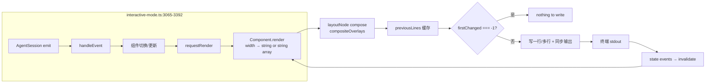

# 11 · TUI 与差分渲染

> pi 的终端 UI 全在 `packages/tui/` 与 `packages/coding-agent/src/modes/interactive/`。本章讲清楚渲染管线、组件、键盘、内置 selectors vs 真 overlay 的区别。

## 11.1 渲染管线



> 这张图说明什么：**TUI 是 terminal-write 优化，不是 render 优化**。`component.render` 总是走完整树；差分算法只省字节不进 wire。`MIN_RENDER_INTERVAL_MS = 16` 让"多次 invalidate"合并成 1 次 render。

## 11.2 差分算法（实际是整行字符串比较）

`packages/tui/src/tui-main-screen.ts:294-308`：

```ts
let firstChanged = -1;
let lastChanged = -1;
const maxLines = Math.max(newLines.length, this.previousLines.length);
for (let i = 0; i < maxLines; i++) {
    const oldLine = i < this.previousLines.length ? this.previousLines[i] : "";
    const newLine = i < newLines.length ? newLines[i] : "";
    if (oldLine !== newLine) {
        if (firstChanged === -1) firstChanged = i;
        lastChanged = i;
    }
}
```

- **粒度**：整行字符串比较，不是 cell-level diff。
- ANSI-state 没有精细处理：每次重写整行用 `\x1b[2K` 清行，再用 synchronized output wrapper 防止撕裂。
- "synced begin/end" 用 `\x1b[?2026h` / `\x1b[?2026l` 包围；多数现代终端都支持。

> 选择简化而非 cell-level，是因为 60 行视口下整行比较快、sync-output 让整行重写在视觉上是原子的；省去 ANSI-state machine 的维护负担。

## 11.3 组件树（42 个）

`packages/coding-agent/src/modes/interactive/components/`：

| 类别 | 组件 |
| --- | --- |
| **Chat / transcript** | `assistant-message.ts` / `user-message.ts` / `tool-execution.ts` / `bash-execution.ts` / `custom-message.ts` / `custom-entry.ts` / `compaction-summary-message.ts` / `branch-summary-message.ts` / `skill-invocation-message.ts` / `diff.ts` / `markdown-transform.ts` / `mermaid.ts` / `visual-truncate.ts` |
| **Footer / status / décor** | `footer.ts` / `keybinding-hints.ts` / `status-indicator.ts` / `dynamic-border.ts` / `bordered-loader.ts` / `countdown-timer.ts` |
| **Modal/focus-replacing selectors** | `model-selector.ts` / `scoped-models-selector.ts` / `settings-selector.ts` / `theme-selector.ts` / `thinking-selector.ts` / `show-images-selector.ts` / `session-selector.ts` / `session-selector-search.ts` / `tree-selector.ts` / `user-message-selector.ts` / `extension-selector.ts` / `extension-input.ts` / `extension-editor.ts` / `oauth-selector.ts` / `login-dialog.ts` / `trust-selector.ts` / `config-selector.ts` / `first-time-setup.ts` |
| **Editor / startup** | `custom-editor.ts` / `armin.ts` / `daxnuts.ts` / `earendil-announcement.ts` / `index.ts` |

> 这 42 个文件**不是**全部 Component — 比如 `keybinding-hints.ts / diff.ts / mermaid.ts / session-selector-search.ts` 是 helper。

## 11.4 主题系统

`packages/coding-agent/src/modes/interactive/theme/theme.ts`：

- `Theme` / 颜色表，bold/italic/dim 等修饰。
- 内置 + custom JSON；`getMarkdownTheme` `:1252` / `getEditorTheme` `:1301`。
- `InteractiveThemeController`（`:17-35`）解析 settings 与终端外观（auto / 显式 dark / light），并观察终端 color-scheme 切换：`:43-66` 初始化，`:81-136` 预选/切换与跟踪。

## 11.5 键盘模型

**当前真实命名**（与早期文档描述不同）：

- **`packages/tui/src/keybindings.ts:64-179`** 默认键：`TUI_KEYBINDINGS`，命名空间 `tui.editor.*` / `tui.input.*` / `tui.select.*` / `tui.altScreen.*`。
- **`packages/coding-agent/src/core/keybindings.ts:63-206`** 默认键：`KEYBINDINGS = { ...TUI_KEYBINDINGS, app.* }`。
- `AppKeybindings` 接口（`:12-55`）通过 declaration-merge 把 `app.*` 注入全局键表。

```ts
// keybindings.ts:65-117（节选）
export const KEYBINDINGS = {
    ...TUI_KEYBINDINGS,
    "app.interrupt": { defaultKeys: "escape", description: "Cancel or abort" },
    "app.clear": { defaultKeys: "ctrl+c", description: "Clear editor" },
    "app.exit": { defaultKeys: "ctrl+d", description: "Exit when editor is empty" },
    "app.thinking.cycle": { defaultKeys: "shift+tab", description: "..." },
    "app.model.cycleForward": { defaultKeys: "ctrl+p", description: "..." },
    "app.model.cycleBackward": { defaultKeys: "shift+ctrl+p", description: "..." },
    "app.model.select": { defaultKeys: "ctrl+l", description: "..." },
    "app.thinking.toggle": { defaultKeys: "ctrl+t", description: "..." },
    "app.tools.expand": { defaultKeys: "ctrl+o", description: "..." },
    "app.session.toggleNamedFilter": { defaultKeys: "ctrl+n", description: "..." },
    "app.editor.external": { defaultKeys: "ctrl+g", description: "..." },
    "app.message.copy": { defaultKeys: "ctrl+x", description: "..." },
    "app.message.followUp": { defaultKeys: "alt+return", description: "..." },
    "app.clipboard.pasteImage": { defaultKeys: "alt+v", description: "..." },
    // 没有默认的 new/tree/fork/resume 让用户显式绑
};
```

⚠ **当前源码并不存在 `DEFAULT_EDITOR_KEYBINDINGS` 与 `DEFAULT_APP_KEYBINDINGS` 常量名**——它们是 2024-Q3 重构前的旧名。如果你在旧资料里看到这两个名，要明白它们对应的是 `TUI_KEYBINDINGS` 与 `KEYBINDINGS` 两层结构。

`KeybindingsManager` 构造时读 `<agentDir>/keybindings.json`（`:339-350`），并把旧版短名（`submit` / `selectModel` 等）迁移到新 ID（`:208-268`）。

### 11.5.1 Editor 输入顺序

`packages/coding-agent/src/modes/interactive/components/custom-editor.ts:6-88`：

1. 扩展快捷键（`pi.on(...)` 注册的）。
2. 截图像（`Alt+V` / `Ctrl+V`）。
3. `app.interrupt`（除非 autocomplete）。
4. `app.exit` —— **仅当 buffer 为空**。
5. Editor 自己的 history 优先冲突。
6. App action IDs（`app.clear / app.editor.external / app.message.copy / ...`）。
7. 否则 `super.handleInput`（即 `tui.editor.*`）。

`packages/tui/src/components/editor.ts:815-830`：

```ts
if (kb.matches(data, "tui.input.submit")) {
    if (this.disableSubmit) return;
    this.submitValue();
    return;
}
```

`submitValue():1272-1286` 取消 autocomplete、展开 paste marker、清空 buffer、调 `onChange("")`、调 `onSubmit(result)`。

### 11.5.2 `setupEditorSubmitHandler`

`interactive-mode.ts:2870-3003`：

- 空文本跳过。
- 命中内置 slash 命令 → 走 `handleXxxCommand`（`/settings /model /tree /fork /login /quit` 等）。
- `!` / `!!` 形态 → `handleBashCommand`。
- compaction queue → `runAutoCompact`。
- streaming steer / 队列 → 走对应路径。
- 否则走 `onInputCallback(text)`（push 到 pending / 直接调 `session.prompt`）。

## 11.6 Modal / Overlay 三态

| 形态 | 入口 | 表现 | 适用 |
| --- | --- | --- | --- |
| **focus-replacing modal** | `showSelector(create)` (`interactive-mode.ts:4351-4373`) | 把组件**替换到 editor 容器**再 focus；不创建新 layer | `/model /scoped-models /fork /tree /resume /trust /login /settings` |
| **真 overlay** | `ctx.ui.custom(factory, { overlay: true })` (`interactive-mode.ts:2658-2736`) | 进 `showOverlay` → `tui.ts:549-658` overlay stack + focus 恢复 | 扩展弹窗、keybinding 提示、半屏详情 |
| **startup selector** | `cli/startup-ui.ts:133-161 showStartupSelector` | **独立构造一个 startup TUI**（不进 InteractiveMode），直接挂载 `ExtensionSelectorComponent` | first-time setup、缺 cwd 选择、启动期 trust |

```ts
// interactive-mode.ts:4351-4373 showSelector
private showSelector(create) {
    const done = () => {
        this.editorContainer.clear();
        this.editorContainer.addChild(this.editor);
        this.ui.setFocus(this.editor);
    };
    const created = create(done);
    this.disposeActiveSelector();
    this.editorContainer.clear();
    this.editorContainer.addChild(created.component);
    this.ui.setFocus(created.focus);
    this.ui.requestRender();
}

// interactive-mode.ts:2719-2727 真 overlay 入口
const handle = this.ui.showOverlay(component, resolveOptions());
```

## 11.7 Footer 速查

`packages/coding-agent/src/modes/interactive/components/footer.ts`：

- 左半（`:127-160`）：cumulative usage — `↑input ↓output R cache-read W cache-write CH cache-hit% $cost (sub)` + context `percent/window (auto)`。
- 右半（`:167-197`）：`(provider)/model` + `thinking off/<level>`。超宽时省略 provider 前缀。
- 第三行（`:231-242`）：按 key 排序的扩展 status。
- `/session` 是不在 footer 的独立 transcript 统计。

## 11.8 Status indicator

`packages/coding-agent/src/modes/interactive/components/status-indicator.ts`：

- `Working`（spinner + "Working"）。
- `Retry`（attempt/max + CountdownTimer + Escape）。
- `Compaction`（manual/auto/overflow + Escape）。
- `BranchSummary`（summarizing branch + Escape）。
- `Idle`（两行空白）。
- Working 可被 extensions/settings 隐藏（`:2066-2083`）。

## 11.9 用户视角下的"为什么"

- 你按 `Ctrl+P` 不动 → 那已经被拦截为 `app.model.cycleForward`。
- `Ctrl+L` → `app.model.select` → 进 `ModelSelectorComponent`，focus-replacing 模式。
- `Escape` 在 agent 流式时 → `app.interrupt`，命中后发 abort 到 agent。
- `Ctrl+T` → `app.thinking.toggle`，切 thinking 可见性。
- `Ctrl+G` → `app.editor.external`，调用外部编辑器（vim / nvim）写 prompt。

## 11.10 架构师视角下的"为什么"

- **三态 UI 是有意识的实现选择**：focus-replacing modal 最简单（与 editor 槽同 lifecycle），真 overlay 用于"扩展想全屏/侧边但编辑器不动"，startup selector 用于"在 InteractiveMode 之前出现"。三者区分在 `pi/design` 上多次被拿出来权衡。
- **KEYBINDINGS 两层与 declaration merge**——把"通用"和"app 专用"分开，让 tui 包不依赖 coding-agent。具体注入通过 `interface AppKeybindings` declaration merge，避免 record 重复。
- **diff 算法故意简化**——terminal-write 不是 hotpath，单次重写整行开销远小于 ANSI-state machine 的复杂度。
- **`MIN_RENDER_INTERVAL_MS = 16`** 让 fast typing 不会让 render 排队爆炸——多个 invalidate 合并成一次 render。
