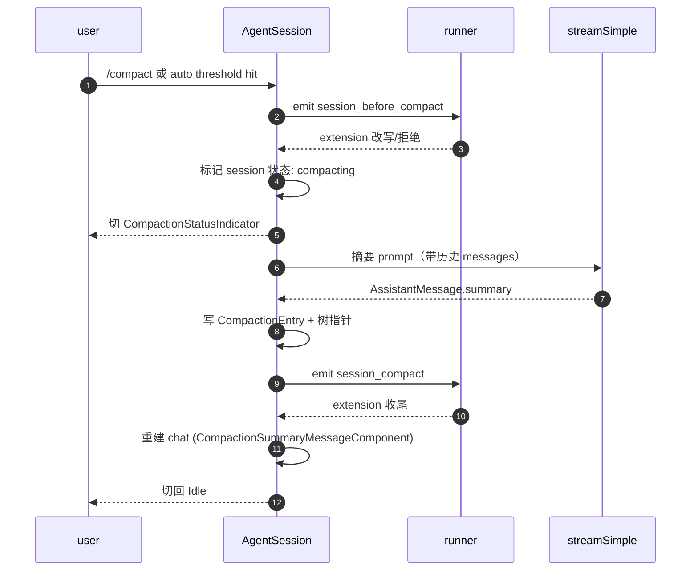

# 12 · Compaction & Branch Summary

> 当上下文窗口撑爆，pi 怎么把历史摘要？compact 与 branch summary 的差异、以及扩展能介入的地方。

## 12.1 触发：token 估算

`packages/coding-agent/src/core/compaction/compaction.ts`：

- 每条 `AssistantMessage` 与 `ToolResultMessage` 都带 `usage`：`input / output / cacheRead / cacheWrite`。
- `compaction.ts` 维护一份"窗口利用率"——当前总 `usage.input + usage.cacheRead + usage.cacheWrite` 与 `model.contextWindow`。
- 阈值可在 `/settings` 配置；默认在 ~85%（自动触发）。
- 手动触发 `/compact` 立即进入流程，不看阈值。

## 12.2 Compaction 的事件流



> 这张图说明什么：summary 由"专门的 LLM 调用"产生，host 把当前快照作为 user prompt 喂给 LLM，再把输出作为 `CompactionEntry` 写入 session tree。**摘要模型可以与主模型不同**——见 `/settings` compact 配置。

## 12.3 扩展接入：`session_before_compact`

`packages/coding-agent/src/core/extensions/types.ts:592, 1083-1122`：

```ts
interface SessionBeforeCompactEvent {
    leafId: string;
    contextUsage: ContextUsage;
    entries: SessionEntry[];
}

type SessionBeforeCompactResult = {
    cancel?: boolean;
    customSummary?: string;
    customMessages?: AgentMessage[];
};
```

扩展可以：

- 提供自己的 `customSummary`（跳过 LLM 摘要调用）。
- 取消 compact（`cancel: true`）。
- 注入 `customMessages`（在 CompactionEntry 后追加）。

`runner.emitBeforeCompact`（`runner.ts`）链式合并，多个扩展按顺序叠加。

## 12.4 异步中止

`compaction.ts` 在摘要 LLM 流上挂 `AbortSignal`：

- 用户按 `Escape` → `app.interrupt` 转发 abort → 流式终止。
- 中止后产生 **partial summary**——若已累积足够文本，写入 `CompactionEntry` 不截断；若极少，回退为 "no-op compact"。
- `session_before_compact` 钩子可以让扩展保存一份"恢复种子"以便下次接着做。

## 12.5 树指针与可恢复

每个 `CompactionEntry` 携带：

- `summary: string`
- `original_entry_count: number`
- `tokensBefore / tokensAfter`
- `model_used: ModelRef`
- `created_at: number`
- **`prev_leaf_id: string`**（指向压缩前的 leaf，可在 tree 上跳回原始历史）

`/tree` 视图上 compaction 节点是一个可折叠的圆点，用户点开能跳回原始分支。

> 这意味着压缩**不破坏历史**：你在 `/tree` 任意 leaf 切换回原分支，自动展示原 messages。compaction 是"在 leaf 上的可逆摘要"，不是真正的删除。

## 12.6 Branch Summary

`packages/agent/src/harness/compaction/branch-summarization.ts`：

- 在 session 树跨多个 leaf 时生成更高层摘要。
- 由 `session_tree` 钩子之后触发，主入口在 `AgentSessionRuntime.emitBeforeTree:133` 与之后的 reconcile。
- 与 compaction 不同：branch summary 是**跨 leaf** 的，触发条件是"当前 leaf 集 + 最近 N 个分支 + duration"。

## 12.7 用户视角

- 你看到 footer 出现 "Compacting…" 并切到 `CompactionStatusIndicator` —— 单按 `Escape` 中止。
- 自动 compaction 默认在 ~85% 触发。可以在 `/settings → auto-compact` 调阈值或禁用。
- 摘要完成后 chat 区出现 `CompactionSummaryMessageComponent`，可折叠/展开看新摘要。

## 12.8 开发者视角

- 自定义摘要 prompt：`session_before_compact` 返回 `customSummary`。
- 取消：`session_before_compact` 返回 `{ cancel: true }`。
- 实现自己的 compaction scheduler：在 `compaction.ts` 加新阈值与评估逻辑，跑测试时关注 `regressions/`。

## 12.9 架构师视角

- **compaction 是 tree 上的可逆摘要，不删除**——这是 tree-as-source-of-truth 设计的核心。换言之，用户永远能找回 "压缩前"的历史视角。
- **异步中止语义要谨慎**——流式 LLM 不可预测，"已生成多少算完成"是经验值。当前实现采用 "auto-completion threshold"，不到则放弃、保留 partial。
- **摘要模型可换**——大上下文用更贵的模型、小上下文用更便宜的；这让"长会话"成本可控。
- **branch summary 与 compaction 是不同 layer**——前者关心跨 leaf，后者关心单 leaf；两者都通过 `session_before_*` 钩子介入。
