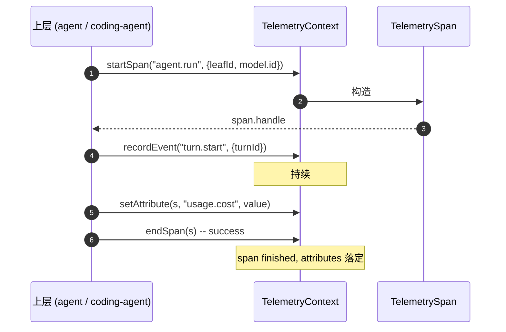

# 13 · Telemetry 契约

> pi 的可观测性层刻意做到"零依赖"——`packages/telemetry` 不导入任何运行时，被所有上层共用。本章讲清楚它的契约、sink、与测试适配。

## 13.1 设计目标

1. **与厂商无关**：上层不写 OTLP / Prometheus / Datadog 任何特定代码。
2. **no-op 默认**：未配置时全 no-op，零开销。
3. **类型化 schema**：通过 `TelemetryStartAttributeDefinition` 等显式声明，编译期查 attribute 名。
4. **可测试**：`testing/inmemory.ts` 提供 in-memory 适配器，无须网络即可断言 span 树。

## 13.2 包结构

```
packages/telemetry/
├── src/
│   ├── index.ts             # TelemetryContext / TelemetrySpan 主接口
│   ├── noop.ts              # 默认实现
│   └── testing/
│       └── inmemory.ts      # 测试用 in-memory 适配
└── test/
    └── ...
```

调用方约定（从 `packages/agent/src/harness/telemetry.ts` 与 `coding-agent/src/core/telemetry*` 抽取）：

```ts
interface TelemetryContext {
    startSpan(name: string, attributes?: Record<string, AttributeValue>): TelemetrySpan;
    recordEvent(name: string, attributes?: Record<string, AttributeValue>): void;
    setAttribute(span: TelemetrySpan, key: string, value: AttributeValue): void;
    endSpan(span: TelemetrySpan): void;
    shutdown?(): Promise<void>;
}

interface TelemetrySpan {
    id: string;
    name: string;
    startAttributes: Record<string, AttributeValue>;
    end?(status: "ok" | "error" | "cancelled"): void;
}
```

## 13.3 Span 生命周期



**关键**：

- `setAttribute` 必须在 `endSpan` 之前。end 之后设置抛错。
- 异常路径用 `end("error", exception)`；某些 sink 会捕获此信号发出 alert。
- `cancelled` 由上层显式区分"用户取消"与"自然终止"。

## 13.4 attribute schema

通过 `TelemetryStartAttributeDefinition`（或类似）显式声明常见 attribute 名字。常用 key：

- `leafId`、`session.id`、`cwd`、`model.id`、`provider`
- `usage.input`、`usage.output`、`usage.cacheRead`、`usage.cacheWrite`、`usage.cost`
- `tool.name`、`tool.callId`、`tool.durationMs`
- `compaction.tokensBefore`、`compaction.tokensAfter`
- `error.kind` / `error.message`（截断到 200 字符）

> 截断是 telemetry 一致规则——避免"攻击者用 payload 充大小写"。

## 13.5 测试用 in-memory 适配

`packages/telemetry/src/testing/inmemory.ts`：

- 把 span / event 存进内存数组。
- 提供查询：`getSpans(name) / findSpan(attribute, value) / assertSpanTree(...)`。
- 用来在没有真 sink 的环境下做断言。

测试套件（`packages/agent/test`、`coding-agent/test/suite/`）用它来验证：

- 一次 run 触发正确数量的 turn / message / tool 事件。
- `usage.cost` 与 reducer 算出的一致。
- abort / cancel 路径产 `cancelled` 状态。

## 13.6 配置

`telemetry` 通过 `SettingsManager` 配置：

- 默认 no-op（无 sink）。
- 配置后可换成 OTLP 等。
- 字段：`endpoint / headers / sampleRate / batchFlushMs / privacyLevel`。

## 13.7 用户视角

- 你看不到 telemetry。它对外"完全沉默"。
- 配置后才影响行为——本手册**不展开**企业部署的 sink 配置，需要在团队内做一份 ops 文档。

## 13.8 开发者视角

- 写新代码时调用 `telemetryCtx.startSpan(...)`；
- attribute 用 schema 中已定义的常量名，不要写 string literal。
- 写测试时用 in-memory 适配；不要依赖第三方 sink。

## 13.9 架构师视角

- **零依赖**：让 telemetry 不被任何重 SDK（OTel SDK、StatsD client）绑死；上层协议可以保持极简。这是为什么独立成 package。
- **no-op 默认**：性能与配置分离；任何 benchmark 都跑在没有 sink 的默认路径。
- **`setAttribute` 强制 end 前**——避免 span 被不确定状态等待。错误信息明示顺序违例。
- **in-memory 是测试基础设施**——不是 production infra，因为它数据全在内存、不能跨进程。如果要观测真实进程，跑 OTLP 适配（不在 telemetry 包内）。
- **与 cost 字段的耦合**：`usage.cost` 与 reducer 算出来的 cost 是同一份数据；telemetry 仅是传播者，不做独立计算。
