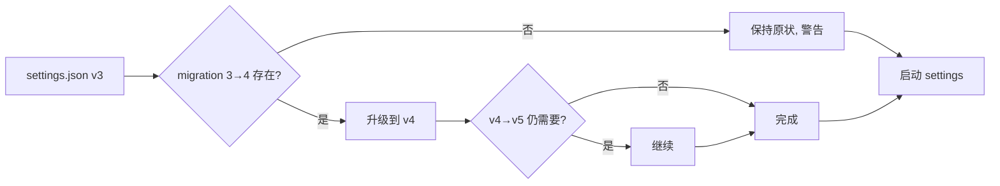
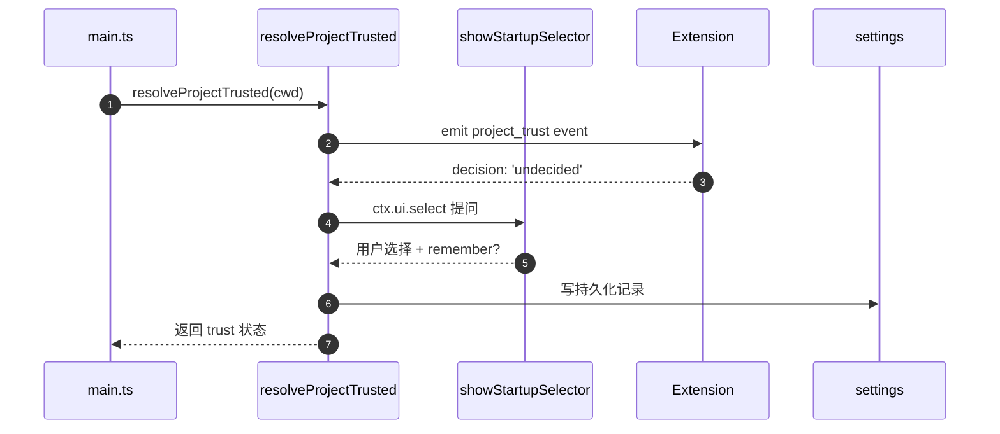
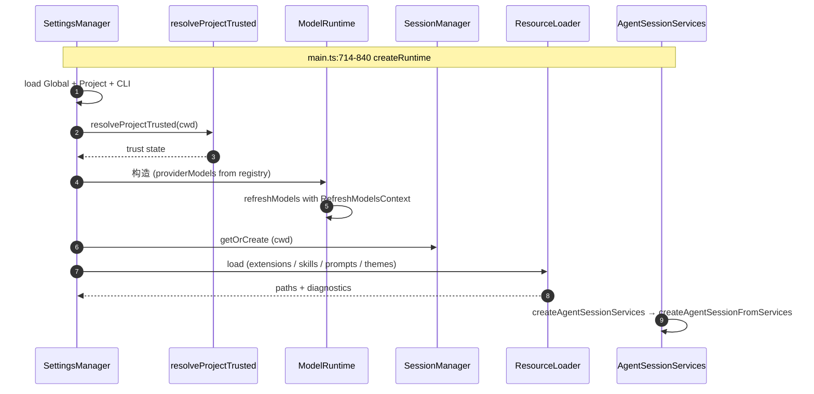

# 14 · Settings · Project Trust · Migrations · Model Runtime

> 本章讲清 pi 在"配置"与"项目信任"两件事上的设计。"项目信任"是默认 deny——你想让 pi 改你本地文件，要先回答 yes/no。

## 14.1 分层与优先级

`packages/coding-agent/src/core/settings-manager.ts:315-447` 把四层配置合并：

1. **global**（`~/.pi/settings.json`）—— 用户的全局默认。
2. **project**（`./.pi/settings.json` 或团队共享）—— 项目级覆盖。
3. **CLI flag**（`--api-key` 等） —— 显式传入。
4. **session-local**（`./.pi/sessions/<sessionId>/settings.json`） —— 单次会话的临时覆盖。

优先级：session-local > CLI > project > global。

合并规则：

- `model`、`thinkingLevel` 替换式合并（单值）。
- `flags` Record 合并（key 覆盖）。
- `aliases`、`keyBindings` 按命名空间合并。
- `permissions` 替换式合并。

## 14.2 原子写与错误处理

`settings-manager.ts` 用 atomic write：

```ts
async writeSettings(path, data) {
    const tmp = `${path}.tmp-${processId}-${random()}`;
    await fs.writeFile(tmp, JSON.stringify(data, null, 2));
    await fs.rename(tmp, path);   // atomic on POSIX
}
```

错误处理：

- 写失败：保留 `.tmp-*`，下次启动 re-do。
- 读失败：保留旧版本、记 warning、auto-heal at next write。
- 校验失败：`migrations.ts` 自动升级 schema；版本号 `--meta.schemaVersion` 写回到 settings 文件。

## 14.3 Migrations

`packages/coding-agent/src/core/migrations.ts`：

- 每个 migration 是一个 `Migration { from, to, transform }`。
- 启动时按版本顺序跑：1 → 2 → 3 → …
- 失败：抛 `MigrationError`，TUI 给用户提示。



## 14.4 Project Trust 全生命周期

`packages/coding-agent/src/core/project-trust.ts:23-37`：

- **启动期**（`main.ts:660-665` 之前）：`resolveProjectTrusted(cwd)`。如果是新项目且未在 settings 里写过：
  1. 走 `core/project-trust.ts` 调 `ctx.ui.select(...)`；
  2. **实际入口**是 `cli/startup-ui.ts:133-161 showStartupSelector`——它独立构造 startup TUI，挂载 `ExtensionSelectorComponent`，不与 InteractiveMode 共享；
  3. 用户选 yes/no/remember → 写到 `project_trust` 表。
- **运行时**（`/trust`）：直接走 `TrustSelectorComponent`。
- **钩子**：扩展可订阅 `project_trust` 事件：

```ts
pi.on("project_trust", async (event, ctx) => {
    if (event.cwd.startsWith("/safe/zones")) return { decision: "yes" };
    return { decision: "undecided" }; // 让用户决定
});
```



## 14.5 Model Runtime

`packages/coding-agent/src/core/model-runtime.ts` + `model-registry.ts` + `model-resolver.ts`：

- **Registry**：注册 provider / model + 内部 id。
- **Resolver**：把"用户选择的 model" 翻译成 `Model`。支持三种来源：
  - settings.json 里的显式 id（`provider/model`）。
  - 上次会话保存的 id（leaf 节点记录）。
  - 用户临时指定（`/model` 切换）。
- **Runtime**：包装 `streamSimple` 调用，附加 retry / http timeout / headers 注入。

`agent-session-services.ts:135-192` 完成 `ModelRuntime` 构造：

```ts
constructor(deps) {
    this.modelRuntime = new ModelRuntime({
        fetch: this.undiciDispatcher,
        providerModels: deps.providerModels,
        retry: deps.retry,
    });
}
```

`ModelRuntime.streamSimple` 接 `Agent.streamFn`（`sdk.ts:294-302`）：

```ts
streamFn: async (model, context, options) => {
    return modelRuntime.streamSimple(model, context, { ...options });
},
```

## 14.6 凭证解析（auth/resolve 入口）

`packages/ai/src/auth/resolve.ts`：

| 来源 | 优先级 | 用例 |
| --- | --- | --- |
| 显式（`--api-key`、`--oauth`） | 最高 | CLI 临时指定 |
| 环境变量 | 次高 | CI 注入 |
| OAuth 持久化 | 中 | 用户登录态 |
| 远程目录 | 低 | enterprise 私有 provider |

实际解析在 `coding-agent/core/auth-*` 几条命令：
- `auth-command.ts`（即 `/login`）
- `auth-check.ts`（启动期验证）
- `credential-print.ts`（不写真实 token 到日志）

## 14.7 启动期一次具体流程



## 14.8 用户视角

- `/settings` 打开 nested 菜单：auto-compact、steering/follow-up、transport/timeouts、images、thinking/theme、trust、tree filters、editor/TUI/display/warnings。
- 改完不需要重启；下次 prompt 自动生效。
- `--api-key` / `--oauth` 临时覆盖。
- 切换项目时 prompt 是否 trust 由 `resolveProjectTrusted` 决定。

## 14.9 开发者视角

- 加 settings 字段：写在 `SettingsConfig`（`settings-selector.ts:58-93`）→ migration → exposed via get/set。
- 加 trust 决策点：用 `pi.on("project_trust", ...)`，返回 `{ decision: "yes" | "no" | "undecided", remember: bool }`。
- 加 model 别名：在 `models-store.ts` 加映射，然后 `ModelResolver` 自动 pick up。

## 14.10 架构师视角

- **trust 默认 deny** 是核心安全姿态——读者改 file / network / process 都先 trust gate。
- **三层配置合并** 用显式优先级 + Record 合并，避免出现"magic auto-merge"的不可预期。
- **migrations 是 first-class**：版本号写在 settings 文件顶部，启动时校验 + 升级；migration 永远不可被"必须重置"覆盖。
- **凭证解析**与"settings 持久化"不同层：凭证不进 settings.json（避免被备份误传），由 `InMemoryCredentialStore` 单独维护。
- **Model Runtime 抽象**让 retry / http dispatcher 注入集中——这与 `cli/configureHttpDispatcher` 在入口完成 undici 配置一起形成"transport 接入点收敛"。
