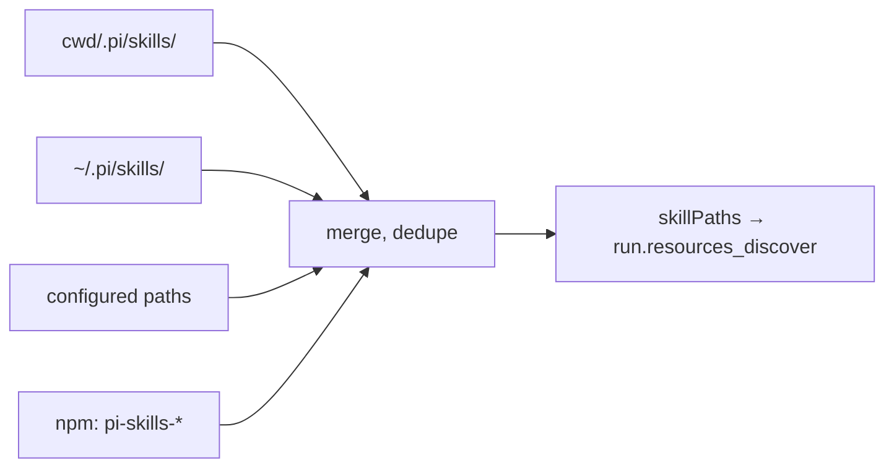

# 15 · 资源：Skills · Prompts · Themes · 系统 Prompt 注入

> 与 extension 并列，pi 还支持四类纯资源（不带代码逻辑）：skills（命令模板）、prompts（文本片段）、themes、system prompt 文件。本章讲清它们的来源、加载顺序、注入点。

## 15.1 四种资源类型

| 类型 | 字段 | 触发方式 | 用途 |
| --- | --- | --- | --- |
| **Skill** | `pi.skills` manifest | 命令行 `/skill:<name>` 或自动 expansion | 把一个完整 prompt 模板抽象出来 |
| **Prompt** | `pi.prompts` manifest | `/tree` / editor autofill | 可重用片段 |
| **Theme** | `pi.themes` manifest + JSON palette | `/theme` 或 settings.json | 切换外观 |
| **System prompt override** | 项目根 `.pi/system-prompt.md` | 自动 | 注入系统级规约 |

## 15.2 manifest 字段

`packages/coding-agent/src/core/pi-manifest.ts:16` 的 `readPiManifest` 读 `package.json` 的 `pi` 字段：

```ts
interface PiManifest {
    extensions?: string[];
    skills?: string[];
    prompts?: string[];
    themes?: string[];
}
```

每个字段是相对包根的路径数组，缺失时静默跳过（不报错）。

## 15.3 资源发现顺序

`core/resource-loader.ts` 的查找顺序：

1. `cwd/${CONFIG_DIR}/skills/`（项目）
2. `agentDir/skills/`（global）
3. 显式配置的 paths
4. npm-installed via package manager

每类资源在 `discoverAndLoad(...)` 之后合并去重。



## 15.4 Skills 的展开过程

`packages/coding-agent/src/core/skills.ts`：

- 文本先经扩展 `input` 钩子转换；再经 skill expansion。
- 命中展开后，文本替换为 skill 内容 + 上下文参数。
- 命中失败（参数不足 / 不存在）→ 跳过。
- 命中展开不影响持久化——展开**前**的形态被记到 session entry，展开仅影响"实际发给 LLM 的消息"。

> 注意：与"扩展 input 钩子 transform"正交；input hook 可丢弃，skill expansion 不可阻断。

## 15.5 Prompts

- 与 skills 同源（manifest `/` 路径），但产物是 `string` 数组而非模板。
- 主要用作 editor 的可重用片段（如"PR review template"）。
- `/tree` 的副面板可显示可用 prompts 列表。

## 15.6 Themes

- JSON palette：`{ name, colors: { fg, bg, dim, accent, error }, markdown: {}, editor: {}, ... }`。
- `core/theme/theme.ts` 的 `getMarkdownTheme(name)` / `getEditorTheme(name)` 取回。
- 切换实时刷新（不需要重启）。
- 内置 theme：`dark` / `light`；custom 与 `pi.themes` 声明的合并。
- `InteractiveThemeController` 监听 terminal color-scheme 切换在 `:81-136`。

## 15.7 System Prompt 注入点

`packages/coding-agent/src/core/system-prompt.ts` 维护 system prompt 的最终拼装：

```ts
function buildSystemPrompt(base, projectOverride, runtime) {
    let sp = base;
    if (projectOverride) sp += "\n" + fs.readFileSync(projectOverride, "utf-8");
    sp += "\n\n" + runtime.extensions.flatMap(e => e.contributeSystemPrompt?.() ?? []).join("\n");
    return sp;
}
```

注入顺序：

1. 模型默认 `base`（来自 provider）。
2. 项目级 `.pi/system-prompt.md`（可选）。
3. user `~/.pi/system-prompt.md`（可选）。
4. 扩展 `contributeSystemPrompt` 注入块。
5. skill expansion（仅在 user 输入阶段，不是 system prompt）。

> 扩展还可在 `before_agent_start` 钩子里返回 system prompt 改写：

```ts
pi.on("before_agent_start", async (event, ctx) => {
    return {
        systemPrompt: event.systemPrompt + "\n\n扩展注入的项目规约：…",
    };
});
```

## 15.8 reload 与诊断

- `/reload` 触发 settings + resources 重新读取：包括扩展、skills、prompts、themes。
- `runner.emitResourcesDiscover` 在 reload 完成后 emit，给扩展再注入自定义路径的机会。
- 失败资源写到 diagnostics（不阻塞启动）；用户在 `/config` 可看。

## 15.9 用户视角

- 把 prompt 模板放 `.pi/prompts/pr-review.md`，然后在 editor 用 `/prompts` picker 选。
- 把团队规约放 `.pi/system-prompt.md`，自动注入。
- 切换主题：`/theme` 选 dark/light/custom。
- 卸载资源：删除对应文件，下次 reload 自动消失。

## 15.10 开发者视角

- 给扩展新增 system prompt 注入：在 `ExtensionSystemPrompt` 接口里实现。
- 写自己的 prompt 模板：放 `~/.pi/prompts/` 或项目 `.pi/prompts/`，用 `pi.prompts` 字段注册（如通过第三方 npm 包）。
- 注意：资源改动需要 reload 才生效。开发时可监控 `core/resource-loader.ts:374-385` 的 reload signal。

## 15.11 架构师视角

- **资源与扩展是两件事**：资源是数据（文本 + palette），扩展是代码。两者通过 manifest 与 host API 双向注入，但不允许扩展修改已加载的 skill 内容——它是 source of truth。
- **system prompt 注入点集中**：第 4 步"扩展 contributeSystemPrompt" + "before_agent_start 钩子改写" 是两条独立路径，前者在 startup 一次定型，后者每次 turn 都生效。
- **资源诊断不阻塞启动**：用户即使资源坏了一半也能进 pi——这是为什么 diagnostics 是 best-effort。
- **reload 是显式行为**：不监视文件系统，避免性能抖动；用户主动 `/reload` 或重启。
