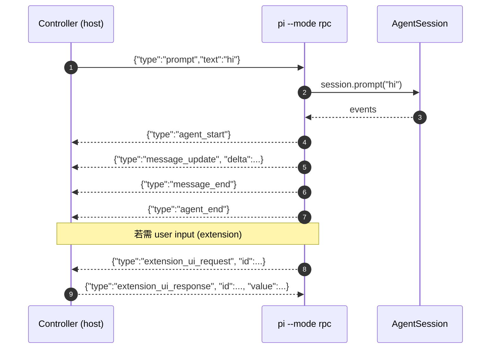

# 16 · Print · RPC · JSON 三种模式

> pi 的非交互入口。本章讲清 print / rpc / json 三模式、与 client/server 的关系，以及第三方嵌入用法。

## 16.1 全景

`packages/coding-agent/src/modes/`：

- **`interactive`**：默认 TUI 入口。
- **`print`**：`pi -p "..."` 单次。
- **`rpc`**：`pi --mode rpc`，行分隔 JSON / 新行分帧。
- **`json`**：`pi --mode json -p "..."`，事件流 JSON。

> ⚠ 注意：`modes/rpc` 走 line-delimited JSON，与 `packages/client`+`packages/server` 的 CBOR 协议**不重叠**——CBOR 协议用于"把整个 agent 暴露成独立服务"，RPC 是"嵌入到本地 shell 把控制信号传出去"。

## 16.2 Print Mode

`packages/coding-agent/src/modes/print-mode.ts`：

- 与 interactive 共用同一 `AgentSessionRuntime`（`agent-session-services.ts` 构造）。
- 启动期：构造 runner，bind extensions（`bindExtensions:74-76`）——但 `mode = "print"`，不绑 UI context。
- 提交 prompt（通常是 `-p <text>` 与 stdin）。stdout takeover（`output-guard.ts`）防止 stdout 打乱。
- 模式切换：`--mode json` 改写 output 形式。

```ts
// packages/coding-agent/src/modes/print-mode.ts (关键节)
runPrintMode(runtime, prompt, opts) {
    await runtime.rebind({ mode: "print" });
    const session = await runtime.agentSession;
    const text = await outputGuard.takeOverStdout();
    try {
        const final = await session.prompt(prompt, opts);
        process.stdout.write(renderResult(final));
    } finally {
        await text.restore();
    }
}
```

### 16.2.1 用户视角

```bash
$ pi -p "Say exactly: ok"
ok
$ pi --mode json -p "reverse hello" | jq
{ "type":"agent_start", ... }
{ "type":"message_start", ... }
...
{ "type":"message_end", "message":{...} }
{ "type":"agent_end" }
```

### 16.2.2 开发者视角

- 使用 `output-guard.ts` 的 `takeOverStdout / flushRawStdout / waitForRawStdoutBackpressure` 做 backpressure。
- 信号钩子优雅关闭（SIGINT 透传到 agent）。

## 16.3 RPC Mode

`packages/coding-agent/src/modes/rpc/`：

- 通过 stdin/stdout 行分隔 JSON 与外部控制器通信。
- 控制器可以：
  - 提交 prompt。
  - 接收 `agent_start / turn_start / message_update …` 事件流。
  - 调用扩展命令、slash 命令。
  - 通过 `extension_ui_request` 接受 user input（`modes/rpc/rpc-mode.ts:560`）。
- 控制 TUI overlay：`examples/rpc-extension-ui.ts` 给出完整示例。



### 16.3.1 UI 降级

`createExtensionUIContext`（`modes/rpc/rpc-mode.ts:136`）：

- `select / confirm / input / editor` → 走 `extension_ui_request` 等响应。
- `notify / setStatus / setTitle / setEditorText / setWidget(strings)` → 走 fire-and-forget RPC。
- `setWidget(component) / setFooter / setHeader / setWorking* / setHiddenThinkingLabel / setEditorComponent / custom / getAllThemes / setTheme` → no-op。

## 16.4 JSON Mode

- 与 print 模式共用同一会话，但输出格式改成每行一 JSON 事件。
- `modes/json-event.ts` 定义事件 schema。
- 第三方脚本（CI、test）最常用的入口。

## 16.5 CLI flags 与模式判断

`packages/coding-agent/src/main.ts:117-128` 的 `resolveAppMode`：

| TTY in | TTY out | `--mode <flag>` | `--rpc-addr` | 选择 |
| - | - | - | - | - |
| Y | Y | - | - | interactive |
| N | N | - | - | print |
| - | - | rpc | - | rpc |
| - | - | json | - | print + json events |
| - | - | - | addr | rpc |

`pi-test.sh` 的 `--no-env` 与 `--offline` 不影响模式选择，只影响 env flag。

## 16.6 嵌入式 / CI / 第三方

第三方用法分两类：

1. **CLI mode**（print / json / rpc）：直接 fork 进程。
   - 优点：零开发、零依赖。
   - 缺点：每次新进程都要 reload 资源，cost on cold start。
2. **In-process embed**：`packages/client` + `packages/server` 协议。
   - 优点：常驻进程、低延迟、复用 snapshot。
   - 缺点：要 `pi serve` 进程；连接管理、断线恢复、超时配置都归消费者。

`examples/rpc-extension-ui.ts` 是 (1) 的扩展开发范式；`examples/sdk/` 是 (2) 的客户端 SDK 范式。

## 16.7 用户视角

- `pi -p "..."`：批处理/脚本首选。
- `pi --mode json -p "..."`：CI、SSE 集成。
- `pi --mode rpc`：把 pi 嵌进其它终端程序（如自己的 chat)。
- 内部团队用 IPC（unix socket）跑 `pi` 服务，所有 IDE 客户端连同一进程。

## 16.8 开发者视角

- 写 RPC 控制器：必须按 protocol schema 严格解析，否则协议层`toError` 会抛错。
- 写 JSON 模式消费者：用 `jq -c '.type'` 反序列化事件流，并按事件类型分流。
- 写 CLI 嵌入式脚本：用 `process.on('SIGINT', ...)` + `flushRawStdout` 做流控。

## 16.9 架构师视角

- **三种模式都共用 `AgentSessionRuntime`**——print/rpc/json 只是 stdout 的包装层不同，业务逻辑零重复。这是构建在内部分层的一个直接好处。
- **CBOR + RPC line-delimited JSON 两套协议并存**是有意识的——CBOR 服务跨机器、line-JSON 与 shell 友好、其它 IDE 工具能直接消费。
- **`output-guard` 抽象**让 print 模式接管 stdout 时不破坏事件流；其它模式默认不接管。
- **LLM boundary 转换**发生一次（`AgentMessages → Messages`），无论哪种模式都共享，让 print/rpc/json 不会比 TUI 慢。
