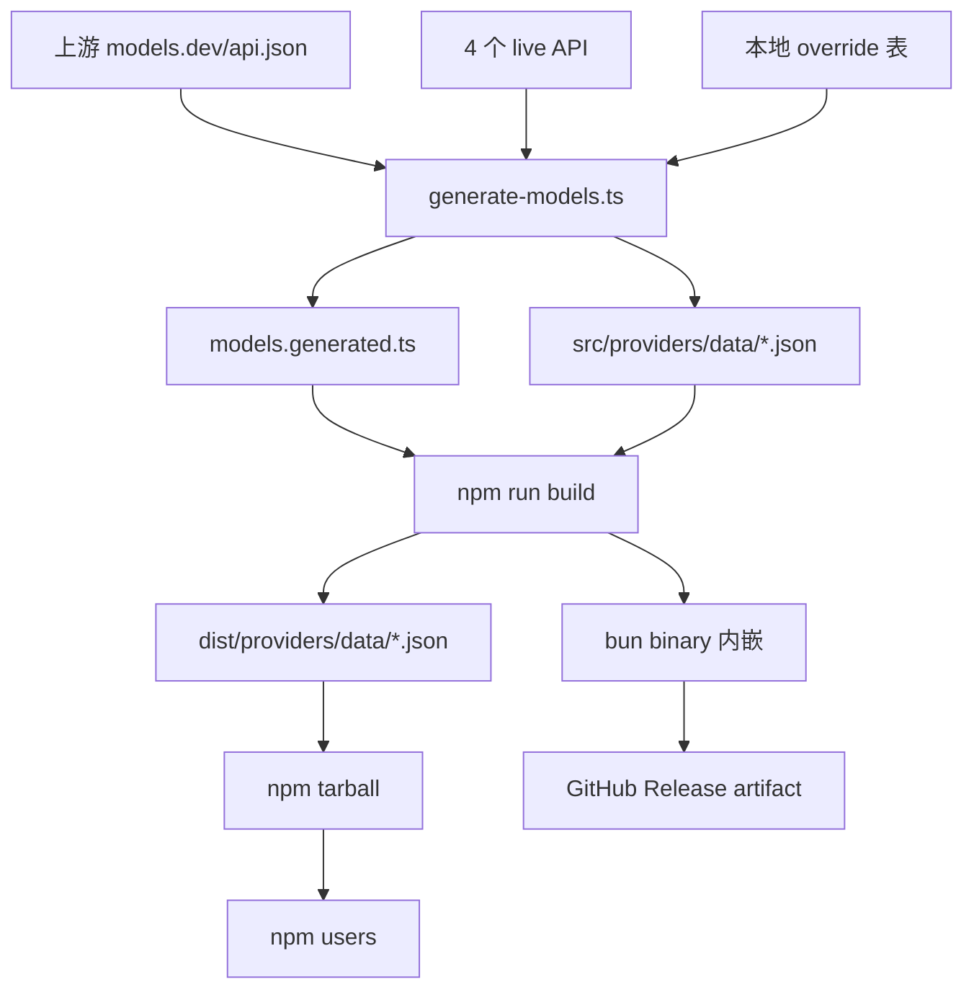

# 17 · 部署、Bun 二进制、lockstep 发布

> pi 的发布链路是有意识"双形态"：npm workspace + Bun 单文件二进制。本章讲清 lockstep 版本、shrinkwrap、CI 与供应链。

## 17.1 lockstep 版本与三种发布

- 所有 `@earendil-works/*` workspace 包共享一个版本号。
- `package.json` 提供 `release:patch / release:minor / release:major` 三个脚本；`scripts/release.mjs:4-6, 28-32` 接受 `patch / minor / major` 三种 bump。
- 实际语义（项目约定）：
  - **`patch`**：修复 + 新增（非破坏性）。
  - **`minor`**：破坏性变更（按 npm 惯例）。
  - **`major`**：项目另设的等级，按 release notes 的口径使用。

> **修订点**：早期文档（仓库根的旧 `HANDBOOK.md` §10.3）把"没有 major"作为锁步约定的一部分写出来，这是过时的。当前 `package.json` 与 `scripts/release.mjs` 都明确接受 `major`；本手册以代码为准。

## 17.2 模型目录生成（每次 build 必经）

```ts
// packages/ai/scripts/generate-models.ts (节选)
const response = await fetch("https://models.dev/api.json");
// ... NVIDIA NIM / OpenRouter / Vercel 等
// 应用 override 表 (generate-models.ts:241-460)
// 写 models.generated.ts 与 src/providers/data/*.json
```

- `npm run build` → `packages/ai` 的 `"build": "npm run generate-models && npm run build:offline"`。
- `build:offline` 不联网，直接复用 `models.generated.ts` 与 `data/*.json`。
- `check:model-data` 校验每条 `MODELS.id` 在 JSON data 中存在；drift 视为 build failure。

## 17.3 Bun 二进制构建

`packages/coding-agent/build:binary`：

1. build monorepo。
2. `bun build --compile dist/bun/cli.js + image-resize-worker.ts`。
3. `copy-binary-assets` 把运行时资源（`photon-node.wasm` / themes / assets / examples / docs）随二进制打包。

CI 通过 `.github/workflows/build-binaries.yml` 把 Bun 产物以 GitHub Release artifact 形式发到 GitHub Releases。

## 17.4 发布流程

```mermaid
flowchart LR
    A[/cl 审计 + 更新所有 [Unreleased]]
    A --> B[npm run release:local --out /tmp/pi-local-release --force]
    B --> C[Bun binary smoke + Node install smoke]
    C --> D[PI_ALLOW_LOCKFILE_CHANGE=1<br/>npm_config_min_release_age=0<br/>npm run release:patch / release:minor / release:major]
    D --> E[bump versions + 更新 changelog +<br/>regenerate release artifacts +<br/>npm run check]
    E --> F[Commit Release vX.Y.Z + push tag]
    F --> G[CI: build-binaries + publish-npm via OIDC trusted publishing]
    G --> H[announce-pi-dev-release 验证 npm tarball + 写 R2 marker]
    H --> I[pi.dev/api/latest-version 读 marker 公告]
```

> 这张图说明什么：本地 smoke 测试是 release blocker——若 release 测试失败，CI 同样会失败，所以 fallback 永远是"重跑 CI"而不是"重跑 release 脚本"。

## 17.5 Shrinkwrap 与 lockfile

- `package-lock.json` 是 ground truth。
- `packages/coding-agent/npm-shrinkwrap.json` 是发给 npm 用户的 transitive deps 锁——由 `scripts/generate-coding-agent-shrinkwrap.mjs` 生成。
- `.npmrc` 强制 `save-exact=true` 与 `min-release-age=2`。
- 直连依赖全是精确锁版本；间接依赖由 shrinkwrap 锁定。
- pre-commit 阻断 lockfile 提交，除非 `PI_ALLOW_LOCKFILE_CHANGE=1`。
- 新增带 lifecycle 脚本的依赖要显式白名单（`scripts/generate-coding-agent-shrinkwrap.mjs` 内有 allowlist）。

## 17.6 供应链硬化

| 措施 | 作用 |
| --- | --- |
| `save-exact` + `min-release-age` | 避免同一天发布的依赖版本被 npm 解析 |
| pinned 直连依赖 | `check:pinned-deps` 在 CI 校验 |
| shrinkwrap | 锁住 transitive deps，影响 npm 用户安装结果 |
| 定期 `npm audit --omit=dev + npm audit signatures --omit=dev` | 跑在 scheduled CI workflow |
| `pi update --self` 强制 `--ignore-scripts` | 避免 lifecycle 脚本攻击 |
| `release:local` smoke 在临时隔离目录 | 防止 workspace 影响 |

## 17.7 模型数据生命周期



> 注意：模型数据既影响 npm 用户（dist JSON），也影响 Bun binary（内嵌）。两者共享同一生成路径。

## 17.8 用户视角

- 安装：`npm i -g @earendil-works/pi-coding-agent`，或下载 GitHub Release 的 Bun binary。
- 升级：`pi update --self --ignore-scripts`。
- 装好后：`pi --help`、`pi --list-models`、`pi -p "say ok"`。
- 调试发布：在本地跑 `npm run release:local --out /tmp/pi-local-release --force`，里面 Node + Bun 双形态都被装好。

## 17.9 开发者视角

- 改完代码后跑 `npm run check`（= biome + pinned-deps + ts-imports + shrinkwrap + tsgo + browser-smoke）。
- 需要更新模型数据：本地 build 会自动 fetch；如果只想更新 JSON，加 `--data-only`。
- 想试一次发布模拟：`npm run release:local` 在 `/tmp` 装一份。

## 17.10 架构师视角

- **lockstep 版本** + "patch=fix+add, minor=breaking" 是项目刻意的"滚动 minor、偶发 patch"策略。这样 changelog 历史可读、npm 升级行为可预测。
- **新增 `release:major`**（与 npm 惯例不同）让项目在跨大版本演进时（比如 AgentHarness 落地、协议大版本变化）仍能走统一脚本。
- **shrinkwrap + lockfile 双重锁**——根 lockfile 是开发环境的 ground truth，coding-agent 的 shrinkwrap 是用户环境的 truth。`PI_ALLOW_LOCKFILE_CHANGE=1` 阻断误操作。
- **Bun 单文件** 在 GitHub Release 发，与 npm 包独立。两者各自维护 smoke 流程，fail/rollback 独立。
- **CI 信任发布**——`publish-npm` 用 GitHub Actions OIDC trusted publishing + environment `npm-publish`，免去本地 npm whoami / OTP / WebAuthn。
- **"先 smoke 后 release"** 是有意为之——`release:local` 在临时目录装好并跑，若失败则 release 取消。

## 17.11 与供应链相关的边界

- npm 用户安装时，lifecycle 脚本要 `--ignore-scripts` 才会真正执行。`pi-test.sh` / `pi update --self` 都强制加。
- undici 升级必须查其 changelog——这是项目政策。undici 涉及 HTTP/2、HTTP/3、proxy、headers 处理，是攻击面较大的依赖。
- 新增依赖必须经过 shrinkwrap allowlist；带 lifecycle 脚本（如 preinstall）默认拒绝。
