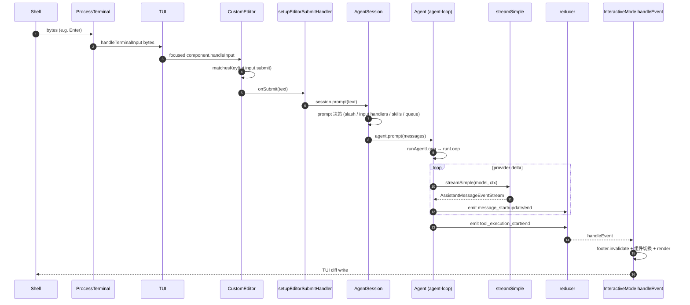

# 18 · 调试与错误恢复 Cookbook

> 本章是面向**用户与开发者**的实战手册。回答两个问题："出错时怎么办"以及"我想知道一段代码到底怎么跑"。

## 18.1 一次按键 → TUI 刷新的完整路径



> 这张图说明什么：从按键到渲染**完整**经过 13 步。每一步都可断点：`handleTerminalInput` / `submitValue` / `setupEditorSubmitHandler` / `session.prompt` / `_runAgentPrompt` / `agent.prompt` / `runAgentLoop` / `streamSimple` / `processEvents` / `handleEvent` / `requestRender` / 终端 write。

## 18.2 6 大真实工作流（节选 3 个走查）

### 18.2.1 首次启动

```bash
$ pi
   ↓
cli's configureHttpDispatcher + process.title  → main(argv)
   ↓
resolveAppMode (TTY guard) + first-time setup?
   ↓
showStartupSelector (cli/startup-ui.ts:133-161)
   ↓
createRuntime closure: trust → services → session → api-key
   ↓
new InteractiveMode(runtime, ...) → interactiveMode.run()
   ↓
init: ScrollView/VStack dock + KeybindingsManager + setupKeyHandlers
   ↓
rebind 扩展 + rebind 当前 session
   ↓
getUserInput() → session.prompt(text) on Enter
```

### 18.2.2 发送一个 prompt 并产生 tool call

1. `submitValue` 调 `setupEditorSubmitHandler`（`interactive-mode.ts:2870-3003`）。
2. 非空 → `onInputCallback(text)` → `getUserInput` 拿到 → `await this.session.prompt(text)`。
3. `AgentSession.prompt` （`agent-session.ts:1116-1273`）：先扩展 command 截取；再 input hook 截取（`handled` 直接返回）；skill/template expansion；streaming queue 检查；compaction 检查；构造 user AgentMessage；扩展 `before_agent_start` 钩子改写系统 prompt、注入 custom messages。
4. `_runAgentPrompt(messages)`（`:1063-1074`）：调用 `agent.prompt(messages)`，循环 `agent.continue()` 处理 retry / compaction / queued continuation，直到 settled。
5. `Agent.runPromptMessages`（`agent.ts:409-422`）调 `runAgentLoop(messages, ctx, cfg, processEvents, signal, streamFunction)`。
6. `agent-loop.ts:95-117` emit `agent_start / turn_start / message_start / message_end (user)`。
7. `runLoop:155-275` 跑 provider 流，emit `message_start / message_update(message, assistantMessageEvent) / message_end`。
8. 如果 LLM 返回 tool_calls → `tool_execution_start / execute(toolCallId, params, signal, onUpdate) / tool_execution_end`。
9. 把 `ToolResultMessage` 追加进 context，进入下一 turn。
10. `InteractiveMode.handleEvent:3065-3392` 按事件切 status、刷新 AssistantMessageComponent / ToolExecutionComponent。
11. 在没有 tool_call 时：`turn_end / agent_end`，UI 切回 Idle。

### 18.2.3 `/edit src/foo.ts` 的真实路径（**核心误区**）

> **`BUILTIN_SLASH_COMMANDS` 不含 `/edit`**（`slash-commands.ts:18-41`）。

1. 你键入 `/edit src/foo.ts` + Enter。
2. `setupEditorSubmitHandler` 在 `BUILTIN_SLASH_COMMANDS` 上查找 `edit` → 未命中。
3. 没有任何扩展注册 `registerCommand('edit')` → 也没命中。
4. 不命中内置 / 扩展 → 视作普通文本，进入 prompt。
5. `AgentSession.prompt` 把它当作 user prompt 发给 LLM。
6. LLM 自主决定调 `edit` 工具（`packages/agent/src/harness/tools/edit.ts`）。
7. `edit` 工具经 `beforeToolCall` 钩子 → `file-mutation-queue` 串行化 → 写盘。
8. tool_result 返回 → 下一 turn。

**所以 `/edit` 不是 pi 的内置 slash 命令**——它由 LLM 驱动的工具调用来达成。如果你想让 `/edit` 走你自己的逻辑，可以 `registerCommand('edit', { handler: ... })` 把它拦下来。

### 18.2.4 (其余工作流要点)

- **加载第三方 provider 的扩展**：`discoverAndLoadExtensions:688` → `resolveExtensionEntries:609` 读 `pi.extensions` → `createExtensionAPI:248` + `bindCore:313` → `runner.registerProvider` → 模型注册表重新生成 → 触发 `runtime.refreshTools`。
- **一次 compact 触发**：token 估算 → `/compact` 或自动阈值 → `compact:1789` → `session_before_compact` 事件钩子 → 摘要 LLM 流（带 AbortSignal） → 写 `CompactionEntry`（带 `prev_leaf_id` 指针）→ UI 状态刷新。
- **断网恢复**：`storage.ts:64-105` 扫描 append-only 行 → 修补/截断尾部 → reducer 重放 → 验证 record-log 完整性 → 复活 lane + leaf → 下个 prompt 续接。

## 18.3 常见错误与恢复

| 症状 | 排查路径 |
| --- | --- |
| TUI 进不去 | `resolveAppMode`（`main.ts:117-128`）—— 检查 stdin/stdout 是否 TTY |
| 模型未显示 | 走 `/model` 检查 catalog refresh；`refreshModels`（`models-store.ts`） |
| 工具未生效 | 确认它是 active tools —— 用 `pi.getActiveTools()` |
| 扩展报错 | `LoadExtensionsResult.errors` 累积；`/config` 查看 |
| Provider 401 | `auth/resolve.ts` 解析顺序：--api-key > env > oauth > remote |
| Session 损坏 | `RecordLogCorruptionReason` 在 `reducer.ts:22-44` 列举；`/tree` 切 leaf 跳过损坏段 |
| Compact 卡住 | `Escape` 中止；`session_before_compact` 钩子可部分保存 |
| Sync with main 太慢 | `TUI_BASE MIN_RENDER_INTERVAL_MS = 16` 自动 throttle；通常不需调 |
| `Connection` 断 | 它会自动重连；若失败，看 `transport.ts` 的 backoff 配置 |
| 模型目录 stale | `npm run generate:models` 或 `npm run build:offline` |
| Tests 不能跑 | `npm test` 包含 e2e——用 `./test.sh` |

## 18.4 用户 cookbook：日常操作

### 18.4.1 选 / 切模型

```bash
/model anthropic/claude-sonnet-4-5            # 直接设置
/model                                     # 打开 selector
Ctrl+L                                     # 等价于 /model
Ctrl+P / Shift+Ctrl+P                       # cycle forward / backward
/scoped-models                             # 限定 cycle 范围
```

### 18.4.2 会话

```bash
/new                                       # 新建
/resume                                    # 打开 session browser
/fork                                      # 在当前 leaf 分叉
/tree                                      # 看分支树
/name "重构 calc.ts"                        # 重命名
/session                                   # 看统计
```

### 18.4.3 编辑 & 编辑器

```bash
@path/to/file                              # editor 内引用文件
/path/to/file                              # 在 editor 内快速插入路径
! ls -la                                   # shell bang
!! bash                                    # 全 shell 模式
Ctrl+G                                     # 外部编辑器
```

### 18.4.4 配置与信任

```bash
/settings                                  # nested 菜单
/trust                                     # 项目信任设
/login                                     # OAuth 入口
/logout                                    # OAuth 注销
/scoped-models                             # 切 cycle 范围
/reload                                    # 重载扩展 + 资源
```

### 18.4.5 错误恢复

- 按 `Escape`（`app.interrupt`）中断 agent。
- 按 `Ctrl+C`（`app.clear`）清空 editor。
- `Ctrl+D`（仅 buffer 空时）退出。
- 自动 compaction 在 ~85% 触发；`Escape` 中止。
- session 重载崩溃：`/tree` 切旧 leaf；`/resume` 切换；reload 修复。

## 18.5 开发者 cookbook：调试技巧

### 18.5.1 启调试模式

```bash
./pi-test.sh --verbose                      # verbose 日志
DEBUG_TUI=1 ./pi-test.sh                    # tui debug
```

### 18.5.2 监听事件流

订阅 agent 事件：

```ts
import { AgentEventBus } from "@earendil-works/pi-coding-agent";

const bus = session.eventBus;
bus.on("*", (event) => console.log(event.type));
```

或写一个最小扩展：

```ts
pi.on("*", (event) => console.log("[event]", event.type, event));
```

### 18.5.3 检查 JSONL

```bash
tail -f ~/.pi/sessions/<id>/session.jsonl | jq -c .
```

### 18.5.4 修改 record-log

- 不要直接编辑 JSONL。
- 用 `session/import` 导入 mutation；或 `registerCustomEntry` 写 custom entry。

### 18.5.5 加载未注册扩展

```bash
PI_EXTENSION_PATHS=./my-extension pi
```

或放项目 `.pi/extensions/` 下。

### 18.5.6 Provider 调试

```bash
./pi-test.sh --no-env --offline             # 纯本地，无凭证
```

> 启动期凭证解析会显式告诉你用了哪条路径。

## 18.6 调试器/性能

| 关注点 | 路径 |
| --- | --- |
| TUI 慢 | `TUI_BASE.MIN_RENDER_INTERVAL_MS`、`renderCache` 在 `layout.ts:354` |
| Provider 慢 | 看 `usage.cacheRead / cacheWrite` 比；切到 `cache_strategy: "auto"` |
| 启动慢 | 八成因为 provider model catalog 刷新 -- 用 `--offline` |
| Memory 增长 | JSONL 一行行 append 是无界的；用 `/compact` 缓解 |
| stream 抖动 | LLM provider 端；改 `thinkingLevel` 提升稳定性 |

## 18.7 小结

- 一切从用户视角走查都有清晰文件位置。
- 调试靠订阅事件总线 + JSONL tail。
- 错误恢复一般通过 `/compact /tree /resume /reload` 解决，无需进程级 reset。
