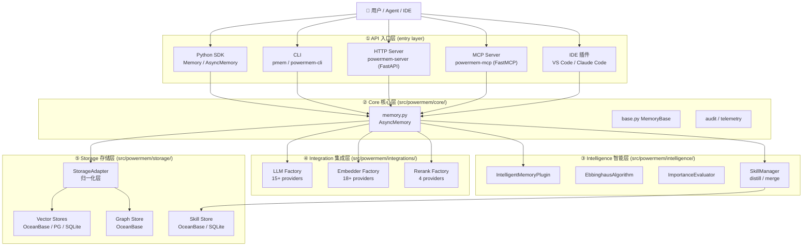
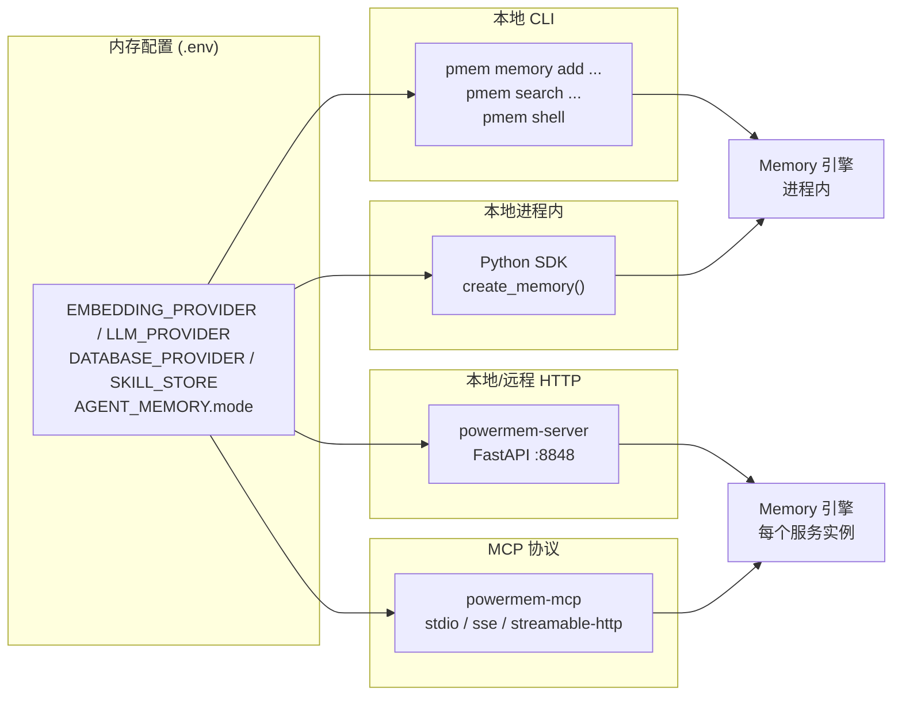
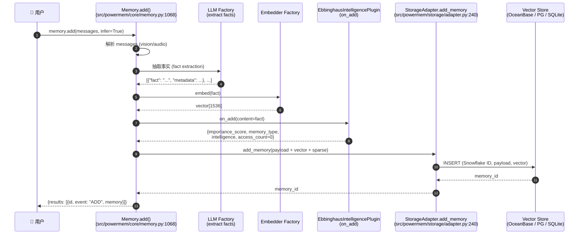

<!--
读者定位:
  👤 用户 (主要) — 想理解 PowerMem 能为自己做什么
  🛠 开发者 (次要) — 想建立全局心智模型
  🏗 架构师 (次要) — 想确认它覆盖了哪些关键设计
-->

# PowerMem 全景概览

> **读者定位**: 👤 用户 (主) · 🛠 开发者 (辅) · 🏗 架构师 (辅)
>
> 本章是整个 handbook 的入口。如果你是首次接触 PowerMem, 先读这一章; 如果你只是想确认某个机制的源码位置, 直接跳到对应章节。

## 你将学到

1. PowerMem 与"普通向量库"的本质差异 — 它不只是存 embedding, 还自带 **LLM 驱动的记忆抽取**、**艾宾浩斯型衰减**、**双层 Experience+Skill 蒸馏**
2. 5 层架构: API / Core / Intelligence / Integration / Storage 各负责什么
3. 4 种接入方式: Python SDK、HTTP Server、CLI、MCP, 以及它们如何共享同一份配置和存储
4. 一条 `add()` 数据流的端到端时序, 帮你建立后续章节的锚点

---

## 1. PowerMem 是什么

> 一句话定义: **PowerMem 是面向 AI 智能体与应用的"持久化、自进化记忆层", 融合向量检索、全文检索、图谱检索、LLM 事实抽取、艾宾浩斯时间衰减, 并原生支持 Experience + Skill 双层蒸馏。**

它解决的不是"如何存向量", 而是**"如何让 AI 智能体越用越聪明"** — 这意味着系统需要:

- **理解对话**: 不是逐字存, 而是 LLM 先抽事实 (fact extraction) 再去重 (dedup), 决策是 ADD / UPDATE / DELETE / NONE
- **遗忘**: 像人脑一样按艾宾浩斯曲线衰减, 长期未用且不重要的记忆进入"工作记忆"层, 最终被软删除
- **归纳**: 从大量对话中蒸馏出可复用的程序性 **Skill** (操作步骤 + 坑点), 形成经验层
- **多模态**: 图片、音频、文本走同一管道, 经 `parse_vision_messages` 统一后再走 LLM
- **多租户**: 同一份存储里隔离 `user_id` / `agent_id` / `run_id` 三种作用域

下面是 PowerMem 与"普通向量数据库"的能力对比:

| 能力 | 普通向量库 | PowerMem |
|------|-----------|----------|
| 存 embedding | ✅ | ✅ |
| KNN / ANN 检索 | ✅ | ✅ |
| 全文检索 + 融合 (RRF) | ❌ / 第三方 | ✅ 内置 |
| 知识图谱 (实体-关系) | ❌ | ✅ (OceanBase graph) |
| LLM 自动抽取事实 | ❌ | ✅ |
| 语义去重 + 冲突合并 | ❌ | ✅ (ADD/UPDATE/DELETE/NONE) |
| 时间衰减与遗忘 | ❌ | ✅ (Ebbinghaus R = e^(-t/S)) |
| 双层蒸馏 (Experience + Skill) | ❌ | ✅ |
| 多模态 (图像/音频) | ❌ | ✅ |
| 30+ LLM / 15+ Embedder / 4 Rerank Provider | ❌ | ✅ 即插即用 |
| 多租户作用域 (user / agent / run) | 部分 | ✅ Scope+Permission+Privacy 三件套 |

---

## 2. 五层架构一览

源码布局严格遵循分层 (`src/powermem/`):



各层一句话职责:

| 层 | 文件根目录 | 一句话职责 |
|----|-----------|-----------|
| ① API 入口 | `src/powermem/{cli,mcp}/` + `src/server/` + `src/powermem/__init__.py` | 把同一份 `Memory` 引擎暴露成 SDK / CLI / HTTP / MCP / IDE 插件 |
| ② Core 核心 | `src/powermem/core/` | `MemoryBase` ABC、`Memory`/`AsyncMemory` 引擎、telemetry、audit、setup |
| ③ Intelligence | `src/powermem/intelligence/` | Ebbinghaus 衰减、重要性评分、Skill 蒸馏、Plugin 扩展点 |
| ④ Integration | `src/powermem/integrations/` | LLM / Embedder / Rerank Provider 的注册表与实现 |
| ⑤ Storage | `src/powermem/storage/` | `StorageAdapter` 归一化层 + OceanBase / PGVector / SQLite 后端 |

> 👉 想看每一层的源码级讲解, 翻到 [01-architecture](./01-architecture)

---

## 3. 四种接入方式

同一个 `Memory` 引擎, 通过不同入口暴露给不同场景:



四种入口共享同一份配置 (`auto_config()`), 数据可互通:

| 入口 | 入口命令 | 适合谁 |
|------|---------|--------|
| Python SDK | `from powermem import create_memory` | 应用嵌入 |
| CLI | `pmem memory add ...` | 运维 / 调试 / 一次性写入 |
| HTTP Server | `powermem-server` (:8848) | 跨语言客户端、容器化部署 |
| MCP Server | `powermem-mcp [transport]` | Claude Desktop / Cursor / Cline / OpenCode 等 MCP 客户端 |

IDE 插件 (`apps/vscode-extension/` + `apps/claude-code-plugin/`) 实际上是对 MCP / HTTP 的封装, 不再单独列出。

> 👉 HTTP / MCP / CLI 的完整 API 速查, 见 [99-api-quickref](./99-api-quickref)

---

## 4. 一条端到端 `add()` 数据流

下面这张图是后续章节的总锚点 — 它会反复被拆解引用:



注意第 ⑥ 步的 `on_add` 钩子 — 这是 PowerMem "自进化" 的关键扩展点, 后续 `EbbinghausIntelligencePlugin` 会基于它给每条记忆打分并打上 `intelligence` 元数据。

> 👉 整条流水线的源码级拆解 (含 `_intelligent_add` vs `_simple_add` 分支决策、稀疏向量生成、sub-store 路由), 见 [02-pipeline-add](./02-pipeline-add)

---

## 5. 一条端到端 `search()` 数据流

`search()` 是 4 路混合检索, 默认走 `fusion="rrf"` (Reciprocal Rank Fusion):

```mermaid
flowchart LR
    Q[query] --> Emb[Embedder<br/>生成 dense vector]
    Q --> Sp[sparse embedder<br/>生成 sparse embedding]
    Q --> FTS[分词, 走后端 FTS5/全文索引]
    Emb --> Vec[向量检索<br/>ANN]
    Sp --> Sparse[稀疏检索<br/>DAAT/SPLADE]
    FTS --> FTS2[全文检索]
    Vec --> RRF[RRF 融合<br/>adapter.py:324 fusion='rrf' rrf_k=60]
    Sparse --> RRF
    FTS2 --> RRF
    RRF --> Rank[Rerank (可选)]
    Rank --> Plug[EbbinghausIntelligencePlugin.on_search<br/>plugin.py:238 — 故意不软删]
    Plug --> Out[Top-K 结果]
```

`on_search` 钩子有一个反直觉但很重要的设计: **它忽略 `delete_flag`**。也就是说, 即便某条记忆的保留率已经低于阈值, 搜索结果里也不会自动移除它 — 这是有意为之, 避免"读操作悄悄改写生命周期"。详见 [04-ebbinghaus](./04-ebbinghaus) 与 [02-pipeline-add](./02-pipeline-add) 的设计取舍小节。

---

## 6. 阅读路径建议

| 你的目标 | 推荐章节顺序 |
|----------|-------------|
| 我是第一次接触, 想 10 分钟上手 | [docs/guides/0001-getting_started](../guides/0001-getting_started) → 本章 §3 → [99-api-quickref](./99-api-quickref) |
| 我要把 PowerMem 集成到我的应用里 | [00-overview](./00-overview) → [02-pipeline-add](./02-pipeline-add) → [08-agents-users](./08-agents-users) → [99-api-quickref](./99-api-quickref) |
| 我要扩展 (新 LLM / 新 Embedder / 新存储) | [00-overview](./00-overview) → [01-architecture](./01-architecture) → [07-providers](./07-providers) → [09-extending](./09-extending) |
| 我是架构师, 想评估技术选型 | [00-overview](./00-overview) → [01-architecture](./01-architecture) → [06-storage](./06-storage) → [04-ebbinghaus](./04-ebbinghaus) |
| 我想研究"自进化记忆"算法本身 | [04-ebbinghaus](./04-ebbinghaus) → [05-skill-distill](./05-skill-distill) → [intelligence 源码](../) |

---

## 延伸阅读

- 五层架构的官方简述: [docs/architecture/overview](../architecture/overview)
- 端到端场景示例 (10 个 notebook): [docs/examples/scenario_1..10_](../examples/overview)
- API 总览: [docs/api/overview](../api/overview)
- 性能基准 (LOCOMO / AppWorld): [docs/benchmark/overview](../benchmark/overview)

---

## 下章预告

下一章 [01-architecture](./01-architecture) 会用类图和模块清单把五层拆开, 给出每一层"读哪几个文件就能搞懂"的最小阅读路径。