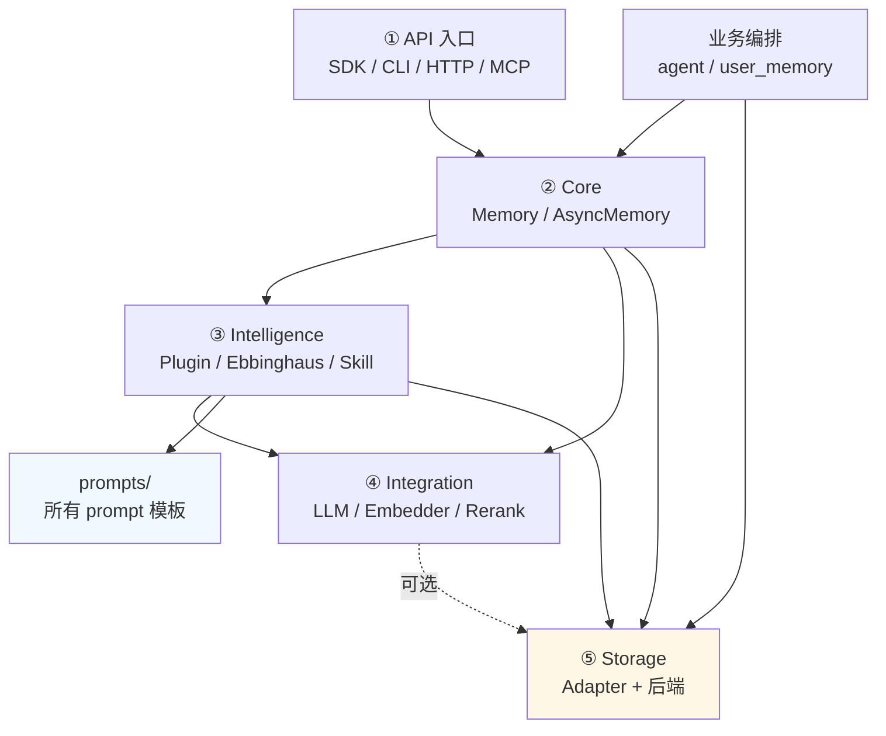
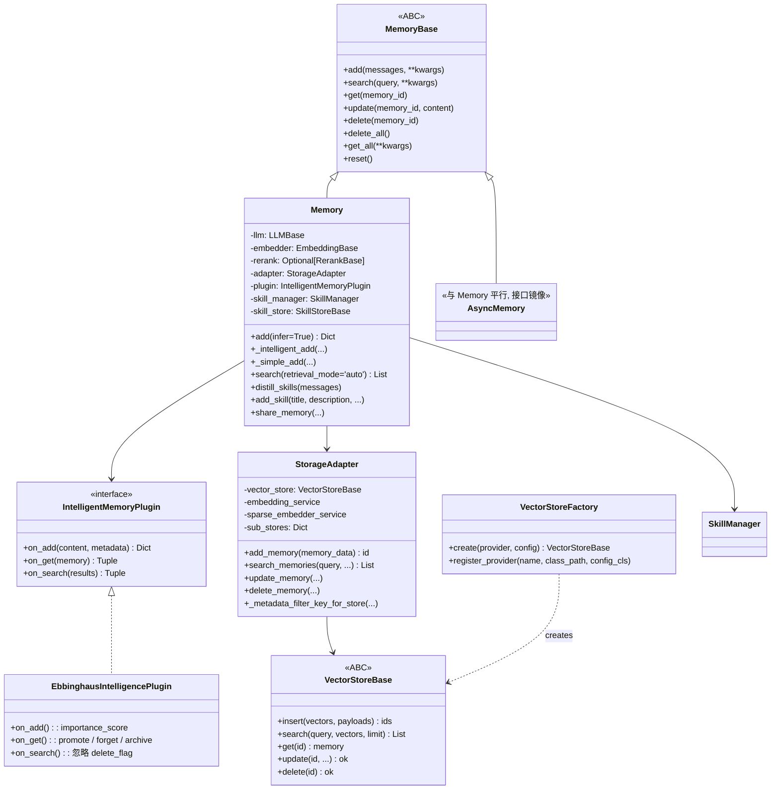
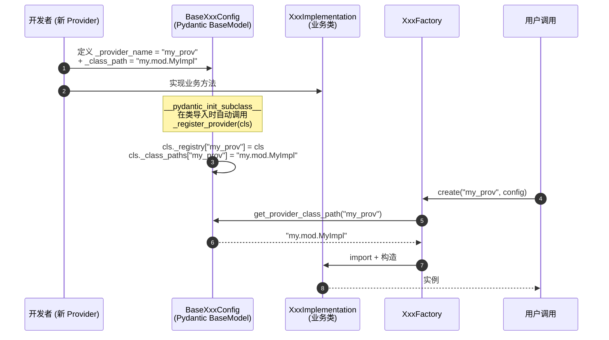

<!--
读者定位:
  🏗 架构师 (主) — 想看到全局依赖图与最小阅读路径
  🛠 开发者 (次要) — 想快速定位"某机制在哪个文件"
  👤 用户 (辅) — 想理解 SDK 内部是怎么分层的
-->

# 五层架构与模块地图

> **读者定位**: 🏗 架构师 (主) · 🛠 开发者 (辅) · 👤 用户 (辅)
>
> 本章是 handbook 的"目录学" — 告诉你"想搞懂 X, 先读哪几个文件"。

## 你将学到

1. 每一层的文件清单和文件大小 (LOC), 帮助估算学习成本
2. 层与层之间的依赖方向 (谁依赖谁, 谁不该被谁依赖)
3. 关键类的 UML 关系 (`MemoryBase` ↔ `Memory` ↔ `StorageAdapter` ↔ `VectorStoreBase`)
4. Provider 注册机制 — 为什么 LLM / Embedder / Rerank / VectorStore / GraphStore 的"加新 provider"是同一种模式
5. 一份最小阅读路径 (从 5 分钟到 2 小时四档)

---

## 1. 各层文件清单与 LOC

`src/powermem/` 共 ~48,000 行 Python, 按目录 (数据来自 `find ... | xargs wc -l`):

| 层 | 目录 | LOC | 关键文件 |
|----|------|-----|---------|
| ① API 入口 | `src/powermem/cli/` | 5,132 | `main.py` (click group) + `commands/` |
| ① API 入口 | `src/powermem/mcp/` | 690 | `server.py` (FastMCP, 13 tools) |
| ① API 入口 | `src/server/` | 7,363 | `main.py` (FastAPI) + `api/v1/` + `services/` + `middleware/` |
| ② Core | `src/powermem/core/` | 5,879 | `memory.py`, `async_memory.py`, `base.py`, `audit.py`, `telemetry.py`, `setup.py` |
| ③ Intelligence | `src/powermem/intelligence/` | 2,439 | `plugin.py`, `ebbinghaus_algorithm.py`, `importance_evaluator.py`, `skill_manager.py` |
| ④ Integration | `src/powermem/integrations/` | 6,676 | `llm/`, `embeddings/`, `rerank/`, 各带 `config/` + `*_factory.py` |
| ⑤ Storage | `src/powermem/storage/` | 10,497 | `adapter.py`, `factory.py`, `oceanbase/`, `pgvector/`, `sqlite/`, `skill_store/` |
| ⑤ 业务层 | `src/powermem/agent/` | 10,220 | `MemoryFactory`, `MultiAgentMemoryManager`, `MultiUserMemoryManager`, `HybridMemoryManager` |
| ⑤ 业务层 | `src/powermem/user_memory/` | 2,274 | `user_memory.py`, `query_rewrite/`, `storage/` |
| 共享 | `src/powermem/prompts/` | 1,810 | 所有 LLM prompt 模板 |
| 共享 | `src/powermem/utils/` | 2,361 | `utils.py`, `serialization`, `oceanbase_util` |

注: `agent/` 和 `user_memory/` 严格意义上属于"业务编排层", 不是 5 层架构里的独立层 — 它们在 `Memory` 之上加 scope / permission / privacy / 画像抽取的逻辑。

---

## 2. 层间依赖方向



依赖红线 (单向):

- ② Core → ③ Intelligence → ④ Integration → ⑤ Storage, 严格自上而下
- ① API 入口只能依赖 ② Core, 不能直接访问 ③ / ④ / ⑤
- 业务编排 (`agent`, `user_memory`) 依赖 ② Core, 不应该被 ② 反向依赖

---

## 3. 核心类关系 (UML)



要点:

- `Memory` 是 `MemoryBase` 的同步实现; `AsyncMemory` 是平行实现, 接口一一对应 (`async_memory.py` 镜像 `memory.py`)
- `StorageAdapter` 是后端无关的归一化层 — 所有 OceanBase / SQLite / PG 差异都被它屏蔽在 `_metadata_filter_key_for_store()` (adapter.py:105) 和 `_supports_text_search_without_vector()` (adapter.py:88) 这类适配方法里
- `IntelligentMemoryPlugin` 是 Ebbinghaus 之外用户可插拔的扩展点 — 默认实现是 `EbbinghausIntelligencePlugin`
- `VectorStoreFactory.create()` 通过字符串 provider 名 (`"oceanbase"`, `"sqlite"`, `"pgvector"`) 查表创建, 不需要 import 具体实现 (后述 §5)

---

## 4. Provider 注册机制 — 五种类型同一种模式

LLM / Embedder / Rerank / VectorStore / GraphStore 五种"可插拔对象"使用同一套 Pydantic 注册模式:



**关键代码** (以 LLM 为例, `src/powermem/integrations/llm/config/base.py:90-108`):

```python
class BaseLLMConfig(BaseModel):
    _provider_name: str = "base"
    _class_path: str = "powermem.integrations.llm.config.base.BaseLLM"
    _registry: ClassVar[Dict[str, type]] = {}
    _class_paths: ClassVar[Dict[str, str]] = {}

    @classmethod
    def _register_provider(cls):
        name = getattr(cls, "_provider_name", None)
        path = getattr(cls, "_class_path", None)
        if name and path:
            BaseLLMConfig._registry[name] = cls
            BaseLLMConfig._class_paths[name] = path

    def __pydantic_init_subclass__(cls, **kwargs):
        super().__pydantic_init_subclass__(**kwargs)
        cls._register_provider()
```

Embedder / VectorStore / GraphStore 的 `Base*Config` 完全是同一段代码的复制。

**⚠️ 踩坑提示**: `__pydantic_init_subclass__` 只在**类被 import** 时触发。如果你的新 Provider 文件放在 `integrations/llm/config/` 下, 但 `__init__.py` 没有 import 它, 注册表就是空的 — `LLMFactory.create("my_prov")` 会抛 `ValueError: Unsupported LLM provider: my_prov`。**正确做法**: 在 `integrations/llm/config/__init__.py` 末尾追加 `from .my_provider import MyProviderConfig  # noqa`。

> 👉 详细 4 步添加流程 + 完整 Provider 清单, 见 [07-providers](./07-providers)

---

## 5. 关键抽象基类一览

| ABC | 文件 | 子类必须实现 | 说明 |
|-----|------|------------|------|
| `MemoryBase` | `src/powermem/core/base.py` | `add`, `search`, `get`, `update`, `delete`, `get_all`, `reset` | 同步 + 异步两种实现都继承它 |
| `IntelligentMemoryPlugin` | `src/powermem/intelligence/plugin.py:19` | `on_add`, `on_get`, `on_search` | 生命周期钩子接口 |
| `LLMBase` | `src/powermem/integrations/llm/base.py` | `generate_response`, `generate_response_stream` | LLM 抽象 |
| `EmbeddingBase` | `src/powermem/integrations/embeddings/base.py` | `embed`, `embed_sparse` | Embedding 抽象 |
| `RerankBase` | `src/powermem/integrations/rerank/base.py` | `rerank`, `compress` | Rerank 抽象 |
| `VectorStoreBase` | `src/powermem/storage/base.py` | `insert`, `search`, `get`, `update`, `delete` | 向量库抽象 |
| `GraphStoreBase` | `src/powermem/storage/base.py` | `add_triplet`, `search`, `delete_triplet` | 图谱抽象 (仅 OceanBase 实现) |
| `SkillStoreBase` | `src/powermem/storage/skill_store/base.py:7` | `add`, `search`, `update` | Skill 存储抽象 |

---

## 6. 最小阅读路径 (按时间预算)

### ⏱ 5 分钟 (游客)

1. 本章 §1 表格 (记住五层)
2. [00-overview §3](./00-overview#3-四种接入方式) (记住四入口)
3. [99-api-quickref](./99-api-quickref) (记住 11 个常用 API)

### ⏱ 30 分钟 (用户)

1. §3 类图 (记住继承关系)
2. §4 注册机制图 (理解为什么加新 provider 简单)
3. [02-pipeline-add](./02-pipeline-add) (理解 `add()` 在做什么)
4. [03-pipeline-search](./03-pipeline-search) (理解 `search()` 在做什么)

### ⏱ 2 小时 (开发者)

1. §3 类图 + §5 ABC 清单
2. **直接读 `src/powermem/core/memory.py` 的 `Memory.__init__` (line ~700)**, 看清它如何把 LLM / Embedder / Rerank / Adapter / Plugin 串起来
3. **读 `src/powermem/storage/adapter.py` 的 `StorageAdapter.add_memory` (line 240) 和 `search_memories` (line 313)** — 理解归一化层在做什么
4. **读 `src/powermem/intelligence/plugin.py` 的 `EbbinghausIntelligencePlugin.on_get` (line 121)** — 理解生命周期钩子
5. 浏览一遍 `src/powermem/integrations/llm/config/qwen.py` 这类最简 provider 实现, 弄懂"加新 provider 要写多少代码"

### ⏱ 1 天 (架构师)

- 把 ① ~ ⑤ 每层至少读一个代表性文件, 加上 `src/powermem/agent/` 下的 `MultiAgentMemoryManager`, 拼出完整数据流
- 重点研究 `src/powermem/intelligence/ebbinghaus_algorithm.py` — 整本算法 (130 行) 浓缩了"艾宾浩斯 + 提升/遗忘/归档 + 强化学习式复用"的设计

---

## 延伸阅读

- 官方架构简图: [docs/architecture/overview](../architecture/overview)
- Provider 添加步骤 (官方版): [docs/development/overview](../development/overview)
- 集成指南总览: [docs/guides/0009-integrations](../guides/0009-integrations)

---

## 下章预告

下一章 [02-pipeline-add](./02-pipeline-add) 把 `Memory.add()` 整条流水线拆成 11 个 step, 标出每个 step 对应的源码行号, 是开发者和架构师最常用的一章。