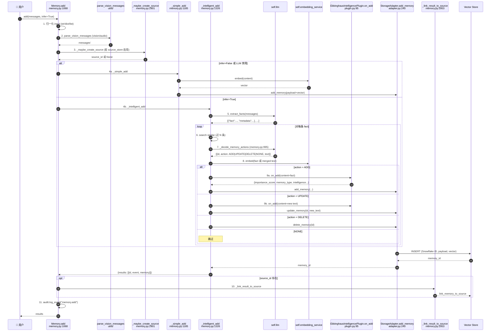
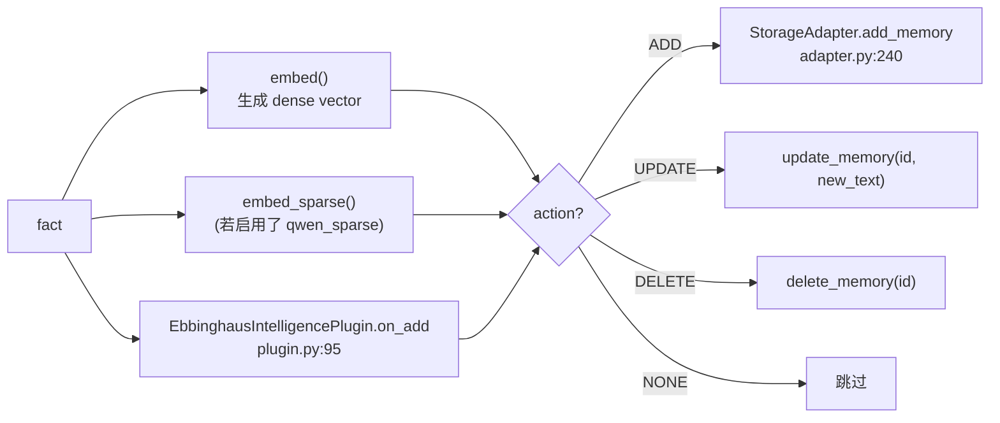

<!--
读者定位:
  🛠 开发者 (主) — 想知道 add() 每一步在做什么、源码在哪
  🏗 架构师 (辅) — 想知道"自进化记忆"在写入路径里如何体现
-->

# `add()` 完整流水线

> **读者定位**: 🛠 开发者 (主) · 🏗 架构师 (辅)
>
> 本章把 `Memory.add()` 整条流水线拆成 11 个 step, 每个 step 标出源码行号。这是 handbook 里被翻得最多的一章。

## 你将学到

1. `add()` 在做哪 11 件事, 以及哪些是同步 / 哪些是 LLM 阻塞
2. `infer=False` 时走什么快路径 (推荐批处理场景)
3. ADD / UPDATE / DELETE / NONE 四种决策是如何由 LLM 给出的, prompt 模板在哪
4. 源链接 (source linking) 的设计意图: 保留原始消息以支持重放
5. plugin.on_add 钩子: Ebbinghaus 在写入路径里加了什么
6. 多模态 (vision / audio) 的预处理在哪一步
7. 异步路径 (`AsyncMemory.add`) 跟同步路径的差异

---

## 1. 顶层时序图



---

## 2. Step 1 — Input 归一化 (memory.py:1129-1134)

```python
if isinstance(messages, str):
    messages = [{"role": "user", "content": messages}]
elif isinstance(messages, dict):
    messages = [messages]
elif not isinstance(messages, list):
    raise ValueError("messages must be str, dict, or list[dict]")
```

`add()` 接受三种形态: 单字符串、单 dict、消息列表。统一规整成 `list[dict]` 后再传给后续管道。

---

## 3. Step 2 — 多模态预处理 (memory.py:1142-1145)

```python
if llm_cfg.get("enable_vision"):
    messages = parse_vision_messages(messages, self.llm, llm_cfg.get("vision_details"), self.audio_llm)
else:
    messages = parse_vision_messages(messages, None, None, self.audio_llm)
```

两个分支都调 `parse_vision_messages` — 只是是否启用 vision LLM 不同。**音频处理**走独立的 `self.audio_llm`, 不影响主 LLM。

- 启用条件: `llm.config.enable_vision=True`
- 图像理解 → 转成 base64 描述, 由 vision LLM 生成 caption, 替换原 `content`
- 音频理解 → 转成文字, 替换原 `content`

---

## 4. Step 3 — 源链接 (memory.py:1154-1160, `_maybe_create_source` 在 2901)

```python
source_id = self._maybe_create_source(
    original_messages,
    user_id=user_id, agent_id=agent_id, run_id=run_id,
    actor_id=actor_id,
)
```

**设计意图**: 在 LLM 抽取事实**之前**, 把原始 `messages` 整段持久化到 `source_store`。如果 LLM 抽取失败或返回空, 原始消息还在, 可以事后重放或调试。

`_maybe_create_source` (memory.py:2901) 关键逻辑:
- 启用条件: `self.source_store_enabled` 为 True
- input 为 str → `source_type="text"`, content=原字符串
- input 为 dict/list → `source_type="conversation"`, content=`json.dumps(..., default=str)`
- 失败时 `logger.warning` 但不抛异常 — 保证 `add()` 主路径不受源链接影响

---

## 5. Step 4a/b — Simple vs Intelligent 分支决策 (memory.py:1162-1173)

```python
llm_disabled = self._is_llm_disabled()
use_infer = infer and isinstance(messages, list) and len(messages) > 0 and not llm_disabled
if infer and llm_disabled:
    logger.info("LLM is disabled; falling back to simple add mode.")
if not use_infer:
    result = self._simple_add(...)
else:
    result = self._intelligent_add(...)
```

| 条件 | 走哪条 |
|------|--------|
| `infer=False` | `_simple_add` (无 LLM 抽取, 直接 embed+写) |
| `infer=True`, LLM 被禁用 (NOOP) | `_simple_add` (降级, 打印 log) |
| `infer=True`, LLM 正常 | `_intelligent_add` |

`_simple_add` 适合批处理 / 嵌入式 / 调试; `_intelligent_add` 是默认路径, 也是"自进化"的入口。

---

## 6. Step 5 — 事实抽取 (`_intelligent_add` 内)

`_intelligent_add` (memory.py:1326) 先调用 LLM 把对话抽成事实列表:

```
Prompt (templates.py: FACT_EXTRACTION_PROMPT):
  请阅读以下对话, 抽取出值得长期记忆的事实。
  对话: <messages>
```

返回结构 (典型):

```json
[
  {"fact": "用户喜欢 PostgreSQL 而非 MySQL", "metadata": {"category": "preferences"}},
  {"fact": "用户住在北京海淀", "metadata": {"category": "location"}}
]
```

抽取失败的 fallback: 用原始消息整段当作单条 fact, 避免 0 条记录。

---

## 7. Step 6 — 检索相似记忆 (在 `_intelligent_add` 内)

对每条 fact, 调一次 `self.storage.search_memories()` 拿回 Top-N 相邻记忆, 用来给 Step 7 的决策 LLM 提供 context。

检索使用 fact 的 dense embedding + 用户/agent/run 过滤, 不带 `metadata` 过滤 (避免事实被遗漏)。

---

## 8. Step 7 — ADD/UPDATE/DELETE/NONE 决策 (memory.py:995-1066, `_decide_memory_actions`)

```python
update_prompt = get_memory_update_prompt(old_memory, new_facts, custom_prompt)
response = llm_json_text_with_fallback(self.llm, messages=[{"role":"user","content":update_prompt}])
actions = parse_memory_actions_json(str(response or ""))
```

Prompt 模板 (`src/powermem/prompts/templates.py: MEMORY_UPDATE_PROMPT`) 包含:

- 已有 N 条相似记忆 (id + text)
- 待写入 K 条新事实 (text + metadata)
- 指令: 对每条新事实, 决策 `{id, action: "ADD"|"UPDATE"|"DELETE"|"NONE", text}`

**JSON 解析** (`src/powermem/utils/utils.py:726`):
- 优先 `json.loads`
- 失败时用 `re.search(r'\{[\s\S]*\}', response)` 抽取大括号块再尝试
- 再次失败 → 返回空数组, 走 `_intelligent_add` 的降级路径 (默认当 ADD 处理)

---

## 9. Step 8-9 — Embed + Plugin 钩子 + 写入

每条 fact 走完决策后, 按 action 分流:



`on_add` 返回的元数据 (`EbbinghausIntelligencePlugin.on_add`, plugin.py:95):

```python
{
    "importance_score": 0.85,           # 由 ImportanceEvaluator 评分
    "memory_type": "long_term",         # working / short_term / long_term
    "access_count": 0,
    "intelligence": {                   # 写入 metadata.intelligence
        "decay_rate": 2.4,
        "current_retention": 1.0,
        "next_review": "2026-08-15T10:00:00",
        "review_schedule": [...],
        ...
    },
    "memory_management": {
        "should_promote": False,
        "should_forget": False,
        "should_archive": False,
        "is_active": True,
    },
    "processing_applied": True,
}
```

---

## 10. Step 10 — Source 链接 (`_link_result_to_source`, memory.py:2953)

```python
for mem in result_list:
    mem_id = mem.get("id")
    self.link_memory_to_source(source_id, mem_id)
```

每条成功写入的记忆都被反向关联回 step 3 创建的 source 行。这样后续可以:

- `memory.get_source_for_memory(id)` 反查"这条记忆来自哪段对话"
- 重放整段对话 (LLM 抽取坏了不要紧, 数据还在)
- 按 source 维度清空特定 session 的所有记忆

---

## 11. Step 11 — Audit 与 telemetry

```python
self.audit.log_event("memory.add", {...})
self.telemetry.capture_event("memory.add", {...})
```

- `AuditLogger` (默认开启, 写 `./logs/audit.log`): 全量事件记录
- `TelemetryManager` (opt-in): 计数 + 计时, 用于性能监控

---

## 12. Simple vs Intelligent 选哪个?

| 场景 | 推荐 |
|------|------|
| 一次性导入历史数据 (>100 条) | `infer=False`, 避免 LLM 成本爆炸 |
| 嵌入式 / 演示 / 测试 | `infer=False` |
| 正常智能体循环 (推荐) | `infer=True` (默认) |
| 想保留原始消息以便重放 | 启用 `source_store`, 与 `infer` 无关 |

**注意**: 即便 `infer=False`, `on_add` 钩子依然会被调用 (只要 plugin.enabled=True), 但因为没经过 LLM 评分, `importance_score` 会用 plugin 默认值 (通常是 0.5)。

---

## 13. 异步路径 (`AsyncMemory.add`, async_memory.py:461)

```python
async def add(self, messages, ...) -> Dict[str, Any]:
    try:
        if getattr(self, "_http_client", None):
            return await self._http_client.add(...)
        # ... 与同步路径几乎一致, 只是 LLM / storage 调用全部 await
```

差异:

1. **所有阻塞调用都 `await`**: LLM / embedder / adapter.search / adapter.add 都用 `aio` 异步版
2. **HTTP 客户端支持**: 如果传了 `_http_client` (远程模式), 直接走 HTTP, 不在本地计算
3. **`SkillManager.distill` 的异步版**: `await SkillManager.adistill(...)` (skill_manager.py:61)

并行优化机会: 当 `messages` 是多条对话时, 异步路径可以 `asyncio.gather()` 并发处理 (但当前实现仍按顺序, 见 `AsyncMemory.add` 内部循环)。

---

## 14. 设计取舍小节

### 14.1 为什么 `on_search` 故意不软删 (search 时不应改生命周期)

`EbbinghausIntelligencePlugin.on_search` (plugin.py:238) 明确注释:

> search is a read operation and should not mutate memory lifecycle state

实现里调用 `on_get(item)` 后,**主动忽略 `delete_flag`**。这避免了"用户搜个老问题就把那条记忆删了"的反直觉行为。软删只在显式 `get(memory_id)` 路径触发。

### 14.2 为什么决策 LLM 失败时降级成 ADD 而不是抛错

`parse_memory_actions_json` 返回空时, `_intelligent_add` 不抛异常, 而是把原始 fact 当 ADD 处理。理由: **写操作的可用性比"严格语义"重要** — 决策 LLM 暂时不可用不应该让用户写不进去。

### 14.3 为什么源链接失败不阻塞 add

`_maybe_create_source` / `_link_result_to_source` 都用 `try/except` + `logger.warning` 兜底。源链接是"事后调试用"的 side channel, 不应该影响主流程。

---

## 延伸阅读

- `_simple_add` 完整实现: `src/powermem/core/memory.py:1185`
- `_intelligent_add` 完整实现: `src/powermem/core/memory.py:1326`
- `_decide_memory_actions`: `src/powermem/core/memory.py:995`
- fact extraction prompt: `src/powermem/prompts/templates.py` (MEMORY_UPDATE_PROMPT)
- 端到端示例: [docs/examples/scenario_2_intelligent_memory](../examples/scenario_2_intelligent_memory)
- 多模态用法: [docs/guides/0007-multimodal](../guides/0007-multimodal)

---

## 下章预告

下一章 [03-pipeline-search](./03-pipeline-search) 解析 `search()` 的 4 路混合检索: 向量 + 全文 + 稀疏 + 图谱, 以及如何融合成最终 Top-K。