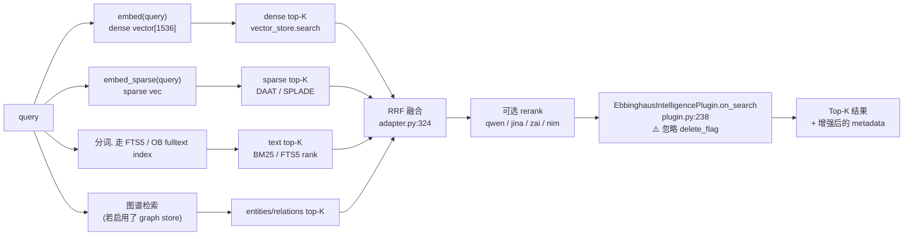
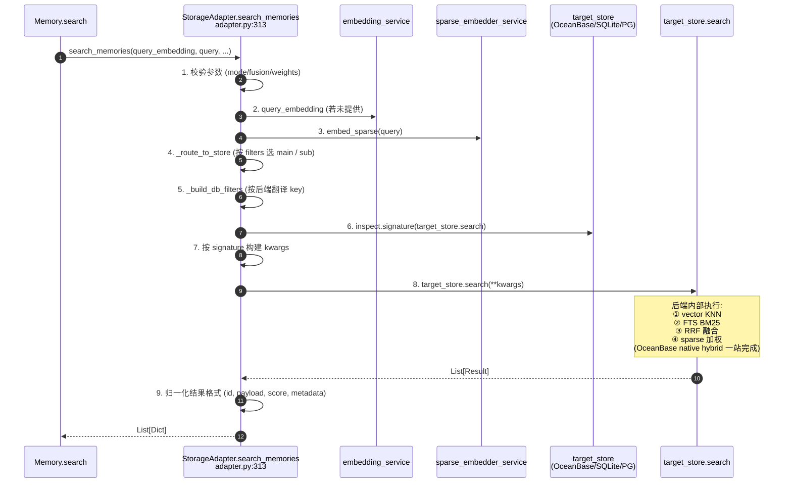
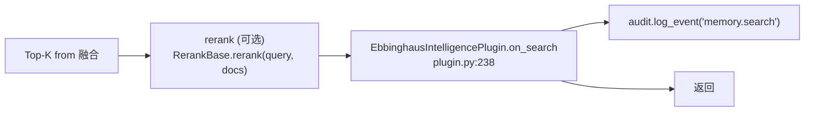

<!--
读者定位:
  🛠 开发者 (主) — 想知道 search() 怎么从 4 路检索融合出最终结果
  🏗 架构师 (辅) — 想知道 RRF vs 加权融合的取舍
-->

# `search()` 4 路混合检索

> **读者定位**: 🛠 开发者 (主) · 🏗 架构师 (辅)
>
> 本章解析 `Memory.search()` 的 4 路混合检索: dense vector + full-text + sparse + (可选 graph)。PowerMem 在 LOCOMO 基准上 87.79% 准确率的关键就在这。

## 你将学到

1. 4 路检索各自做什么、适合什么场景
2. `retrieval_mode`: `auto` / `fts` / `vector` / `hybrid` 的判定逻辑
3. RRF (Reciprocal Rank Fusion) 公式与 `rrf_k` 的直觉
4. `weighted` 融合与 RRF 的差异
5. 后置 rerank 与 plugin.on_search 的角色
6. 各后端的 FTS 支持矩阵 (OceanBase hybrid / SQLite FTS5 / PGVector tsvector)

---

## 1. 4 路检索速览



---

## 2. 顶层入口 — `Memory.search` 签名

```python
memory.search(
    query="用户喜欢用什么数据库",
    user_id="alice",
    agent_id="bot1",
    run_id="session-42",
    filters={"category": "preferences"},
    limit=10,
    threshold=0.3,                # 0.0–1.0, 低于此分丢弃
    retrieval_mode="auto",        # auto | fts | vector | hybrid
    fusion="rrf",                 # rrf | weighted
    vector_weight=0.6,
    fts_weight=0.4,
    rrf_k=60,                     # RRF 常数, 默认 60
    candidate_limit=None,         # 每路召回数量, 默认=limit
    include_explanation=False,    # 返回每路分数用于解释
)
```

> 源码位置: `src/powermem/core/memory.py` (搜索方法) → `src/powermem/storage/adapter.py:313` (实际执行)

---

## 3. `retrieval_mode` 判定 (adapter.py:337-367)

```python
mode = (retrieval_mode or "auto").lower()
if mode == "fts":
    query_vector = None           # 强制只用全文
elif mode == "vector":
    search_query = ""             # 强制只用向量
elif mode == "hybrid" and query_vector is None:
    if has_query:
        logger.warning("Hybrid retrieval missing query embedding; falling back to FTS")
    else:
        return []                 # hybrid 必须同时有向量和文本
elif mode == "auto":
    # 双路都满足 → 走混合; 只有文本 → 降级 fts; 只有向量 → 走 vector
```

| 模式 | 必须条件 | 行为 |
|------|---------|------|
| `auto` (默认) | 无 | 若同时有 query text + embedding → hybrid; 若只有 text 且后端支持纯文本 → fts; 若只有 embedding → vector |
| `fts` | 文本 | 强制全文, 不调 embedder |
| `vector` | 向量 | 强制向量, 不传 query |
| `hybrid` | 同时具备 | 严格双路 + 融合 |

---

## 4. StorageAdapter.search_memories 核心流程 (adapter.py:313-449)



注意第 8 步 — 实际执行检索的**不是** Python 端的 RRF, 而是后端原生 SQL 函数 (OceanBase 在 SQL 内部完成 hybrid, SQLite 在 Python 内做 RRF, PGVector 在 SQL + Python 混合做)。

---

## 5. RRF 融合公式

RRF (Reciprocal Rank Fusion) 是 1959 年 Cormack 等人提出的多路排序融合算法, 公式极其简洁:

```
score(doc) = Σ over ranks:  1 / (k + rank_i(doc))
```

- `rank_i(doc)` 是文档在第 i 路检索结果中的排名 (1-based, 1 最好)
- `k` 是阻尼常数, 越大越"宽容" (低排名文档的贡献衰减得越慢)
- PowerMem 默认 `k=60` (adapter.py:327 `rrf_k=60`), 这是 Cormack 原始论文推荐值

### 例子: 同一文档在不同路中的排名

| 路 | doc A 排名 | doc B 排名 | doc C 排名 |
|----|-----------|-----------|-----------|
| Dense | 1 | 3 | 5 |
| FTS | 2 | 1 | 4 |
| Sparse | 4 | 2 | 1 |

最终 RRF 分 (k=60):
- doc A = 1/61 + 1/62 + 1/64 ≈ **0.0497**
- doc B = 1/63 + 1/61 + 1/62 ≈ **0.0490**
- doc C = 1/65 + 1/64 + 1/61 ≈ **0.0475**

即使 doc A 在 Dense 中占优、doc B 在 FTS 中占优、doc C 在 Sparse 中占优, **doc A 凭"两路在前 3"依然胜出**。这就是 RRF 的优势: 不要求各路分数可比 (不像 `weighted` 必须归一化), 只看排名。

### 为什么默认 k=60?

经验值: k 太小 (如 1) → 高排名 (1, 2) 优势过大, 多路近似退化为单路; k 太大 (如 ∞) → 所有路贡献趋同, 退化为按出现频率。60 是经验平衡点。

---

## 6. weighted 融合 vs RRF

```python
fusion = (fusion or "rrf").lower()
if fusion not in {"rrf", "weighted"}:
    raise ValueError(f"Invalid fusion method: {fusion}")
```

| 维度 | `rrf` (默认) | `weighted` |
|------|--------------|-----------|
| 输入 | 仅排名 (rank) | 分数 (score) |
| 需要归一化 | ❌ | ✅ 必须把向量距离、FTS BM25、稀疏分各自归一到 [0, 1] |
| 公式 | `1/(k+rank)` | `vector_weight * s_dense + fts_weight * s_fts + sparse_weight * s_sparse` |
| 优势 | 不依赖后端分数语义 | 显式可控每路重要性 |
| 适用 | 跨后端混合 | 已知各路质量, 想精细调权 |

> 后端加权融合实现在 `src/powermem/storage/oceanbase/oceanbase.py:1902` (`_weighted_fusion`) 和 SQLite 端 `src/powermem/storage/sqlite/sqlite_vector_store.py:498` (`_weighted_fusion`); RRF 融合分别在 `oceanbase.py:1755` 和 `sqlite_vector_store.py:423`。

---

## 7. 4 路检索在 3 个后端的支持矩阵

| 后端 | Dense | FTS | Sparse | Native Hybrid |
|------|-------|-----|--------|---------------|
| OceanBase (集群) | ✅ HNSW | ✅ OB ≥4.4.1 + heap table | ✅ OB ≥4.5 或 seekdb | ✅ OB ≥4.4.1 + heap table |
| SQLite (内置) | ✅ Brute-force cosine (默认) / HNSW (扩展) | ✅ FTS5 虚拟表 | ✅ SPARSE_VECTOR (扩展) | ❌ (Python 端融合) |
| PGVector | ✅ HNSW / DiskANN | ✅ tsvector | ⚠️ 需手动集成 pgvector + 稀疏扩展 | ❌ (Python 端融合) |

后端能力探测代码: `src/powermem/utils/oceanbase_util.py` (function `detect_native_hybrid_support`, `detect_sparse_support` 等)。

---

## 8. 检索后: rerank + on_search



### 8.1 可选 rerank

如果配置了 `Rerank` (qwen / jina / zai / nim), 会把 Top-K (默认 ≥ 30) 截到 Top-L (默认 10) 重新排序。rerank 是二次打分, 比纯 RRF 准但更慢, 通常关掉按需开启。

### 8.2 on_search 钩子 (plugin.py:238)

```python
def on_search(self, results):
    if not self.enabled or not self._algo:
        return [], []
    updates, _delete_ids = [], []
    for item in results:
        try:
            upd, delete_flag = self.on_get(item)
            # ⚠️ 关键: 忽略 delete_flag, search 不应改生命周期
            if upd:
                search_updates = self._enhance_for_search(item, upd)
                updates.append((item["id"], search_updates))
        except Exception:
            continue
    return updates, []  # 注意: 第二项永远空列表
```

**两件事会写入**:
1. `access_count + 1`, `last_searched_at`, `search_count + 1` (复用 `on_get` 逻辑)
2. 在每 5 次访问时 (`new_access_count % 5 == 0`), 重跑 `process_memory_metadata` 重算 `intelligence` 块

**两件事不会发生**:
1. **不会软删** (忽略 delete_flag)
2. **不会改 memory_type** (即使 promote 条件满足, 也只更新 metadata, 不真的把 working 变 short_term)

---

## 9. `_enhance_for_search` 加了什么 (plugin.py:265)

```python
base_metadata["last_searched_at"] = get_current_datetime()
base_metadata["search_count"] = base_metadata.get("search_count", 0) + 1
enhanced_updates["metadata"] = base_metadata

# 如果没有 search_relevance_score, 用一个简单启发式
if "search_relevance_score" not in memory:
    access_count = ...
    importance_score = ...
    search_relevance = min(1.0, (access_count * 0.1) + (importance_score * 0.5))
    enhanced_updates["search_relevance_score"] = search_relevance
```

这个 `search_relevance_score` 在 `get(memory_id)` 链路里读不到, 只服务于搜索后端做二次排序 (例如 dashboard 显示"最相关记忆"时可用)。

---

## 10. 异步路径 (`AsyncMemory.search`)

`async_memory.py` 中的 `search` 与同步版几乎一致, 区别仅在内部:

- `embedding_service.embed` 若是 async → `await`
- `StorageAdapter.search_memories` 若是 async (有的后端有) → `await`
- 后端默认还是调同步版 (`asyncio.to_thread` 包裹), 因为大多数向量客户端不原生 async

---

## 11. 调优建议

| 现象 | 建议 |
|------|------|
| 召回率低 (漏检) | 调大 `candidate_limit` (如 100), 调小 `rrf_k` (如 30) |
| 准确率低 (误检) | 启用 rerank; 提高 `threshold` (如 0.5) |
| 延迟高 | 关掉 rerank; 改用 `vector` 模式 (单路) |
| 后端是 SQLite, 性能不够 | 改 OceanBase / PG, 走 native hybrid |
| 想突出某一路 | 用 `weighted` + `vector_weight=0.8` 等 |

---

## 延伸阅读

- `StorageAdapter.search_memories`: `src/powermem/storage/adapter.py:313`
- 后端 native hybrid: `src/powermem/storage/oceanbase/oceanbase.py` (RRF + weighted 块)
- 后端 SQLite: `src/powermem/storage/sqlite/sqlite_vector_store.py`
- 后端 PGVector: `src/powermem/storage/pgvector/pgvector.py`
- 混合检索示例: [docs/examples/scenario_8_ebbinghaus_forgetting_curve](../examples/scenario_8_ebbinghaus_forgetting_curve) (实际用混合检索做衰减查询)
- 稀疏向量配置: [docs/guides/0011-sparse_vector](../guides/0011-sparse_vector)

---

## 下章预告

下一章 [04-ebbinghaus](./04-ebbinghaus) 解析 PowerMem 的"自进化"核心算法 — 艾宾浩斯遗忘曲线、重要性评分、提升/遗忘/归档三大阈值, 以及 plugin.on_get 的生命周期钩子。