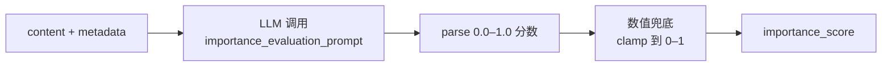

<!--
读者定位:
  🛠 开发者 (主) — 想知道 Ebbinghaus 公式与默认阈值
  🏗 架构师 (辅) — 想知道为什么是这套参数、如何调优
-->

# 艾宾浩斯自进化算法

> **读者定位**: 🛠 开发者 (主) · 🏗 架构师 (辅)
>
> 本章是 PowerMem "自进化" 的算法核心 — `EbbinghausAlgorithm` + `ImportanceEvaluator`。读完后你将能解释: 为什么一条记忆会被遗忘? 为什么一条记忆会被提升? 为什么一次访问会让"保留率"变高?

## 你将学到

1. 艾宾浩斯保留率公式 R = e^(-t/S) 的代码实现
2. 默认阈值表 (working/short_term/long_term)
3. `ImportanceEvaluator` 如何打分
4. `should_promote` / `should_forget` / `should_archive` 三个判定函数
5. `reinforce` (强化学习式复用) 的衰减抑制公式
6. `on_get` 钩子的 9 步生命周期 (含 ASCII 流程图)
7. 调优建议: 不同业务应该改哪些参数

---

## 1. 核心文件 + 默认参数

**主文件**: `src/powermem/intelligence/ebbinghaus_algorithm.py` (EbbinghausAlgorithm)
**重要度评估**: `src/powermem/intelligence/importance_evaluator.py` (ImportanceEvaluator)
**插件封装**: `src/powermem/intelligence/plugin.py` (EbbinghausIntelligencePlugin)

默认参数 (ebbinghaus_algorithm.py:24-55):

| 参数 | 默认 | 含义 |
|------|------|------|
| `initial_retention` | 1.0 | 初始保留率上限 (0-1) |
| `decay_rate` | 1.5 | 全局衰减速率 S, 越大衰减越慢 |
| `decay_rate_multipliers` | `{working: 1, short_term: 7, long_term: 60}` | 按 memory_type 缩放 S |
| `reinforcement_factor` | 0.3 | 强化学习式复用增量 |
| `working_threshold` | 0.3 | 低于此值 → 遗忘 |
| `short_term_threshold` | 0.6 | 高于此值 → 短期记忆 |
| `long_term_threshold` | 0.8 | 高于此值 → 长期记忆 |
| `review_intervals` | `[1, 6, 24, 72, 168]` 小时 | 复习提醒时间序列 (1h, 6h, 1d, 3d, 1周) |
| `review_interval_min_hours` | 0.5 | 复习间隔下界 |

`decay_rate_multipliers` 的设计: **working 衰减最快, long_term 衰减最慢**, 严格满足 `working < short_term < long_term` (校验见 `_validate_decay_rate_multipliers`, line 413)。

---

## 2. 保留率公式 R = e^(-t/S)

**源码** (`calculate_decay`, ebbinghaus_algorithm.py:134-179):

```python
def calculate_decay(self, created_at, decay_rate=None):
    # 解析 created_at (str/datetime/None)
    ...
    time_elapsed = get_current_datetime() - created_at
    hours_elapsed = time_elapsed.total_seconds() / 3600

    rate = self.decay_rate if decay_rate is None else decay_rate

    # Ebbinghaus forgetting curve: R = e^(-t/S)
    # where R is retention, t is time (hours), S is strength (per-type scaled)
    decay_factor = math.exp(-hours_elapsed / (24 * rate))

    return max(decay_factor, 0.0)
```

直观理解:

- t = 经过小时数; S = 强度参数 (24 * rate)
- 当 t = S 时, R = e^(-1) ≈ 0.368 (约保留 37%)
- 当 t = 2S 时, R = e^(-2) ≈ 0.135
- 当 t = 4S 时, R ≈ 0.018 (几乎全忘)

### 不同 memory_type 的 S 差距

假设 `decay_rate=1.5`, 即全局 S = 36 小时 (1.5 天):

| memory_type | multiplier | 实际 S | 半衰期 t_half ≈ 0.693 * S |
|-------------|-----------|--------|-------------------------|
| working | 1.0 | 36h (1.5d) | ~25h |
| short_term | 7.0 | 252h (10.5d) | ~175h (~7d) |
| long_term | 60.0 | 2160h (90d) | ~1496h (~62d) |

也就是说, 一条"long_term"记忆在 60 天后还保留 37%; 一条"working"记忆在 1.5 天后就只剩 37%。

---

## 3. `process_memory_metadata` — 新记忆初始化 (line 57)

调用时机: `plugin.on_add` (plugin.py:95), 每次新记忆写入时执行一次。

```python
def process_memory_metadata(self, content, importance_score, memory_type) -> Dict:
    initial_retention = self._calculate_initial_retention(importance_score)
    decay_rate = self._get_decay_rate_for_type(memory_type)
    review_schedule = self._generate_review_schedule(importance_score, now)
    next_review = review_schedule[0] if review_schedule else now + 1h

    return {
        "intelligence": {
            "importance_score": importance_score,
            "memory_type": memory_type,
            "initial_retention": initial_retention,
            "decay_rate": decay_rate,
            "current_retention": initial_retention,
            "next_review": next_review.isoformat(),
            "review_schedule": [rt.isoformat() for rt in review_schedule],
            "last_reviewed": now.isoformat(),
            "review_count": 0,
            "access_count": 0,
            "reinforcement_factor": self.reinforcement_factor,
        },
        "memory_management": {
            "should_promote": False,
            "should_forget": False,
            "should_archive": False,
            "is_active": True,
        },
        "created_at": now.isoformat(),
        "updated_at": now.isoformat(),
    }
```

`_calculate_initial_retention` (line 530) 的关键:

```python
max_retention = max(0.0, min(1.0, float(self.initial_retention)))  # 默认 1.0
retention_floor = min(max_retention, max(0.0, min(1.0, self.working_threshold)))
return max(max_retention * score, retention_floor)
```

含义: **初始保留率 = max(importance × 1.0, 0.3)**。重要性 0.5 的记忆初始保留率 = max(0.5, 0.3) = 0.5; 重要性 0.1 的记忆 = max(0.1, 0.3) = 0.3 (被下限兜底, 避免"垃圾记忆初始就 0")。

---

## 4. 重要性评分 — `ImportanceEvaluator`

文件: `src/powermem/intelligence/importance_evaluator.py`

评分流程:



Prompt (`src/powermem/prompts/intelligent_memory_prompts.py`): 让 LLM 综合考虑"是否影响长期目标、是否含用户偏好、是否含实体信息、是否有时效性"等维度打分。

可定制: `custom_importance_evaluation_prompt` 环境变量覆盖默认 prompt, 见 `EbbinghausIntelligencePlugin.__init__` (plugin.py:67-70)。

---

## 5. 三大判定函数

### 5.1 `should_promote` (line 213) — 是否提升 memory_type

```python
def should_promote(self, memory) -> bool:
    access_count = memory.get("access_count", 0)
    if access_count >= 3:
        return True

    created_at = memory.get("created_at")
    if created_at and access_count > 0:
        # ... 解析时间 ...
        if time_elapsed > timedelta(hours=24):
            return True

    importance = memory.get("importance_score", 0.5)
    if importance >= self.short_term_threshold:  # 默认 0.6
        return True

    return False
```

三个触发条件 (任一满足即 True):

1. **访问频次** ≥ 3
2. **存在时间** > 24h 且 **至少被访问过 1 次** (这条很重要: 长期未被访问的记忆即便老也不提升)
3. **重要性** ≥ short_term_threshold (默认 0.6)

### 5.2 `should_forget` (line 252) — 是否该软删

```python
def should_forget(self, memory) -> bool:
    if self.calculate_current_retention(memory) < self.working_threshold:
        return True
    return False
```

**判定标准**: 当前保留率 < 0.3 (默认)。保留率本身是 `stored_retention × decay_factor`, 所以这条规则等价于 "保留率已经衰到 30% 以下"。

### 5.3 `should_archive` (line 271) — 是否归档 (不进 Top-K 但不删除)

```python
def should_archive(self, memory) -> bool:
    created_at = memory.get("created_at")
    if created_at:
        # ... 时间解析 ...
        if time_elapsed > timedelta(days=30):  # > 30 天
            return True
    importance = memory.get("importance_score", 0.5)
    if importance < self.working_threshold:  # < 0.3
        return True
    return False
```

归档比遗忘更激进 — **30 天以上** 或 **重要性 < 0.3** 都会归档。归档不等于删除, 后续还可以通过 admin 命令恢复。

---

## 6. `reinforce` — 强化学习式复用 (line 305)

```python
def reinforce(self, memory) -> Dict:
    _, intelligence = self._resolve_metadata_sections(memory)
    current_retention = self.calculate_current_retention(memory)
    reinforcement_factor = self._resolve_reinforcement_factor(memory)
    review_count = int(intelligence.get("review_count") or 0)

    new_retention = min(
        1.0,
        current_retention + reinforcement_factor * (1.0 - current_retention)
    )
    new_review_count = review_count + 1

    review_schedule = intelligence.get("review_schedule") or []
    next_review = review_schedule[new_review_count] if new_review_count < len(review_schedule) else None
    ...
```

公式: **`R_new = min(1.0, R_old + factor × (1 - R_old))`** — 经典的 diminishing-returns 公式。

直观理解:

- 因子 factor=0.3 时, R=0.5 → R=0.65 (跳 0.15); R=0.8 → R=0.86 (跳 0.06); R=0.95 → R=0.965 (跳 0.015)
- 多次强化趋近 1.0 但永不超过
- 模拟人脑: 学过一次提升明显, 学过十次边际效益递减

调用时机: `plugin.on_get` 内部, 当 `now >= next_review` 时触发。

---

## 7. `on_get` 生命周期 9 步 (plugin.py:121)

```mermaid
flowchart TD
    Start[get memory by id] --> A[1. 提取 metadata.intelligence<br/>+ 读取 access_count / importance_score]
    A --> B[2. access_count + 1<br/>updated_at = now]
    B --> C{3. now >= next_review?}
    C -- 是 --> D[4. reinforce<br/>R += factor × (1-R)]
    C -- 否 --> E[5. 跳过 reinforce]
    D --> F{6. should_promote?}
    E --> F
    F -- 是 + working --> P1[7a. promote → short_term]
    F -- 是 + short_term --> P2[7b. promote → long_term]
    F -- 否 --> Skip[7c. 保持原 memory_type]
    P1 --> Clear[8. 清除 should_forget<br/>marked_for_forgetting_at = null]
    P2 --> Clear
    Skip --> G{9. 新 memory_type == 旧?}
    Clear --> G
    G -- 是 + should_forget --> Forget[return None, True<br/>(调用方应软删)]
    G -- 是 + should_archive --> Archive[meta.archived = True]
    G -- 否 (已 promote) --> ReCompute[重算 intelligence 块]
    G -- 否 + 每 5 次访问 --> ReCompute
    G -- 否 --> TouchUp[仅更新 access_count + 强化字段]
    ReCompute --> Done
    Archive --> Done
    TouchUp --> Done
```

详细代码注释见 `EbbinghausIntelligencePlugin.on_get` (plugin.py:121-236)。

### 7.1 顺序不可调换的两个关键点

1. **promote 必须先检查** (第 6 步) — 如果一条 working 记忆被 promote 到 short_term, 当次访问**不能再触发 forget** (避免"刚提升就立刻遗忘"的悖论)
2. **reinforce 与 should_forget 共享同一 `calculate_current_retention`** — 即 reinforce 后 R 已经 boost, 所以 forget 判定用 R_new 而非 R_old

### 7.2 重算 intelligence 的时机

只有满足以下之一时才重跑 `process_memory_metadata` (昂贵, 会重新生成 review_schedule):

- memory_type 发生变化 (promote 触发)
- `new_access_count % 5 == 0` (每 5 次访问一次)

---

## 8. `on_search` 与 `on_get` 的关系 (plugin.py:238)

`on_search` 内部**复用** `on_get` 的逻辑, 但做了两个关键限制:

1. **忽略 delete_flag** — 即便 `should_forget` 为 True, 搜索结果里也不会把它从列表里移除
2. **不真正修改 memory_type** — 即便 promote 条件满足, 也只更新 `metadata.memory_type` 标记, 不影响实际存储

理由: **搜索是读操作, 不应该改写生命周期**。否则用户搜一次"很久以前的 X", 那条记忆就被悄悄删了 — 体验极差。

---

## 9. 调优建议

| 业务场景 | 建议调整 |
|---------|---------|
| 高频更新 (短生命周期) | `decay_rate=0.5` 让工作记忆更快过期 |
| 长期知识库 (低频访问但不能忘) | `decay_rate=5.0`, `working_threshold=0.1` |
| 想让"老用户偏好"持久 | `decay_rate_multipliers.long_term = 120` |
| 检索相关性比遗忘重要 | 关闭 plugin: `ebbinghaus.enabled=False` |
| 客服场景 (高频复用) | `reinforcement_factor=0.5` (强反馈) |
| 想降低 LLM 重要性评分成本 | 关掉 `enable_inference` 或自定义短 prompt |

---

## 延伸阅读

- 主算法: `src/powermem/intelligence/ebbinghaus_algorithm.py` (整本 130 行核心)
- 重要性评估: `src/powermem/intelligence/importance_evaluator.py`
- 插件封装: `src/powermem/intelligence/plugin.py` (EbbinghausIntelligencePlugin)
- 测试样例 (Ebbinghaus 边界): `tests/unit/intelligence/test_ebbinghaus_decay_rate.py`, `test_ebbinghaus_review_schedule.py`, `test_retention_runtime.py`
- 实战示例: [docs/examples/scenario_8_ebbinghaus_forgetting_curve](../examples/scenario_8_ebbinghaus_forgetting_curve)
- 配置详解: [docs/guides/0008-ebbinghaus_forgetting_curve](../guides/0008-ebbinghaus_forgetting_curve)

---

## 下章预告

下一章 [05-skill-distill](./05-skill-distill) 解析 PowerMem 的"双层蒸馏": Experience (经验) 和 Skill (技能) 的区别, `SkillManager.distill` / `merge` 的 prompt 设计, 以及 SkillStore 与 MemoryStore 的关系。