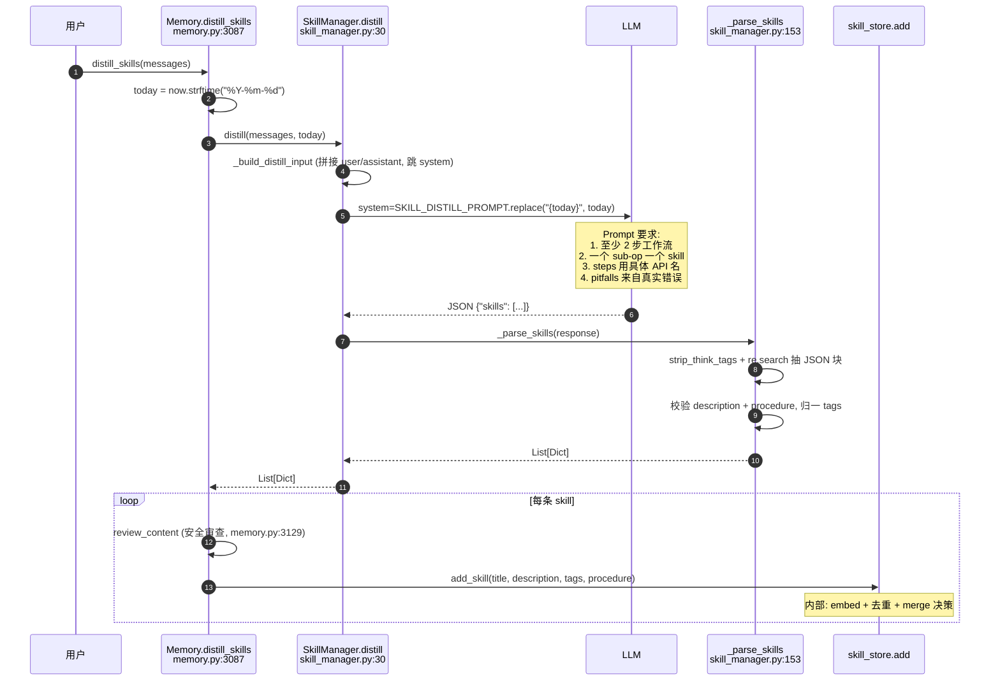
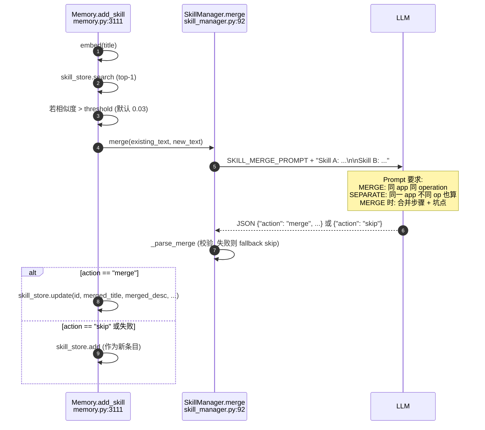
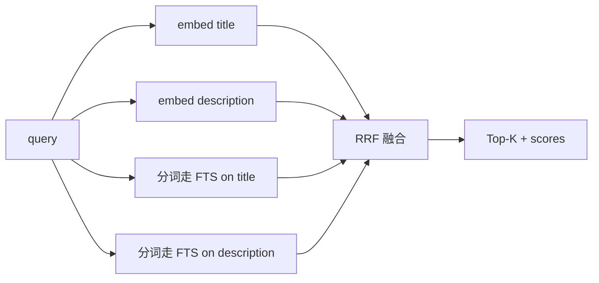

<!--
读者定位:
  🛠 开发者 (主) — 想知道 Skill 怎么生成、存储、检索
  🏗 架构师 (辅) — 想知道为什么 Experience 与 Skill 要分开两层
-->

# Experience + Skill 双层蒸馏

> **读者定位**: 🛠 开发者 (主) · 🏗 架构师 (辅)
>
> 本章解析 PowerMem 的"自进化"另一面 — **Skill 蒸馏**。区别于 Ebbinghaus 的"时间衰减", Skill 蒸馏是"从对话中归纳出可复用的操作程序"。PowerMem 在 AppWorld 基准上 39% 通过率 (vs 24% baseline) 的关键就在这。

## 你将学到

1. Experience (经验) 与 Skill (技能) 的本质区别
2. `SkillManager.distill()` 的输入、prompt、输出结构
3. `SkillManager.merge()` 怎么判断两个 skill 该不该合并
4. Skill 的存储 schema (OceanBase `_skills` 表)
5. Skill 检索: 4 路混合 + RRF, 与 Memory 检索的异同
6. 触发时机: 默认**不**自动触发, 由调用方决定何时 distill

---

## 1. Experience vs Skill — 为什么要分两层?

PowerMem 把"记忆"分成两层语义:

| 层级 | 内容 | 触发时机 | 例子 |
|------|------|---------|------|
| **Memory (经验)** | "用户在 2026-08-08 说他喜欢 PostgreSQL" | 每次对话自动 add | **事件性**, 时序性强, 会被 Ebbinghaus 衰减 |
| **Skill (技能)** | "如何在 Spotify 用 API 分页获取歌曲 (含 token 坑点)" | 显式调用 `distill_skills()` | **程序性**, 跨时间聚合, 不衰减 (除非被 merge) |

设计取舍:

- **Memory** 是"事实" — 不可压缩、不可合并, 需要 LLM 决策 ADD/UPDATE/DELETE
- **Skill** 是"操作步骤" — 可压缩、可合并, 不需要逐条存取, 由 `merge()` 决定去重
- 两层**互补**: Memory 回答"用户当前偏好是什么", Skill 回答"如何执行用户想做的任务"

```
┌────────────────────────────────────────────────────────────┐
│                                                            │
│   对话 ─┬─→ Memory.add() ─→ MemoryStore (受 Ebbinghaus 影响) │
│         │                                                   │
│         └─→ SkillManager.distill() ─→ SkillStore (不衰减)   │
│                                                            │
└────────────────────────────────────────────────────────────┘
```

---

## 2. 主文件 + 默认参数

- `src/powermem/intelligence/skill_manager.py` — `SkillManager` 类
- `src/powermem/prompts/skill_prompts.py` — `SKILL_DISTILL_PROMPT` (line 8), `SKILL_MERGE_PROMPT` (line 80)
- `src/powermem/storage/skill_store/base.py:7` — `SkillStoreBase` ABC
- `src/powermem/storage/skill_store/oceanbase.py` — OceanBase 实现
- 触发入口: `Memory.distill_skills()` (`memory.py:3087`), `Memory.add_skill()` (`memory.py:3111`), `Memory.search_skills()` (`memory.py:3170`)

---

## 3. `SkillManager.distill()` (skill_manager.py:30-59)

### 3.1 签名

```python
def distill(self, messages: List[Dict[str, str]], today: str) -> List[Dict[str, Any]]:
    """
    返回结构:
    [
      {
        "title": "...",           # ≤20 chars, app + operation
        "description": "...",
        "tags": ["app_name", "op"],
        "procedure": {
          "prerequisites": [...],
          "steps": [{"index": N, "action": "...", "expected": "...", "note": "..."}],
          "pitfalls": [{"error": "...", "cause": "...", "fix": "..."}]
        }
      },
      ...
    ]
    """
```

### 3.2 流程图



### 3.3 Prompt 关键指令 (`SKILL_DISTILL_PROMPT`, line 8-77)

```
RULES:
1. Extract skills ONLY when the conversation shows a multi-step workflow (≥2 steps) involving tools/APIs.
2. Each skill = ONE cohesive sub-operation on a specific app.
3. Steps must include concrete API calls with parameter names, but replace task-specific data values with placeholders.
4. Pitfalls MUST come from actual errors observed in the conversation (trial-and-error patterns).
5. If no reusable skill pattern exists, return {"skills": []}.
6. LANGUAGE: match the user's input language. NEVER translate.
7. SENSITIVE CONTENT: skip harmful/illegal content.
```

第 6 条很关键 — 输出语言跟随用户输入。中文对话产出中文 skill, 英文对话产出英文 skill。

### 3.4 输出校验 (`_parse_skills`, line 153-187)

- 必须有 `description` (非空字符串) 和 `procedure` (dict)
- `tags`: 字符串则按 `,` 拆; 列表则直接用; 其他类型降级为 `[]`
- 缺字段的 skill 直接丢弃, 不抛异常

---

## 4. `SkillManager.merge()` (skill_manager.py:92-114)

### 4.1 签名

```python
def merge(self, existing: str, new: str) -> Dict[str, Any]:
    """
    返回结构:
    {"action": "merge", "title": "...", "description": "...", "procedure": {...}}
    或
    {"action": "skip"}
    """
```

### 4.2 流程图



### 4.3 Prompt 关键指令 (`SKILL_MERGE_PROMPT`, line 80-92)

```
MERGE when: they describe the same operation on the same app.
KEEP SEPARATE when: they describe different operations even if on the same app.
If MERGE — combine steps (union, deduplicate) and pitfalls.
If SEPARATE — return skip.
RULES:
1. Preserve the original language.
2. Output ONLY valid JSON:
   MERGE:    {"action": "merge", "title": "...", "procedure": {...}}
   SEPARATE: {"action": "skip"}
```

### 4.4 默认阈值与降级

- **相似度阈值**: 0.03 (memory.py:3140, `(self.config.get("skill_store") or {}).get("similarity_threshold", 0.03)`)
- **LLM 禁用时**: 直接返回 `{"action": "skip"}` (skill_manager.py:100-102) — 不会触发 merge, 等价于"每条都当独立 skill 存"
- **JSON 解析失败**: 同上, 降级 skip, 不抛异常

---

## 5. SkillStore schema (OceanBase `_skills` 表)

存储在主表的旁边, 表名为 `<main_collection>_skills`, 由 `Memory._init_skill_store` (memory.py:2811-2842) 在 OceanBase 后端下自动创建。

主要列:

| 列 | 类型 | 说明 |
|----|------|------|
| `id` | BIGINT (Snowflake ID) | 主键 |
| `user_id` | VARCHAR(128) | 作用域 |
| `agent_id` | VARCHAR(128) | 作用域 |
| `title` | VARCHAR | 操作名 |
| `title_embedding` | VECTOR(dim) | dense 向量 |
| `description` | LONGTEXT | 描述 |
| `description_embedding` | VECTOR(dim) | dense 向量 |
| `tags` | JSON | 标签数组 |
| `procedure_data` | LONGTEXT (JSON) | 完整步骤 + 坑点 |
| `status` | VARCHAR | active / deprecated / merged |
| `positive_count` | INT | 正反馈计数 (被调用) |
| `negative_count` | INT | 负反馈计数 (被 reject) |
| `created_at` | VARCHAR(128) | ISO 时间 |
| `updated_at` | VARCHAR(128) | ISO 时间 |

### 5.1 与 Memory 表的区别

| 维度 | Memory 表 | Skill 表 |
|------|----------|---------|
| 衰减 | Ebbinghaus (按 R 值) | 不衰减 |
| 检索路径 | vector + FTS + sparse (3 路) | **vector + FTS 双路 × title/description 共 4 路** |
| Fusion | RRF (default) | RRF (default) |
| Embedding | 1 个 (对 content) | **2 个** (对 title 和 description 分别 embed) |
| 反馈字段 | 无 (用 metadata 间接表达) | 正/负计数直接列 |
| Embedding 维度 | 来自 vector_store config | 来自 skill_store config (默认 1536, 同主表) |

---

## 6. Skill 检索: 4 路混合 + RRF

`skill_store.search` 的内部实现 (`src/powermem/storage/skill_store/oceanbase.py`):



4 路并发检索 (`ThreadPoolExecutor(max_workers=4)`), RRF 公式 `1/(k+rank)` 默认 k=60 (与 Memory 同), 候选数 `min(limit*3, 50)`。

过滤项:
- `status != "deprecated"` (默认排除)
- 可选 `user_id` / `agent_id` 过滤
- 可选 `status` 过滤

---

## 7. 触发时机 — 默认不自动

**重要**: Skill 蒸馏**不是**由 `Memory.add()` 自动触发的。要生成 skill, 必须显式调用:

```python
# 1. 从一段对话中蒸馏
skills = memory.distill_skills(messages, today="2026-08-08")
# skills 是 List[Dict], 不直接写入; 需要手动 add_skill

# 2. 写入一条 skill (带去重 + 内容审查)
result = memory.add_skill(
    title="Spotify 登录",
    description="使用邮箱和密码登录 Spotify",
    tags=["spotify", "login"],
    procedure={"prerequisites": [...], "steps": [...], "pitfalls": [...]},
    user_id="alice",
    skip_review=False,   # 默认 True 会调 review_content
)
# result = {"id": 123, "title": "...", "action": "created"|"merged"|"blocked"}

# 3. 检索 skill
results = memory.search_skills("怎么登录 Spotify", limit=5, user_id="alice")
```

设计意图: **Skill 蒸馏是 LLM 重操作** (一次 distill 至少一次 LLM 调用 + 可能的 merge 调用), 自动触发会大幅增加 token 开销。PowerMem 默认让业务方控制节奏。

何时适合自动触发?

- 后台离线 pipeline: 每晚批处理今日所有对话 → 蒸馏 → 入库
- 任务完成后 hook: 任务成功 → 触发 distill 整段对话
- 用户主动指示: "记住这个操作" → 立即 distill

---

## 8. Async 版 (`adistill` / `amerge`)

skill_manager.py:61 (`adistill`) 和 :116 (`amerge`) 是异步版, 用 `asyncio.to_thread()` 包裹同步 LLM 调用 (避免阻塞事件循环)。调用方式:

```python
skills = await memory.skill_manager.adistill(messages, today)  # 注意: skill_manager 是私有属性
```

更推荐: 直接用同步 `memory.distill_skills` 在异步应用里 (`await asyncio.to_thread(memory.distill_skills, ...)`), 避免依赖私有属性。

---

## 9. 后端限制

**只有 OceanBase 后端启用了 SkillStore** (memory.py:2811-2842):

```python
if self.vector_store_config.get("provider") == "oceanbase" and self.config.get("skill_store", {}).get("enabled", False):
    self.skill_store = OceanBaseSkillStore(...)
else:
    self.skill_store = None
```

如果你的主存储是 SQLite / PG, `skill_store` 始终是 None, `Memory.add_skill()` 会抛 `RuntimeError("SkillStore not enabled")`。

### 9.1 PG 后端怎么办?

目前需要自行实现 `SkillStoreBase` 子类 (类似 `src/powermem/storage/skill_store/oceanbase.py`), 然后在 `memory.py:_init_skill_store` 增加注册分支。这是个**潜在 PR 切入点**。

---

## 10. 完整实战示例

```python
from powermem import create_memory

memory = create_memory()

# 1. 一段对话
messages = [
    {"role": "user", "content": "帮我登录 Spotify"},
    {"role": "assistant", "content": "请提供邮箱和密码"},
    {"role": "user", "content": "alice@example.com / pwd123"},
    {"role": "assistant", "content": "调用 apis.spotify.login('alice@example.com', 'pwd123')"},
    {"role": "assistant", "content": "返回: {'access_token': '...', 'token_type': 'Bearer'}"},
    {"role": "user", "content": "token 怎么用?"},
    {"role": "assistant", "content": "用 token 调 apis.spotify.show_song_library(token, page_index=0, page_limit=20)"},
]

# 2. 蒸馏
skills = memory.distill_skills(messages, today="2026-08-08")
# 期望产出: 1-2 条 skill (登录 + 分页)

# 3. 写入 (带去重)
for skill in skills:
    result = memory.add_skill(
        title=skill["title"],
        description=skill["description"],
        tags=skill["tags"],
        procedure=skill["procedure"],
        user_id="alice",
    )
    print(result)  # {"action": "created"} or {"action": "merged"}

# 4. 检索
results = memory.search_skills("怎么分页拉歌曲", limit=3, user_id="alice")
for r in results:
    print(r["title"], r["score"])
```

---

## 延伸阅读

- `SkillManager`: `src/powermem/intelligence/skill_manager.py` (215 行核心)
- Prompt 模板: `src/powermem/prompts/skill_prompts.py`
- SkillStore 基类: `src/powermem/storage/skill_store/base.py:7`
- OceanBase SkillStore: `src/powermem/storage/skill_store/oceanbase.py`
- 实战示例: [docs/examples/scenario_5_custom_integration](../examples/scenario_5_custom_integration) (内含 skill 用法)
- AppWorld 基准 (Skill 蒸馏效果): [docs/benchmark/overview](../benchmark/overview)

---

## 下章预告

下一章 [06-storage](./06-storage) 解析 PowerMem 的存储层: 三种后端 (OceanBase / SQLite / PGVector) 的对比、`StorageAdapter` 归一化层的内部机制、主表 schema, 以及 sub-store 路由。