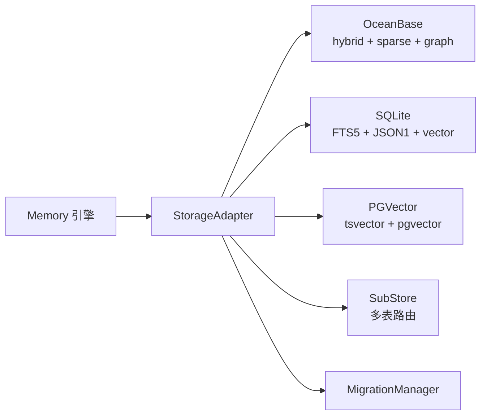
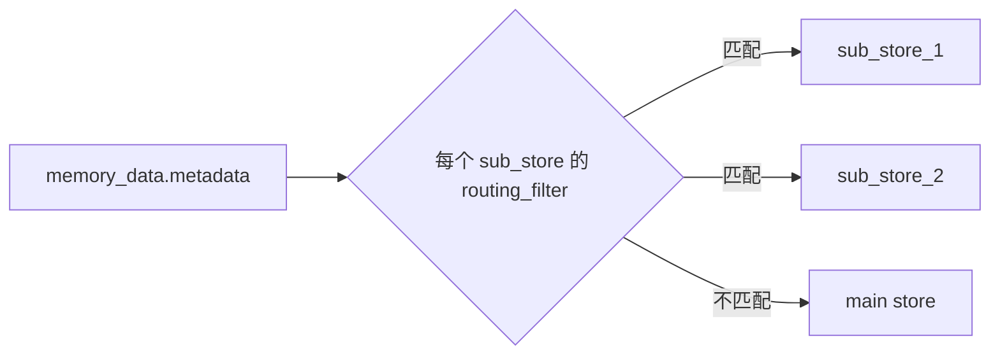
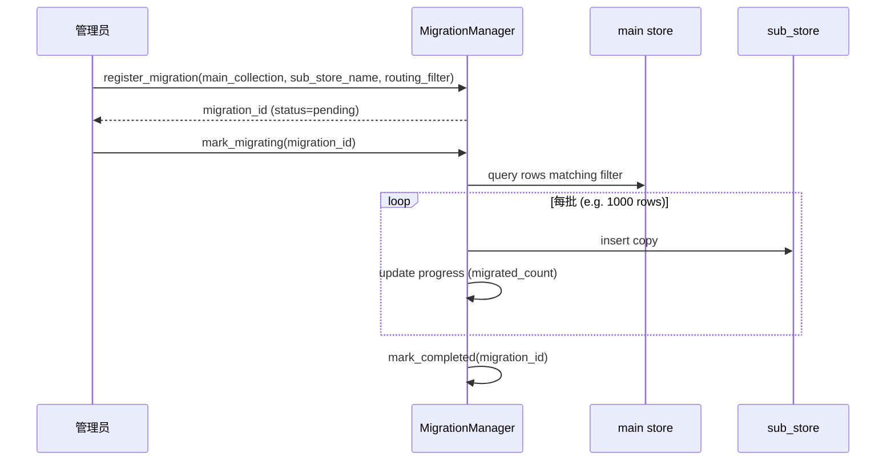
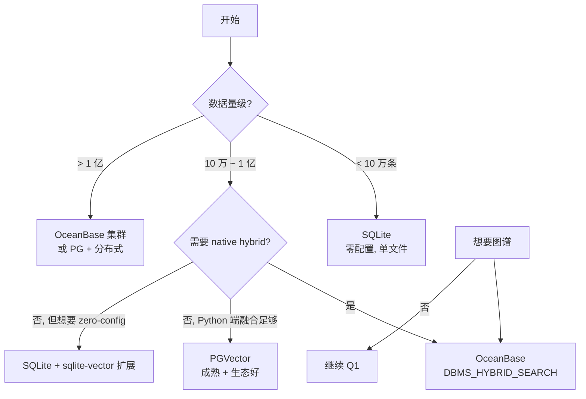

<!--
读者定位:
  🏗 架构师 (主) — 想知道存储层抽象是否稳, 三后端能力差距
  🛠 开发者 (辅) — 想知道 schema 长什么样, sub-store 怎么配
-->

# 存储层与三后端对比

> **读者定位**: 🏗 架构师 (主) · 🛠 开发者 (辅)
>
> 本章解析 PowerMem 的存储层 — `StorageAdapter` 归一化层的内部机制, 三个支持后端的能力矩阵, 主表 schema, sub-store 路由, 以及可选的图谱存储。

## 你将学到

1. `StorageAdapter` 把哪些差异归一化掉了
2. OceanBase / SQLite / PGVector 三后端在 vector / FTS / sparse / hybrid 上的能力矩阵
3. 主表 schema (OceanBase 版, 其他后端近似)
4. Sub-store 路由: 怎么按 `filters` 把不同 sub_collection 写到不同表
5. 图谱: 只有 OceanBase 实现, 何时启用
6. `migration_manager`: 不是通用 schema 版本管理, 是 sub-store 状态追踪
7. Snowflake ID: 三后端都自己生成

---

## 1. `StorageAdapter` — 归一化层

文件: `src/powermem/storage/adapter.py`

`StorageAdapter` 是 `Memory` 引擎与具体后端之间的**唯一**边界。`Memory.add` / `search` / `get` / `update` / `delete` 全部走它。



### 1.1 归一化的差异

| 维度 | OceanBase | SQLite | PGVector | Adapter 处理 |
|------|-----------|--------|----------|-------------|
| metadata 字段路径 | `metadata.foo` (nested JSON) | `metadata.foo` | `metadata.foo` | 用 `_metadata_filter_key_for_store` 翻译 |
| `data` 文本字段 | `document` 列 | `data` 字段 | `data` 字段 | 用 `_oceanbase_text_field` 区分 |
| `LIKE %q%` 全文 fallback | ✅ | ✅ | ✅ | Adapter 不感知, 后端自己处理 |
| Sparse embedding | SPARSE_VECTOR 列 | TEXT 序列化 | 无 | Adapter 调 `embed_sparse` 然后传给后端 |
| Snowflake ID | 数据库自动 | Python 生成 | 数据库自动 | Adapter 不感知, 后端自己处理 |

**关键代码**: `adapter.py:105` `_metadata_filter_key_for_store` — 一个 30 行的 if/elif 链, 把逻辑 metadata key 翻译成各后端的物理列名。

### 1.2 Adapter 的方法面

```python
class StorageAdapter:
    def add_memory(memory_data) -> int          # adapter.py:240
    def search_memories(...) -> List[Dict]       # adapter.py:313
    def get_memory(memory_id) -> Optional[Dict]
    def update_memory(memory_id, data)
    def delete_memory(memory_id)
    def get_all_memories(...) -> List[Dict]
    def count_all_memories(...)
    def clear_memories(...) -> int

    # sub-store 路由
    def add_sub_store(name, config)
    def remove_sub_store(name)
    def get_migration_status(...) -> Dict

    # 内部辅助
    def _route_to_store(metadata) -> VectorStoreBase
    def _build_db_filters(user_id, agent_id, run_id, filters, target_store) -> Dict
    def _metadata_filter_key_for_store(key, target_store) -> str
    def _generate_sparse_embedding(content, memory_action)
    def _supports_text_search_without_vector(target_store) -> bool
```

---

## 2. 三后端能力矩阵

| 能力 | OceanBase (≥4.4.1) | SQLite (内置) | PGVector |
|------|---------------------|---------------|----------|
| 向量检索 (ANN) | ✅ HNSW + IVF | ✅ Brute-force / HNSW (扩展) | ✅ HNSW / DiskANN |
| 全文检索 | ✅ OB ≥4.4.1 + heap table | ✅ FTS5 虚拟表 | ✅ tsvector + GIN |
| 稀疏向量 | ✅ OB ≥4.5 或 seekdb | ⚠️ 需手工建表 (无官方支持) | ❌ 需 pgvector 0.5+ + 自定义类型 |
| Native hybrid | ✅ OB ≥4.4.1 (DBMS_HYBRID_SEARCH) | ❌ Python 端融合 | ❌ Python 端融合 |
| 图谱 | ✅ graph_entities + graph_relationships | ❌ | ❌ |
| JSON 元数据过滤 | ✅ | ✅ (JSON1) | ✅ (JSONB) |
| 嵌入式运行 | ✅ seekdb (单进程) | ✅ (本身就是嵌入式) | ❌ (需独立进程) |
| 多进程并发 | ✅ | ⚠️ 加锁后 | ✅ |
| 主表 row 数实测 | 数亿 | 数十万 (brute-force 极限) | 千万级 |

**关键约束** (server.py::_is_embedded_storage, 见 CLAUDE.md):

> Embedded storage (SQLite or OceanBase without `OCEANBASE_HOST`) forces `workers=1` — don't try multi-worker uvicorn.

也就是说, 如果用 `DATABASE_PROVIDER=sqlite` 或本地 seekdb, `make server-start` 启动的 4-worker uvicorn 会被强制降为 1 worker。

---

## 3. OceanBase 主表 schema (oceanbase.py:282-374)

```sql
CREATE TABLE IF NOT EXISTS memories (
    id          BIGINT PRIMARY KEY,                              -- Snowflake ID
    vector      VECTOR(embedding_dims),                          -- dense 向量
    data        LONGTEXT,                                        -- 文本内容
    metadata    JSON,                                            -- 用户元数据
    user_id     VARCHAR(128),
    agent_id    VARCHAR(128),
    run_id      VARCHAR(128),
    actor_id    VARCHAR(128),
    hash        VARCHAR(32),                                     -- MD5 of content
    created_at  VARCHAR(128),                                    -- ISO 8601
    updated_at  VARCHAR(128),
    category    VARCHAR(64),
    fulltext_content    LONGTEXT,                                -- FTS 副本
    sparse_embedding    SPARSE_VECTOR,                           -- 可选
    INDEX idx_user_id (user_id),
    INDEX idx_agent_id (agent_id),
    INDEX idx_run_id (run_id),
    -- dense 向量索引 (按 config 创建, 默认 HNSW)
    VECTOR INDEX idx_vector (vector) WITH (metric=cosine, type=hnsw),
    -- FTS 索引 (若启用了 hybrid_search)
    FULLTEXT INDEX idx_fulltext (fulltext_content),
    -- 稀疏索引 (若启用了 sparse)
    SPARSE INDEX idx_sparse (sparse_embedding) WITH (search_mode=daat)
);
```

### 3.1 Snowflake ID 生成策略

| 后端 | 生成方 | 备注 |
|------|--------|------|
| OceanBase | 数据库 (auto_increment 或 sequence) | 64-bit, 全局唯一 |
| SQLite | Python 端 (`generate_snowflake_id()`, sqlite_vector_store.py:199-211) | 41-bit 时间戳 + 10-bit 机器 + 12-bit 序列 |
| PGVector | 数据库 (BIGSERIAL) | 实际是 Postgres sequence, 不严格 Snowflake, 但兼容 |

Snowflake ID 的好处: 跨表的全局排序性, 写入时不需要先 INSERT 再 SELECT lastval (避免 race condition)。

### 3.2 各列的实际含义

| 列 | 写入时机 | 读取用途 |
|----|---------|---------|
| `id` | insert 后由后端生成 | 主键检索 |
| `vector` | add_memory 时由 embedding_service 生成 | ANN 检索 |
| `data` | 用户 content | 检索返回时的 text |
| `metadata` | 用户 metadata (JSON) | 检索返回时的 metadata |
| `fulltext_content` | 与 data 同步写入, 用于 FTS | 全文检索 (BM25) |
| `sparse_embedding` | 若配置了 sparse embedder | 稀疏检索 (DAAT) |
| `hash` | add_memory 时 MD5(content) | 去重 + 一致性校验 |
| `category` | 用户 metadata 中的 category 字段 (或自动) | 分类筛选 |
| `user_id` / `agent_id` / `run_id` / `actor_id` | 用户传入 | 多租户过滤 |

---

## 4. SQLite 主表 schema (sqlite_vector_store.py:161-190)

```sql
CREATE TABLE IF NOT EXISTS memories (
    id              INTEGER PRIMARY KEY,
    vector          TEXT,                 -- JSON 序列化的浮点列表
    payload         TEXT,                 -- JSON 序列化完整 payload
    fulltext_content TEXT
);

CREATE VIRTUAL TABLE IF NOT EXISTS memories_fts
USING fts5(fulltext_content, content='memories', content_rowid='id');
```

差异:

- SQLite 用 TEXT 存向量 (JSON), Python 端做 cosine 计算 (或用 sqlite-vector 扩展做 ANN)
- FTS5 是虚拟表, 自动维护, 通过 `MATCH` 查询
- payload 是完整 dict, metadata 字段藏在 payload JSON 里

---

## 5. PGVector 主表 schema (pgvector.py:148-186, 概要)

```sql
CREATE TABLE IF NOT EXISTS memories (
    id              BIGSERIAL PRIMARY KEY,
    embedding       VECTOR(embedding_dims),       -- pgvector 类型
    document        TEXT,
    metadata        JSONB,
    user_id         VARCHAR(128),
    agent_id        VARCHAR(128),
    run_id          VARCHAR(128),
    fulltext_content TEXT,
    created_at      TIMESTAMP,
    updated_at      TIMESTAMP,
    hash            VARCHAR(32),
    -- 向量索引 (HNSW 或 IVFFlat, 按 config)
    USING hnsw (embedding vector_cosine_ops)
);
```

FTS 通过 GIN + tsvector (Postgres 原生), 需要在应用层维护 `to_tsvector('simple', fulltext_content)` 触发器, 或在写入时手动构造。

---

## 6. Sub-store 路由 — 多 collection 隔离

**场景**: 你想把 Experience 记忆写到 `memories_main`, 把 Skill 蒸馏结果写到 `memories_skill`, 或者按用户分组写到不同 collection。

```python
# 配置示例
memory.add_sub_store(
    name="skill_store",
    routing_filter={"metadata.skill_origin": True},  # metadata 包含该 key 时路由
    config={"provider": "oceanbase", "config": {"collection_name": "skills"}},
)
```

路由逻辑 (`_route_to_store` in adapter.py):



Sub-store 的写入/检索使用同一套 `StorageAdapter` 接口, 但内部的 `target_store` 是不同的 `VectorStoreBase` 实例。

### 6.1 已知限制

- 一个 `Memory` 实例只能有一份 `StorageAdapter`, sub-store 数量理论无上限但实测建议 ≤ 5
- Sub-store 与 main store 的 `vector_store.config` 各自独立 (向量维度、索引类型可以不同)

---

## 7. 图谱存储 (OceanBase only)

文件: `src/powermem/storage/oceanbase/oceanbase_graph.py`

启用条件:

```python
config["graph_store"] = {
    "enabled": True,
    "provider": "oceanbase",
    "config": {"embedding_model_dims": 1536}
}
```

### 7.1 触发时机

`Memory.add()` 在 `_intelligent_add` 末尾调一次 `_add_to_graph(messages, filters, user_id, agent_id, run_id)` (memory.py:1549):

```python
def _add_to_graph(self, messages, filters, user_id, agent_id, run_id):
    if not self.graph_store or self._is_llm_disabled():
        return
    text = parse_messages_for_facts(messages)  # 拼成单段文本
    graph_filters = {
        "user_id": user_id or "user",
        "agent_id": agent_id,
        "run_id": run_id,
        **filters,
    }
    self.graph_store.add(data=text, filters=graph_filters)
```

`graph_store.add()` 内部调 LLM 抽 entity + relation, 然后写入两张表。

### 7.2 Schema (graph_entities + graph_relationships, oceanbase_graph.py:310-452)

```sql
CREATE TABLE graph_entities (
    id              BIGINT PRIMARY KEY,
    name            VARCHAR(255),
    user_id         VARCHAR(128),
    entity_type     VARCHAR(64),
    embedding       VECTOR(dim),
    created_at      TIMESTAMP,
    updated_at      TIMESTAMP,
    UNIQUE INDEX idx_user_name (user_id, name),
    VECTOR INDEX idx_entity_vec (embedding)
);

CREATE TABLE graph_relationships (
    id                      BIGINT PRIMARY KEY,
    source_entity_id        BIGINT,
    destination_entity_id   BIGINT,
    relationship_type       VARCHAR(128),
    user_id                 VARCHAR(128),
    agent_id                VARCHAR(128),
    run_id                  VARCHAR(128),
    description             LONGTEXT,
    strength                FLOAT,
    created_at              TIMESTAMP,
    updated_at              TIMESTAMP,
    INDEX idx_r_covering (user_id, source_entity_id, destination_entity_id, relationship_type)
);
```

### 7.3 图谱检索

`Memory.search()` 末尾会调一次图谱检索 (如果 graph_store 启用), 返回结构中的 `relations` 字段:

```python
{
    "results": [...],   # 来自 vector/FTS/sparse 融合
    "relations": [      # 来自图谱检索
        {"source": "alice", "relationship": "prefers", "destination": "PostgreSQL", "score": 0.92},
        ...
    ]
}
```

图谱与向量检索**独立打分**, 不会融合。需要的话可以自己在客户端合并。

---

## 8. Migration Manager — Sub-store 状态追踪

**重要认知**: `src/powermem/storage/migration_manager.py` 的 `MigrationManager` **不是通用 schema 版本管理**, 而是 **sub-store 数据迁移状态追踪**。

```sql
CREATE TABLE sub_store_migration_status (
    id                      BIGINT PRIMARY KEY,
    main_collection_name    VARCHAR,
    sub_store_name          VARCHAR,
    routing_filter          JSON,
    status                  VARCHAR,    -- pending / migrating / completed / failed
    migrated_count          INT,
    total_count             INT,
    error_message           LONGTEXT,
    created_at              TIMESTAMP,
    updated_at              TIMESTAMP,
    started_at              TIMESTAMP,
    completed_at            TIMESTAMP,
    INDEX idx_status (status),
    INDEX idx_main (main_collection_name)
);
```

### 8.1 何时需要 migration

当你**新增一个 sub-store**, 想把 main store 中已有的历史数据按 `routing_filter` 重新分配到 sub-store, 而不想重新 add (因为那样会改变 ID、丢失 importance_score 等 intelligence 字段)。

典型流程:



公开 API:

- `register(main_collection, sub_store_name, routing_filter)` — 注册新迁移
- `mark_migrating(migration_id)` — 进入执行态
- `mark_progress(migration_id, migrated_count)` — 进度更新
- `mark_completed(migration_id)` — 完成
- `mark_failed(migration_id, error)` — 失败
- `is_ready(sub_store_name)` — `status == "completed"` 才算 ready, 否则 sub-store 不参与路由

---

## 9. 选型决策树



### 9.1 实测推荐

| 场景 | 推荐 | 原因 |
|------|------|------|
| 个人项目 / 原型 | SQLite | 零配置, 启动 < 1s |
| 中型 SaaS (< 1 亿条) | OceanBase 单机 / PG | 有 hybrid 加成 |
| 大型企业 (> 1 亿) | OceanBase 集群 | 水平扩展 + native hybrid |
| 需要图谱 | OceanBase | 唯一实现 |
| 嵌入式 (智能体本地) | seekdb (OceanBase embedded) | 单进程, 无依赖 |

---

## 10. 常见运维操作

### 10.1 切换后端

修改 `.env`:

```bash
DATABASE_PROVIDER=sqlite    # 或 oceanbase / pgvector
OCEANBASE_HOST=remote-host  # 仅 oceanbase 模式需要
OCEANBASE_PORT=2881
OCEANBASE_USER=root@test
OCEANBASE_PASSWORD=***
OCEANBASE_DB_NAME=powermem
```

然后:

```python
from powermem import auto_config, Memory
config = auto_config()  # 自动从 .env 读
memory = Memory(config=config)
```

切换后端需要重新导入数据 (Schema 不通用)。建议先用 `memory.export_all()` 导出, 再在新后端 `memory.import_all()`。

### 10.2 备份

```bash
# OceanBase: 用 OB 自带工具
ob_client -h host -P 2881 -u root -p *** -D powermem -e "SELECT * FROM memories" > backup.sql

# SQLite: 直接复制文件
cp powermem.db backup_2026-08-08.db
```

### 10.3 重置

```python
memory.reset()  # 删表 + 重建 collection
# ⚠️ 不可恢复, 慎用
```

---

## 延伸阅读

- `StorageAdapter`: `src/powermem/storage/adapter.py`
- `VectorStoreFactory`: `src/powermem/storage/factory.py`
- OceanBase 实现: `src/powermem/storage/oceanbase/oceanbase.py`
- SQLite 实现: `src/powermem/storage/sqlite/sqlite_vector_store.py`
- PGVector 实现: `src/powermem/storage/pgvector/pgvector.py`
- 图谱实现: `src/powermem/storage/oceanbase/oceanbase_graph.py`
- Migration Manager: `src/powermem/storage/migration_manager.py`
- 后端能力探测工具: `src/powermem/utils/oceanbase_util.py`
- 详细配置: [docs/guides/0003-configuration](../guides/0003-configuration)

---

## 下章预告

下一章 [07-providers](./07-providers) 解析 PowerMem 的 Provider 注册机制 — 为什么 LLM / Embedder / Rerank / VectorStore / GraphStore 共享同一套注册模式, 以及添加新 Provider 的 4 步清单。