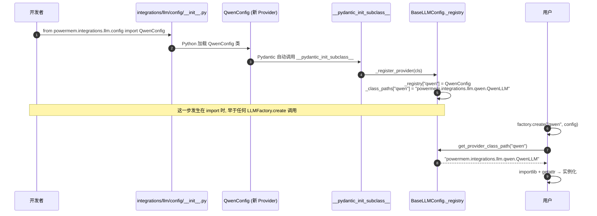

<!--
读者定位:
  🛠 开发者 (主) — 想知道怎么加一个新 LLM / Embedder / Vector Store
  🏗 架构师 (辅) — 想知道这套设计是否经得起扩展
-->

# Provider 注册机制

> **读者定位**: 🛠 开发者 (主) · 🏗 架构师 (辅)
>
> 本章解析 PowerMem 的"可插拔"核心 — 五种 Provider 共享同一套基于 Pydantic 的注册模式。理解这个机制后, 加一个新 LLM / Embedder / VectorStore 只需要 4 步。

## 你将学到

1. 为什么 LLM / Embedder / Rerank / VectorStore / GraphStore 用同一种模式
2. `__pydantic_init_subclass__` 钩子的工作原理
3. 添加新 Provider 的 4 步清单 (含最容易踩的坑)
4. 完整 Provider 清单矩阵
5. 自定义 Provider vs 第三方 Provider 的接入路径

---

## 1. 五种 Provider 用同一套模式

PowerMem 中所有"可插拔"的组件都遵循同一套 Pydantic 注册模式:

| 类型 | Config 基类 | 工厂 | 子类必须设置 |
|------|------------|------|-------------|
| **LLM** | `BaseLLMConfig` (integrations/llm/config/base.py:90) | `LLMFactory` | `_provider_name`, `_class_path` |
| **Embedder** | `BaseEmbedderConfig` (integrations/embeddings/config/base.py:19) | `EmbedderFactory` | `_provider_name`, `_class_path` |
| **Rerank** | `BaseRerankConfig` (integrations/rerank/config/base.py) | `RerankFactory` | `_provider_name`, `_class_path` |
| **VectorStore** | `BaseVectorStoreConfig` (storage/config/base.py:30-45) | `VectorStoreFactory` | `_provider_name`, `_class_path` |
| **GraphStore** | `BaseGraphStoreConfig` (storage/config/base.py:256-274) | `GraphStoreFactory` | `_provider_name`, `_class_path` |
| **UserProfileStore** | `UserProfileStoreBase` (user_memory/storage/base.py) | `UserProfileStoreFactory` | `_provider_name`, `_class_path` |

**完全相同的代码模板** (以 LLM 为例, integrations/llm/config/base.py:90-108):

```python
from typing import ClassVar, Dict

class BaseLLMConfig(BaseModel):
    _provider_name: ClassVar[str] = "base"
    _class_path: ClassVar[str] = "powermem.integrations.llm.config.base.BaseLLM"
    _registry: ClassVar[Dict[str, type]] = {}
    _class_paths: ClassVar[Dict[str, str]] = {}

    @classmethod
    def _register_provider(cls):
        name = getattr(cls, "_provider_name", None)
        path = getattr(cls, "_class_path", None)
        if name and path:
            BaseLLMConfig._registry[name] = cls
            BaseLLMConfig._class_paths[name] = path

    def __pydantic_init_subclass__(cls, **kwargs):
        super().__pydantic_init_subclass__(**kwargs)
        cls._register_provider()
```

Embedder / VectorStore / GraphStore 的代码完全一致, 只换类名。

---

## 2. `__pydantic_init_subclass__` 钩子详解

Pydantic v2 在每个 `BaseModel` 子类被 Python 解释器加载 (即 `import` 时) 自动调用 `__pydantic_init_subclass__`。PowerMem 利用这个钩子, **在 import 副作用中完成注册**, 避免显式 `register()` 调用。



### 2.1 关键设计

| 设计点 | 为什么这样 |
|--------|-----------|
| `ClassVar` | 字段不会被 Pydantic 当作实例字段, 不会被序列化为 schema |
| `_registry` / `_class_paths` 在基类上 | 所有子类共享同一份表, 避免重复 |
| `__pydantic_init_subclass__` 而非 `__init_subclass__` | Pydantic v2 重命名, 更精确 |
| 静态注册 (import 时) | 启动后无注册开销, 失败立刻能感知 |

### 2.2 工厂代码 (LLMFactory.create 思路)

```python
class LLMFactory:
    @classmethod
    def create(cls, provider_name, config):
        # 1. 从注册表拿 class_path
        class_path = BaseLLMConfig.get_provider_class_path(provider_name)
        if not class_path:
            raise ValueError(f"Unsupported LLM provider: {provider_name}")

        # 2. 从注册表拿 config 类
        config_cls = BaseLLMConfig.get_provider_config_cls(provider_name) or BaseLLMConfig

        # 3. 把 dict 转成对应 ProviderConfig 实例
        if isinstance(config, dict):
            provider_config = config_cls(**config)
        elif isinstance(config, BaseLLMConfig):
            provider_config = config
        else:
            raise TypeError(...)

        # 4. 反射加载类
        module_path, class_name = class_path.rsplit(".", 1)
        module = importlib.import_module(module_path)
        llm_class = getattr(module, class_name)
        return llm_class(provider_config)
```

其他 5 种工厂代码完全一样, 只是 `BaseXxxConfig` 不同。

---

## 3. 添加新 Provider 的 4 步清单

假设要加一个名为 `"my_provider"` 的 LLM。

### Step 1 — 写配置类

`src/powermem/integrations/llm/config/my_provider.py`:

```python
from pydantic import Field
from .base import BaseLLMConfig

class MyProviderConfig(BaseLLMConfig):
    _provider_name = "my_provider"
    _class_path = "powermem.integrations.llm.my_provider.MyProviderLLM"

    api_key: str = Field(default="")
    base_url: str = Field(default="https://api.myprovider.com/v1")
    model: str = Field(default="my-model-v1")
    # ... 你自己的字段
```

### Step 2 — 写实现类

`src/powermem/integrations/llm/my_provider.py`:

```python
from .base import BaseLLM

class MyProviderLLM(BaseLLM):
    def __init__(self, config: MyProviderConfig):
        self.config = config
        self._client = MyProviderClient(config.api_key, config.base_url)

    def generate_response(self, messages, **kwargs):
        return self._client.chat(messages, model=self.config.model)

    def generate_response_stream(self, messages, **kwargs):
        yield from self._client.stream_chat(messages, model=self.config.model)
```

### Step 3 — 注册 config 类 (最容易漏!)

`src/powermem/integrations/llm/config/__init__.py` 末尾追加:

```python
# 触发自动注册
from .my_provider import MyProviderConfig  # noqa: F401
```

⚠️ **踩坑提示**: 这一步是必须的。`__pydantic_init_subclass__` 只在**类被 import** 时触发。如果你的 config 文件没被 import, `_registry` 里就没有 `"my_provider"`, `LLMFactory.create("my_provider")` 会抛 `ValueError: Unsupported LLM provider`。

### Step 4 — 用户使用

```python
config = {
    "llm": {
        "provider": "my_provider",
        "config": {
            "api_key": "...",
            "model": "my-model-v1",
        },
    },
}
memory = Memory(config=config)
# LLMFactory.create("my_provider", config) 会在 Memory.__init__ 内部被调用
```

### 3.1 验证注册成功

```python
from powermem.integrations.llm.config.base import BaseLLMConfig

print(BaseLLMConfig.get_provider_class_path("my_provider"))
# 应该输出: "powermem.integrations.llm.my_provider.MyProviderLLM"
```

如果输出 `None`, 说明 Step 3 漏了。

---

## 4. 不同 Provider 类型的差异点

| 类型 | 多写一步 | 不写会怎样 |
|------|---------|-----------|
| LLM | 实现 `generate_response` (sync) 和 `generate_response_stream` | 用户调用时会报 `NotImplementedError` |
| Embedder | 实现 `embed` (dense) 和 `embed_sparse` (可选) | 只用 dense 就够, sparse 是可选能力 |
| Rerank | 实现 `rerank(query, docs, top_n)` | 同上 |
| VectorStore | 实现 `insert`, `search`, `get`, `update`, `delete` | 任何写入或查询都会失败 |
| GraphStore | 实现 `add_triplet`, `search`, `delete_triplet` | 同上 |

### 4.1 VectorStore 的额外复杂度

VectorStore 需要创建 collection / index, 因此还有这两个方法:

```python
class VectorStoreBase:
    def create_col(self, name, vector_size, distance="cosine"):
        """幂等: 已存在则跳过"""

    def reset(self):
        """删表重建"""
```

`StorageAdapter.add_memory` 在首次写入时会自动调 `create_col`, 所以你不需要手动调用, 但要保证方法实现幂等。

---

## 5. 完整 Provider 清单

### 5.1 LLM (15+)

| provider_name | 实现文件 | 备注 |
|---------------|---------|------|
| `openai` | integrations/llm/openai.py | GPT-4o, GPT-4-turbo |
| `anthropic` | integrations/llm/anthropic.py | Claude 4 Sonnet/Opus, Claude Haiku 4.5 |
| `azure` | integrations/llm/azure.py | Azure OpenAI Service |
| `deepseek` | integrations/llm/deepseek.py | DeepSeek-V3 |
| `gemini` | integrations/llm/gemini.py | Google Gemini |
| `ollama` | integrations/llm/ollama.py | 本地 Ollama |
| `qwen` | integrations/llm/qwen.py | 通义千问 (默认) |
| `qwen_asr` | integrations/llm/qwen_asr.py | Qwen ASR (音频) |
| `siliconflow` | integrations/llm/siliconflow.py | 硅基流动 |
| `vllm` | integrations/llm/vllm.py | 自托管 vLLM |
| `zai` | integrations/llm/zai.py | 智谱 AI |
| `langchain` | integrations/llm/langchain.py | LangChain ChatModel 包装 |
| `noop` | (内置) | 空操作, 用于纯本地演示 |
| `mock` | (内置) | Mock, 用于测试 |
| `openai_structured` | integrations/llm/openai_structured.py | OpenAI structured output 模式 |

### 5.2 Embedder (18+)

| provider_name | 实现 | 维度 | 备注 |
|---------------|------|------|------|
| `openai` | integrations/embeddings/openai.py | 1536 / 3072 | text-embedding-3-small/large |
| `qwen` | integrations/embeddings/qwen.py | 1536 | text-embedding-v3 |
| `qwen_sparse` | integrations/embeddings/qwen_sparse.py | (sparse) | 稀疏向量, 需配合 native hybrid |
| `siliconflow` | integrations/embeddings/siliconflow.py | 1024 / 768 | BGE / M3E |
| `huggingface` | integrations/embeddings/huggingface.py | 384 / 1024 | 本地 HF 模型 |
| `ollama` | integrations/embeddings/ollama.py | (config) | 本地 Ollama |
| `lmstudio` | integrations/embeddings/lmstudio.py | (config) | LM Studio |
| `azure_openai` | integrations/embeddings/azure_openai.py | 1536 | Azure OpenAI |
| `gemini` | integrations/embeddings/gemini.py | 768 | Google Gemini Embedding |
| `vertexai` | integrations/embeddings/vertexai.py | 768 | Google Vertex AI |
| `together` | integrations/embeddings/together.py | (config) | Together AI |
| `aws_bedrock` | integrations/embeddings/aws_bedrock.py | (config) | AWS Bedrock |
| `zai` | integrations/embeddings/zai.py | 1024 / 2048 | 智谱 embedding |
| `langchain` | integrations/embeddings/langchain.py | (config) | LangChain Embeddings 包装 |
| `ob_mass` | integrations/embeddings/ob_mass.py | (config) | OceanBase MASS 内置 |
| `pyseekdb_default` | integrations/embeddings/pyseekdb_default.py | 384 | **默认**, seekdb 内置 all-MiniLM-L6-v2, 零 API key |
| `mock` | (内置) | 1536 | 测试 |
| `default` | 同 `pyseekdb_default` | 384 | 别名 |
| `none` | (内置) | - | 关闭 embedding, 仅做文本匹配 |

### 5.3 Rerank (4)

| provider_name | 实现 | 备注 |
|---------------|------|------|
| `qwen` | integrations/rerank/qwen.py | qwen3-rerank |
| `jina` | integrations/rerank/jina.py | jina-reranker |
| `zai` | integrations/rerank/zai.py | 智谱 rerank |
| `nim` | integrations/rerank/nim.py | NVIDIA NIM rerank |
| `generic` | integrations/rerank/generic.py | 通用 HTTP, 用户配 URL |

### 5.4 VectorStore (3)

| provider_name | 实现 |
|---------------|------|
| `oceanbase` | storage/oceanbase/oceanbase.py |
| `pgvector` | storage/pgvector/pgvector.py |
| `sqlite` | storage/sqlite/sqlite_vector_store.py |

### 5.5 GraphStore (1)

| provider_name | 实现 |
|---------------|------|
| `oceanbase` | storage/oceanbase/oceanbase_graph.py |

### 5.6 UserProfileStore (2)

| provider_name | 实现 |
|---------------|------|
| `oceanbase` | user_memory/storage/user_profile.py |
| `sqlite` | user_memory/storage/user_profile_sqlite.py |

---

## 6. 第三方 / 自定义 Provider 接入路径

如果你不想改 PowerMem 源码 (而是动态注入), 有两种方式:

### 6.1 方式 A — Monkey-patch 注册表

```python
from powermem.integrations.llm.config.base import BaseLLMConfig

class MyExternalLLMConfig(BaseLLMConfig):
    _provider_name = "my_external"
    _class_path = "my_package.MyExternalLLM"
    api_key: str = ""

# 触发注册 (类在内存中创建时自动调 __pydantic_init_subclass__)
# 无需显式注册, import 时已生效

from powermem import Memory
memory = Memory(config={"llm": {"provider": "my_external", "config": {"api_key": "..."}}})
```

### 6.2 方式 B — 用 `register_provider` 显式注册

```python
from powermem.integrations.llm.config.base import BaseLLMConfig
from powermem.integrations.llm.langchain import LangChainLLM  # 现成的包装

BaseLLMConfig._registry["langchain_langsmith"] = LangChainLLM.config_class
BaseLLMConfig._class_paths["langchain_langsmith"] = "path.to.LangChainLLM"
```

不推荐方式 B — 容易被后续 import 覆盖, 且与 Pydantic 自动注册机制冲突。

---

## 7. 设计取舍

### 7.1 优点

- **零样板**: 加一个新 Provider 只需要写两个类 + import 一行
- **统一配置入口**: 所有 Provider 走同一个 dict schema, 用户不用记"每个 LLM 不同的参数位置"
- **反射加载**: 类名 → importlib, 无需在工厂里维护 if-elif 链

### 7.2 缺点

- **依赖 import 副作用**: 漏 import 就默默失败 (`ValueError: Unsupported provider`)。已在 [09-extending](./09-extending) 给出"启动时打印注册表"的调试技巧
- **不支持热注册**: 注册表在 import 时填充, 运行时 add provider 需要重新 import, 实际等同于重启
- **Pydantic 版本绑定**: 一旦切到 Pydantic v3, `__pydantic_init_subclass__` 可能改名, 需要迁移

---

## 延伸阅读

- 添加 Provider 官方指南: [docs/development/overview](../development/overview)
- LLM 基类: `src/powermem/integrations/llm/base.py`
- Embedder 基类: `src/powermem/integrations/embeddings/base.py`
- Rerank 基类: `src/powermem/integrations/rerank/base.py`
- VectorStore 基类: `src/powermem/storage/base.py`
- 自定义 Provider 示例: [docs/examples/scenario_5_custom_integration](../examples/scenario_5_custom_integration)
- 集成指南总览: [docs/guides/0009-integrations](../guides/0009-integrations)

---

## 下章预告

下一章 [08-agents-users](./08-agents-users) 解析 PowerMem 的多智能体 / 多用户 / 混合三种模式, Scope / Permission / Privacy 三件套, 以及 UserMemory 的画像抽取与查询重写。