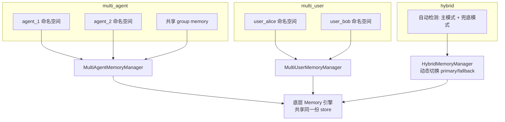
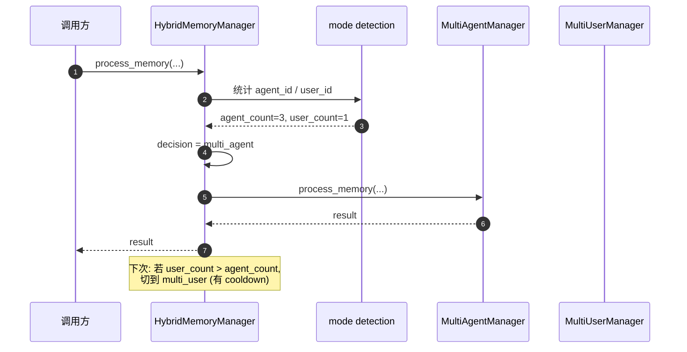
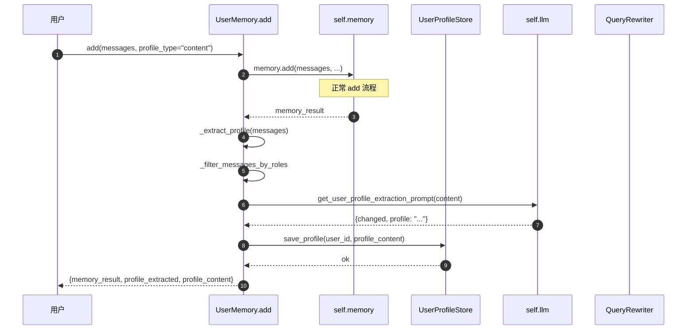
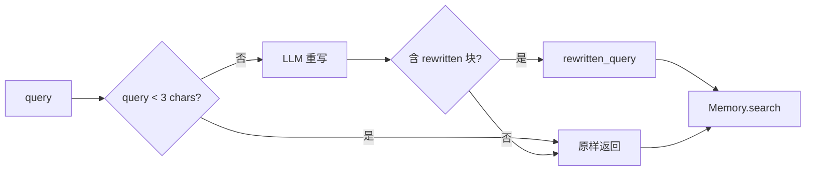

<!--
读者定位:
  🛠 开发者 (主) — 想知道多智能体隔离怎么实现
  👤 用户 (辅) — 想知道 UserMemory 能为自己做什么
-->

# 多智能体与用户画像

> **读者定位**: 🛠 开发者 (主) · 👤 用户 (辅)
>
> 本章解析 PowerMem 的两类业务编排 — `AgentMemory` (智能体间隔离 + 协作) 和 `UserMemory` (用户长期画像)。它们都基于 `Memory` 引擎, 但在外层加了自己的语义层。

## 你将学到

1. `AgentMemory` 三种模式 (multi_agent / multi_user / hybrid) 的本质差异
2. Scope / Permission / Privacy 三件套: 不改表, 全在内存里执行
3. `UserMemory` 的画像抽取流程 (content / topics 两模式)
4. Query rewriting: 用 LLM 把查询改写成"含用户偏好关键词"的版本
5. 实战示例: 多智能体协作 + 用户画像混合使用

---

## 1. 何时需要 AgentMemory?

如果你只服务一个用户、一个 agent, 直接用 `Memory` 就够。当出现以下场景时升级到 `AgentMemory`:

| 场景 | 适用模式 |
|------|---------|
| 多 agent 共享同一份记忆但彼此隔离 | `multi_agent` |
| 同一 agent 服务多用户, 用户间严格隔离 | `multi_user` |
| 既有多 agent 又有用户隔离需求 | `hybrid` |
| 简单单租户 | 直接 `Memory` |

---

## 2. 三种模式的数据流



### 2.1 multi_agent (`src/powermem/agent/implementations/multi_agent.py:30`)

**数据隔离原理**: 每个 `agent_id` 拥有自己的"逻辑 namespace", 由 `ScopeController` (`src/powermem/agent/components/scope_controller.py`) 在 `process_memory` 时打 `scope` 标签。实际存储仍是同一张表, 通过 `metadata.scope` 字段区分。

```python
MultiAgentMemoryManager.process_memory(
    content=...,
    agent_id="agent_1",
    context={"scope": "agent_group", "collaborators": ["agent_2"]},
)
# 内部: ScopeController.classify → metadata.scope = "agent_group"
```

**默认配置**:

| 参数 | 默认 | 含义 |
|------|------|------|
| `default_scope` | `MemoryScope.PRIVATE` | 不指定 scope 时的默认 |
| `default_collaboration_level` | `COLLABORATIVE` | 同 agent_group 是否可互相读 |
| `agent_groups` | `{}` | agent_group → members 映射 |
| `default_permissions` | `{owner: [...], collaborator: [read,write], viewer: [read]}` | 角色 → 权限 |

### 2.2 multi_user (`src/powermem/agent/implementations/multi_user.py:26`)

**严格用户隔离**: `user_isolation=True` 是默认, 任何跨用户的读取都被 `PermissionController` 拦截。

```python
MultiUserMemoryManager.search(
    query="...", user_id="alice", agent_id="bot_1"
)
# 自动附加 metadata.user_id = "alice" 过滤
# 若同时传 agent_id, 必须 = 当前 agent, 否则被 PermissionController 拒绝
```

**默认配置**:

| 参数 | 默认 | 含义 |
|------|------|------|
| `user_isolation` | `True` | 强制用户隔离 |
| `cross_user_sharing` | `False` | 默认禁止跨用户 |
| `user_context_config.max_user_memories` | 10000 | 单用户记忆上限 |
| `user_context_config.context_retention_days` | 30 | 上下文自动清理天数 |
| `user_context_config.auto_cleanup` | True | 开启自动清理 |

### 2.3 hybrid (`src/powermem/agent/implementations/hybrid.py:21`)

**动态切换**: 根据当前调用的 `agent_id` / `user_id` 数量自动选择 multi_agent 或 multi_user。

```python
mode_detection = {
    "agent_count_threshold": 2,        # > 2 agents → multi_agent
    "user_count_threshold": 3,         # > 3 users → multi_user
    "collaboration_threshold": 0.5,    # 协作比例 > 50% → multi_agent
}
```

切换有 `switch_delay=1.0s` + `cooldown`, 防止抖动。



---

## 3. Scope / Permission / Privacy 三件套

这三个组件 (`src/powermem/agent/components/`) 都是**纯内存对象**, 不写表 — 它们在 `process_memory` / `get_memories` 路径上拦截和改写 metadata。

### 3.1 `ScopeController` (scope_controller.py)

```python
class ScopeController:
    """决定一条记忆属于 PRIVATE / AGENT_GROUP / USER_GROUP / PUBLIC / RESTRICTED"""
    def classify_scope(self, content, context) -> MemoryScope:
        # 简单规则: LLM 没启用 → PRIVATE; 否则调 LLM 分类
        if self._is_llm_disabled():
            return MemoryScope.PRIVATE
        return self._llm_classify_scope(content)
```

### 3.2 `PermissionController` (permission_controller.py)

```python
class PermissionController:
    """角色 → 权限矩阵"""
    DEFAULT_PERMISSIONS = {
        "owner":        [AccessPermission.READ, WRITE, DELETE, SHARE, ADMIN],
        "collaborator": [AccessPermission.READ, WRITE],
        "viewer":       [AccessPermission.READ],
    }
```

`check_permission(agent_id, target_agent_id, action)` 在 `process_memory` 之前调用, 无权限直接拒绝。

### 3.3 `PrivacyProtector` (privacy_protector.py)

```python
class PrivacyProtector:
    """数据脱敏 + 加密 + 访问日志"""
    def anonymize(self, content) -> str:
        # 用正则 / 实体识别脱敏邮箱、电话、身份证等
        ...
```

### 3.4 它们不存表的原因

Scope/Permission/Privacy 是**会话级**决策, 不应该持久化 — 否则用户改一次策略就要批量改历史数据。PowerMem 选择把它们放在内存对象里, 每次调用重新评估。

**代价**: 多 agent / 多用户场景下, 每次 `process_memory` 都要做权限检查, 性能损耗 ~1-5ms (取决于 LLM 分类开销)。

---

## 4. 工厂: `MemoryFactory` (memory_factory.py:21)

```python
from powermem.agent import MemoryFactory, ManagerType

# 显式创建
manager = MemoryFactory.create_manager(ManagerType.MULTI_AGENT, config)
manager = MemoryFactory.create_manager(ManagerType.HYBRID, config)

# 通过 config 自动选择
agent_memory = MemoryFactory.create_from_config(agent_memory_config)
```

`_MANAGER_REGISTRY` 映射:

```python
{
    "multi_agent": MultiAgentMemoryManager,
    "multi_user":  MultiUserMemoryManager,
    "hybrid":      HybridMemoryManager,
}
```

注册新 manager: `MemoryFactory.register_manager("my_mode", MyManager)`。

---

## 5. UserMemory — 用户画像层

文件: `src/powermem/user_memory/user_memory.py`

`UserMemory` = `Memory` + `UserProfileStore` + (可选) `QueryRewriter`。

### 5.1 画像抽取流程



### 5.2 两种 profile_type

| 类型 | 输出 | 适用 |
|------|------|------|
| `content` | 自由文本段落, 像 Wikipedia-style 简介 | 通用人物画像 |
| `topics` | 嵌套 JSON `{main_topic: {sub_topic: value}}` | 结构化知识 / 表单 |

`topics` 模式 prompt (prompts/user_profile_prompts.py) 接受 `custom_topics` (用户自定义主题树) 和 `strict_mode` (必须填所有主题) 与 `native_language` (输出语言)。

### 5.3 默认 fallback 链

```
LLM 返回结构化 JSON (主路径)
  ↓ 解析失败
LLM 返回 "none" / "no profile information" 等 (no-op 字符串)
  ↓ 检测到 no-op
plain text fallback (无 JSON 包装的纯文本)
  ↓ 仍失败
静默 skip, profile 不更新
```

---

## 6. Query Rewriting — 查询重写

文件: `src/powermem/user_memory/query_rewrite/rewriter.py`

启用:

```python
config["user_memory"] = {
    "query_rewrite": {
        "enabled": True,
        "llm_provider": "qwen",   # 默认与主 LLM 同
        "custom_instructions": "...",  # 可选
    }
}
```

### 6.1 工作原理



**直觉**: 用户搜索 "最近的好餐厅", 改写后变成 "用户 Alice 偏好日料且预算 500 元, 最近的好餐厅是?" — 把用户画像注入到 query, 检索相关性大幅提升。

### 6.2 Skip 条件

- query 长度 < 3 字符
- 用户没有 profile (首次)
- LLM 不可用 (`is_noop=True`)
- LLM 返回格式错误 → 静默 fallback 原 query, 不抛异常

### 6.3 Prompt 模板

`src/powermem/prompts/query_rewrite_prompts.py` 中的 `build_query_rewrite_prompt(profile_content, query, custom_instructions)`, 期望输出:

```xml
<rewritten>改写后的查询</rewritten>
```

---

## 7. UserProfileStore schema (OceanBase / SQLite)

OceanBase 版本 (`user_profile.py:108-120`):

```sql
CREATE TABLE user_profiles (
    id                  BIGINT PRIMARY KEY,
    user_id             VARCHAR(128),
    profile_content     LONGTEXT,
    topics              JSON,
    created_at          VARCHAR(128),
    updated_at          VARCHAR(128),
    INDEX idx_user_id (user_id)
);
```

按 `user_id` 唯一约束 (upsert), `topics` 是 JSON 数组 / 嵌套字典。

SQLite 版本同样 schema, 存在 SQLite 文件的同一库内。

---

## 8. 实战示例: 多 agent + 用户画像

```python
from powermem import create_memory
from powermem.agent import AgentMemory
from powermem.user_memory import UserMemory

# 基础配置
memory = create_memory()

# 1. 多 agent 隔离
agent_memory = AgentMemory(mode="multi_agent")

agent_a = agent_memory.get_memory(agent_id="planner")
agent_b = agent_memory.get_memory(agent_id="executor")

agent_a.add("我打算明天调用 Postgres", agent_id="planner", user_id="alice")
agent_b.add("我需要先 GET /api/db-info", agent_id="executor", user_id="alice")

# planner 看不到 executor 的工作流细节 (PRIVATE 作用域)
# 但同一个 user_group 内的 agent 可以共享 USER_GROUP 作用域的记忆

# 2. 共享: 把 planner 的"目标"分享给 executor
agent_memory.share_memory(
    from_agent_id="planner",
    to_agent_id="executor",
    memory_id=...,
)

# 3. 用户画像 (从同一份 memory 抽出长期偏好)
user_memory = UserMemory(memory=memory)
user_memory.add(
    messages=[{"role": "user", "content": "我喜欢用 PostgreSQL, 讨厌 MySQL"}],
    user_id="alice",
    profile_type="content",
)
profile = user_memory.get_profile(user_id="alice")
print(profile["profile_content"])
# 输出: "用户 Alice 偏好 PostgreSQL, 不喜欢 MySQL..."

# 4. 用画像改写查询
results = user_memory.search(
    query="数据库推荐",
    user_id="alice",
    add_profile=True,   # 在结果中附加 profile_content
)
```

---

## 9. 已知限制

- **AsyncMemory 不支持 SkillManager**: 如果用 `AsyncMemory`, `Memory.distill_skills()` / `add_skill()` 等不可用
- **Graph store 只在 OceanBase**: `agent_memory` 启用时如果用 SQLite, `_add_to_graph` 会跳过
- **混合模式切换延迟**: hybrid 模式下, 初次调用延迟较高 (要做 agent_count / user_count 统计); 高频场景建议显式选 multi_agent 或 multi_user
- **Permission 检查纯内存**: 改了配置不重启不生效; 不存审计日志 (需要在业务层补)

---

## 延伸阅读

- 官方多 agent 指南: [docs/guides/0005-multi_agent](../guides/0005-multi_agent)
- 官方 UserMemory 指南: [docs/guides/0010-user_memory](../guides/0010-user_memory)
- AgentMemory 源码: `src/powermem/agent/`
- UserMemory 源码: `src/powermem/user_memory/`
- API 参考: [docs/api/0003-agents](../api/0003-agents)
- 实战示例: [docs/examples/scenario_3_multi_agent](../examples/scenario_3_multi_agent), [docs/examples/scenario_9_user_memory](../examples/scenario_9_user_memory)

---

## 下章预告

下一章 [09-extending](./09-extending) 解析 PowerMem 的所有扩展点: 自定义 LLM / Embedder / Rerank / VectorStore / Plugin / Prompt, 每条路径给出最小可运行模板 (≤25 行)。