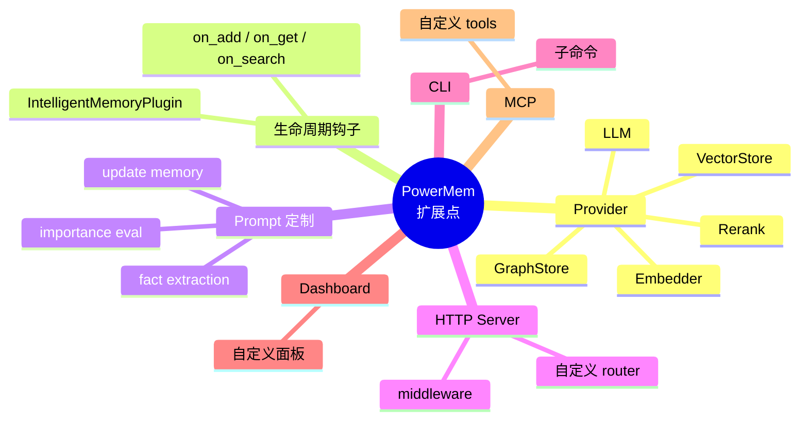

<!--
读者定位:
  🛠 开发者 (主) — 想知道"我想加 X, 要碰哪些文件"
-->

# 扩展点全景

> **读者定位**: 🛠 开发者 (主)
>
> 本章是"我想扩展 PowerMem, 要碰哪些文件"的总图。每条扩展路径给出最小可运行模板 (≤25 行) 和踩坑提示。

## 你将学到

1. 7 种扩展点的最小改动路径
2. 每条路径的文件清单和代码模板
3. 调试技巧: 启动时打印注册表, 验证 Provider 装载
4. IDE / MCP / CLI 的扩展点
5. 何时该提交 PR 而非本地 hack

---

## 1. 扩展点思维地图



---

## 2. 扩展点 1: 自定义 LLM

**典型场景**: 你要用自己部署的 LLM 服务 (HTTP), 或想给 OpenAI 加一层缓存。

### 2.1 文件清单 (2 文件 + 1 行 import)

```
src/powermem/integrations/llm/config/my_provider.py     (新增, ~15 行)
src/powermem/integrations/llm/my_provider.py            (新增, ~25 行)
src/powermem/integrations/llm/config/__init__.py       (末尾追加 1 行 import)
```

### 2.2 模板

`my_provider.py` (config):

```python
from pydantic import Field
from .base import BaseLLMConfig

class MyProviderConfig(BaseLLMConfig):
    _provider_name = "my_provider"
    _class_path = "powermem.integrations.llm.my_provider.MyProviderLLM"
    api_key: str = Field(default="")
    base_url: str = Field(default="http://localhost:8000/v1")
```

`my_provider.py` (实现):

```python
import httpx
from .base import BaseLLM

class MyProviderLLM(BaseLLM):
    def __init__(self, config: MyProviderConfig):
        self.config = config
        self._client = httpx.Client(base_url=config.base_url, headers={"Authorization": f"Bearer {config.api_key}"})

    def generate_response(self, messages, **kwargs):
        resp = self._client.post("/chat/completions", json={"messages": messages, **kwargs})
        return resp.json()["choices"][0]["message"]["content"]
```

`__init__.py` 末尾:

```python
from .my_provider import MyProviderConfig  # noqa: F401
```

---

## 3. 扩展点 2: 自定义 Embedder

同 LLM, 见 [07-providers §3](./07-providers#3-添加新-provider-的-4-步清单)。

---

## 4. 扩展点 3: 自定义 Rerank

同 LLM, 但基类是 `BaseRerankConfig` (`src/powermem/integrations/rerank/config/base.py`)。工厂是 `RerankFactory`。

模板 (≤25 行):

```python
# config/my_rerank.py
from pydantic import Field
from .base import BaseRerankConfig

class MyRerankConfig(BaseRerankConfig):
    _provider_name = "my_rerank"
    _class_path = "powermem.integrations.rerank.my_rerank.MyRerank"
    api_key: str = ""

# my_rerank.py
from .base import BaseRerank

class MyRerank(BaseRerank):
    def rerank(self, query, documents, top_n=None):
        # 简单示例: 返回原序
        return [{"index": i, "relevance_score": 1.0 - i*0.01, "document": d}
                for i, d in enumerate(documents[:top_n])]
```

---

## 5. 扩展点 4: 自定义 VectorStore

比 LLM 复杂一点, 因为要管 collection / index。

模板 (≤40 行, 简化版):

```python
# src/powermem/storage/my_store.py
from typing import List, Optional, Any
from .base import VectorStoreBase

class MyVectorStore(VectorStoreBase):
    def __init__(self, **kwargs):
        self._client = MyDBClient(kwargs["host"], kwargs["port"])
        self.collection_name = kwargs.get("collection_name", "memories")

    def create_col(self, name, vector_size, distance="cosine"):
        self._client.execute(f"CREATE COLLECTION IF NOT EXISTS {name} (vector FLOAT[{vector_size}])")

    def insert(self, vectors, payloads, ids=None):
        # 1. 生成 Snowflake IDs (如果未提供)
        # 2. 写入存储
        # 3. 返回 IDs
        return [self._gen_id() for _ in payloads]

    def search(self, query, vectors, limit, filters=None):
        # 1. 执行 ANN 检索
        # 2. 包装为统一格式 (id, payload, score)
        return []

    def get(self, memory_id):
        return self._client.get(memory_id)

    def update(self, memory_id, payload, vector=None):
        self._client.update(memory_id, payload, vector)

    def delete(self, memory_id):
        self._client.delete(memory_id)

    def reset(self):
        self._client.drop(self.collection_name)
```

注册:

```python
# src/powermem/storage/config/my_store.py
from .base import BaseVectorStoreConfig

class MyVectorStoreConfig(BaseVectorStoreConfig):
    _provider_name = "my_store"
    _class_path = "powermem.storage.my_store.MyVectorStore"
    host: str = "localhost"
    port: int = 5432

# src/powermem/storage/configs.py 末尾追加
from .my_store import MyVectorStoreConfig  # noqa: F401
```

---

## 6. 扩展点 5: 自定义 Plugin

文件: `src/powermem/intelligence/plugin.py`

`IntelligentMemoryPlugin` 接口很简单, 3 个方法 + `enabled` 属性。

模板 (≤20 行):

```python
from typing import Any, Dict, List, Optional, Tuple
from powermem.intelligence.plugin import IntelligentMemoryPlugin

class TagPlugin(IntelligentMemoryPlugin):
    """给所有新记忆打 'tagged_at' 时间戳的示例 plugin."""

    def on_add(self, *, content, metadata=None):
        if not self.enabled:
            return {}
        from datetime import datetime
        return {"tagged_at": datetime.now().isoformat()}

    def on_get(self, memory):
        return None, False  # 不改

    def on_search(self, results):
        return [], []  # 不改

# 启用: config["intelligent_memory"]["plugin"] = "tag_plugin"
# Memory.__init__ 当前只识别 "ebbinghaus", 自定义 plugin 需要在 memory.py:766 改一行
```

⚠️ **重要**: `Memory.__init__` (memory.py:766-779) 当前只识别 `"ebbinghaus"`。如果你想启用自定义 plugin, 需要改一行:

```python
if plugin_type == "ebbinghaus":
    self._intelligence_plugin = EbbinghausIntelligencePlugin(merged_cfg)
elif plugin_type == "tag_plugin":
    self._intelligence_plugin = TagPlugin(merged_cfg)
```

或者**不修改 Memory**, 而是在自己的应用层手动注入:

```python
memory._intelligence_plugin = TagPlugin({"enabled": True})
```

---

## 7. 扩展点 6: 自定义 Prompt

**无需改源码**, 全部通过环境变量:

```bash
POWERMEM_CUSTOM_FACT_EXTRACTION_PROMPT="你的 fact 抽取 prompt..."
POWERMEM_CUSTOM_UPDATE_MEMORY_PROMPT="你的 update prompt..."
POWERMEM_CUSTOM_IMPORTANCE_EVALUATION_PROMPT="你的 importance prompt..."
POWERMEM_CUSTOM_QUERY_REWRITE_PROMPT="你的 query rewrite prompt..."
```

详见 [docs/guides/0004-custom_prompts_usage](../guides/0004-custom_prompts_usage)。

### 7.1 编程方式

`Memory` 实例支持覆盖属性:

```python
memory.custom_fact_extraction_prompt = "你的 prompt..."
memory.custom_update_memory_prompt = "..."
memory.custom_importance_evaluation_prompt = "..."
```

这些属性会被 `_intelligent_add` 内部检查并使用 (memory.py:1034-1036)。

---

## 8. 扩展点 7: 自定义 HTTP 路由

文件: `src/server/api/v1/` (FastAPI routers)

新增一个 router:

```python
# src/server/api/v1/my_router.py
from fastapi import APIRouter, Depends
from ...models.response import APIResponse

router = APIRouter(prefix="/my", tags=["my"])

@router.get("/hello")
async def hello():
    return APIResponse(success=True, data={"message": "hi"})
```

注册到 `src/server/api/v1/__init__.py`:

```python
from .my_router import router as my_router
api_router.include_router(my_router)
```

---

## 9. 扩展点 8: 自定义 CLI 子命令

文件: `src/powermem/cli/commands/` (click commands)

模板 (≤25 行):

```python
# src/powermem/cli/commands/my_command.py
import click
from ..main import cli
from ...context import CLIContext

@cli.command()
@click.option("--name", required=True)
def greet(name):
    """Say hello."""
    ctx = CLIContext()
    mem = ctx.memory
    mem.add(f"我刚见了 {name}", user_id="cli_user")
    click.echo(f"Hello, {name}!")
```

`src/powermem/cli/main.py` 中 `cli.add_command(greet)` 自动注册 (click 装饰器), 但需 import 这个文件。

---

## 10. 扩展点 9: 自定义 MCP tool

文件: `src/powermem/mcp/server.py`

模板 (≤20 行):

```python
from powermem.mcp.server import mcp, get_memory

@mcp.tool(description="Print the last memory's first 100 chars.")
def peek_latest(user_id: str) -> str:
    memory = get_memory()
    memories = memory.get_all(user_id=user_id, limit=1)
    if not memories:
        return "no memories"
    return memories[0].get("memory", "")[:100]
```

启动方式不变: `powermem-mcp streamable-http`。

---

## 11. 扩展点 10: 自定义 Dashboard 面板

文件: `dashboard/src/` (React + Vite)

新增路由 (`dashboard/src/routes/my-panel.tsx`), 在 `dashboard/src/__root.tsx` 注册, 用 TanStack Query 调 HTTP API。

详见 [docs/guides/0013-dashboard](../guides/0013-dashboard)。

---

## 12. 调试技巧: 启动时打印注册表

写一个调试脚本:

```python
# debug_registration.py
from powermem.integrations.llm.config.base import BaseLLMConfig
from powermem.integrations.embeddings.config.base import BaseEmbedderConfig
from powermem.storage.config.base import BaseVectorStoreConfig

# 触发所有 Provider config 的 import
import powermem.integrations.llm.config  # noqa
import powermem.integrations.embeddings.config  # noqa
import powermem.storage.config  # noqa

print("LLM providers:", list(BaseLLMConfig._class_paths.keys()))
print("Embedder providers:", list(BaseEmbedderConfig._class_paths.keys()))
print("VectorStore providers:", list(BaseVectorStoreConfig._class_paths.keys()))

# 测试你的 Provider 是否注册成功
print("My provider LLM class:", BaseLLMConfig.get_provider_class_path("my_provider"))
```

如果输出 `None`, 说明漏了 import。

---

## 13. 何时该提交 PR

PowerMem 仓库 ([github.com/oceanbase/powermem](https://github.com/oceanbase/powermem)) 欢迎贡献。**建议提交 PR 的场景**:

- 新 LLM / Embedder / Rerank Provider (通用价值高)
- 新 VectorStore 后端 (如 ElasticSearch / Weaviate)
- 新的 Plugin 示例 (除 Ebbinghaus 外)
- Bug fix / 性能优化 / 测试覆盖
- 文档 / 示例 notebook

**建议保持本地的场景**:

- 内部业务的特殊定制 (用 fork 或继承方式)
- 实验性功能 (待稳定后再提)
- 一次性数据迁移脚本

---

## 延伸阅读

- 添加 Provider 详细指南: [docs/development/overview](../development/overview)
- 自定义集成示例: [docs/examples/scenario_5_custom_integration](../examples/scenario_5_custom_integration)
- 自定义 Prompt: [docs/guides/0004-custom_prompts_usage](../guides/0004-custom_prompts_usage)
- 集成总览: [docs/guides/0009-integrations](../guides/0009-integrations)
- Plugin 注册逻辑: [07-providers](./07-providers)
- Dashboard 开发: [docs/guides/0013-dashboard](../guides/0013-dashboard)

---

## 下章预告

下一章 [99-api-quickref](./99-api-quickref) 是整本 handbook 的最后一章 — Python SDK / HTTP API / MCP / CLI 四种入口的速查表。