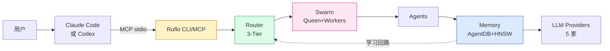

# 第 01 章 · 认识 Ruflo：Agent = Model + Harness

> 📘 **摘要**：本章回答三个问题——ruflo 是什么、为什么需要它、与 LangGraph/AutoGen/CrewAI 等「agent 框架」有何本质差异。读完你能用 30 秒向同事解释 ruflo 的核心价值。
>
> 🏷️ **读者画像**：A / B / C / D / E / F（全员必读）
> 🕐 **预估耗时**：15 分钟
> ✅ **LAST_VERIFIED_AGAINST**：`26c35b59` (v3.32.9)

---

## 1. 背景与动机

### 1.1 一个被反复问的问题：「Claude Code 不是已经够强了吗？」

是的，Claude Code（以及 OpenAI Codex、Cursor、Continue.dev）已经能在 IDE 里写出可工作的代码。但当任务跨越**多文件、多 agent、多会话、跨机器**，单兵作战的模型就开始暴露三个短板：

| 短板 | 表现 | 后果 |
|------|------|------|
| **没有共享内存** | 每个 session 是孤岛 | 用户必须反复交代上下文 |
| **没有协同机制** | 一个 LLM 进程做所有事 | 长任务断点多、token 暴涨 |
| **没有持续学习** | 同样的错误犯两次 | 没有"上次成功是怎么做的"记忆 |

ruflo 的全部设计，都围绕解决这三个短板展开。

### 1.2 名字由来

> *Ruflo* = **Ru**（取自 rUv，作者 rUvnet）+ **flo**（flow state 的简称，源自作者凌晨三点还在写代码的状态）
>
> 原名 **Claude Flow**，2026 年 v3.5 正式更名为 Ruflo。三发行包（`@claude-flow/cli` + `claude-flow` + `ruflo`）始终同步发布。

---

## 2. 核心概念

### 2.1 一句话定位

> **Ruflo is an agent meta-harness for Claude Code and Codex.**
>
> *Agent = Model + Harness.* 模型负责「写」，harness 负责「给工具、给内存、给循环、给沙箱、给控制」。**Ruflo 就是那个 harness**。

它**不替代** Claude Code 或 Codex，而是给它们加上「神经系统」——一个执行层，把孤立的代码助手升级为**可协调、可记忆、可学习、可联邦**的 agent 系统。

### 2.2 五大核心理念

#### ① Agent = Model + Harness

ruflo 不重新训练模型。它包装已有的 LLM，让它们能：

- 调用 **314+ MCP 工具**（memory / swarm / hooks / agent_spawn / task / intelligence 等命名空间）
- 协作（**Swarm + Hive Mind + 5 种共识算法**）
- 持久化（**HNSW 向量内存 + 8 种记忆类型**）
- 学习（**SONA 自学习 + ReasoningBank 4 步流水线**）

#### ② Self-Learning Loop

```
Execute → Learn (RETRIEVE → JUDGE → DISTILL → CONSOLIDATE) → Better Routing → Execute
```

成功模式自动存入 **ReasoningBank**；下次类似任务，路由层会优先选择走通过的路径。这是 ruflo 与「无状态 agent 框架」最本质的区别。

#### ③ Anti-Drift Defaults（防漂移默认）

新手最常犯的错：spawn 50 个 agent、跑 Byzantine 共识、不写 checkpoint —— 几天后任务完全失控。ruflo 的出厂默认是：

> **小团队（6–8 agents）+ hierarchical 拓扑 + specialized 策略 + raft 共识 + 频繁 checkpoint + 共享内存命名空间**

这套「**最不漂移**」的默认，让 80% 的团队无需调参即可稳定运行。

#### ④ Zero-Trust Federation

跨机器 / 跨组织的 agent 协作，默认**零信任**：

- **mTLS** 双向证书认证
- **ed25519** 身份签名
- **5 级信任梯**：UNTRUSTED → VERIFIED → ATTESTED → TRUSTED → PRIVILEGED
- **PII 自动剥离**（14 类检测）
- **预算熔断器**（`maxHops=8`、`maxTokens=50k`）防递归雪崩

信任**随行为升级**——一个陌生 agent 干了 100 件正确的事，会自动升到 TRUSTED。

#### ⑤ Truth by Witness

你安装的 ruflo 字节是否被官方签名过？`ruflo verify` 通过 Ed25519 签名证明本地字节与签名清单一致——**「所见即所信」**，无需中心服务器。

---

## 3. 架构原理（一图概览）



**5 层架构**（详细见 ch04）：

1. **User** —— 你
2. **Claude Code / Codex** —— LLM 编辑器
3. **Ruflo CLI / MCP** —— 入口（314+ 工具）
4. **Router** —— 3-Tier 智能路由（WASM → Haiku → Sonnet）
5. **Swarm** —— 多 agent 协同
6. **Memory** —— AgentDB + HNSW + SONA
7. **LLM Providers** —— Anthropic / OpenAI / Gemini / Cohere / Ollama

---

## 4. Hands-on：本章无 hands-on

本章是**纯阅读**，目的是建立全局心智模型。下章开始动手。

---

## 5. 沙箱验证

```bash
### Verify H1.0 — 概念检查（5 道判断题）
```

打开 `sandbox/asserts/ch1.sh`（暂为空，可选）：

```bash
# 自检 5 题（不强制，纯思考）
echo "1. ruflo 是替代 Claude Code 的新模型吗？"
echo "2. SONA 是哪种类型的子系统？"
echo "3. Anti-Drift 默认是 spawn 50 agents 还是 6-8？"
echo "4. Federation 的默认信任策略是什么？"
echo "5. Truth by Witness 用哪种签名算法？"
# 答案见 chapters/17-terminology-glossary.md
```

---

## 6. 小结

### 关键要点

- ruflo = **agent meta-harness**，给 Claude Code/Codex 加**工具 + 内存 + 循环 + 沙箱 + 控制**
- 五大理念：**Model + Harness** / **Self-Learning** / **Anti-Drift** / **Zero-Trust Federation** / **Truth by Witness**
- 7 层架构：User → Claude/Codex → Ruflo CLI/MCP → Router → Swarm → Memory → LLM
- 与「agent 框架」（LangGraph / AutoGen / CrewAI）的差异：**ruflo 是执行层，不是新的 agent 抽象**

### 术语锚点

- Swarm → ch06
- Hive Mind / Queen → ch06
- MCP Server → ch04
- AgentDB / HNSW → ch07
- SONA / ReasoningBank → ch07
- Anti-Drift → ch06
- Zero-Trust Federation → ch09
- Trust Ladder → ch09
- Truth by Witness → ch10

### 下一步

👉 进入 [第 02 章 安装与初始化](./02-install-and-init.md)，把 ruflo 跑起来。

### 参考链接

- 主项目 README：<https://github.com/ruvnet/ruflo#readme>
- 哲学章节源码：<https://github.com/ruvnet/ruflo/blob/main/README.md#L22-L30>
- SKILL.md 入门：<https://github.com/ruvnet/ruflo/blob/main/SKILL.md>
- USERGUIDE.md 总览：<https://github.com/ruvnet/ruflo/blob/main/docs/USERGUIDE.md>