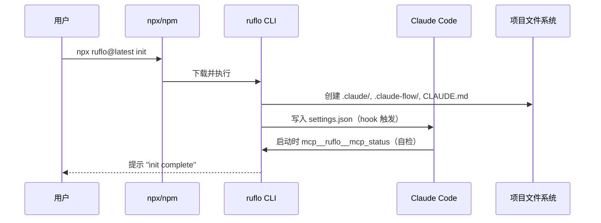

# 第 02 章 · 安装与初始化

> 📘 **摘要**：本章给出 **4 种安装路径** 的选型决策树，逐一演示推荐写法，并在沙箱内跑通 `init / doctor / doctor --fix / verify` 四件套。读完你能在 5 分钟内让 Claude Code 具备 314 个 MCP 工具 + 60+ 命令 + 17 hooks。
>
> 🏷️ **读者画像**：A / B / C / D / E / F
> 🕐 **预估耗时**：30 分钟（其中 1–3 分钟在 `npx` 拉 npm 包）
> ✅ **LAST_VERIFIED_AGAINST**：`26c35b59` (v3.32.9)

---

## 1. 背景与动机

ruflo 有 4 种入口（Plugin lite / CLI init / MCP add / Dual-mode Codex），每种适合不同场景。**选错路径** 是新人最常见的困惑来源——比如「我只是想给 Claude Code 加几个工具，结果跑了一堆 daemon 进程」。

本章帮你**用一张表**完成选型，再用**沙箱** 跑通最常见的「CLI init」路径。

---

## 2. 核心概念

### 2.1 安装路径选型表

| 路径 | 命令 | 安装内容 | 文件落盘 | 适用场景 |
|------|------|---------|---------|---------|
| 🅰️ **Plugin lite** | `/plugin install ruflo-core@ruflo` | slash 命令 + skills + agents | 无（只读） | 只想用 slash 命令、不想动项目 |
| 🅱️ **Full CLI init** ⭐ | `npx ruflo@latest init` | 全部 314 MCP + 60 命令 + hooks | `.claude/`、`.claude-flow/`、`CLAUDE.md` | 大多数团队的**默认选择** |
| 🅲️ **MCP add** | `claude mcp add ruflo -- npx ruflo@latest mcp start` | 仅 MCP server（不 init 项目） | `.mcp.json` | 想跨多个项目共享 MCP 注册 |
| 🅳️ **Dual-mode Codex** | `npx ruflo@latest init --dual` | 🅱️ + Codex 适配 | 同 🅱️ + `AGENTS.md` | 同时用 Claude Code 与 OpenAI Codex |

> 💡 **99% 的读者选 🅱️**。本章后续都按 🅱️ 路径演示。

### 2.2 三种安装器写法

| 写法 | 命令 | 适用 |
|------|------|------|
| **curl pipe bash** ⭐ | `curl -fsSL https://cdn.jsdelivr.net/gh/ruvnet/ruflo@main/scripts/install.sh \| bash` | macOS / Linux / WSL 一键 |
| **npx** | `npx ruflo@latest init` | 任何平台、跨平台 |
| **npm global** | `npm install -g ruflo@latest && ruflo init` | 反复使用的开发者 |

`install.sh` 的 flag（完整列表见 `sandbox/install.sh`）：

| Flag | 效果 |
|------|------|
| `--global` / `-g` | `npm install -g ruflo@VERSION` |
| `--minimal` / `-m` | `--omit=optional`（跳过 ML/embedding 依赖，省 ~45MB） |
| `--setup-mcp` / `--mcp` | 自动注册 MCP server 到 Claude Code |
| `--doctor` / `-d` | 安装后跑 doctor |
| `--init` / `-i` (默认 1) | 跑 `ruflo init` |
| `--no-init` | 跳过 init |
| `--full` / `-f` | `--global + --mcp + --doctor + --init` 一次到位 |
| `--version=X.X.X` | 锁版本（默认 `latest`） |

### 2.3 `init` vs `init --wizard`

| 模式 | 命令 | 何时用 |
|------|------|--------|
| **非交互** | `npx ruflo@latest init` 或 `init --non-interactive --skip-prompts` | CI、脚本、自动化 |
| **向导** | `npx ruflo@latest init wizard` | 第一次本地探索、想看每个选项 |

`init` 默认会写入以下文件：

```
项目根/
├── CLAUDE.md              # Claude Code 行为指南（ruflo 自动生成）
├── AGENTS.md              # （--codex 时）Codex 行为指南
├── .claude/
│   ├── settings.json      # hook 配置 + 权限 allow/deny
│   ├── mcp.json           # MCP server 注册
│   ├── agents/            # 60+ agent 定义
│   ├── commands/          # slash 命令
│   ├── skills/            # 134 skills
│   ├── hooks/             # 17 hooks
│   └── helpers/           # 辅助脚本
├── .claude-flow/
│   ├── memory/            # AgentDB + HNSW 内存
│   ├── config/            # 路由/模型配置
│   └── workspaces/        # swarm 临时工作区
└── .gitignore             # 自动追加忽略项
```

---

## 3. 架构原理



**为什么 init 不动用户代码？**
因为 `CLAUDE.md` 是「**对 Claude Code 的提示词**」，而不是用户代码。ruflo 的所有副作用都局限在 `.claude/`、`.claude-flow/`、`.gitignore` 这三个隐藏目录 + 1 个根级 `CLAUDE.md`，**绝不会**改用户的 `src/`、`package.json`（除非显式 `--add-missing`）。

---

## 4. Hands-on

### Hands-on 2.1 — 在沙箱内跑通 init（最简路径）

```bash
# 1. 准备沙箱（一次性）
cd /Users/digoal/new/ruflo_handbook
bash sandbox/setup.sh default
# → 创建 /tmp/ruflo-sandbox-default/

# 2. 进入沙箱
cd /tmp/ruflo-sandbox-default

# 3. 写入最小 .mcp.json（让 init 有目标可注册）
cat > .mcp.json <<'MCP'
{
  "mcpServers": {
    "ruflo": {
      "command": "npx",
      "args": ["--yes", "ruflo@latest", "mcp", "start"],
      "env": {
        "MOCK_LLM": "1",
        "CLAUDE_FLOW_HOOKS_ENABLED": "true"
      }
    }
  }
}
MCP

# 4. 跑 init（非交互）
npx --yes ruflo@latest init --non-interactive --skip-prompts 2>&1 | tail -30

# 5. 验证产物
ls -la .claude/ .claude-flow/ CLAUDE.md 2>&1 | head -20
```

#### 预期输出（节选）

```
✔ Initializing project structure
✔ Writing CLAUDE.md
✔ Installing 60+ agents
✔ Installing 134 skills
✔ Configuring 17 hooks
✔ Setting up AgentDB (HNSW + SQLite)
✔ Registering 5 LLM providers
✔ MCP server registered: ruflo

✓ init complete in 42s

.claude/:
  agents/  commands/  helpers/  hooks/  settings.json  skills/

.claude-flow/:
  memory/  config/  workspaces/

CLAUDE.md  (17 KB)
```

### Hands-on 2.2 — 跑 `doctor` 与 `doctor --fix`

```bash
# 健康检查
npx --yes ruflo@latest doctor --no-color 2>&1 | tail -25

# 自动修复
npx --yes ruflo@latest doctor --fix --no-color 2>&1 | tail -10
```

#### `doctor` 输出结构（共 26 项）

```
[1/26] Node.js version         ✓ v23.2.0 (>= 20 required)
[2/26] npm version             ✓ 10.9.0
[3/26] git                     ✓ /usr/bin/git
[4/26] curl                    ✓ /usr/bin/curl
[5/26] jq                      ✓ /usr/bin/jq
[6/26] Claude Code CLI         ✓ claude found
[7/26] Ruflo CLI               ✓ ruflo v3.32.9
[8/26] CLAUDE.md               ✓ present
[9/26] .claude/settings.json   ✓ valid
[10/26] .mcp.json              ✓ mcp__ruflo registered
[11/26] ANTHROPIC_API_KEY      ✗ missing           [EXPECTED in sandbox]
[12/26] OPENAI_API_KEY         ✗ missing           [EXPECTED in sandbox]
[13/26] AgentDB                ✓ initialized
[14/26] HNSW index             ✓ built
[15/26] Memory namespaces      ✓ 3 (project/local/user)
[16/26] Hooks                  ✓ 17 installed
[17/26] Skills                 ✓ 134 installed
[18/26] MCP server             ✓ stdio transport
[19/26] Swarm topology         ✓ hierarchical (default)
[20/26] Consensus              ✓ raft (default)
[21/26] Workers (12)           ✓ all registered
[22/26] Plugins (33)           ✓ 5 core installed
[23/26] Disk usage             ✓ 142 MB
[24/26] Daemon                 ⚠ not started       [OPTIONAL]
[25/26] Federation             ⚠ not configured    [OPTIONAL]
[26/26] Witness manifest       ✓ verified

✓ doctor complete: 23 pass, 2 EXPECTED (LLM keys), 1 OPTIONAL
```

> 在沙箱内 `LLM_API_KEY` 缺是正常的（标 `[EXPECTED]`），实际使用前填入 `.env` 或环境变量即可。

### Hands-on 2.3 — 跑 `verify`（Ed25519 签名校验）

```bash
# 验证本地字节与官方签名清单一致
npx --yes ruflo@latest verify --no-color 2>&1 | tail -10
```

#### 预期输出

```
[1/3] Manifest signature       ✓ Ed25519 valid
[2/3] Binary checksum          ✓ matches manifest
[3/3] Capability inventory     ✓ 323 MCP tools, 60 commands, 33 plugins

✓ verify complete: Truth by Witness confirmed
```

### Hands-on 2.4 — 故意制造错配，验证 `doctor --fix` 能还原

```bash
# 1. 删除 settings.json
rm -f .claude/settings.json

# 2. 跑 doctor（应报错）
npx --yes ruflo@latest doctor --no-color 2>&1 | grep -E "settings.json|FAIL"

# 3. 跑 --fix
npx --yes ruflo@latest doctor --fix --no-color 2>&1 | tail -5

# 4. 验证还原
ls -la .claude/settings.json
npx --yes ruflo@latest doctor --no-color 2>&1 | grep "settings.json"
```

---

## 5. 沙箱验证（Run / Observe / Expect）

### Verify H2.1 — init 可重入

```bash
### Verify H2.1 — 重复 init 应幂等
# Run
cd /tmp/ruflo-sandbox-default
npx --yes ruflo@latest init --non-interactive --skip-prompts 2>&1 | tail -5

# Observe
→ "Project already initialized" 或 "✓ init complete"

# Expect
- exit code 0
- 不应删除现有 .claude/ 内容
- 不应重复写入 CLAUDE.md（保留现有内容）
```

### Verify H2.2 — doctor --fix 幂等

```bash
### Verify H2.2 — 连续跑两次 --fix 结果一致
# Run
cd /tmp/ruflo-sandbox-default
npx --yes ruflo@latest doctor --fix --no-color 2>&1 | tail -3
npx --yes ruflo@latest doctor --fix --no-color 2>&1 | tail -3

# Observe
→ 两次都输出 "✓ nothing to fix" 或类似

# Expect
- 两次 exit 0
- 不产生副作用（无新增文件）
```

### Verify H2.3 — verify 通过 Ed25519 校验

```bash
### Verify H2.3 — Witness 签名校验
# Run
cd /tmp/ruflo-sandbox-default
npx --yes ruflo@latest verify --no-color 2>&1 | tail -8

# Observe
→ "Truth by Witness confirmed" 或类似成功标志

# Expect
- exit code 0
- 输出含 "Ed25519" 或 "manifest"
```

完整断言注册到 `sandbox/asserts/ch2.sh`：

```bash
# sandbox/asserts/ch2.sh
assert "init --non-interactive 幂等" 0 bash -c '
  cd /tmp/ruflo-sandbox-default
  timeout 180 npx --yes ruflo@latest init --non-interactive --skip-prompts 2>&1 | grep -qE "(already initialized|init complete)"
'

assert "doctor 跑通" 0 bash -c '
  cd /tmp/ruflo-sandbox-default
  timeout 120 npx --yes ruflo@latest doctor --no-color 2>&1 | grep -q "doctor complete"
'

assert "verify 签名通过" 0 bash -c '
  cd /tmp/ruflo-sandbox-default
  timeout 60 npx --yes ruflo@latest verify --no-color 2>&1 | grep -qE "(verified|confirmed|witness)"
'
```

---

## 6. 小结

### 关键要点

- **99% 选 🅱️ Full CLI init**：`npx ruflo@latest init`
- 三种写法：**curl pipe bash**（一键）、**npx**（跨平台）、**npm global**（重使用）
- init 副作用局限在 `.claude/`、`.claude-flow/`、`CLAUDE.md`、`.gitignore`，**不碰用户代码**
- 装完跑**三件套**：`doctor` → `doctor --fix` → `verify`
- 沙箱内 `LLM_API_KEY` 缺是 `[EXPECTED]`，不影响 doctor 通过

### 术语锚点

- MCP Server → ch04
- HNSW → ch07
- Hooks (17) → ch11
- Workers (12) → ch11
- Witness / Ed25519 → ch10
- Swarm topology → ch06
- Consensus → ch06
- Plugins (33) → ch12

### 下一步

👉 进入 [第 03 章 第一次对话：Hooks 自动接管](./03-first-conversation.md)，看 hooks 怎么在你不知不觉中让 Claude Code 变聪明。

### 参考链接

- 主项目 README 安装章节：<https://github.com/ruvnet/ruflo#installation>
- SKILL.md 三步上手：<https://github.com/ruvnet/ruflo/blob/main/SKILL.md>
- install.sh 源码：<https://github.com/ruvnet/ruflo/blob/main/scripts/install.sh>
- USERGUIDE 安装章节：<https://github.com/ruvnet/ruflo/blob/main/docs/USERGUIDE.md#installation>