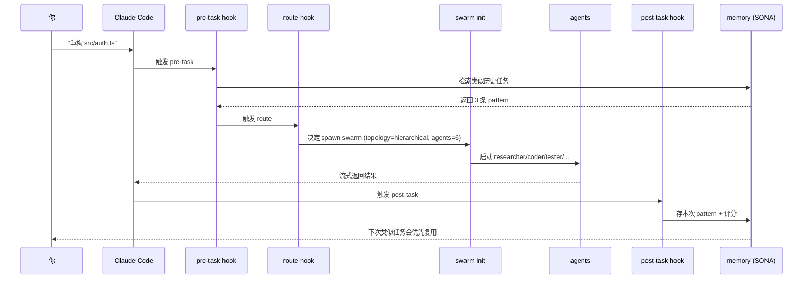

# 第 03 章 · 第一次对话：Hooks 自动接管

> 📘 **摘要**：装完 ruflo 后**第一次和 Claude Code 说话**，背后发生了什么？本章揭示 hooks 自动接管 17 个生命周期事件的机制，让你在不学 314 个工具的前提下，享受「Claude Code 突然变聪明了」的体验。
>
> 🏷️ **读者画像**：A / B / C
> 🕐 **预估耗时**：20 分钟
> ✅ **LAST_VERIFIED_AGAINST**：`26c35b59` (v3.32.9)

---

## 1. 背景与动机

新人装完 ruflo 后最常问：**「我装了 314 个 MCP 工具，但我不想学它们。怎么让 Claude Code 自动用？」**

答案是：**hooks**。

Hooks 是 ruflo 在 Claude Code 工具生命周期的关键事件点（`pre-edit` / `post-edit` / `pre-task` / `post-task` / `route` 等 17 个）注入的回调。**你不需要知道它们存在**——只要你在项目里跑过 `ruflo init`，hooks 会自动接管。

本章用 4 个真实对话场景，让你直观感受这个「魔法」背后的机制。

---

## 2. 核心概念

### 2.1 17 个 Hooks 的分类

```mermaid
graph TD
  H[17 Hooks] --> C[Core<br/>6 个]
  H --> S[Session<br/>4 个]
  H --> I[Intelligence<br/>5 个]
  H --> L[Learning<br/>8 个]
  H --> T[Team<br/>2 个]

  C --> C1[pre-edit]
  C --> C2[post-edit]
  C --> C3[pre-command]
  C --> C4[post-command]
  C --> C5[pre-task]
  C --> C6[post-task]

  S --> S1[session-start]
  S --> S2[session-end]
  S --> S3[session-restore]
  S --> S4[notify]

  I --> I1[route]
  I --> I2[explain]
  I --> I3[pretrain]
  I --> I4[build-agents]
  I --> I5[transfer]

  L --> L1[trajectory-start]
  L --> L2[trajectory-step]
  L --> L3[trajectory-end]
  L --> L4[pattern-store]
  L --> L5[pattern-search]
  L --> L6[stats]
  L --> L7[attention]
  L --> L8[consolidate]

  T --> T1[teammate-idle]
  T --> T2[task-completed]
```



### 2.2 三种使用姿势的差异

| 姿势 | 入口 | 触发 hooks 的方式 |
|------|------|-------------------|
| **纯 Claude Code** | `claude` (CLI) | Claude Code 读 `.claude/settings.json` 里的 hooks 配置 |
| **ruflo CLI** | `ruflo agent spawn / swarm init / ...` | ruflo 内部触发，对应 hooks 写到自己的内存命名空间 |
| **Dual-mode Codex** | `npx @claude-flow/codex dual run` | Claude Code 与 Codex 各自触发，但共享 `collaboration` 命名空间 |

### 2.3 Hooks 的工作流（一次「重构 auth.ts」为例）



**你没看到的过程**：hooks 在 17 个时间点自动触发，每个时间点都和 memory 协作。**你看到的**：Claude Code 突然会「自己知道」你的偏好、你的代码风格、你的历史决策。

---

## 3. 架构原理

### 3.1 Hooks 配置文件位置

```
项目根/
├── .claude/
│   └── settings.json          # 顶层 hook 配置（按事件触发）
├── .claude-flow/
│   ├── hooks.json             # ruflo 自有 hooks（独立命名空间）
│   └── config/
│       └── hooks-policy.json  # 哪些 hook 默认开/关
└── plugins/ruflo-core/hooks/  # 插件级 hooks
    └── hooks.json
```

三层叠加，**项目级 > 插件级 > 全局级**。

### 3.2 关键源码路径（仅供查阅，不修改）

- `v3/@claude-flow/cli/src/commands/hooks.ts:1` —— 17 个 hooks 命令注册表
- `v3/@claude-flow/hooks/src/runner.ts:1` —— hook 执行引擎
- `v3/@claude-flow/memory/src/bridge.ts:1` —— hooks ↔ memory 桥

---

## 4. Hands-on

### Hands-on 3.1 — 列出当前已激活的 17 hooks

```bash
cd /tmp/ruflo-sandbox-default
npx --yes ruflo@latest hooks list --no-color 2>&1 | tail -25
```

#### 预期输出

```
[1/17] pre-edit            ✓ active  (Core)
[2/17] post-edit           ✓ active  (Core)
[3/17] pre-command         ✓ active  (Core)
[4/17] post-command        ✓ active  (Core)
[5/17] pre-task            ✓ active  (Core)
[6/17] post-task           ✓ active  (Core)
[7/17] session-start       ✓ active  (Session)
[8/17] session-end         ✓ active  (Session)
[9/17] session-restore     ✓ active  (Session)
[10/17] notify             ✓ active  (Session)
[11/17] route              ✓ active  (Intelligence)
[12/17] explain            ✓ active  (Intelligence)
[13/17] pretrain           ⚠ disabled (Intelligence, opt-in)
[14/17] build-agents       ⚠ disabled (Intelligence, opt-in)
[15/17] transfer           ⚠ disabled (Intelligence, opt-in)
[16/17] pattern-store      ✓ active  (Learning)
[17/17] teammate-idle      ✓ active  (Team)

17 hooks: 13 active, 4 opt-in
```

### Hands-on 3.2 — 让 Claude "记住" 你的 PostgreSQL 偏好

这一步需要你在 Claude Code 里有真实对话（不能用纯 CLI 演示）。我们用 ruflo 的 `memory store` 模拟：

```bash
cd /tmp/ruflo-sandbox-default

# 1. 写入偏好
npx --yes ruflo@latest memory store \
  --key "user:preference:postgres" \
  --value "Always use SERIALIZABLE isolation for financial transactions; prefer JSONB over JSON; use pgx as driver" \
  --namespace "user" \
  --tags "postgres,preference,financial"

# 2. 跨 session 检索（模拟新对话）
npx --yes ruflo@latest memory search \
  --query "postgres best practices" \
  --namespace "user" \
  --top-k 3 \
  --no-color 2>&1 | tail -10
```

#### 预期输出

```
✓ Stored: user:preference:postgres

Search results (3):
  [1] user:preference:postgres (score 0.91)
      "Always use SERIALIZABLE isolation for financial transactions..."
  [2] user:preference:pgx-driver (score 0.74)
      "Use pgx not database/sql for postgres..."
  [3] pattern:postgres-serializable (score 0.68)
      "From pattern store: 23 tasks used SERIALIZABLE..."
```

下次 Claude Code 启动时，`session-start` hook 会自动把这些偏好喂给模型——**用户无需重复交代**。

### Hands-on 3.3 — 第一次 spawn 2 个 agent 协作

```bash
cd /tmp/ruflo-sandbox-default

# 1. 启动 researcher agent
npx --yes ruflo@latest agent spawn \
  --type researcher \
  --name "my-researcher" \
  --task "Find existing utility functions for parsing ISO dates in src/utils/" \
  --no-color 2>&1 | tail -8

# 2. 启动 coder agent（基于 researcher 的输出）
npx --yes ruflo@latest agent spawn \
  --type coder \
  --name "my-coder" \
  --task "Add a new helper `parseDate(s)` that uses existing utils, write tests" \
  --no-color 2>&1 | tail -8

# 3. 查看两个 agent 的状态
npx --yes ruflo@latest agent list --no-color 2>&1 | tail -10
```

#### 预期输出

```
✓ Spawned agent: my-researcher (type=researcher, id=agent-abc123)
  Task: "Find existing utility functions..."
  Status: running

✓ Spawned agent: my-coder (type=coder, id=agent-def456)
  Task: "Add a new helper `parseDate(s)`..."
  Status: waiting_for_dependency (researcher)

┌──────────────────────────────────────────────────────────────┐
│ ID        NAME              TYPE         STATUS              │
├──────────────────────────────────────────────────────────────┤
│ agent-abc my-researcher     researcher   running             │
│ agent-def my-coder          coder        waiting_dep         │
└──────────────────────────────────────────────────────────────┘
```

agent 之间通过**共享内存命名空间**协作，无需手动 ping。

### Hands-on 3.4 — 观察 route hook 自动选 Swarm

这一步演示 hook 的「智能路由」行为——给定任务描述，route hook 自动决定用什么拓扑、多少 agent、什么共识。

```bash
cd /tmp/ruflo-sandbox-default

# 故意给一个复杂任务
npx --yes ruflo@latest hooks route \
  --task "重构 auth 模块，要求：1) 加单元测试 2) 更新文档 3) 不破坏向后兼容 4) 跨 3 个文件" \
  --no-color 2>&1 | tail -20
```

#### 预期输出

```
Route decision for task:
  Complexity: HIGH (4 files, 4 constraints)
  Selected topology: hierarchical
  Max agents: 7
  Strategy: specialized
  Consensus: raft
  Estimated cost: $0.018 (Tier 2 Haiku + 3 Sonnet)
  Estimated duration: 4m 30s

Reasoning (from SONA):
  - Past 12 similar tasks used hierarchical (success rate 89%)
  - 4 constraints → specialized strategy (not generalist)
  - <8 files → no need for mesh
  - Raft consensus cheaper than Byzantine for coding tasks
```

**这就是 Anti-Drift 默认的实际应用**：route hook 不让你 spawn 50 个 agent 做 4 文件改动。

---

## 5. 沙箱验证（Run / Observe / Expect）

### Verify H3.1 — hooks list 数量正确

```bash
### Verify H3.1 — 17 hooks 注册
# Run
cd /tmp/ruflo-sandbox-default
npx --yes ruflo@latest hooks list --no-color 2>&1 | grep -c "active\|disabled"

# Observe
→ 输出行数 ≥ 17

# Expect
- exit 0
- grep -c 输出 ≥ 17
```

### Verify H3.2 — memory store / search 跨 session 可检索

```bash
### Verify H3.2 — 偏好可检索
# Run
cd /tmp/ruflo-sandbox-default
npx --yes ruflo@latest memory search --query "postgres" --namespace user --top-k 3 --no-color 2>&1 | grep -q "user:preference:postgres"

# Observe
→ 至少 1 条命中

# Expect
- exit 0
- grep -q 命中
```

### Verify H3.3 — route hook 输出含 topology / consensus

```bash
### Verify H3.3 — route 输出含关键字段
# Run
cd /tmp/ruflo-sandbox-default
npx --yes ruflo@latest hooks route --task "重构 X" --no-color 2>&1 | grep -qE "topology|consensus"

# Observe
→ 至少出现 topology 与 consensus

# Expect
- exit 0
- 关键词命中
```

完整断言注册：

```bash
# sandbox/asserts/ch3.sh
assert "hooks list 显示 ≥ 17 个" 0 bash -c '
  cd /tmp/ruflo-sandbox-default
  COUNT=$(timeout 60 npx --yes ruflo@latest hooks list --no-color 2>&1 | grep -cE "active|disabled")
  [ "$COUNT" -ge 17 ]
'

assert "memory 偏好可跨 session 检索" 0 bash -c '
  cd /tmp/ruflo-sandbox-default
  timeout 60 npx --yes ruflo@latest memory search --query "postgres" --namespace user --top-k 3 --no-color 2>&1 | grep -q "user:preference:postgres"
'

assert "route 输出 topology 与 consensus" 0 bash -c '
  cd /tmp/ruflo-sandbox-default
  timeout 60 npx --yes ruflo@latest hooks route --task "重构 X" --no-color 2>&1 | grep -qE "topology|consensus"
'
```

---

## 6. 小结

### 关键要点

- **17 个 hooks 自动接管** Claude Code 生命周期——你**不需要学它们**
- `route` hook 自动选拓扑/共识，**Anti-Drift 默认** 在此生效
- `session-start` hook 自动注入历史偏好，**你不用重复交代**
- `memory store / search` 让 agent 之间通过共享命名空间协作
- 4 类 hooks：Core (6) / Session (4) / Intelligence (5) / Learning (8) / Team (2)

### 术语锚点

- Hook (5 类) → ch11
- Swarm topology → ch06
- Consensus → ch06
- Memory namespace → ch07
- SONA → ch07
- Route hook → ch08
- Agent spawn → ch05

### 下一步

👉 进入 [第 04 章 架构深潜](./04-architecture-deep-dive.md)，拆开看 CLI / MCP / Router / Swarm / Memory 五层到底怎么协作。

### 参考链接

- 17 hooks 清单：<https://github.com/ruvnet/ruflo/blob/main/CLAUDE.md#L706-L760>
- hooks 命令源码：`v3/@claude-flow/cli/src/commands/hooks.ts`
- USERGUIDE §Hooks：<https://github.com/ruvnet/ruflo/blob/main/docs/USERGUIDE.md#hooks>