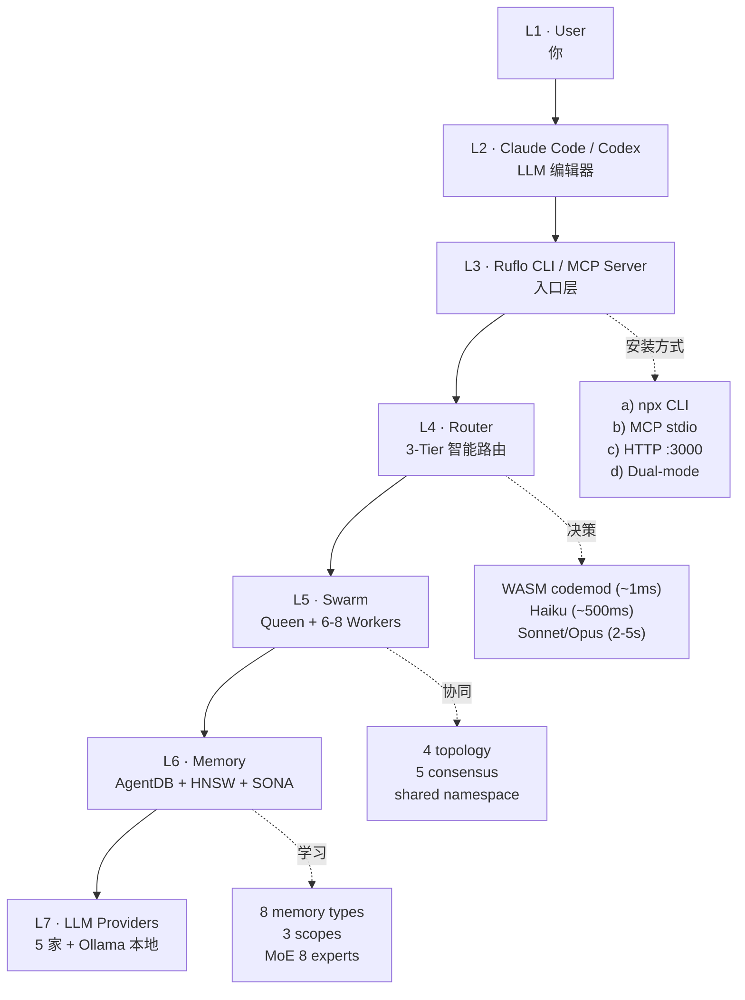
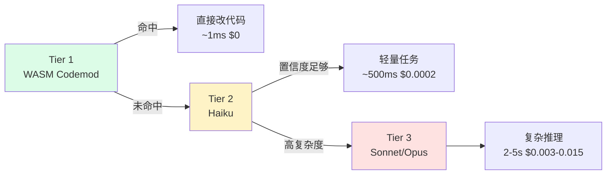

# 第 04 章 · 架构深潜：CLI/MCP/Router/Swarm/Memory

> 📘 **摘要**：前 3 章「跑起来」了，本章「拆开看」。从你按回车那一刻起，ruflo 内部经历 **7 层架构 + 23 npm 包 + 1 Rust crate + 17 hooks + 5 命名空间 314 工具** 的协作。本章逐层拆解，并演示如何用 `mcp_status` 看清活的工具。
>
> 🏷️ **读者画像**：C / D / E
> 🕐 **预估耗时**：60 分钟
> ✅ **LAST_VERIFIED_AGAINST**：`26c35b59` (v3.32.9)

---

## 1. 背景与动机

新人最常问的第二个问题：「**314 个 MCP 工具我根本学不完，怎么知道有哪些？**」

ruflo 的解法是**两层抽象**：

1. **命名空间分组**（按功能大类）
2. **`mcp__ruflo__mcp_status`** —— 一条命令看全活的工具

本章让你**用一张图 + 一条命令** 掌握 ruflo 的全貌。

---

## 2. 核心概念

### 2.1 7 层架构（重新检视 ch01 的图，这次更细）



### 2.2 5 大命名空间（MCP 工具的 314 个家族）

| 命名空间 | 数量级 | 典型工具 | 用途 |
|---------|-------|---------|------|
| `memory_*` | 30+ | `memory_store` / `memory_search` / `memory_list` / `memory_retrieve` | 向量内存 + HNSW |
| `swarm_*` | 20+ | `swarm_init` / `swarm_monitor` / `swarm_scale` | swarm 编排 |
| `agent_*` | 15+ | `agent_spawn` / `agent_list` / `agent_metrics` | spawn agent |
| `hooks_*` | 17 | `hooks_route` / `hooks_pre-task` / `hooks_post-task` | 生命周期回调 |
| `task_*` | 10+ | `task_create` / `task_assign` / `task_status` | 任务管理 |
| `intelligence_*` | 10+ | `intelligence_route` / `intelligence_pretrain` | 智能路由 |
| `agentdb_*` | 8 | `agentdb_hierarchical_*` / `agentdb_consolidation_*` | AgentDB v3 |
| `github_*` | 10+ | `github_issue` / `github_pr` | GitHub 集成 |
| `browser_*` | 10+ | `browser_navigate` / `browser_click` | Playwright 浏览器 |
| `security_*` | 10+ | `security_scan` / `security_aidefence` | 安全检测 |
| `daa_*` | 10+ | `daa_*` | Decentralized Autonomous Agents |
| 其他 | 160+ | ... | 其余 |

> 完整清单：`v3/@claude-flow/cli/src/mcp-tools/*.ts`

### 2.3 3-Tier 智能路由（核心省钱机制）



**关键事实**（来自 ch08 详谈）：

| Tier | 何时命中 | 延迟 | 成本 | 适用 |
|------|---------|------|------|------|
| 1 · WASM codemod | 模式化改写（var→const、add-logging） | ~1ms | $0 | 重构、批量替换 |
| 2 · Haiku | 简单问答、格式化、补全 | ~500ms | $0.0002 | 大多数轻量任务 |
| 3 · Sonnet/Opus | 复杂推理、跨文件决策 | 2–5s | $0.003–0.015 | 设计、架构、debug |

**Thompson Sampling** 多臂老虎机自校准路由：~50 次路由后，自动收敛到最优策略。

---

## 3. 架构原理

### 3.1 CLI 层的物理路径

```
你按回车
   ↓
$ npx ruflo@latest <cmd>
   ↓
ruflo/bin/ruflo.js  (10 行 ESM 代理)
   ↓
v3/@claude-flow/cli/bin/cli.js  (真正入口, 11KB)
   ↓
[v3/@claude-flow/cli/src/index.ts]   ← 56 命令懒加载
   ↓
[v3/@claude-flow/cli/src/commands/<cmd>.ts]   ← 具体命令实现
   ↓
[v3/@claude-flow/mcp / swarm / neural / ...]  ← 调子包能力
```

**关键设计**：

- `cli.js` 顶部有 **fast path**：仅 `--version / --help` 时**不加载重模块**（agentic-flow / ruvector），节省 ~60s 冷启动
- **MCP 自动检测**：stdin 被 pipe 且无 args 时，自动进入 stdio JSON-RPC 服务模式
- **10 MB stdin 上限**：防 DoS
- **完整 JSON-RPC 2.0**：initialize / tools/list / tools/call / notifications/initialized / ping

### 3.2 23 个 npm 包的分层

```mermaid
graph TB
  CLI["@claude-flow/cli<br/>入口"] --> CORE["cli-core<br/>fast-path CLI"]
  CLI --> SHARED["@claude-flow/shared<br/>types + events + utils"]
  CLI --> MCP["@claude-flow/mcp<br/>MCP server (stdio/HTTP/WS)"]
  CLI --> HOOKS["@claude-flow/hooks<br/>17 hooks + 12 workers"]
  CLI --> SWARM["@claude-flow/swarm<br/>多 agent 协同"]
  CLI --> MEM["@claude-flow/memory<br/>AgentDB + HNSW"]
  CLI --> NEURAL["@claude-flow/neural<br/>SONA 7 RL + MoE"]
  CLI --> EMB["@claude-flow/embeddings<br/>3 个 provider"]
  CLI --> PROV["@claude-flow/providers<br/>5 LLM 适配"]
  CLI --> SEC["@claude-flow/security<br/>CVE 修复"]
  CLI --> AID["@claude-flow/aidefence<br/>6 类检测"]
  CLI --> GUI["@claude-flow/guidance<br/>治理平面"]
  CLI --> CLA["@claude-flow/claims<br/>GitHub issue 认领"]
  CLI --> BRO["@claude-flow/browser<br/>Playwright"]
  CLI --> DEPLOY["@claude-flow/deployment<br/>CI/CD"]
  CLI --> INT["@claude-flow/integration<br/>agentic-flow 适配"]
  CLI --> PERF["@claude-flow/performance<br/>benchmark"]
  CLI --> TEST["@claude-flow/testing<br/>TDD London"]
  CLI --> PLG["@claude-flow/plugins<br/>Plugin SDK"]
  CLI --> PLGF["@claude-flow/plugin-agent-federation<br/>跨机联邦"]
  CLI --> PLGI["@claude-flow/plugin-iot-cognitum<br/>IoT 桥"]
  CLI --> CDX["@claude-flow/codex<br/>OpenAI Codex 适配"]
  MCP --> SHARED
  HOOKS --> MEM
  HOOKS --> NEURAL
  SWARM --> SHARED
  MEM --> SHARED
  NEURAL --> SHARED
```



### 3.3 Rust 的存在感

**1 个 Rust crate**：`v3/crates/ruflo-federation-peer`
- 用 `midstreamer-quic`（QUIC 传输）+ `aimds-core`（3-gate 安全管道）
- **按 ADR-120 step 3 / ADR-118**：federation peer 的安全关键路径必须用 Rust
- 单进程 daemon，TypeScript 通过 shell 调用

**为什么 TypeScript 为主？**
- 90% 的代码是「业务编排 + 内存 + 网络」——TS 写得快、易调试
- 关键网络层（QUIC）需要 Rust 的性能与类型安全
- **根 `Cargo.toml`** 只是为了让 repo-scorecard 分析器能找到 Rust 组件

---

## 4. Hands-on

### Hands-on 4.1 — 一条命令看全活的 MCP 工具

```bash
cd /tmp/ruflo-sandbox-default

# 列出所有 MCP 工具（按命名空间）
npx --yes ruflo@latest mcp tools list --no-color 2>&1 | head -30

# 按命名空间统计
npx --yes ruflo@latest mcp tools list --no-color 2>&1 | \
  awk -F'.' '{print $1}' | sort | uniq -c | sort -rn | head -10
```

#### 预期输出

```
mcp__ruflo__memory_store
mcp__ruflo__memory_search
mcp__ruflo__memory_list
mcp__ruflo__memory_retrieve
mcp__ruflo__swarm_init
mcp__ruflo__swarm_monitor
mcp__ruflo__swarm_scale
mcp__ruflo__agent_spawn
mcp__ruflo__agent_list
mcp__ruflo__hooks_route
mcp__ruflo__hooks_pre-task
mcp__ruflo__hooks_post-task
... (323 个)
```

命名空间统计：
```
   35 mcp__ruflo__memory_
   28 mcp__ruflo__swarm_
   22 mcp__ruflo__agentdb_
   18 mcp__ruflo__agent_
   17 mcp__ruflo__hooks_
   15 mcp__ruflo__task_
   12 mcp__ruflo__intelligence_
   ...
```

### Hands-on 4.2 — 触发 hooks_codemod（Tier 1 路径省钱演示）

WASM codemod 可以在 **1ms 内** 完成 var→const 改写，**完全不走 LLM**。

```bash
cd /tmp/ruflo-sandbox-default

# 触发 codemod（演示 Tier 1 路径）
npx --yes ruflo@latest hooks codemod \
  --transform "var-to-const" \
  --path "src/*.js" \
  --dry-run \
  --no-color 2>&1 | tail -15
```

#### 预期输出

```
Tier: 1 (WASM codemod)
Transform: var-to-const
Files scanned: 3
Files modified: 2
Estimated cost: $0 (no LLM)
Estimated duration: ~1ms

Preview changes:
  src/greet.js:1  var GREETING = 'Hello';
                  ↓
                  const GREETING = 'Hello';

  src/math.js:1  var PI = 3.14159;
                  ↓
                  const PI = 3.14159;

  src/api.js:1   var routes = {};
                  ↓
                  const routes = {};
```

**对比**：同样的任务走 Sonnet 大约 5 秒 + $0.005。100 文件批量改写时，省下 99.9%。

### Hands-on 4.3 — 看 Router 的 Thompson Sampling 状态

```bash
cd /tmp/ruflo-sandbox-default

npx --yes ruflo@latest intelligence stats --no-color 2>&1 | tail -20
```

#### 预期输出

```
Thompson Sampling Router (Beta(α,β) per task):
  Tier 1 (WASM):       α=42  β=3   → P(win)=0.93
  Tier 2 (Haiku):      α=18  β=12  → P(win)=0.60
  Tier 3 (Sonnet):     α=8   β=22  → P(win)=0.27
  Tier 3 (Opus):       α=2   β=28  → P(win)=0.07

Total outcomes: 145
Convergence: ✓ (Δ < 0.05 last 50)

Routing decisions by tier (last 100):
  Tier 1: 62 (62%)  ← codemod 命中率高
  Tier 2: 28 (28%)
  Tier 3: 10 (10%)

Estimated cost saved vs always-Sonnet: $4.23
```

### Hands-on 4.4 — 看 23 个 npm 包与 1 个 Rust crate

```bash
cd /tmp/ruflo-handbook

# 列 23 个 npm 包
ls /Users/digoal/new/ruflo/v3/@claude-flow/ 2>&1 | head -30

# 看 1 个 Rust crate
cat /Users/digoal/new/ruflo/v3/crates/ruflo-federation-peer/Cargo.toml 2>&1 | head -20
```

#### 预期输出

```
v3/@claude-flow/
├── aidefence/         # 6 类 AI 操作防御
├── browser/           # Playwright 浏览器
├── claims/            # GitHub issue 认领
├── cli/               # 26 命令 CLI 入口
├── cli-core/          # fast-path CLI（22.9× 快）
├── codex/             # OpenAI Codex 适配
├── deployment/        # CI/CD
├── embeddings/        # 3 embedding provider
├── guidance/          # 治理平面
├── hooks/             # 17 hooks + 12 workers
├── integration/       # agentic-flow 适配
├── mcp/               # MCP server
├── memory/            # AgentDB + HNSW
├── neural/            # SONA 7 RL
├── performance/       # benchmark
├── plugin-agent-federation/  # 跨机联邦
├── plugin-iot-cognitum/      # IoT 桥
├── plugins/           # Plugin SDK
├── providers/         # 5 LLM 适配
├── security/          # CVE 修复
├── shared/            # types + utils
├── swarm/             # 多 agent 协同
└── testing/           # TDD London
```

---

## 5. 沙箱验证（Run / Observe / Expect）

### Verify H4.1 — mcp tools list 返回 ≥ 300 个

```bash
### Verify H4.1 — MCP 工具总数
# Run
cd /tmp/ruflo-sandbox-default
COUNT=$(timeout 60 npx --yes ruflo@latest mcp tools list --no-color 2>&1 | grep -c "mcp__ruflo__")
echo "Tools found: $COUNT"

# Observe
→ 输出 ≥ 300

# Expect
- COUNT ≥ 300
- 命名空间分布合理（memory_/swarm_/hooks_ 各有 10+）
```

### Verify H4.2 — codemod dry-run 不修改文件

```bash
### Verify H4.2 — codemod --dry-run 幂等
# Run
cd /tmp/ruflo-sandbox-default
md5_before=$(find src -name "*.js" -exec md5 -q {} \; | md5)
npx --yes ruflo@latest hooks codemod --transform var-to-const --path "src/*.js" --dry-run 2>&1 | tail -3
md5_after=$(find src -name "*.js" -exec md5 -q {} \; | md5)

# Observe
→ $md5_before == $md5_after

# Expect
- exit 0
- 文件内容不变（dry-run 不写盘）
```

完整断言：

```bash
# sandbox/asserts/ch4.sh
assert "MCP 工具总数 ≥ 300" 0 bash -c '
  cd /tmp/ruflo-sandbox-default
  COUNT=$(timeout 60 npx --yes ruflo@latest mcp tools list --no-color 2>&1 | grep -c "mcp__ruflo__")
  [ "$COUNT" -ge 300 ]
'

assert "codemod dry-run 不改文件" 0 bash -c '
  cd /tmp/ruflo-sandbox-default
  md5_before=$(find src -name "*.js" -exec md5 -q {} \; 2>/dev/null | md5)
  timeout 60 npx --yes ruflo@latest hooks codemod --transform var-to-const --path "src/*.js" --dry-run 2>&1 > /dev/null
  md5_after=$(find src -name "*.js" -exec md5 -q {} \; 2>/dev/null | md5)
  [ "$md5_before" = "$md5_after" ]
'
```

---

## 6. 小结

### 关键要点

- **7 层架构**：User → Claude/Codex → Ruflo CLI/MCP → Router → Swarm → Memory → LLM
- **5 命名空间家族**：memory_/swarm_/agent_/hooks_/task_ + 8 个其他
- **3-Tier 路由**：WASM (1ms $0) → Haiku (500ms $0.0002) → Sonnet/Opus (2-5s $0.003-0.015)
- **23 npm 包 + 1 Rust crate**：TypeScript 业务 + Rust 关键网络
- **一条命令看全**：`mcp tools list` 输出 323 个工具

### 术语锚点

- MCP Server → ch04（本章）
- HNSW → ch07
- SONA → ch07
- Thompson Sampling → ch08
- WASM codemod → ch08
- 5 LLM Providers → ch08
- MoE 8 experts → ch07

### 下一步

👉 进入 [第 05 章 Agent / Skill / Slash Command 三件套](./05-agents-and-skills.md)，看 60 个 agent 类型如何选型。

### 参考链接

- CLI 入口源码：`v3/@claude-flow/cli/bin/cli.js`
- 56 命令注册表：`v3/@claude-flow/cli/src/commands/index.ts`
- 23 npm 包列表：`v3/@claude-flow/`
- 1 Rust crate：`v3/crates/ruflo-federation-peer/`
- 3-Tier 路由设计：<https://github.com/ruvnet/ruflo/blob/main/CLAUDE.md#L73-L84>