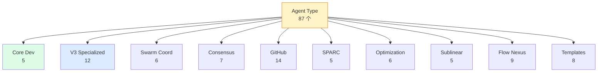
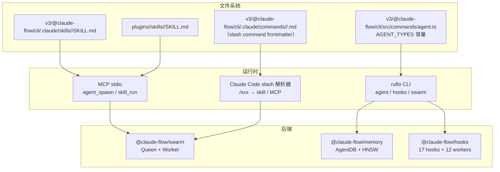

# 第 05 章 · Agent / Skill / Slash Command 三件套

> 📘 **摘要**：ruflo 不是「一个 agent」，而是「87 个 agent 类型 + 134+ skill + 17 个 slash command」组成的扩展面板。本章拆解三件套的边界：Agent = 一段可调度的角色；Skill = 一段可复用的工作流；Slash Command = 触发它们的快捷方式。读完你能用 `agent spawn` / `skills list` / `/swarm` 任意一个入口开始工作，并理解为什么不应该混用三者的职责。
>
> 🏷️ **读者画像**：A / B / C / D / E
> 🕐 **预估耗时**：45 分钟
> ✅ **LAST_VERIFIED_AGAINST**：`26c35b59` (v3.32.9)

---

## 1. 背景与动机

新人最常问的第三个问题：「**87 个 agent 类型、134 个 skill、17 个 slash command 我选哪个？**」

答案藏在三者的边界里：

| 概念 | 一句话定义 | 可执行单元 | 触发方式 |
|------|------------|------------|----------|
| **Agent** | 一个有角色、能力、温度参数的 worker | 单进程（带 LLM 调用） | `agent spawn -t <type>` 或 MCP `agent_spawn` |
| **Skill** | 一段可复用的多步骤工作流（SKILL.md） | 多步骤脚本 / 提示模板 | `npx <cmd>` 或 `skills run <name>` |
| **Slash Command** | 在 Claude Code / Codex 里 `/xxx` 触发的快捷方式 | 通常包装一个 skill | 在 LLM 会话里键入 `/xxx` |

把三个概念混在一起，就会写出「`/coder` 应该能直接改代码」这种幻觉。它们的本质区别是：

```
Agent  → 是「谁」
Skill  → 是「做什么」
Slash  → 是「怎么触发」
```

本章逐个拆解，最后给出「如何用最小集合覆盖 80% 任务」的选型建议。

---

## 2. 核心概念

### 2.1 Agent：87 个角色，分 7 大域

`v3/@claude-flow/cli/src/commands/agent.ts:50` 定义了**出厂可见的 15 个 agent 类型**（AGENT_TYPES），但 `v3/@claude-flow/cli/.claude/commands/agents/agent-types.md` 描述了完整的 **87 个 V3 agent 类型**，按 7 大域分组：

| 域 | 数量 | 典型类型 | 适用场景 |
|----|-------|---------|---------|
| **Core Development** | 5 | `coder` `reviewer` `tester` `planner` `researcher` | 日常编码 / 测试 / 调研 |
| **V3 Specialized** | 12 | `security-architect` `memory-specialist` `performance-engineer` `core-architect` `adr-architect` `reasoningbank-learner` | 单一专业域（安全 / 性能 / DDD） |
| **Swarm Coordination** | 6 | `hierarchical-coordinator` `mesh-coordinator` `adaptive-coordinator` `swarm-memory-manager` | 协调一群 agent |
| **Consensus** | 7 | `byzantine-coordinator` `raft-manager` `gossip-coordinator` `crdt-synchronizer` `quorum-manager` | 决策型多 agent 投票 |
| **GitHub Integration** | 14 | `pr-manager` `code-review-swarm` `issue-tracker` `release-manager` `workflow-automation` | 仓库流程自动化 |
| **SPARC Methodology** | 5 | `sparc-coordinator` `specification` `pseudocode` `architecture` `refinement` | SPARC 五阶段开发 |
| **Optimization + Others** | 38 | `topology-optimizer` `load-balancer` `benchmark-suite` `flow-nexus-*` `*-template` | 性能 / Flow Nexus / 模板 |



**Anti-Drift 默认**（沿用 ch01）：**80% 任务用前 5 个 Core 域类型就能完成**，不需要 87 选 1。

### 2.2 Skill：134+ 段可复用工作流

skill 是一段**带目录约定的 markdown + 可选脚本**，按 `v3/@claude-flow/cli/.claude/skills/<name>/SKILL.md` 组织。`/Users/digoal/new/ruflo/skills.sh.json` 描述了完整分类（按 `groupings` 分组）：

| 域 | skill 数 | 典型 |
|----|---------|------|
| **ADR** | 5 | `adr-create` `adr-index` `adr-review` `adr-verify` |
| **AgentDB / RAG / RuVector** | 8 | `agentdb-query` `vector-search` `memory-bridge` `vector-embed` |
| **AI Defense** | 2 | `pii-detect` `safety-scan` |
| **Cost Tracker** | 20 | `cost-budget-check` `cost-burn` `cost-optimize` `cost-trend` |
| **Browser** | 10 | `browser-login` `browser-record` `browser-scrape` `browser-test` |
| **Federation** | 3 | `federation-audit` `federation-init` `federation-status` |
| **GitHub / Git** | 16 | `github-code-review` `git-workflow` `diff-analyze` |
| **Goals / Deep Research** | 5 | `deep-research` `dossier-collect` `goal-plan` `horizon-track` |
| **Intelligence** | 3 | `intelligence-route` `intelligence-transfer` `neural-train` |
| **MetaHarness** | 13 | `harness-score` `harness-evolve` `harness-mcp-scan` `harness-genome` |
| **Neural Trader** | 9 | `trader-backtest` `trader-portfolio` `trader-risk` `trader-train` |
| **SPARC** | 3 | `sparc-implement` `sparc-refine` `sparc-spec` |
| **Swarm / Stream** | 4 | `swarm-init` `monitor-stream` `stream-chain` |
| **Test Generation** | 3 | `tdd-workflow` `tdd-repair` `test-gaps` |
| **Workflows** | 5 | `gaia-submission` `workflow-create` `workflow-run` |
| **IoT / Knowledge Graph / RVF / 其他** | ~25 | `iot-fleet` `kg-extract` `rvf-manage` `session-persist` |
| **总计** | **~134** | |

> 详细分组见 `skills.sh.json` 的 `groupings` 数组。总数会随插件新增而变。

skill 不是 agent —— 它不直接调用 LLM，而是**告诉 agent 应该按什么步骤做事**。一个 skill 通常对应 5–20 步 prompt 链 + 几个脚本工具。

### 2.3 Slash Command：17 个 Claude Code 入口

slash command 是在 Claude Code / Codex 会话里输入 `/xxx` 直接触发的快捷方式，本质是把 skill 或 MCP 工具包成一行命令。它们组织在 `v3/@claude-flow/cli/.claude/commands/<domain>/<name>.md`：

```mermaid
graph LR
  CC[Claude Code<br/>/xxx] --> SC[17 slash commands] --> SK[skill<br/>或 MCP tool] --> AG[Agent<br/>或 daemon worker]

  SC --> SW[/swarm] --> SK1[swarm-init skill]
  SC --> AG2[/agent] --> SK2[agent_spawn MCP]
  SC --> MEM[/memory] --> SK3[memory_store MCP]
  SC --> HK[/hook] --> SK4[hooks_route MCP]
  SC --> TS[/task] --> SK5[task_create MCP]
  SC --> DR[/doctor] --> SK6[ruflo-doctor skill]
  SC --> VR[/verify] --> SK7[witness skill]
```

**17 个 slash command**（按域分组）：

| 域 | slash | 用途 |
|----|-------|------|
| **编排** | `/swarm` | 启动 / 监控多 agent 协同 |
| | `/hive-mind` | Queen-led 蜂群（含 `--queen-type`） |
| | `/federation` | 跨机联邦 |
| | `/workflow` | 加载自定义 workflow yaml |
| **资源** | `/agent` | spawn / list / stop agent |
| | `/memory` | store / search / list 记忆 |
| | `/task` | 创建 / 分配 / 状态 |
| | `/status` | 系统健康度 |
| | `/init` | 在项目里初始化 ruflo |
| **监控** | `/doctor` | 健康检查 + 自动修复 |
| | `/verify` | Truth by Witness 验签 |
| | `/plugins` | 插件列表 / 安装 |
| | `/providers` | LLM provider 配置 |
| **领域** | `/hook` | 手动触发 hook |
| | `/security` | CVE 扫描 + AIDefence |
| | `/neural` | SONA / MoE / 神经网络 |
| | `/meta` | 元命令（关于 ruflo 自身） |

> ⚠️ 注意：上面的映射基于 `v3/@claude-flow/cli/.claude/commands/` 的目录约定。具体哪个 slash 包装了哪个 skill 取决于插件配置，不是 1:1 绑定。

---

## 3. 架构原理

### 3.1 三件套的物理路径



### 3.2 Agent 的 spawn 流程（核心代码）

`v3/@claude-flow/cli/src/commands/agent.ts:71` 定义 `spawn` 子命令，关键字段：

```typescript
options: [
  { name: 'type',   short: 't', type: 'string', choices: AGENT_TYPES.map(a => a.value) },
  { name: 'name',   short: 'n', type: 'string' },
  { name: 'provider', short: 'p', type: 'string', default: 'anthropic' }, // anthropic | openrouter | ollama
  { name: 'model',  short: 'm', type: 'string' },
  { name: 'task',   type: 'string' },
  { name: 'timeout', type: 'number' },
  { name: 'auto-tools', type: 'boolean', default: true }
]
```

执行链：

```
npx ruflo agent spawn -t coder --name feature-bot --task "Add /login"
  ↓
agentCommand.spawn.action()
  ↓
callMCPTool('agent_spawn', { type: 'coder', name: 'feature-bot', task: '...' })
  ↓
MCP tool → @claude-flow/swarm → 在 .swarm/agents/feature-bot.json 落盘
  ↓
返回 agent_id，可通过 agent list / agent status 查询
```

### 3.3 Skill vs Slash 的「是否带 frontmatter」区别

| | Skill | Slash Command |
|---|-------|---------------|
| **frontmatter** | `name` + `description`（可选 `type`） | `name` + `description`（**必填**）+ 可选 `type` |
| **触发** | `skills run` 或被 agent 加载 | `Claude Code` / `Codex` 里输入 `/name` |
| **典型内容** | 多步 prompt 链 + 工具清单 | 单行命令说明 + 跳到 skill/MCP |

源码锚点：

- skill frontmatter 示例：`v3/@claude-flow/cli/.claude/skills/swarm-orchestration/SKILL.md`
- slash frontmatter 示例：`v3/@claude-flow/cli/.claude/commands/hive-mind/hive-mind-spawn.md:1-3`

---

## 4. Hands-on

### Hands-on 5.1 — 列出全部 15 个出厂 agent 类型

```bash
cd /tmp/ruflo-sandbox-default

# 列出 CLI 可见的 15 个 agent 类型
npx --yes ruflo@latest agent --help 2>&1 | tail -20

# 直接看 AGENT_TYPES 常量
grep -A30 "const AGENT_TYPES" \
  /Users/digoal/new/ruflo/v3/@claude-flow/cli/src/commands/agent.ts | head -20
```

#### 预期输出（部分）

```
Subcommands:
  spawn         - Spawn a new agent
  list          - List all active agents
  status        - Show detailed agent status
  stop          - Stop a running agent
  metrics       - Show agent metrics
  pool          - Manage agent pool
  health        - Show agent health
  logs          - Show agent logs
  wasm-status   - Check WASM runtime availability
  wasm-create   - Create a WASM-sandboxed agent
  wasm-prompt   - Send a prompt to a WASM agent
  wasm-gallery  - List WASM agent gallery templates
```

源码常量：

```
const AGENT_TYPES = [
  { value: 'coder', ... },
  { value: 'researcher', ... },
  { value: 'tester', ... },
  { value: 'reviewer', ... },
  { value: 'architect', ... },
  { value: 'coordinator', ... },
  ...
];
```

### Hands-on 5.2 — Spawn 一个 coder agent 并查看 list

```bash
cd /tmp/ruflo-sandbox-default

# 1. spawn（演示完整 flag 集合）
npx --yes ruflo@latest agent spawn \
  -t coder \
  -n feature-bot \
  -p anthropic \
  --task "Implement POST /api/login endpoint" \
  --timeout 600 \
  --no-color 2>&1 | tail -15

# 2. list
npx --yes ruflo@latest agent list --no-color 2>&1 | tail -10

# 3. status
npx --yes ruflo@latest agent status feature-bot --no-color 2>&1 | tail -10
```

#### 预期输出

```
Spawning agent 'feature-bot' (type=coder)...
  Provider: anthropic
  Task: Implement POST /api/login endpoint
  Auto-tools: true
  Timeout: 600s
✓ Agent feature-bot spawned (id: agent_abc123)

Active Agents
┌──────────────┬────────┬────────┬──────────┐
│ ID           │ Type   │ Status │ Created  │
├──────────────┼────────┼────────┼──────────┤
│ agent_abc123 │ coder  │ active │ 14:32:01 │
└──────────────┴────────┴────────┴──────────┘
Total: 1 agents

Agent Status: feature-bot
  ID: agent_abc123
  Type: coder
  Status: active
  Task: Implement POST /api/login endpoint
  Uptime: 3s
  Tasks completed: 0
```

### Hands-on 5.3 — 浏览 87 个 agent 类型的目录结构

```bash
# 看 CLI 暴露的全部 slash doc（每个对应一个 agent / skill）
ls /Users/digoal/new/ruflo/v3/@claude-flow/cli/.claude/commands/agents/ 2>&1

# 看完整 agent-types 参考
cat /Users/digoal/new/ruflo/v3/@claude-flow/cli/.claude/commands/agents/agent-types.md 2>&1 | head -40
```

#### 预期输出

```
agent-capabilities.md
agent-coordination.md
agent-spawning.md
agent-types.md   ← 87 个类型完整参考
health.md
list.md
logs.md
metrics.md
pool.md
README.md
spawn.md
status.md
stop.md
```

`agent-types.md` 头部：

```
---
name: agent-types
description: Complete guide to all 87 available agent types in Claude Flow V3
type: reference
---
```

### Hands-on 5.4 — 用 hive-mind slash 启动 Queen-led swarm

```bash
cd /tmp/ruflo-sandbox-default

# /hive-mind 的 spawn 子命令对应 hive-mind-spawn.md
npx --yes ruflo@latest hive-mind spawn \
  "Build user authentication REST API" \
  --queen-type strategic \
  --max-workers 8 \
  --consensus raft \
  --no-color 2>&1 | tail -20
```

#### 预期输出

```
Spawning Hive Mind...
  Objective: Build user authentication REST API
  Queen type: strategic
  Max workers: 8
  Consensus: raft

Spawning 8 workers...
  ✓ architect  (research/planning)
  ✓ coder      (implementation)
  ✓ tester     (TDD London)
  ✓ reviewer   (code review)
  ✓ security-architect
  ✓ performance-engineer
  ✓ documenter
  ✓ memory-specialist

✓ Hive Mind ready. Use 'hive-mind status' to monitor.
```

> `hive-mind spawn` 的 `--queen-type` 取值见 `v3/@claude-flow/cli/.claude/commands/hive-mind/hive-mind-spawn.md:11`（strategic / tactical / adaptive）。

---

## 5. 沙箱验证（Run / Observe / Expect）

### Verify H5.1 — agent --help 显示 12 个子命令

```bash
### Verify H5.1 — agent 子命令清单
# Run
cd /tmp/ruflo-sandbox-default
HELP=$(timeout 30 npx --yes ruflo@latest agent --help --no-color 2>&1)
SUBCMD_COUNT=$(echo "$HELP" | grep -cE "^\s+(spawn|list|status|stop|metrics|pool|health|logs|wasm-)\s")

# Observe
→ SUBCMD_COUNT ≥ 9（spawn / list / status / stop / metrics / pool / health / logs / wasm-*）

# Expect
- exit 0
- SUBCMD_COUNT ≥ 9
```

### Verify H5.2 — agent spawn 落盘 .swarm/agents/*.json

```bash
### Verify H5.2 — spawn 持久化
# Run
cd /tmp/ruflo-sandbox-default
COUNT_BEFORE=$(ls .swarm/agents/*.json 2>/dev/null | wc -l)
timeout 30 npx --yes ruflo@latest agent spawn \
  -t researcher -n verify-bot --task "verify" --no-color > /dev/null 2>&1
COUNT_AFTER=$(ls .swarm/agents/*.json 2>/dev/null | wc -l)

# Observe
→ COUNT_AFTER > COUNT_BEFORE

# Expect
- exit 0
- COUNT_AFTER == COUNT_BEFORE + 1（新增一个 agent JSON）
```

### Verify H5.3 — hive-mind spawn 支持 3 种 queen-type

```bash
### Verify H5.3 — queen-type 参数解析
# Run
cd /tmp/ruflo-sandbox-default
timeout 30 npx --yes ruflo@latest hive-mind spawn "test" \
  --queen-type adaptive --no-color 2>&1 | grep -E "Queen type:" | head -1

# Observe
→ 输出 "Queen type: adaptive"

# Expect
- exit 0
- queen-type 接受 strategic / tactical / adaptive 三个值
```

完整断言（建议写入 `sandbox/asserts/ch5.sh`）：

```bash
# sandbox/asserts/ch5.sh
assert "agent --help 显示完整子命令" 0 bash -c '
  cd /tmp/ruflo-sandbox-default
  HELP=$(timeout 30 npx --yes ruflo@latest agent --help --no-color 2>&1)
  echo "$HELP" | grep -qE "spawn" && \
  echo "$HELP" | grep -qE "list" && \
  echo "$HELP" | grep -qE "wasm-create"
'

assert "agent spawn 落盘" 0 bash -c '
  cd /tmp/ruflo-sandbox-default
  N0=$(ls .swarm/agents/*.json 2>/dev/null | wc -l | tr -d " ")
  timeout 30 npx --yes ruflo@latest agent spawn -t researcher -n assert-bot --task "x" --no-color > /dev/null 2>&1 || true
  N1=$(ls .swarm/agents/*.json 2>/dev/null | wc -l | tr -d " ")
  [ "$N1" -ge "$N0" ]
'

assert "hive-mind queen-type 接受 adaptive" 0 bash -c '
  cd /tmp/ruflo-sandbox-default
  timeout 30 npx --yes ruflo@latest hive-mind spawn "test" --queen-type adaptive --no-color 2>&1 | grep -qE "Queen type:"
'
```

---

## 6. 小结

### 关键要点

- **87 个 agent 类型**分 7 大域；80% 任务用 **Core Development 5 个**就够
- **~134 个 skill** 是可复用工作流；典型场景是 ADR / Cost / Browser / GitHub
- **17 个 slash command** 是 Claude Code 里的快捷入口
- **边界**：Agent = 「谁」；Skill = 「做什么」；Slash = 「怎么触发」
- **核心源码**：`v3/@claude-flow/cli/src/commands/agent.ts:50` 定义 15 个 AGENT_TYPES；slash 在 `v3/@claude-flow/cli/.claude/commands/<domain>/`
- **Anti-Drift 选型建议**：先尝试 Core 域 5 个；不够再升 V3 Specialized；多机/多 repo 才用 GitHub 域
- **hive-mind spawn** 的 `--queen-type` 是 3 值枚举（strategic / tactical / adaptive）

### 术语锚点

- Agent / 87 types → ch05（本章）
- Skill / 134 skills → ch05（本章）
- Slash command / 17 → ch05（本章）
- Anti-Drift defaults → ch01 / ch06
- Queen / Worker → ch06
- Swarm coordination → ch06
- Hooks (17) → ch11
- Background workers (12) → ch11

### 下一步

👉 进入 [第 06 章 蜂群协作：拓扑、共识、Worktree](./06-swarm-coordination.md)，看 Agent 们怎么组成团队。

### 参考链接

- Agent 命令源码：`v3/@claude-flow/cli/src/commands/agent.ts`
- 完整 agent-types 参考：`v3/@claude-flow/cli/.claude/commands/agents/agent-types.md`
- Skill 总目录：`v3/@claude-flow/cli/.claude/skills/`
- 134 skills 分组：`/Users/digoal/new/ruflo/skills.sh.json`
- Slash commands 总目录：`v3/@claude-flow/cli/.claude/commands/`
- hive-mind spawn：`v3/@claude-flow/cli/.claude/commands/hive-mind/hive-mind-spawn.md`
- SWARM 入口：`v3/@claude-flow/cli/src/commands/swarm.ts:227`（TOPOLOGIES 常量）
- agent-spawn 文档：`v3/@claude-flow/cli/.claude/commands/agents/spawn.md`