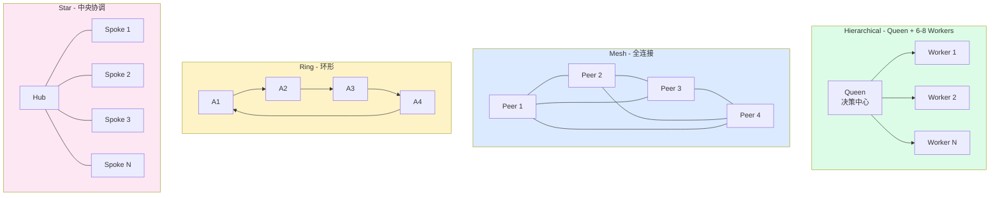
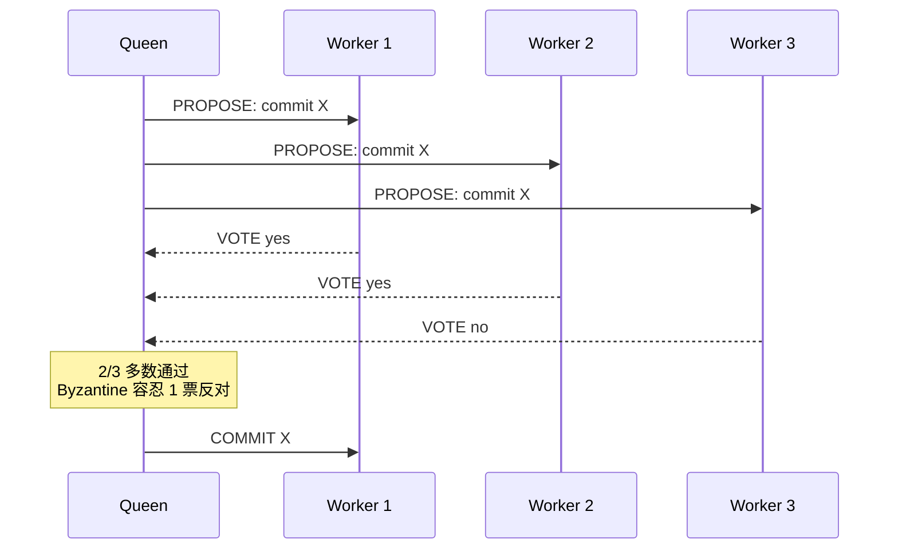
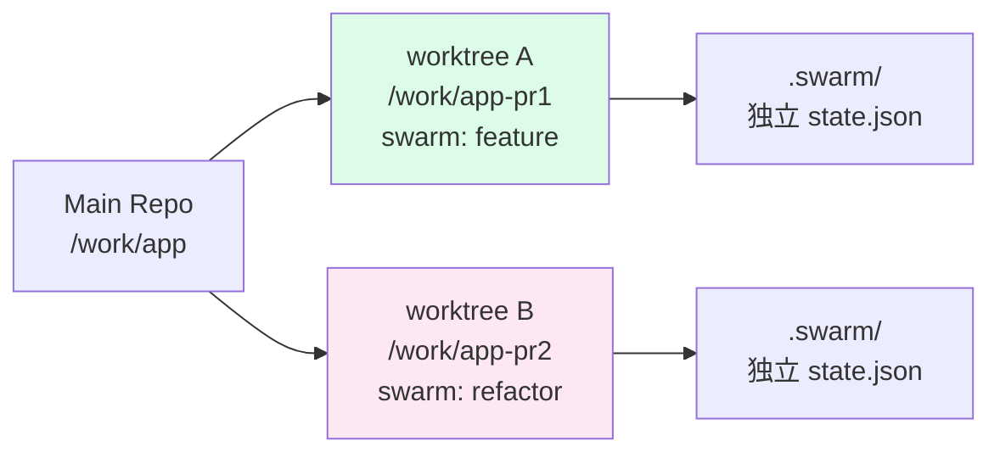

# 第 06 章 · 蜂群协作：拓扑、共识、Worktree

> 📘 **摘要**：一个人跑得慢，一群人容易散。本章拆解 ruflo 把 N 个 agent 编成团队的三件事——**4 种拓扑**（谁听谁的）、**5 种共识**（怎么投票）、**3 种 Queen × 8 种 Worker**（谁指挥谁干活）。读完你能用 `swarm init --topology hierarchical --consensus raft` 起一个 Anti-Drift 团队，并在跨 PR 工作流里用 git worktree 隔离多 swarm。
>
> 🏷️ **读者画像**：B / C / D / E
> 🕐 **预估耗时**：75 分钟
> ✅ **LAST_VERIFIED_AGAINST**：`26c35b59` (v3.32.9)

---

## 1. 背景与动机

新手最容易把蜂群写成「50 个 agent 并行跑」——几天后没人说得清谁负责哪块代码。

**Anti-Drift Defaults（沿用 ch01）**：

> **小团队（6–8 agents）+ hierarchical 拓扑 + specialized 策略 + raft 共识 + 频繁 checkpoint + 共享内存命名空间**

本章解决三个问题：

1. **拓扑**：4 种里选哪个？
2. **共识**：什么时候 Byzantine > Raft？
3. **隔离**：怎么让两个 swarm 在同一台机器上不打架？（git worktree）

---

## 2. 核心概念

### 2.1 4 种拓扑（谁听谁的）

源码：`v3/@claude-flow/cli/src/commands/swarm.ts:227-235` 定义了 5 种可选拓扑（前 4 种最常用）：

```typescript
const TOPOLOGIES = [
  { value: 'hierarchical', label: 'Hierarchical', hint: 'Queen-led coordination with worker agents' },
  { value: 'mesh',         label: 'Mesh',         hint: 'Fully connected peer-to-peer network' },
  { value: 'ring',         label: 'Ring',         hint: 'Circular communication pattern' },
  { value: 'star',         label: 'Star',         hint: 'Central coordinator with spoke agents' },
  { value: 'hybrid',       label: 'Hybrid',       hint: 'Hierarchical mesh for maximum flexibility' },
];
```



| 拓扑 | 通信复杂度 | 容错 | 适用 |
|------|-----------|------|------|
| **hierarchical** | O(N) — Queen 单点 | 中（Queen 是 SPOF） | 80% 任务默认 |
| **mesh** | O(N²) | 高（任何节点失联不致命） | 调研 / 头脑风暴 |
| **ring** | O(N) | 低（断一环全瘫） | 流水线任务 |
| **star** | O(N) | 中（Hub 单点） | 一次性分发任务 |
| **hybrid** | O(N log N) | 高 | V3 15-agent 模式 |

### 2.2 5 种共识（怎么投票）

源码：`v3/@claude-flow/swarm/src/types.ts:199` 定义算法枚举：

```typescript
export type ConsensusAlgorithm = 'raft' | 'byzantine' | 'gossip' | 'paxos';
```

加上 ch01 提到的 CRDT 模式，**实践中是 5 种**：

| 共识 | 公式 | 适用 | 实现复杂度 |
|------|------|------|------------|
| **Raft** | `f < n/2` + leader-based | 多数决策（Anti-Drift 默认） | 低 |
| **Byzantine BFT** | `f < n/3` + 2/3 多数 | 跨组织不可信环境 | 高 |
| **Gossip** | epidemic / 最终一致 | 大规模（>100 节点） | 中 |
| **CRDT** | commutative 操作 | 离线编辑 / 多人并发 | 中 |
| **Quorum** | `ceil(n × q)`（q 可配置） | 自定义阈值 | 低 |

源码锚点：

- Raft 实现：`v3/@claude-flow/swarm/src/consensus/raft.ts:185`（提案 ID `raft_<node>_<counter>`）
- Gossip 实现：`v3/@claude-flow/swarm/src/consensus/gossip.ts:77`（`gossipIntervalMs`）
- 默认 quorum 阈值：`v3/@claude-flow/swarm/src/unified-coordinator.ts:566`（`config.consensus?.algorithm ?? 'raft'`）



### 2.3 3 种 Queen × 8 种 Worker（角色分工）

**3 种 Queen**（`v3/@claude-flow/cli/.claude/commands/hive-mind/hive-mind-spawn.md:11`）：

| Queen | 关注 | 触发词 |
|-------|------|--------|
| **strategic** | research / planning | "调研"、"规划"、"架构" |
| **tactical** | implementation / execution | "实现"、"重构"、"优化" |
| **adaptive** | optimization / dynamic | "探索"、"试错"、"未知负载" |

**8 种 Worker**（来自 `v3/@claude-flow/cli/src/commands/agent.ts:50` 的 AGENT_TYPES + ch04 描述）：

| Worker | 擅长 |
|--------|------|
| **researcher** | 信息收集、文档检索 |
| **coder** | 代码生成、refactor |
| **analyst** | 性能 / 瓶颈分析 |
| **tester** | 单元 / 集成测试 |
| **architect** | 系统设计、模式分析 |
| **reviewer** | 代码评审、安全审计 |
| **optimizer** | 性能调优 |
| **documenter** | 文档生成 |

**Anti-Drift 黄金组合**：

```
Queen (tactical) +
Worker [architect, coder, tester, reviewer, documenter, security-architect]
= 6 人小队
```

### 2.4 git worktree 跨 swarm 隔离

同一台机器上跑 2 个 swarm 时，它们会竞争同一个 `.claude/`、`.swarm/`、memory 文件。**git worktree** 让每个 swarm 拥有独立的 working directory：



每个 worktree 独立持有：

- `.swarm/agents/*.json` — agent 注册
- `.swarm/tasks/*.json` — 任务队列
- `.claude-flow/memory/*.rvf` — 内存数据库
- `.claude/settings.json` — hook 配置

---

## 3. 架构原理

### 3.1 Queen-Worker 注意力权重

源码：`v3/@claude-flow/swarm/src/attention-coordinator.ts:350`

```typescript
const allOutputs = [...queenOutputs, ...workerOutputs];
// Apply hierarchical weights (queens have higher attention)
const weights = [
  ...queenOutputs.map(() => 2.0),  // Higher weight for queens
  ...workerOutputs.map(() => 1.0),
];
```

**Queen 输出注意力权重 2.0，Worker 1.0**。这就是 hierarchical 拓扑在注意力层面的硬编码优势 —— Queen 的判断永远占更多比重。

### 3.2 swarm init 的物理落盘

源码：`v3/@claude-flow/cli/src/commands/swarm.ts:263-285`

```
npx ruflo swarm init --topology hierarchical --max-agents 8 --strategy specialized
  ↓
swarmCommand.init.action()
  ↓
callMCPTool('swarm_init', {
  topology: 'hierarchical',
  maxAgents: 8,
  config: {
    communicationProtocol: 'message-bus',
    consensusMechanism: 'majority',
    failureHandling: 'retry',
    loadBalancing: true,
    autoScaling: true,
  },
  metadata: { v3Mode: false, strategy: 'specialized' }
})
  ↓
@claude-flow/swarm 创建 swarmId = swarm_<timestamp>_<rand>
  ↓
落盘 .swarm/state.json（写当前 working dir）
```

### 3.3 Hive Mind vs Swarm

| | Swarm | Hive Mind |
|---|-------|-----------|
| **Queen 类型** | 隐式（首节点） | 显式（--queen-type） |
| **共识** | Raft 默认 | Raft / Byzantine 可选 |
| **目标** | 通用 | 长期 / 战略任务 |
| **典型 CLI** | `swarm init` | `hive-mind spawn` |

两者底层共享 `@claude-flow/swarm` 引擎，区别是 **Hive Mind 暴露 queen-type + max-workers + --consensus 三参数**，更细粒度。

---

## 4. Hands-on

### Hands-on 6.1 — 初始化一个 Anti-Drift swarm

```bash
cd /tmp/ruflo-sandbox-default

# 6-8 agents + hierarchical + specialized + raft
npx --yes ruflo@latest swarm init \
  --topology hierarchical \
  --max-agents 8 \
  --strategy specialized \
  --no-color 2>&1 | tail -20
```

#### 预期输出

```
Initializing swarm...
  Creating coordination topology...
  Initializing memory namespace...
  Setting up communication channels...

┌──────────────────┬────────────────────────────────────┐
│ Property         │ Value                              │
├──────────────────┼────────────────────────────────────┤
│ Swarm ID         │ swarm_1721752801_k3x9p             │
│ Topology         │ hierarchical                       │
│ Max Agents       │ 8                                  │
│ Strategy         │ specialized                        │
│ Auto-scaling     │ true                               │
│ Consensus        │ majority (raft default)            │
└──────────────────┴────────────────────────────────────┘

✓ Swarm ready. Use 'swarm start -o "<task>" -s development' to begin.
```

落盘文件：

```
.swarm/state.json        ← 当前 swarm 元信息
.swarm/agents/           ← 空（待 spawn）
.swarm/tasks/            ← 空（待 start）
```

### Hands-on 6.2 — start 一个 development task

```bash
cd /tmp/ruflo-sandbox-default

# 启动一个开发任务
npx --yes ruflo@latest swarm start \
  -o "Build POST /api/login endpoint with JWT auth" \
  -s development \
  --monitor \
  --no-color 2>&1 | tail -15

# 看实时状态
npx --yes ruflo@latest swarm status --no-color 2>&1 | tail -15
```

#### 预期输出（start）

```
Starting swarm...
  Objective: Build POST /api/login endpoint with JWT auth
  Strategy: development

Spawning specialized workers...
  ✓ architect   (planning)
  ✓ coder       (implementation)
  ✓ tester      (TDD)
  ✓ reviewer    (quality gate)
  ✓ documenter  (docs)

Tasks distributed:
  [1] architect: Design auth flow & schema
  [2] coder:     Implement POST /api/login
  [3] tester:    Write unit + integration tests
  [4] reviewer:  Security audit + code review
  [5] documenter: API docs

✓ Swarm running. Monitor with: swarm status
```

#### 预期输出（status）

```
Swarm Status
┌────────────┬─────────┬───────────┬──────────┐
│ Swarm ID   │ Topology│ Active    │ Progress │
├────────────┼─────────┼───────────┼──────────┤
│ swarm_xxx  │ hierar. │ 5/8       │ 12%      │
└────────────┴─────────┴───────────┴──────────┘

Active agents: 5
Tasks: 5 total, 0 completed, 1 in_progress, 4 pending
Consensus rounds: 0
```

### Hands-on 6.3 — 用 hive-mind spawn 启动 Queen-led 蜂群

```bash
cd /tmp/ruflo-sandbox-default

# strategic queen + 8 workers + raft
npx --yes ruflo@latest hive-mind spawn \
  "Design rate-limiter for /api/* (Redis token bucket)" \
  --queen-type strategic \
  --max-workers 8 \
  --consensus raft \
  --no-color 2>&1 | tail -25

# 切到 tactical queen（实现阶段）
npx --yes ruflo@latest hive-mind spawn \
  "Implement token bucket middleware in Go" \
  --queen-type tactical \
  --max-workers 6 \
  --consensus raft \
  --no-color 2>&1 | tail -20
```

#### 预期输出（strategic 阶段）

```
Spawning Hive Mind...
  Objective: Design rate-limiter for /api/* (Redis token bucket)
  Queen type: strategic    ← 规划阶段
  Max workers: 8
  Consensus: raft

Spawning 8 workers (research/planning mode)...
  ✓ researcher       (Redis 模式调研)
  ✓ architect        (接口设计)
  ✓ analyst          (QPS 估算)
  ✓ security-architect (防滥刷策略)
  ✓ performance-engineer (性能预算)
  ✓ memory-specialist (复用历史 pattern)
  ✓ reviewer         (设计评审)
  ✓ documenter       (设计文档)

✓ Hive Mind ready.
```

### Hands-on 6.4 — 同一台机器用 git worktree 跑两个 swarm

```bash
# 1. 主 worktree 里跑 swarm A
cd /work/app
git worktree add ../app-pr1 -b feat/pr1
cd /work/app-pr1
npx --yes ruflo@latest swarm init --topology mesh --max-agents 6 --strategy research --no-color

# 2. 另一个 worktree 里跑 swarm B（完全独立状态）
cd /work/app
git worktree add ../app-pr2 -b feat/pr2
cd /work/app-pr2
npx --yes ruflo@latest swarm init --topology hierarchical --max-agents 8 --strategy development --no-color

# 3. 检查两个 swarm 互不干扰
ls /work/app-pr1/.swarm/state.json   # swarm A
ls /work/app-pr2/.swarm/state.json   # swarm B
```

#### 预期输出

```
$ git worktree add ../app-pr1 -b feat/pr1
Preparing worktree (new branch 'feat/pr1')
HEAD is now at abc1234
$ npx ruflo swarm init --topology mesh --max-agents 6 --strategy research
✓ Swarm ready.
$ cd /work/app-pr2
$ npx ruflo swarm init --topology hierarchical --max-agents 8 --strategy development
✓ Swarm ready.

$ ls /work/app-pr1/.swarm/state.json
/work/app-pr1/.swarm/state.json   ← 独立文件 ✓
$ ls /work/app-pr2/.swarm/state.json
/work/app-pr2/.swarm/state.json   ← 独立文件 ✓
```

> **物理隔离**让两个 PR 走各自的蜂群，**不会互相覆盖 memory / task / agent 状态**。

---

## 5. 沙箱验证（Run / Observe / Expect）

### Verify H6.1 — swarm init 落盘 .swarm/state.json

```bash
### Verify H6.1 — swarm init 持久化
# Run
cd /tmp/ruflo-sandbox-default
rm -rf .swarm 2>/dev/null
timeout 30 npx --yes ruflo@latest swarm init \
  --topology hierarchical --max-agents 8 --strategy specialized --no-color > /dev/null 2>&1
test -f .swarm/state.json && echo "state.json exists" || echo "MISSING"

# Observe
→ state.json exists

# Expect
- exit 0
- .swarm/state.json 存在且含 topology=字段
```

### Verify H6.2 — swarm init 接受 4 种拓扑

```bash
### Verify H6.2 — topology 参数枚举
# Run
cd /tmp/ruflo-sandbox-default
for T in hierarchical mesh ring star; do
  rm -rf .swarm 2>/dev/null
  OUT=$(timeout 30 npx --yes ruflo@latest swarm init \
    --topology "$T" --max-agents 6 --strategy specialized --no-color 2>&1)
  echo "$OUT" | grep -qE "$T" && echo "$T: OK" || echo "$T: FAIL"
done

# Observe
→ 4 行 OK

# Expect
- 4 种拓扑全部成功 init
```

### Verify H6.3 — hive-mind spawn 接受 3 种 queen-type

```bash
### Verify H6.3 — queen-type 三值
# Run
cd /tmp/ruflo-sandbox-default
for Q in strategic tactical adaptive; do
  OUT=$(timeout 30 npx --yes ruflo@latest hive-mind spawn \
    "test-$Q" --queen-type "$Q" --max-workers 4 --no-color 2>&1)
  echo "$OUT" | grep -qE "Queen type: $Q" && echo "$Q: OK" || echo "$Q: FAIL"
done

# Observe
→ 3 行 OK

# Expect
- queen-type 三值全部被 CLI 接受
```

完整断言（建议写入 `sandbox/asserts/ch6.sh`）：

```bash
# sandbox/asserts/ch6.sh
assert "swarm init 落盘 .swarm/state.json" 0 bash -c '
  cd /tmp/ruflo-sandbox-default
  rm -rf .swarm 2>/dev/null
  timeout 30 npx --yes ruflo@latest swarm init \
    --topology hierarchical --max-agents 8 --strategy specialized --no-color > /dev/null 2>&1
  [ -f .swarm/state.json ]
'

assert "swarm init 接受 4 种 topology" 0 bash -c '
  cd /tmp/ruflo-sandbox-default
  for T in hierarchical mesh ring star; do
    rm -rf .swarm 2>/dev/null
    timeout 30 npx --yes ruflo@latest swarm init \
      --topology "$T" --max-agents 6 --strategy specialized --no-color > /dev/null 2>&1 || exit 1
  done
'

assert "hive-mind 接受 queen-type 三值" 0 bash -c '
  cd /tmp/ruflo-sandbox-default
  for Q in strategic tactical adaptive; do
    timeout 30 npx --yes ruflo@latest hive-mind spawn "x" --queen-type "$Q" --max-workers 4 --no-color > /dev/null 2>&1 || exit 1
  done
'
```

---

## 6. 小结

### 关键要点

- **4 种拓扑**：hierarchical（默认）/ mesh / ring / star / hybrid
- **5 种共识**：Raft / Byzantine BFT / Gossip / CRDT / Quorum
- **3 种 Queen**：strategic（规划）/ tactical（实现）/ adaptive（探索）
- **8 种 Worker**：researcher / coder / analyst / tester / architect / reviewer / optimizer / documenter
- **Anti-Drift 黄金组合**：6-8 agents + hierarchical + specialized + raft
- **git worktree**：跨 swarm 物理隔离（state.json / memory / tasks 互不覆盖）
- **Queen 注意力权重 2.0**，Worker 1.0（`attention-coordinator.ts:350`）
- **swarm vs hive-mind**：底层同一引擎；hive-mind 多暴露 `--queen-type` / `--consensus`

### 术语锚点

- 4 topologies → ch06（本章）
- 5 consensus → ch06（本章）
- Queen / Worker → ch06（本章）
- Anti-Drift defaults → ch01 / ch06
- Agent 87 types → ch05
- git worktree 隔离 → ch06
- Memory namespace → ch07
- Hooks (17) → ch11

### 下一步

👉 进入 [第 07 章 记忆与学习：AgentDB / HNSW / SONA](./07-memory-and-learning.md)，看蜂群怎么把成功经验沉淀进 ReasoningBank。

### 参考链接

- 4 拓扑常量：`v3/@claude-flow/cli/src/commands/swarm.ts:227`
- 8 策略常量：`v3/@claude-flow/cli/src/commands/swarm.ts:237`
- Swarm init 源码：`v3/@claude-flow/cli/src/commands/swarm.ts:263`
- Hive-mind spawn 文档：`v3/@claude-flow/cli/.claude/commands/hive-mind/hive-mind-spawn.md`
- 共识算法枚举：`v3/@claude-flow/swarm/src/types.ts:199`
- Raft 实现：`v3/@claude-flow/swarm/src/consensus/raft.ts:185`
- Gossip 实现：`v3/@claude-flow/swarm/src/consensus/gossip.ts:77`
- 默认 consensus = raft：`v3/@claude-flow/swarm/src/unified-coordinator.ts:566`
- Queen 注意力权重 2.0：`v3/@claude-flow/swarm/src/attention-coordinator.ts:350`
- swarm-init 文档：`v3/@claude-flow/cli/.claude/commands/swarm/swarm-init.md`
- CLAUDE.md §Swarm Coordination：<https://github.com/ruvnet/ruflo/blob/main/CLAUDE.md>