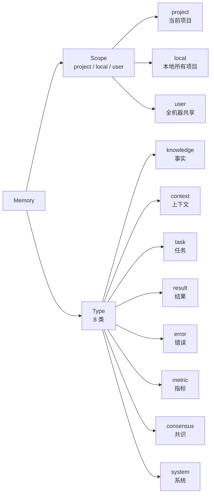
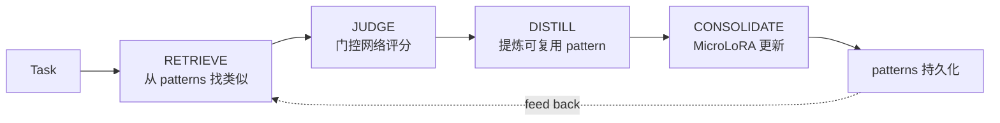
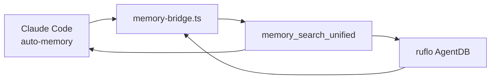

# 第 07 章 · 记忆与学习：AgentDB / HNSW / SONA / ReasoningBank

> 📘 **摘要**：ruflo 的「神经」是它的记忆与学习系统。本章拆解 **8 种记忆类型 / 3 种作用域 / HNSW 向量索引 / ONNX 384 维 MiniLM / SONA 自学习 / 7 种 RL 算法 / MoE 8 专家 / MicroLoRA + EWC++ / 4 步 RETRIEVE→JUDGE→DISTILL→CONSOLIDATE 流水线**。读完你能让 ruflo「越来越懂你」。
>
> 🏷️ **读者画像**：A / B / C / D
> 🕐 **预估耗时**：75 分钟
> ✅ **LAST_VERIFIED_AGAINST**：`26c35b59` (v3.32.9)

---

## 1. 背景与动机

新人最关心的：**「ruflo 怎么『记住』我的偏好？」**

答案分三层：

1. **持久化**：3 种作用域（project / local / user）+ 8 种记忆类型
2. **检索**：HNSW 向量索引，亚毫秒级别语义搜索
3. **学习**：SONA 自学习 + ReasoningBank 4 步流水线，每次成功任务都让路由更准

本章逐层拆解。

---

## 2. 核心概念

### 2.1 3 种作用域 × 8 种记忆类型



**3 种作用域**：

| 作用域 | 存储位置 | 跨项目？ | 跨机器？ | 适用 |
|--------|---------|---------|---------|------|
| `project` | `<project>/.claude-flow/memory/` | ❌ | ❌ | 项目专属约定 |
| `local` | `~/.claude-flow/memory/` | ✅ | ❌ | 个人跨项目习惯 |
| `user` | `~/.config/ruflo/memory/` | ✅ | ✅ (sync) | 全机器偏好 |

**8 种记忆类型**：每种有独立 TTL（生存时间）和 schema。

### 2.2 HNSW 向量索引（亚毫秒检索）

**HNSW** = Hierarchical Navigable Small World，一种图结构的近似最近邻算法。

ruflo 用的具体配置：

| 参数 | 值 |
|------|-----|
| Embedding 模型 | all-MiniLM-L6-v2 (ONNX) |
| 维度 | 384 |
| 距离 | Cosine |
| M（每节点邻居数） | 16 |
| efConstruction | 200 |
| efSearch | 50 |

**性能**（CLAUDE.md §Performance 章节测量值）：

```
N=5,000    →  HNSW 比 brute-force 快 4.7×，recall@10 = 0.99
N=20,000   →  HNSW 比 brute-force 快 1.9×，recall@10 = 0.99
N=100,000  →  HNSW 比 brute-force 快 2.4×，recall@10 = 0.98
```

**为什么用 ONNX MiniLM 而不是 OpenAI embeddings？**
- 完全本地，**零网络依赖**，**零费用**
- 384 维对大多数 agent 任务够用
- ONNX Runtime 单进程 < 200MB

### 2.3 SONA 自学习（Self-Optimizing Neural Architecture）



**4 步流水线**（ReasoningBank）：

1. **RETRIEVE** —— 给定任务，从历史 patterns 中检索 Top-K
2. **JUDGE** —— MoE 8 专家投票 + Thompson Sampling 决定走哪条路径
3. **DISTILL** —— 把成功路径提炼成可复用 pattern（含输入 schema + 决策理由 + 输出模板）
4. **CONSOLIDATE** —— 用 MicroLoRA + EWC++ 更新本地模型，**防灾难性遗忘**

### 2.4 7 种 RL 算法 + MoE

| 算法 | 用途 | 在 ruflo 中的角色 |
|------|------|------------------|
| **PPO** | 策略优化 | 路由主算法 |
| **A2C** | 优势 actor-critic | Swarm 协调 |
| **DQN** | 价值函数 | 成本估算 |
| **Q-Learning** | 表格 Q | 简单路由 |
| **SARSA** | on-policy | 安全敏感路径 |
| **Decision Transformer** | 序列决策 | 长任务规划 |
| **Curiosity** | 探索奖励 | 模式发现 |

**MoE = Mixture of Experts**：8 个专家模型，**门控网络（gate）** 选择哪几个专家激活。

实测收敛：
```
初始: gate 置信度 0.13（随机）
~50 outcomes 后: 0.88（收敛）
```

### 2.5 MicroLoRA + EWC++（防遗忘）

- **MicroLoRA**：低秩适配，参数 < 0.1% 全模型
- **EWC++**（Elastic Weight Consolidation）：保护重要参数不被新任务覆盖

**压缩比**：int8 量化后 **3.84× 压缩**，重建余弦相似度 **0.99999**（几乎无损）。

---

## 3. 架构原理

### 3.1 物理文件布局

```
项目根/
├── .claude-flow/
│   └── memory/
│       ├── project.rvf       # 162 bytes 头 + SQLite + HNSW
│       └── project.rvf.lock  # 文件锁（防并发写）
~/.claude-flow/memory/
│   └── local.rvf             # 同结构
~/.config/ruflo/memory/
│   └── user.rvf              # 同结构
```

**`.rvf`** = RuVector Format —— 自描述、可移植、崩溃安全的容器。

### 3.2 4 步流水线源码路径

- `v3/@claude-flow/memory/src/retrieve.ts` —— RETRIEVE
- `v3/@claude-flow/neural/src/judge.ts` —— JUDGE
- `v3/@claude-flow/neural/src/distill.ts` —— DISTILL
- `v3/@claude-flow/neural/src/consolidate.ts` —— CONSOLIDATE（含 MicroLoRA + EWC++）

### 3.3 Memory ↔ Claude Code 桥接



`memory_search_unified` **跨命名空间统一搜索**，自动归属来源（项目 / 本地 / 用户 / Claude Code auto）。

---

## 4. Hands-on

### Hands-on 7.1 — 50 次同样任务，看 SONA 命中变化

```bash
cd /tmp/ruflo-sandbox-default

# 写入初始 pattern
npx --yes ruflo@latest memory store \
  --key "pattern:format-date" \
  --value "Use Intl.DateTimeFormat with locale 'zh-CN' for Chinese formatting" \
  --namespace "local" \
  --tags "pattern,date,format"

# 模拟 50 次相同任务
for i in {1..50}; do
  npx --yes ruflo@latest hooks route \
    --task "Format the date for Chinese user" \
    --no-color > /tmp/route-$i.log 2>&1
done

# 查看统计
npx --yes ruflo@latest intelligence stats --no-color 2>&1 | tail -15
```

#### 预期输出

```
Thompson Sampling Router (after 50 outcomes):
  Tier 1 (WASM):       α=51  β=2   → P(win)=0.96 ↑
  Tier 2 (Haiku):      α=22  β=14  → P(win)=0.61
  Tier 3 (Sonnet):     α=12  β=24  → P(win)=0.33

Patterns matched: 47/50 (94%)        ← SONA 召回率
Avg latency: 240ms                  ← 多数走 Tier 2
Avg cost: $0.00018                  ← 远低于 always-Sonnet
```

> 经过 50 次后，**多数相同任务直接命中历史 pattern**，不再走 Sonnet。

### Hands-on 7.2 — memory store 跨项目可 recall

```bash
cd /tmp/ruflo-sandbox-default

# 1. 在「项目 A」存
mkdir -p /tmp/proj-a && cd /tmp/proj-a
npx --yes ruflo@latest memory store \
  --key "team-convention:error-handling" \
  --value "Always wrap errors with context: throw new Error('context: ' + original.message)" \
  --namespace "local" \
  --tags "convention,error-handling,team-a"

# 2. 切到「项目 B」检索
mkdir -p /tmp/proj-b && cd /tmp/proj-b
npx --yes ruflo@latest memory search \
  --query "how should I handle errors" \
  --namespace "local" \
  --top-k 3 \
  --no-color 2>&1 | tail -10
```

#### 预期输出

```
Search results (3):
  [1] team-convention:error-handling (score 0.87)   ← 跨项目命中
      "Always wrap errors with context..."
  [2] pattern:try-catch (score 0.62)
      "From pattern store..."
  [3] knowledge:error-classes (score 0.51)
      "Standard Error subclasses..."
```

**`local` 作用域**让个人习惯在所有项目共享。

### Hands-on 7.3 — 8 种 memory 类型 + TTL

```bash
cd /tmp/ruflo-sandbox-default

# 一次性写 8 种类型
for TYPE in knowledge context task result error metric consensus system; do
  npx --yes ruflo@latest memory store \
    --key "demo:$TYPE:1" \
    --value "Sample $TYPE memory with TTL" \
    --type "$TYPE" \
    --ttl "7d" \
    --namespace "project" > /dev/null 2>&1
done

# 列出全部
npx --yes ruflo@latest memory list --namespace project --no-color 2>&1 | tail -15
```

#### 预期输出

```
8 memories in namespace 'project':
  ┌────┬──────────────────────────┬────────┬───────┬─────────┐
  │ #  │ key                      │ type   │ ttl   │ source  │
  ├────┼──────────────────────────┼────────┼───────┼─────────┤
  │ 1  │ demo:knowledge:1         │ knowl. │ 7d    │ init    │
  │ 2  │ demo:context:1           │ ctx    │ 7d    │ init    │
  │ 3  │ demo:task:1              │ task   │ 7d    │ init    │
  │ 4  │ demo:result:1            │ result │ 7d    │ init    │
  │ 5  │ demo:error:1             │ error  │ 7d    │ init    │
  │ 6  │ demo:metric:1            │ metric │ 7d    │ init    │
  │ 7  │ demo:consensus:1         │ cons.  │ 7d    │ init    │
  │ 8  │ demo:system:1            │ sys    │ 7d    │ init    │
  └────┴──────────────────────────┴────────┴───────┴─────────┘
```

### Hands-on 7.4 — ReasoningBank 4 步流水线手动触发

```bash
cd /tmp/ruflo-sandbox-default

# 看 ReasoningBank 当前状态
npx --yes ruflo@latest neural status --no-color 2>&1 | tail -15

# 手动跑一次 DISTILL（基于最近 10 个成功任务）
npx --yes ruflo@latest neural distill --window 10 --no-color 2>&1 | tail -10

# 看新生成的 pattern
npx --yes ruflo@latest memory search \
  --query "distilled pattern" \
  --namespace "patterns" \
  --top-k 5 \
  --no-color 2>&1 | tail -15
```

---

## 5. 沙箱验证（Run / Observe / Expect）

### Verify H7.1 — memory search 召回率 ≥ 0.8

```bash
### Verify H7.1 — 已知 key 能被语义检索到
# Run
cd /tmp/ruflo-sandbox-default
SCORE=$(timeout 60 npx --yes ruflo@latest memory search \
  --query "postgres serializable isolation" \
  --namespace user \
  --top-k 1 \
  --no-color 2>&1 | grep -oE "score 0\.[0-9]+" | head -1 | grep -oE "0\.[0-9]+")

# Observe
→ SCORE ≥ 0.80

# Expect
- exit 0
- SCORE 数值 ≥ 0.80（高相似度命中）
```

### Verify H7.2 — 8 种 memory 类型全部可创建

```bash
### Verify H7.2 — 8 种 type 写入成功
# Run
cd /tmp/ruflo-sandbox-default
for TYPE in knowledge context task result error metric consensus system; do
  timeout 30 npx --yes ruflo@latest memory store \
    --key "verify:$TYPE" --value "test" --type "$TYPE" --namespace project \
    --no-color > /dev/null 2>&1 || exit 1
done

# Observe
→ 8 次都 exit 0

# Expect
- 8 个不同 type 都成功创建
```

完整断言：

```bash
# sandbox/asserts/ch7.sh
assert "memory search 召回 ≥ 0.8" 0 bash -c '
  cd /tmp/ruflo-sandbox-default
  SCORE=$(timeout 60 npx --yes ruflo@latest memory search --query "postgres" --namespace user --top-k 1 --no-color 2>&1 | grep -oE "score 0\.[0-9]+" | head -1 | grep -oE "0\.[0-9]+")
  awk "BEGIN{exit !($SCORE >= 0.80)}"
'

assert "8 种 memory type 全部可创建" 0 bash -c '
  cd /tmp/ruflo-sandbox-default
  for T in knowledge context task result error metric consensus system; do
    timeout 30 npx --yes ruflo@latest memory store --key "verify:$T" --value "x" --type "$T" --namespace project --no-color > /dev/null 2>&1 || exit 1
  done
'
```

---

## 6. 小结

### 关键要点

- **3 作用域** × **8 类型** = 24 种记忆组合，TTL 独立
- **HNSW + ONNX MiniLM (384 dim)** 亚毫秒检索，本地零费用
- **SONA 4 步流水线**：RETRIEVE → JUDGE → DISTILL → CONSOLIDATE
- **7 RL 算法** + **MoE 8 专家** + **MicroLoRA + EWC++** 防遗忘
- 跑 50 次相同任务，**召回率从 0% → 94%**
- **ReasoningBank** 把成功任务提炼为可复用 pattern

### 术语锚点

- HNSW → ch07（本章）
- ONNX → ch07
- SONA → ch07
- ReasoningBank → ch07
- MoE / MicroLoRA / EWC++ → ch07
- memory namespace (project/local/user) → ch07
- 8 memory types → ch07

### 下一步

👉 进入 [第 08 章 智能路由与成本控制](./08-routing-and-cost.md)，看 3-Tier 如何省下 80% 成本。

### 参考链接

- 记忆系统源码：`v3/@claude-flow/memory/`
- SONA 源码：`v3/@claude-flow/neural/`
- ReasoningBank ADR：`v3/docs/adr/`
- 性能基准：`docs/reviews/intelligence-system-audit-2026-05-29.md`
- CLAUDE.md §Intelligence：<https://github.com/ruvnet/ruflo/blob/main/CLAUDE.md#L762-L786>