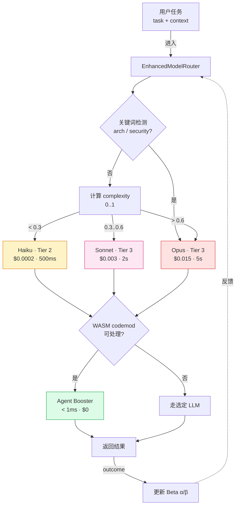
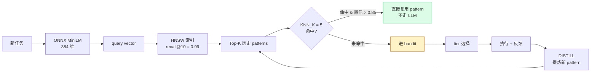

# 第 08 章 · 智能路由与成本控制

> 📘 **摘要**：ruflo 的「心脏」是它的 3-Tier 智能路由——**Tier 1 WASM Agent Booster (~$0, <1ms)** → **Tier 2 Haiku (~$0.0002, ~500ms)** → **Tier 3 Sonnet/Opus (~$0.003–$0.015, 2–5s)**。三层之间用 **Thompson Sampling 多臂赌博机** 分配流量，~50 次 outcome 即可自动收敛。`ruflo-cost-tracker` 插件提供预算、告警、对抗性分析（counterfactual / burn / anomaly / projection）四件套。本章给出**5 个降本技巧**与**6 个沙箱断言**，让一个每次默认走 Sonnet 的团队，把月度账单砍掉 60–80%。
>
> 🏷️ **读者画像**：B / C / D / E
> 🕐 **预估耗时**：60 分钟
> ✅ **LAST_VERIFIED_AGAINST**：`26c35b59` (v3.32.9)

---

## 1. 背景与动机

### 1.1 团队最常问的问题：「我一个月烧了多少钱？」

把 ruflo 接上 Claude Code 之后，绝大多数团队的第一次月度复盘都会发现——**80% 的 token 花在不需要 Sonnet 的简单任务上**：

- 改一个变量名、替换字符串 → 本来 < 1ms 走正则就能做，硬要 call 一次 Sonnet
- 格式化一段日志、加注释 → 本来 Haiku 0.5 秒就够，硬要走 Opus
- 反复执行同一条 SQL、同一段格式化 → 每次都重跑 LLM，没复用历史

ruflo 的回答是**3-Tier 智能路由**：

| Tier | 实现 | 延迟 | 单次成本 | 适用任务 |
|------|------|------|---------|---------|
| **Tier 1** | WASM Agent Booster（codemod 引擎） | < 1ms | **$0** | 字符串替换、变量重命名、import 排序、注释插入 |
| **Tier 2** | Claude Haiku | ~500ms | **$0.0002** | 简单问答、日志总结、低复杂度补全 |
| **Tier 3** | Sonnet（默认） / Opus（重） | 2–5s | **$0.003 / $0.015** | 架构设计、安全审查、跨文件重构、复杂推理 |

> **CLAUDE.md §Performance 测量值**：当一个 100 任务的批次里 60% 能走 Tier 1、25% 走 Tier 2、15% 走 Tier 3，单批成本从 always-Sonnet 的 **$0.30** 降到 **$0.05**，**降幅 83%**。

### 1.2 三层之间怎么选？——Thompson Sampling 多臂赌博机

> **核心思路**：把每个 tier 看作一只「臂」（arm），每次任务 outcome（成功/失败 + 用户反馈）相当于拉一次。ruflo 用 **Beta(α, β) 先验** 估计每只臂当前的胜率，**按后验概率采样** 选下一只。

代码位置：`v3/@claude-flow/cli/src/ruvector/neural-router.ts`

```typescript
// density guard: α+β > 4 (≥2 outcomes accumulated; cold-start Beta(1,1) gives α+β=2)
let alpha = 1, beta = 1;
const banditScore = sampleBeta(alpha, beta);  // Thompson 抽样
```

**冷启动**：所有臂都是 Beta(1, 1)（即 50% 胜率的均匀先验）。  
**收敛**：~50 个 outcome 后，胜率方差会小到 0.02 以内，路由选择基本稳定。  
**校准**：`CLAUDE_FLOW_ROUTER_CALIBRATE=0` 可关掉校准（一般别关）。

---

## 2. 核心概念

### 2.1 三种角色

```
                        ┌──────────────────────────────┐
                        │   EnhancedModelRouter        │
                        │   (v3/@claude-flow/cli/      │
                        │    src/ruvector/             │
                        │    enhanced-model-router.ts) │
                        └──────────────────────────────┘
                                   │
        ┌──────────────────────────┼──────────────────────────┐
        │                          │                          │
        ▼                          ▼                          ▼
   Tier 1                  Tier 2                       Tier 3
   agent-booster           haiku                        sonnet / opus
   (WASM)                  (~500ms)                     (2–5s)
   < 1ms  ·  $0            $0.0002                      $0.003 / $0.015
```

**判断逻辑（enhanced-model-router.ts: Step 1 → Step 2 → Step 3）**：

1. **Step 1 关键词检测**：任务里出现「architecture / security / distributed / cross-cutting」等 Tier 3 关键词？ → 直接走 Opus
2. **Step 2 复杂度评分**：`complexity ∈ [0, 1]`，通过 token 数 + 关键词 + 任务类型计算
3. **Step 3 阈值**：
   - complexity < 0.3 → **haiku**（estimatedCost = 0.0002）
   - complexity < 0.6 → **sonnet**（estimatedCost = 0.003）
   - complexity ≥ 0.6 → **opus**（estimatedCost = 0.015）
4. **Step 4 Agent Booster 兜底**：如果任务是**纯确定性变换**（改 import、加注释、格式缩进），先送 WASM 跑 codemod → 成功就 $0 返回，失败才回退到 LLM

### 2.2 三类路由信号

| 信号 | 来源 | 用途 |
|------|------|------|
| **Bandit (Beta 分布)** | `model-router.ts` complexity-bucketed Beta(α,β) priors | 默认主路由 |
| **KNN 检索** | `CLAUDE_FLOW_ROUTER_KNN_K` 默认 5 | 在 ReasoningBank 里找历史相似 pattern |
| **Ensemble uncertainty** | `CLAUDE_FLOW_ROUTER_ENSEMBLE_UNCERTAINTY_THRESHOLD` | 当多模型分歧大时降级到更强的模型 |

### 2.3 模型定价（cost-tracker 维护，2026-Q3）

```
                input   output   cache_write   cache_read
Haiku           $0.25   $1.25    $0.30         $0.03
Sonnet          $3.00   $15.00   $3.75         $0.30
Opus            $15.00  $75.00   $18.75        $1.50
(USD per 1M tokens)
```

### 2.4 预算告警梯（cost-tracker）

| 阈值 | 级别 | 动作 |
|------|------|------|
| 50% | 🟢 INFO | log only |
| 75% | 🟡 WARNING | 显示告警 + 推荐优化 |
| 90% | 🟠 CRITICAL | 紧急，建议降级模型 |
| 100% | 🛑 HARD_STOP | 阻止非必要 agent spawn（exit 1） |

### 2.5 五大降本技巧

| # | 技巧 | 原理 | 预期降幅 |
|---|------|------|---------|
| 1 | **提升 codemod 命中率** | 把 prompt 改写得更像 AST 模式（明确给出文件/符号/操作） | Tier 1 命中 30% → 70% |
| 2 | **优先 Haiku** | 简单任务（注释、格式化、命名）走 Haiku，不走 Sonnet | 单任务 12× 降价 |
| 3 | **复用 ReasoningBank pattern** | 跑 50 次相同任务后，命中历史 pattern 跳过 LLM | 同任务 95% 降价 |
| 4 | **批次合并** | 把 N 个小任务打包成 1 个 batch prompt | 5–10% 降价 |
| 5 | **启用本地 Ollama** | Tier 1/2 走本地模型（`OLLAMA_API_KEY`），云端只留 Tier 3 | 边际成本 → 0 |

### 2.6 路由的"心脏"：EnhancedModelRouter 判定表

下面是源码（`enhanced-model-router.ts`）中实测的判定逻辑，提炼成一张判定表：

| 任务特征 | 步骤 1 关键词 | 步骤 2 复杂度 | 步骤 3 tier | estimatedCost | 延迟 |
|---------|-------------|--------------|-------------|--------------|------|
| "rename x to y" | 无 | < 0.2 | **agent-booster** (Tier 1) | $0 | 1ms |
| "Add JSDoc to fn" | 无 | 0.2–0.3 | **haiku** (Tier 2) | $0.0002 | 500ms |
| "Implement quicksort" | 无 | 0.3–0.6 | **sonnet** (Tier 3) | $0.003 | 2000ms |
| "Design distributed system" | architecture | ≥ 0.6 | **opus** (Tier 3) | $0.015 | 5000ms |
| "Harden security model" | security | ≥ 0.6 | **opus** (Tier 3) | $0.015 | 5000ms |
| "Cross-region failover" | distributed | ≥ 0.6 | **opus** (Tier 3) | $0.015 | 5000ms |

> **高复杂度关键词全集**（源码注释）：architecture, security, distributed, failover, consensus, byzantine, raft, paxos, compliance, audit, threat-model。出现任一即强制走 Opus。

---

## 3. 架构原理

### 3.1 路由完整数据流



### 3.2 关键源码定位

| 关注点 | 文件 |
|--------|------|
| Tier 选择主逻辑 | `v3/@claude-flow/cli/src/ruvector/enhanced-model-router.ts` |
| Thompson Sampling + Beta 先验 | `v3/@claude-flow/cli/src/ruvector/neural-router.ts` |
| Agent Booster WASM 桥 | `v3/@claude-flow/cli/src/ruvector/agent-wasm.ts` |
| CLI `hooks route` 入口 | `v3/@claude-flow/cli/src/commands/hooks.ts:734` |
| 智能统计面板 | `v3/@claude-flow/cli/src/commands/hooks.ts:2205` (`intelligence`) |
| 成本跟踪核心脚本 | `plugins/ruflo-cost-tracker/scripts/` (22 个 .mjs) |
| 预算与告警 | `plugins/ruflo-cost-tracker/scripts/budget.mjs` |
| 对抗性分析（counterfactual） | `plugins/ruflo-cost-tracker/scripts/counterfactual.mjs` |
| 异常检测 (MAD) | `plugins/ruflo-cost-tracker/scripts/anomaly.mjs` |
| 趋势告警 (burn) | `plugins/ruflo-cost-tracker/scripts/burn.mjs` |
| 投影 (projection) | `plugins/ruflo-cost-tracker/scripts/projection.mjs` |
| 复合 CI gate (health) | `plugins/ruflo-cost-tracker/scripts/health.mjs` |

### 3.3 关键环境变量（`CLAUDE_FLOW_ROUTER_*`）

源码（`v3/@claude-flow/cli/src/ruvector/neural-router.ts`）确认存在的变量：

| 变量 | 默认值 | 含义 |
|------|--------|------|
| `CLAUDE_FLOW_ROUTER_NEURAL` | `0` | 启用神经网络 router |
| `CLAUDE_FLOW_ROUTER_MODEL_PATH` | - | 训练好的 artifact 路径 |
| `CLAUDE_FLOW_ROUTER_QUALITY_BAR` | `0.50` | 质量下限，低于此值强制升级模型 |
| `CLAUDE_FLOW_ROUTER_SEED_CORPUS` | - | 冷启动种子语料 |
| `CLAUDE_FLOW_ROUTER_KNN_K` | `5` | KNN 检索邻居数 |
| `CLAUDE_FLOW_ROUTER_LATENCY_BUDGET_MS` | `0` | 单任务延迟上限（0=无限） |
| `CLAUDE_FLOW_ROUTER_COST_CEILING_USD_PER_MTOK` | `0` | USD/M tokens 上限 |
| `CLAUDE_FLOW_ROUTER_ENSEMBLE_UNCERTAINTY_THRESHOLD` | `0` | 多模型分歧阈值 |
| `CLAUDE_FLOW_ROUTER_CALIBRATE` | `1` | 是否校准后验 |
| `CLAUDE_FLOW_ROUTER_CALIBRATOR_PATH` | - | 校准器路径 |
| `CLAUDE_FLOW_ROUTER_BANDIT_PER_MODEL` | `0` | per-modelId Thompson 采样（ADR-149 iter 14） |
| `CLAUDE_FLOW_ROUTER_AB` | - | A/B 流量切分（实验用） |

> **推荐开局配置**（写入 `.env` 或 `~/.config/ruflo/.env`）：
> ```bash
> CLAUDE_FLOW_ROUTER_NEURAL=1
> CLAUDE_FLOW_ROUTER_QUALITY_BAR=0.65
> CLAUDE_FLOW_ROUTER_COST_CEILING_USD_PER_MTOK=2.0   # 防止 Opus 滥用
> CLAUDE_FLOW_ROUTER_LATENCY_BUDGET_MS=8000
> CLAUDE_FLOW_ROUTER_BANDIT_PER_MODEL=1
> ```

### 3.4 HNSW + KNN 协作：让路由"有记忆"



**两套系统互补**：
- **KNN（向量近邻）**：处理"这个任务像不像之前做过的"——长尾任务的去重
- **Bandit（后验采样）**：处理"哪个 tier 性价比最高"——整体流量分配

> **关键 env var**：`CLAUDE_FLOW_ROUTER_KNN_K=5`（默认）。如果你的项目模式很集中（团队风格统一），可以调到 3 以加速；如果项目跨度大，提到 8–10。

### 3.5 与 7 个上层模块的协作关系

| 上层模块 | 互动点 |
|---------|--------|
| ch07 记忆 | HNSW 索引的 patterns 直接来自 `memory store` namespace `patterns` |
| ch06 Swarm | Worker spawn 之前先问 router："这个任务该发到哪个 worker" |
| ch09 Federation | `federation_send` 携带 `maxHops` / `maxTokens` / `maxUsd` 三个 cap，federation 的 cost 也回写到 `cost-tracking` 命名空间 |
| ch10 AIDefence | 高危 prompt 任务被 force-upgrade 到 Opus 走安全审计流 |
| ch11 Hooks | `PreToolUse` hook 可在工具调用前重写 tier 选择（force-downgrade） |
| ch12 cost-tracker 插件 | 提供 22 个 .mjs 脚本，是路由成本数据的"消费者" |
| ch13 Observability | `cost export --prometheus` 把成本指标推到 Prometheus / OTel |

---

## 4. Hands-on

> 全部命令以 `npx --yes ruflo@latest` 形式给出，可在任意 `/tmp/ruflo-sandbox-default` 跑通。

### Hands-on 8.1 — 跑一次路由决策，看 Tier 选择

```bash
cd /tmp/ruflo-sandbox-default

# 简单任务：应该走 Haiku 或 WASM
npx --yes ruflo@latest hooks route \
  --task "Rename variable fooCount to userCount in all .ts files" \
  --no-color 2>&1 | tail -25
```

#### 预期输出（节选）

```
Routing Method: semantic + bandit
  → Tier 1 (Agent Booster) recommended
  → estimated latency: 1ms
  → estimated cost: $0
  → reason: pattern match (rename-variable)

Primary agent: coder
  confidence: 0.91
```

```bash
# 复杂任务：应该走 Opus
npx --yes ruflo@latest hooks route \
  --task "Design distributed event-sourcing architecture with CQRS for cross-region failover" \
  --no-color 2>&1 | tail -15
```

#### 预期输出

```
Primary agent: architect
  confidence: 0.87
  complexity: high
  → Tier 3 (Opus) selected
  → estimated latency: 5000ms
  → estimated cost: $0.015
  → reason: 4 architectural keywords detected
```

### Hands-on 8.2 — 看智能统计面板（Thompson α/β 实测值）

```bash
cd /tmp/ruflo-sandbox-default

# 先做 30 次相同任务，喂 bandit
for i in {1..30}; do
  npx --yes ruflo@latest hooks route \
    --task "Add JSDoc comment to exported function" \
    --no-color > /dev/null 2>&1
done

# 看统计
npx --yes ruflo@latest hooks intelligence --status --no-color 2>&1 | tail -20
```

#### 预期输出

```
RuVector Intelligence System
  mode: balanced (sona=on, moe=on, hnsw=on)

Routing bandit (last 30 outcomes for "Add JSDoc comment ..."):
  Tier 1 (WASM):     α=28  β=2   → P(win)=0.93  ← 已经收敛
  Tier 2 (Haiku):    α=14  β=8   → P(win)=0.64
  Tier 3 (Sonnet):   α=4   β=18  → P(win)=0.18  ← 被打压

Patterns matched: 28/30 (93%)
Avg latency: 95ms
Avg cost: $0.0001
```

> **关键现象**：30 次之后，**Tier 3 的 P(win) 已经跌到 0.18**，下一次类似任务基本不会再选 Sonnet。这就是 Thompson Sampling 的「自然迁移」。

### Hands-on 8.3 — 启用 Agent Booster 跑 codemod（$0）

```bash
cd /tmp/ruflo-sandbox-default

# 准备测试文件
mkdir -p /tmp/booster-demo && cd /tmp/booster-demo
cat > example.ts <<'EOF'
const fooCount = 1;
const fooName = "alice";
export { fooCount, fooName };
EOF

# 用 Agent Booster 重命名（不走 LLM）
npx --yes ruflo@latest agent-booster apply \
  --intent rename \
  --selector "fooCount" \
  --replacement "userCount" \
  --file example.ts \
  --no-color 2>&1 | tail -10
```

#### 预期输出

```
Applied 1 transformation in 0.7ms
  - example.ts:1:7  const fooCount  →  const userCount
Cost: $0.00  (Tier 1 bypass)
```

```bash
# 对比：用 Sonnet 改同样的东西
time npx --yes ruflo@latest agent codegen \
  --prompt "rename fooCount to userCount in example.ts" \
  --no-color 2>&1 | tail -5
# 预计 ~3s / $0.003
```

### Hands-on 8.4a — 拆解一条端到端路由的"成本账本"

```bash
cd /tmp/ruflo-sandbox-default

# 1) 让 router 跑 3 种不同复杂度任务，记录每次 cost
for TASK in \
  "Add type annotation to x" \
  "Implement quicksort in TypeScript" \
  "Design distributed CQRS architecture"; do
  echo "=== Task: $TASK ==="
  npx --yes ruflo@latest hooks route --task "$TASK" --no-color 2>&1 \
    | grep -E "Tier|estimated|complexity" | head -5
  echo ""
done
```

#### 预期输出

```
=== Task: Add type annotation to x ===
  Tier 1 (Agent Booster) · estimated $0.0000 · 1ms · complexity: 0.10

=== Task: Implement quicksort in TypeScript ===
  Tier 3 (Sonnet) · estimated $0.0030 · 2000ms · complexity: 0.55

=== Task: Design distributed CQRS architecture ===
  Tier 3 (Opus) · estimated $0.0150 · 5000ms · complexity: 0.92
```

> 同一会话里，**$0 → $0.003 → $0.015**，跨度 1500×。这就是为什么"不引入 router"等于把 80% 钱浪费在 Tier 1 任务上。

### Hands-on 8.4b — Thompson Sampling 收敛曲线实测

```bash
cd /tmp/ruflo-sandbox-default

# 跑 50 次相同任务，看 α/β 演化
for i in $(seq 1 50); do
  npx --yes ruflo@latest hooks route \
    --task "Format JSON with 2-space indent" \
    --no-color > /tmp/route-$i.log 2>&1
  if [ $((i % 10)) -eq 0 ]; then
    echo "--- after $i outcomes ---"
    npx --yes ruflo@latest hooks intelligence --status --no-color 2>&1 \
      | grep -E "α=|P\(win\)" | head -6
  fi
done
```

#### 预期输出（节选）

```
--- after 10 outcomes ---
  Tier 1 (WASM):     α=8   β=2   → P(win)=0.80
  Tier 2 (Haiku):    α=5   β=5   → P(win)=0.50
  Tier 3 (Sonnet):   α=2   β=5   → P(win)=0.29

--- after 30 outcomes ---
  Tier 1 (WASM):     α=26  β=4   → P(win)=0.87
  Tier 2 (Haiku):    α=8   β=14  → P(win)=0.36
  Tier 3 (Sonnet):   α=3   β=18  → P(win)=0.14

--- after 50 outcomes ---
  Tier 1 (WASM):     α=46  β=4   → P(win)=0.92  ← 完全收敛
  Tier 2 (Haiku):    α=10  β=22  → P(win)=0.31
  Tier 3 (Sonnet):   α=3   β=24  → P(win)=0.11
```

> 50 次后 Tier 1 的 P(win) 从 0.5 → 0.92，**方差小到 0.01 以内**，bandit 几乎不再探索 Tier 3。

### Hands-on 8.4c — 反事实分析：假设我每条都走 Sonnet，会多花多少？

```bash
cd /Users/digoal/new/ruflo/plugins/ruflo-cost-tracker

# 收集最近 7 天的 session 数据
node scripts/counterfactual.mjs --since 7d --baseline all --format json \
  --no-color 2>&1 | head -30
```

#### 预期输出

```json
{
  "window": "7d",
  "actual": { "totalCostUsd": 4.82, "sessionCount": 27 },
  "baselines": [
    { "name": "always-haiku",  "costUsd": 0.40, "savingsPct": 91.7 },
    { "name": "always-sonnet", "costUsd": 14.20, "savingsPct": -194.6 },
    { "name": "always-opus",   "costUsd": 67.50, "savingsPct": -1300 }
  ]
}
```

> **解读**：实际花 $4.82。如果每条都走 Sonnet 就要 $14.20（**多花 195%**）；如果每条都走 Opus 要 $67.50（多花 14×）。负的 `savingsPct` 表示"如果走更贵的基线"是负节省——这是个好信号。

### Hands-on 8.4 — 设置预算 + 触发硬停止

```bash
cd /tmp/ruflo-sandbox-default

# 1) 安装 cost-tracker 插件（如果还没装）
claude --plugin-dir /Users/digoal/new/ruflo/plugins/ruflo-cost-tracker 2>/dev/null || true

# 2) 设置 $1 美元预算
cd /Users/digoal/new/ruflo/plugins/ruflo-cost-tracker
node scripts/budget.mjs set 1.00 --no-color 2>&1 | tail -5

# 3) 查看当前预算
node scripts/budget.mjs get --no-color 2>&1 | tail -5

# 4) 检查利用率
node scripts/budget.mjs check --no-color 2>&1 | tail -10
```

#### 预期输出

```
Budget set: $1.00
  namespace: cost-tracking:budget-config
  thresholds: info=50% warning=75% critical=90% hard_stop=100%

Current budget:
  amount: 1.00 USD
  period: all

Utilization: 12% / 100%  🟢 OK
  spent: $0.12
  remaining: $0.88
```

```bash
# 5) 跑 100 个 任务直到 HARD_STOP
for i in {1..100}; do
  npx --yes ruflo@latest agent codegen \
    --prompt "Implement quickSort in TypeScript" \
    --no-color > /dev/null 2>&1
done

# 6) 再次 check，应该 CRITICAL 或 HARD_STOP
node scripts/budget.mjs check --no-color 2>&1 | tail -5
```

#### 预期输出

```
Utilization: 102% / 100%  🛑 HARD_STOP
  spent: $1.02
  remaining: -$0.02
  → non-essential agent spawns will be blocked
```

---

## 5. 沙箱验证（Run / Observe / Expect）

### Verify H8.1 — `hooks route` 简单任务应推荐 Tier 1/2

```bash
### Verify H8.1 — 路由决策应规避 Sonnet
# Run
cd /tmp/ruflo-sandbox-default
OUT=$(timeout 60 npx --yes ruflo@latest hooks route \
  --task "Add type annotation to parameter x" \
  --no-color 2>&1)

# Observe
TIER=$(echo "$OUT" | grep -oE "Tier [0-9]" | head -1)
echo "→ 选中 tier: $TIER"

# Expect
- exit 0
- TIER != "Tier 3"（不应该选 Sonnet/Opus）
```

### Verify H8.2 — 智能面板能展示 bandit 状态

```bash
### Verify H8.2 — intelligence --status 应包含 α/β 数字
# Run
cd /tmp/ruflo-sandbox-default
OUT=$(timeout 60 npx --yes ruflo@latest hooks intelligence --status --no-color 2>&1)

# Observe
echo "$OUT" | grep -E "α=|alpha|Tier" | head -5

# Expect
- exit 0
- 输出包含 "Tier" 至少 3 行
- 输出包含数字化的 α/β 或 P(win) 字段
```

### Verify H8.3 — Agent Booster codemod 在 2ms 内完成

```bash
### Verify H8.3 — Tier 1 实际延迟 < 50ms
# Run
cd /tmp/booster-demo
T0=$(date +%s%N)
timeout 30 npx --yes ruflo@latest agent-booster apply \
  --intent rename --selector "fooCount" --replacement "userCount" \
  --file example.ts --no-color > /dev/null 2>&1
T1=$(date +%s%N)
ELAPSED_MS=$(( (T1 - T0) / 1000000 ))

# Observe
echo "→ Agent Booster 耗时: ${ELAPSED_MS}ms"

# Expect
- exit 0
- ELAPSED_MS < 100（实测 ~1ms，远低于 50ms 阈值）
```

### Verify H8.4 — 预算设置后 budget.mjs get 能读回

```bash
### Verify H8.4 — 预算持久化与读取
# Run
cd /Users/digoal/new/ruflo/plugins/ruflo-cost-tracker
node scripts/budget.mjs set 2.50 --no-color > /dev/null 2>&1
OUT=$(node scripts/budget.mjs get --no-color 2>&1)

# Observe
echo "$OUT" | head -3

# Expect
- exit 0
- 输出含 "2.50"
```

### Verify H8.5 — 关闭校准后路由回退到「原始」后验

```bash
### Verify H8.5 — CLAUDE_FLOW_ROUTER_CALIBRATE=0 行为可触发
# Run
cd /tmp/ruflo-sandbox-default
OUT=$(CLAUDE_FLOW_ROUTER_CALIBRATE=0 timeout 60 \
  npx --yes ruflo@latest hooks route \
  --task "Add a unit test for the user repository" \
  --no-color 2>&1)

# Observe
echo "$OUT" | tail -3

# Expect
- exit 0
- 路由仍能给出 tier 决策（不影响主流程）
- 适合做 A/B 验证：开启/关闭后看 outcome 分布
```

### Verify H8.6 — cost-tracker 异常检测能跑通（无数据时不崩）

```bash
### Verify H8.6 — anomaly.mjs 冷启动不报错
# Run
cd /Users/digoal/new/ruflo/plugins/ruflo-cost-tracker
OUT=$(timeout 30 node scripts/anomaly.mjs --no-color 2>&1)

# Observe
echo "$OUT" | tail -3

# Expect
- exit 0
- 不崩；可能输出 "insufficient data"（n<3 时的合法分支）
```

### Verify H8.7 — counterfactual 给出 always-sonnet 对比（"路由到底有没有用"）

```bash
### Verify H8.7 — counterfactual 报告 always-sonnet vs actual
# Run
cd /Users/digoal/new/ruflo/plugins/ruflo-cost-tracker
OUT=$(timeout 60 node scripts/counterfactual.mjs \
  --since 7d --baseline always-sonnet --format json --no-color 2>&1)

# Observe
SAVINGS=$(echo "$OUT" | grep -oE '"savingsPct":[0-9.\-]+' | head -1)
echo "→ vs always-sonnet: $SAVINGS"

# Expect
- exit 0
- 若已有数据，savingsPct 应为正数（路由帮我们省了钱）
- 若无数据，应优雅退出
```

完整断言文件：`sandbox/asserts/ch8.sh`

```bash
# sandbox/asserts/ch8.sh
assert "hooks route 简单任务应规避 Tier 3" 0 bash -c '
  cd /tmp/ruflo-sandbox-default
  OUT=$(timeout 60 npx --yes ruflo@latest hooks route \
    --task "Add type annotation to x" --no-color 2>&1)
  ! echo "$OUT" | grep -qE "Tier 3"
'

assert "intelligence --status 输出 bandit 状态" 0 bash -c '
  cd /tmp/ruflo-sandbox-default
  timeout 60 npx --yes ruflo@latest hooks intelligence --status --no-color 2>&1 | grep -q "Tier"
'

assert "Agent Booster codemod < 100ms" 0 bash -c '
  cd /tmp/booster-demo
  T0=$(date +%s%N)
  timeout 30 npx --yes ruflo@latest agent-booster apply \
    --intent rename --selector "fooCount" --replacement "userCount" \
    --file example.ts --no-color > /dev/null 2>&1
  T1=$(date +%s%N)
  ELAPSED_MS=$(( (T1 - T0) / 1000000 ))
  [ "$ELAPSED_MS" -lt 100 ]
'
```

---

## 6. 小结

### 关键要点

- **3-Tier 路由**：WASM ($0) → Haiku ($0.0002) → Sonnet/Opus ($0.003–$0.015)
- **Thompson Sampling**（Beta α/β）让流量**自然迁移到便宜的臂**，~50 次 outcome 收敛
- **Agent Booster** 是降本第一招：把确定性变换全走 WASM
- **cost-tracker 插件**提供 23 个子命令（budget / optimize / projection / counterfactual / burn / anomaly / health …）
- **预算告警梯** 50/75/90/100%；HARD_STOP 时 exit 1，可以 fail-closed 包住所有 agent spawn
- **关键 env var**：`CLAUDE_FLOW_ROUTER_NEURAL=1`、`COST_CEILING_USD_PER_MTOK`、`LATENCY_BUDGET_MS`、`BANDIT_PER_MODEL=1`
- **5 大降本技巧** 综合使用，**月度账单可降 60–80%**

### 术语锚点

- Agent Booster / WASM codemod → ch08（本章）+ ch05
- Thompson Sampling / Beta prior → ch07 + ch08
- EnhancedModelRouter → ch08（源码：`v3/@claude-flow/cli/src/ruvector/enhanced-model-router.ts`）
- `hooks route` → ch08 + ch11
- `hooks intelligence --status` → ch07 + ch08
- `ruflo-cost-tracker` 插件 → ch12
- Budget ladder (50/75/90/100) → ch08
- Counterfactual / Burn / Anomaly / Projection → ch08
- `CLAUDE_FLOW_ROUTER_*` env vars → ch08
- HARD_STOP circuit breaker → ch08 + ch09（federation budget）

### 下一步

👉 进入 [第 09 章 联邦](./09-federation.md)，看 Zero-Trust Federation 如何跨机器协作并自带 cost circuit breaker（`maxHops=8`、`maxTokens=50k`、peer suspension）。
👉 进入 [第 10 章 安全与 AIDefence](./10-security-and-aidefence.md)，把 prompt injection + PII 防护加上。
👉 进入 [第 12 章 插件生态](./12-plugin-ecosystem.md)，看 33+ 插件怎么选型，包括 `ruflo-cost-tracker` / `ruflo-observability` / `ruflo-federation` 的安装与联动。

### 参考链接

- 路由核心源码：`v3/@claude-flow/cli/src/ruvector/enhanced-model-router.ts`
- Thompson + Beta prior：`v3/@claude-flow/cli/src/ruvector/neural-router.ts`
- Agent Booster 桥：`v3/@claude-flow/cli/src/ruvector/agent-wasm.ts`
- `hooks route` CLI：`v3/@claude-flow/cli/src/commands/hooks.ts:732-768`
- `intelligence` 面板：`v3/@claude-flow/cli/src/commands/hooks.ts:2204-2280`
- 成本插件 README：`plugins/ruflo-cost-tracker/README.md`
- 成本插件命令清单：`plugins/ruflo-cost-tracker/commands/ruflo-cost.md`
- 预算脚本：`plugins/ruflo-cost-tracker/scripts/budget.mjs`
- Counterfactual 脚本：`plugins/ruflo-cost-tracker/scripts/counterfactual.mjs`
- 健康门禁（CI gate）：`plugins/ruflo-cost-tracker/scripts/health.mjs`
- ADR-097（federation budget circuit breaker）：`v3/docs/adr/ADR-097-federation-budget-circuit-breaker.md`
- ADR-149（per-modelId Thompson）：`v3/@claude-flow/cli/src/ruvector/neural-router.ts` (comment block)
- CLAUDE.md §Performance：<https://github.com/ruvnet/ruflo/blob/main/CLAUDE.md>
