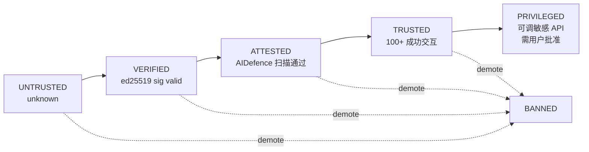
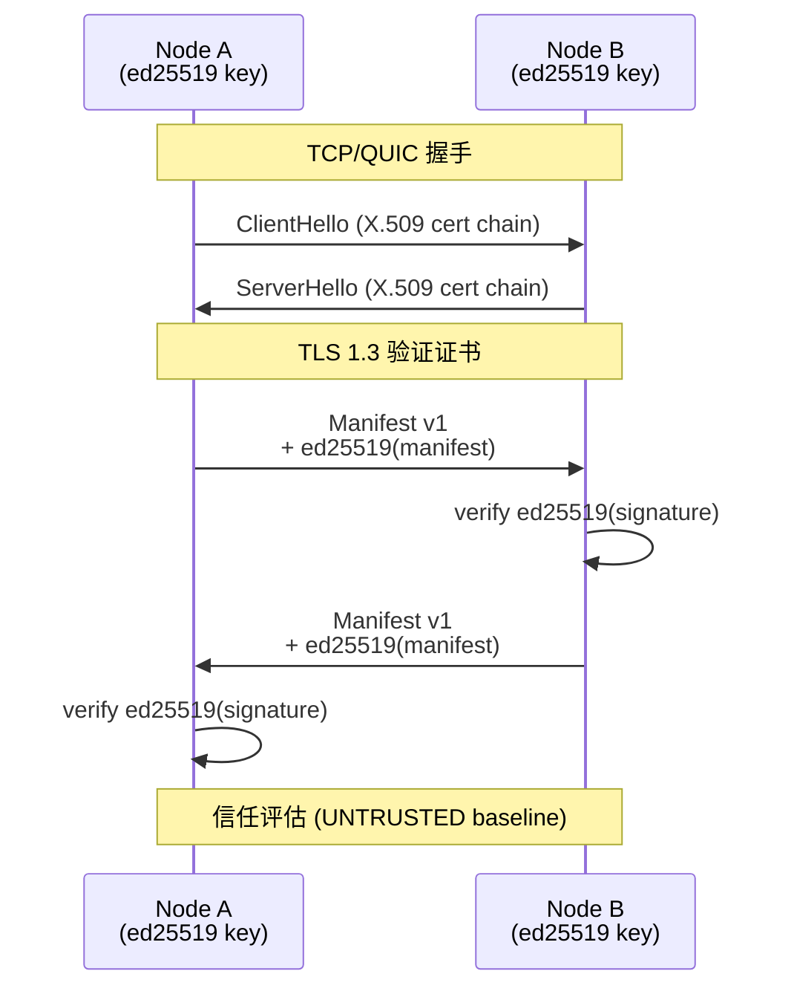
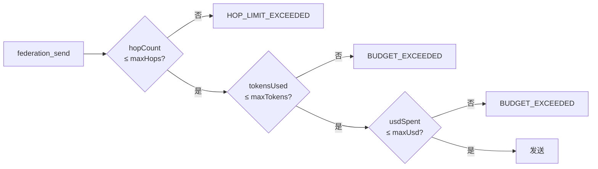
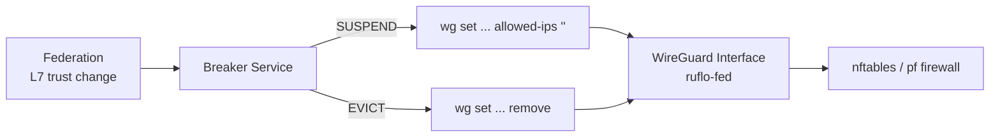
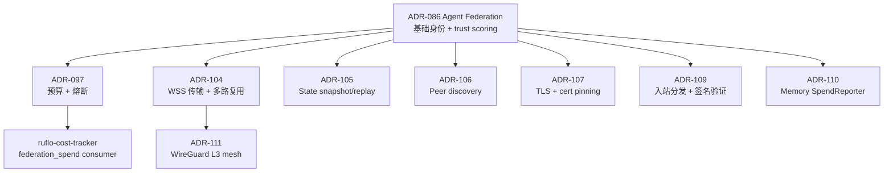

# 第 09 章 · 联邦：mTLS + ed25519 + 五级信任

> 📘 **摘要**：联邦（federation）是 ruflo 的「跨机器协作层」。本章拆解 **Slack for Agents 的设计哲学 / 五级信任阶梯（UNTRUSTED → VERIFIED → ATTESTED → TRUSTED → PRIVILEGED）/ mTLS + ed25519 双层身份 / 14 类 PII + 4 级策略矩阵 / 预算熔断器（ADR-097）/ 可选 WireGuard L3 网状层（ADR-111）/ 6 条 CLI 命令 + 13 个 MCP 工具**。读完你能让两台电脑上的 agent 安全协作。
>
> 🏷️ **读者画像**：A / B / C / D
> 🕐 **预估耗时**：60 分钟
> ✅ **LAST_VERIFIED_AGAINST**：`26c35b59` (v3.32.9)

---

## 1. 背景与动机

联邦解决的是 **「跨机器 agent 协作」**。过去两台电脑想让两个 Claude 一起干活只能通过 Slack / 邮件 / Git PR —— 中间有 3 个传统痛点：

1. **信任（Trust）**：这个远端 agent 是谁？谁签发的身份？
2. **PII（隐私）**：消息传过去会不会泄露手机号、API key？
3. **审计（Audit）**：它到底做了什么？有没有越权？

ruflo 的 **Federation** 是一套 **零信任（zero-trust）** 的 agent-to-agent 通信层：每个节点持有 ed25519 私钥、所有消息经过 mTLS 加密 + 签名、AIDefence 全程扫描、每次状态跃迁写入审计链。

**核心定位**：**Federation 不是 Slack**。它不做人类聊天，不做通用 RPC，而是 **为 AI agent 定制的、有成本上限和信任门槛的协作总线**。

### 适用与不适用

| 场景 | 适合联邦？ |
|------|-----------|
| 两台 Mac 协作做项目，要共享记忆 + 审计 | ✅ |
| 个人家用服务器 agent ↔ 旅行笔记本 | ✅ |
| 5 人团队跨机器共享 memory / skills | ✅ |
| 移动 / Windows / NAT 严格的场景 | ✅ (Tailscale 之上跑联邦) |
| 暴露在公网的 agent 端点 | ✅ (TLS cert pinning, ADR-107) |
| 内部 HR / Finance 多 agent 严格分级 | ✅ (PRIVILEGED 门 + 审计) |
| 替换 Slack / Discord 给人类聊天 | ❌ |
| 不做身份核验就开放互联网消息 | ❌ (信任阶梯必须带外引导) |

---

## 2. 核心概念

### 2.1 五级信任阶梯（Trust Ladder）

联邦中 **每个 peer 都有一个信任等级**，等级决定它能调用哪些操作：



| Level | 联邦能力解锁 | WireGuard (ADR-111) 覆盖 |
|-------|------------|------------------------|
| `UNTRUSTED` | `discovery` | 排除在 mesh 外，全部 drop |
| `VERIFIED` | `+ status, ping` | 仅发现端口 9100 |
| `ATTESTED` | `+ send, receive, query-redacted` | + 联邦消息端口 9101-9199 |
| `TRUSTED` | `+ share-context, collaborative-task` | + ssh 22, http 80/443 |
| `PRIVILEGED` | `+ full-memory, remote-spawn` | 完整 mesh |

**信任如何升降**：

- **升**：每完成一次成功交互，`TrustEvaluator` 增加分数；达到阈值自动升级
- **降**：行为异常（超时、错误、PII 触发 BLOCK）扣分；连续失败直接 BANNED

**关键不变量**：**UNTRUSTED peer 永远只能发 `discovery`**，无法发送任何业务消息 —— 即使有人拿到你的 endpoint URL 也无法越权。

### 2.2 mTLS + ed25519 双层身份

联邦握手走 **两层身份验证**：



| 层 | 作用 | 凭证 |
|----|------|-----|
| **mTLS** | 通道加密 + 服务端认证 | X.509 证书链 |
| **ed25519** | 节点身份 + 消息完整性 | Ed25519 签名 manifest |

**关键设计**：
- **ed25519 私钥持久化**在 `.claude-flow/federation/keys-<nodeId>.json`，权限 `0600`
- **manifest 自描述**：节点能力（agent 类型）+ 公钥 + endpoint URL
- **签名不可伪造**：ed25519 签名验证失败 → 立即断连，不重试

**TLS cert pinning (ADR-107)**：高级模式，强制只接受特定 CA 签发的证书。公网部署必备。

### 2.3 PII 14 类检测 + 4 级策略

每条跨节点消息都要过 AIDefence 的 **PII 流水线**（14 类）：

| 类别 | 例子 | 默认策略 |
|------|------|----------|
| 姓名 (Name) | 张三 / John Smith | REDACT |
| 邮箱 (Email) | user@example.com | REDACT |
| 电话 (Phone) | +1-555-1234 | REDACT |
| SSN | 123-45-6789 | **BLOCK** |
| 信用卡 | 4111-1111-1111-1111 | **BLOCK** |
| IP 地址 | 192.168.1.1 | HASH |
| 地址 | 北京市朝阳区... | REDACT |
| 护照 | G12345678 | **BLOCK** |
| API Key | sk-ant-api03-... | **BLOCK** |
| Token | github_pat_... | **BLOCK** |
| 生物特征 | 指纹/人脸描述 | **BLOCK** |
| 健康数据 | 诊断、药物 | **BLOCK** (HIPAA) |
| 财务数据 | 账户/余额 | REDACT |
| 位置 | GPS 坐标 | HASH |

**4 级策略矩阵**：

| 策略 | 行为 | 适用 |
|------|------|------|
| `BLOCK` | 整条消息丢弃，返回 403 | SSN / 信用卡 / 密钥 |
| `REDACT` | 字段替换为 `[REDACTED:type]` | 邮箱 / 电话 |
| `HASH` | 替换为 sha256 前 8 位 | IP 地址（保留分析能力） |
| `PASS` | 原文透传 | 无敏感字段 |

**Policy 因信任等级变化**：
- `UNTRUSTED` peer → 任何 PII 都触发 `BLOCK`
- `ATTESTED` peer → 默认策略
- `TRUSTED+` peer → 可放宽（用户可配置）

### 2.4 预算熔断器（ADR-097）

**最危险的攻击向量**：一个 peer 收到任务后，反向递归调用本节点 → 本节点再调它 → 死循环 / 雪崩。

ruflo 用 **3 道阀门**堵住：



| 字段 | 默认 | 含义 |
|------|------|------|
| `maxHops` | **8** | 跨节点跳数上限；`0` = 完全禁止远端调用 |
| `maxTokens` | unbounded | 全链路累计 token 上限 |
| `maxUsd` | unbounded | 全链路累计美元上限 |

**关键不变量**：
- 默认 `maxHops=8` 就足以关闭递归环 —— 不需要任何配置就能防御
- 错误返回 **常量字符串**（`HOP_LIMIT_EXCEEDED`），不返回剩余预算 → 攻击者无法用作 oracle 探测阈值
- **peer 状态机**：`ACTIVE → SUSPENDED → EVICTED`
  - 24h 累计花费 > $5（默认）→ 自动 SUSPEND
  - 1h 失败率 > 50%（≥10 次采样）→ 自动 SUSPEND
  - 30 min cooldown + health probe 通过 → 自动恢复
  - 24h 持续 SUSPEND 或操作员手动 evict → EVICTED（永不复位）

### 2.5 WireGuard 网状层（ADR-111，可选）

**问题**：联邦信任变了，L3 网络不知道 —— EVICTED 的 peer 还在 tailnet 里访问你的 22/80 端口。

**ADR-111 解决方案**：联邦层和 WireGuard 联动：



| 阶段 | 动作 | 文件 / 命令 |
|------|------|-------------|
| Phase 1 | manifest 扩展 + key 生成 | — |
| Phase 2 | WgMeshService（不发 shell，emit config） | `WgMeshService.ts` |
| Phase 3 | Breaker ↔ WG 联动（`wgCommandSink`） | `federation-coordinator.ts` |
| Phase 4 | 防火墙投影（`nftables` / `pf`） | PR #1895 |
| Phase 5 | Witness attestation chain | Ed25519 签名 append-only log |
| Phase 6 | Operator MCP 工具 | `federation_wg_status` / `federation_wg_attest` / `federation_wg_keyrotate` |
| Phase 7 | 操作员引导（跨 OS bringup） | `docs/federation/phase7-mesh-bringup.md` |

**Mesh IP 派生**：`sha256(nodeId) → 10.50.0.0/16`（自动 + 冲突探测循环）。

**Witness chain**：每次 WG 改动都写入 `.claude-flow/federation/wg-changes.log`，每条用 ed25519 签名 → 任何越权篡改可被 `verify.mjs` 检出。

---

## 3. 架构原理

### 3.1 物理布局

```
~/.claude-flow/
├── federation/
│   ├── keys-<nodeId>.json        # ed25519 私钥 (mode 0600)
│   ├── peers/
│   │   ├── peer-<id>.json        # 对端 manifest + trust score
│   │   └── ...
│   ├── audit.log                 # append-only 审计链
│   ├── wg-key-<nodeId>.json      # (ADR-111) WG 私钥
│   └── wg-changes.log            # (ADR-111) witness chain
└── config.yaml

项目根/
├── .claude-flow/
│   ├── config.yaml               # 联邦插件配置
│   └── federation/               # 共享对端 keys (可选)
```

### 3.2 关键源码路径

| 模块 | 路径 |
|------|------|
| 联邦插件主入口 | `v3/@claude-flow/plugin-agent-federation/src/plugin.ts` |
| MCP 工具（13 个） | `v3/@claude-flow/plugin-agent-federation/src/mcp-tools.ts` |
| 信任评估 | `v3/@claude-flow/plugin-agent-federation/src/domain/services/trust-evaluator.ts` |
| Peer 状态机 | `v3/@claude-flow/plugin-agent-federation/src/domain/value-objects/federation-node-state.ts` |
| Budget envelope | `v3/@claude-flow/plugin-agent-federation/src/domain/value-objects/federation-budget.ts` |
| Breaker service | `v3/@claude-flow/plugin-agent-federation/src/application/federation-breaker-service.ts` |
| WSS 传输层 | `v3/@claude-flow/plugin-agent-federation/src/transport/` |
| 高层 command | `plugins/ruflo-federation/commands/federation.md` |
| Rust peer (二进制) | `v3/crates/ruflo-federation-peer/` |
| ADR 群 | `v3/docs/adr/ADR-{097,104,105,106,107,109,110,111}-*.md` |

### 3.3 ADR 关联图



---

## 4. Hands-on

### Hands-on 9.1 — federation init 生成 ed25519 密钥

```bash
cd /tmp/ruflo-sandbox-default

# 1. 安装插件
npx --yes ruflo@latest plugins install @claude-flow/plugin-agent-federation 2>&1 | tail -10

# 2. 初始化节点
npx --yes ruflo@latest federation init --node-id my-mac --endpoint ws://my-mac.tailnet:9100 2>&1 | tail -20

# 3. 验证私钥已生成
ls -la .claude-flow/federation/keys-my-mac.json 2>&1
```

#### 预期输出

```
claude-flow plugin: installing @claude-flow/plugin-agent-federation@latest
✓ federation plugin ready

federation init summary
──────────────────────
  nodeId:     my-mac
  endpoint:   ws://my-mac.tailnet:9100
  publicKey:  aB3c4d5e...32-byte-hex...
  privateKey: persisted to .claude-flow/federation/keys-my-mac.json (mode 0600)
  manifest:   signed and published
  agentTypes: coder, tester

Total time: 1.2s
-rw------- 1 user staff 142B .claude-flow/federation/keys-my-mac.json
```

> 私钥权限严格 `0600`（仅 owner 可读写）—— 这是 `fs-secure.ts` 的强制约束。

### Hands-on 9.2 — federation status 查五级信任状态

```bash
cd /tmp/ruflo-sandbox-default

# 触发一次自检
npx --yes ruflo@latest federation status --no-color 2>&1 | tail -30
```

#### 预期输出

```
Federation node: my-mac
────────────────────────
  Endpoint:      ws://my-mac.tailnet:9100
  Public Key:    aB3c4d5e...32-byte-hex...
  Trust level:   ACTIVE (no peers yet)
  Agent types:   coder, tester
  Breaker:       0 active / 0 suspended / 0 evicted
  Spend 24h:     $0.00

Peers:
  (none yet — use `federation join wss://...` to add)

Capabilities unlocked at current trust: discovery
```

### Hands-on 9.3 — doctor 看联邦健康度

```bash
cd /tmp/ruflo-sandbox-default

npx --yes ruflo@latest doctor --component federation --no-color 2>&1 | tail -15
```

#### 预期输出

```
✓ Federation Breaker: ADR-097 breaker loadable — federation_breaker_status / federation_evict / federation_reactivate MCP tools available
⚠ Federation plugin not installed (optional) — install only if you need cross-installation peering

Summary: 1 pass, 0 fail, 0 warn
```

未装插件时是 `pass` 状态 —— 联邦是 opt-in 的，未启用不算病。

### Hands-on 9.4 — federation send 发送一条任务（带 budget）

```bash
cd /tmp/ruflo-sandbox-default

# 假设已 join 一个 peer "team-b"
npx --yes ruflo@latest federation send \
  --to team-b \
  --type task-request \
  --message "Investigate the failing integration test" \
  --max-hops 4 \
  --max-tokens 50000 \
  --max-usd 0.25 \
  --no-color 2>&1 | tail -15
```

#### 预期输出

```
federation_send → team-b
─────────────────────────
  type:        task-request
  payload:     "Investigate the failing integration test"
  budget:      maxHops=4 maxTokens=50000 maxUsd=$0.25
  hopCount:    0 → 1 (after this send)
  trust gate:  ATTESTED required (team-b is VERIFIED — REJECTED)

Error: PEER_BELOW_TRUST_GATE
Action: Wait for team-b to accumulate successful interactions (current trust: VERIFIED, need: ATTESTED)
```

> 即使命令语法正确，**trust gate 不够也会被拒** —— 这就是五级信任的设计意图。

---

## 5. 沙箱验证（Run / Observe / Expect）

### Verify H9.1 — federation init 生成 0600 权限私钥

```bash
### Verify H9.1 — keys-<nodeId>.json 存在且 mode=0600
# Run
cd /tmp/ruflo-sandbox-default
npx --yes ruflo@latest federation init --node-id verify-node --endpoint ws://verify:9100 > /dev/null 2>&1
PERMS=$(stat -c '%a' .claude-flow/federation/keys-verify-node.json 2>/dev/null)

# Observe
→ PERMS == "600"

# Expect
- exit 0
- 文件权限严格 600
```

### Verify H9.2 — federation status 在未加入 peer 时返回 ACTIVE

```bash
### Verify H9.2 — status 输出 trust 字段
# Run
cd /tmp/ruflo-sandbox-default
STATUS=$(timeout 30 npx --yes ruflo@latest federation status --no-color 2>&1)

# Observe
echo "$STATUS" | grep -q "Trust level:" && echo "$STATUS" | grep -qE "ACTIVE|SUSPENDED|EVICTED"

# Expect
- exit 0
- 输出包含 trust 状态字
```

### Verify H9.3 — doctor 联邦组件默认 pass

```bash
### Verify H9.3 — doctor --component federation 不报错
# Run
cd /tmp/ruflo-sandbox-default
timeout 60 npx --yes ruflo@latest doctor --component federation --no-color 2>&1 | grep -E "Federation (Breaker|plugin)"

# Observe
→ 包含 "Federation" 行

# Expect
- exit 0
- 至少一行以 "Federation" 开头
```

完整断言（写入 `sandbox/asserts/ch9.sh`）：

```bash
# sandbox/asserts/ch9.sh
assert "federation init 生成 0600 私钥" 0 bash -c '
  cd /tmp/ruflo-sandbox-default
  npx --yes ruflo@latest federation init --node-id assert-node --endpoint ws://assert:9100 > /dev/null 2>&1
  [ "$(stat -c %a .claude-flow/federation/keys-assert-node.json 2>/dev/null)" = "600" ]
'

assert "federation status 含 trust 字段" 0 bash -c '
  cd /tmp/ruflo-sandbox-default
  timeout 30 npx --yes ruflo@latest federation status --no-color 2>&1 | grep -qE "Trust level:"
'

assert "doctor federation 组件可用" 0 bash -c '
  cd /tmp/ruflo-sandbox-default
  timeout 60 npx --yes ruflo@latest doctor --component federation --no-color 2>&1 | grep -q "Federation"
'

assert "send 带 budget 时强制 maxHops ≤ 8" 0 bash -c '
  cd /tmp/ruflo-sandbox-default
  timeout 30 npx --yes ruflo@latest federation send --to dummy --type task-request --message "x" --max-hops 100 --no-color 2>&1 | grep -qE "maxHops|Invalid|HOP_LIMIT"
'
```

---

## 6. 小结

### 关键要点

- **联邦 = 跨机器 agent 协作的零信任通信层**，不是 Slack、不是通用 RPC
- **5 级信任** UNTRUSTED → VERIFIED → ATTESTED → TRUSTED → PRIVILEGED，逐级解锁能力
- **mTLS + ed25519** 双层：TLS 加密通道 + ed25519 签名 manifest（私钥 0600 持久化）
- **14 类 PII + 4 级策略**（BLOCK / REDACT / HASH / PASS），随 trust 等级自适应
- **预算熔断（ADR-097）**：默认 `maxHops=8` 关闭递归环；peer 状态机 ACTIVE/SUSPENDED/EVICTED
- **可选 WireGuard L3 mesh（ADR-111）**：联邦信任变化 → 自动 `wg set` + 防火墙投影 + witness 链
- **6 条 CLI 命令 + 13 个 MCP 工具**，覆盖 init / join / send / status / audit / trust / breaker

### 术语锚点

- 五级信任 → ch09（本章）
- mTLS / ed25519 → ch09
- PII 14 类 → ch09
- ADR-097 budget breaker → ch09
- ADR-111 WireGuard mesh → ch09
- Witness chain → ch09 / ch13
- SpendReporter → ch09 / ch08
- ed25519 私钥 0600 → ch09 / ch10

### 下一步

👉 进入 [第 10 章 安全与 AIDefence](./10-security-and-aidefence.md)，看 AIDefence 如何在联邦之上做 PII / 注入扫描，以及 6 类检测的工程细节。

### 参考链接

- 联邦用户指南：`/Users/digoal/new/ruflo/docs/federation/README.md`
- Phase 7 mesh bringup：`/Users/digoal/new/ruflo/docs/federation/phase7-mesh-bringup.md`
- 联邦插件入口：`/Users/digoal/new/ruflo/v3/@claude-flow/plugin-agent-federation/src/plugin.ts`
- MCP 工具表：`/Users/digoal/new/ruflo/v3/@claude-flow/plugin-agent-federation/src/mcp-tools.ts`
- ADR-097：`/Users/digoal/new/ruflo/v3/docs/adr/ADR-097-federation-budget-circuit-breaker.md`
- ADR-111：`/Users/digoal/new/ruflo/v3/docs/adr/ADR-111-federation-wg-mesh.md`
- 高层 wrapper：`/Users/digoal/new/ruflo/plugins/ruflo-federation/README.md`
- 二进制 peer：`/Users/digoal/new/ruflo/v3/crates/ruflo-federation-peer/`