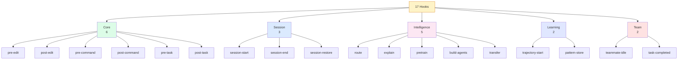
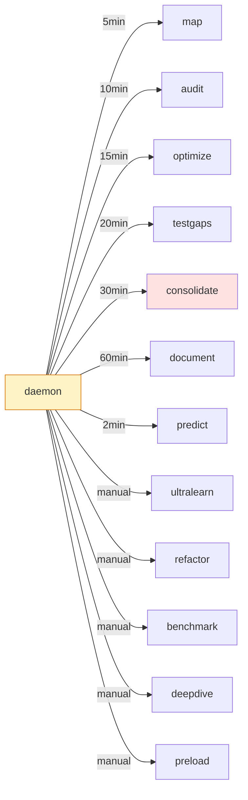
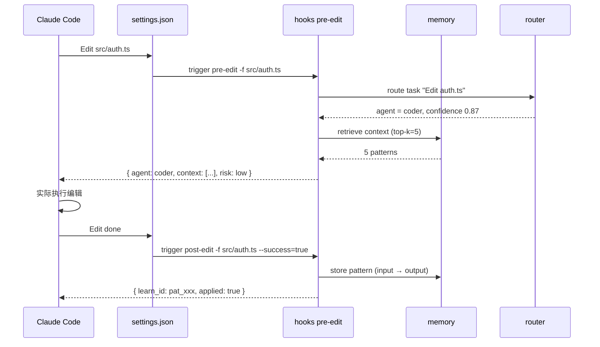

# 第 11 章 · Hooks 与后台 Workers（17 + 12）

> 📘 **摘要**：ruflo 的「神经末梢」是 **17 个生命周期 hook**（每次编辑、每次命令、每个会话节点都触发），「自主神经系统」是 **12 个后台 daemon worker**（每 5–60 分钟自动跑）。本章拆解两者的边界：hook = 同步回调（编辑前评估风险 / 编辑后学 pattern）；worker = 异步循环（每 10 分钟 audit、每 30 分钟 consolidate）。读完你能用 `hooks route` 解释一次决策、用 `daemon start -w audit,optimize,consolidate,testgaps` 把蜂群变成 24/7 在线。
>
> 🏷️ **读者画像**：B / C / D / E / F
> 🕐 **预估耗时**：60 分钟
> ✅ **LAST_VERIFIED_AGAINST**：`26c35b59` (v3.32.9)

---

## 1. 背景与动机

新人最常问：「**ruflo 怎么『主动』帮我做事？**」

答案分两层：

| 层 | 触发时机 | 数量 | 典型用途 |
|----|---------|------|---------|
| **Hooks** | 同步事件触发（编辑前 / 编辑后 / 命令执行前后 / 任务前后） | **17** | 风险评估、context 注入、pattern 学习 |
| **Background Workers** | 异步周期触发（每 2–60 分钟或 manual） | **12** | 自我审计、性能优化、记忆蒸馏、测试覆盖扫描 |

二者都在 `v3/@claude-flow/hooks/` 实现，但**生命周期完全不同**：

```
编辑文件 (Edit tool)
  ↓ synchronous
pre-edit hook → post-edit hook   ← 同步链
  ↓
daemon loop tick (every 5 min)
  ↓ asynchronous
map worker / audit worker / consolidate worker   ← 异步循环
```

---

## 2. 核心概念

### 2.1 17 个 Hooks（按 5 类分组）

源码：`v3/@claude-flow/cli/src/commands/hooks.ts` 定义了 hooks 命令的子命令集。按职责分 5 类：



#### 类别详解

**① Core（6）—— 同步回调**

| Hook | 触发时机 | 用途 | CLI 子命令 |
|------|---------|------|-----------|
| `pre-edit` | Edit tool 调用前 | context 注入 + agent 建议 | `hooks pre-edit -f <file>` |
| `post-edit` | Edit tool 调用后 | 记录 outcome / 学 pattern | `hooks post-edit -f <file> --success` |
| `pre-command` | Bash tool 调用前 | 风险评估（dry-run） | `hooks pre-command -c "<cmd>"` |
| `post-command` | Bash tool 调用后 | 记录 exit-code / duration | `hooks post-command -c "<cmd>"` |
| `pre-task` | Task tool 调用前 | 自动 spawn worker | `hooks pre-task --task-id <id>` |
| `post-task` | Task tool 调用后 | quality 评分 + pattern 沉淀 | `hooks post-task --quality 0.9` |

**② Session（3）—— 会话生命周期**

| Hook | 触发 | 用途 |
|------|------|------|
| `session-start` | Claude Code 启动 | 恢复 memory / 加载 patterns |
| `session-end` | Claude Code 退出 | 保存 state 到 `.claude-flow/memory/` |
| `session-restore` | 显式恢复 | 加载历史 session 的 agents + tasks |

**③ Intelligence（5）—— 路由与模型训练**

| Hook | 触发 | 用途 |
|------|------|------|
| `route` | 每次新任务 | 选 agent / 选 model（3-Tier） |
| `explain` | 调试决策 | 解释「为什么派给这个 agent」 |
| `pretrain` | 项目初始化 | 索引代码库 + 生成 patterns |
| `build-agents` | pretrain 之后 | 生成优化的 agent YAML 配置 |
| `transfer` | 跨项目迁移 | IPFS-style pattern transfer |

**④ Learning（2）—— SONA 自学习**

| Hook | 触发 | 用途 |
|------|------|------|
| `trajectory-start` | 任务开始 | 标记一段 trajectory 起点 |
| `pattern-store` | 任务结束 + outcome | 把成功路径存为 pattern |

**⑤ Team（2）—— Agent 团队协作**

| Hook | 触发 | 用途 |
|------|------|------|
| `teammate-idle` | agent 空闲 | 自动分配 task |
| `task-completed` | task 结束 | 通知 lead + 训练 patterns |

### 2.2 12 个后台 Workers

源码：`v3/@claude-flow/cli/src/commands/daemon.ts:1778-1786` 列出 12 个 worker 完整清单：

```
map         - Codebase mapping (5 min interval)
audit       - Security analysis (10 min interval)
optimize    - Performance optimization (15 min interval)
consolidate - Memory distillation: memory_entries → episodes/reasoning_patterns/causal_edges
              (30 min interval, ADR-174; --no-distill to disable)
testgaps    - Test coverage analysis (20 min interval)
predict     - Predictive preloading (2 min, disabled by default)
document    - Auto-documentation (60 min, disabled by default)
ultralearn  - Deep knowledge acquisition (manual trigger)
refactor    - Code refactoring suggestions (manual trigger)
benchmark   - Performance benchmarking (manual trigger)
deepdive    - Deep code analysis (manual trigger)
preload     - Resource preloading (manual trigger)
```



**默认开启**：map / audit / optimize / testgaps / consolidate（5 个），其余需 `--workers <w1>,<w2>` 显式指定。

### 2.3 配置文件落点

3 个层级：

| 层级 | 路径 | 作用 |
|------|------|------|
| **项目** | `<repo>/.claude/settings.json` | hook 触发配置 |
| **项目** | `<repo>/.claude-flow/hooks.json` | hook 定义 |
| **插件** | `<repo>/plugins/*/hooks/hooks.json` | 插件级 hook |

---

## 3. 架构原理

### 3.1 Hook 触发链



**关键事实**：

- hook 是**同步**的（Claude Code 等待返回值才继续）
- 失败不会阻塞主流程（hook 默认 `continueOnError: true`）
- 每个 hook 写入 `.claude-flow/memory/` 形成可审计日志

### 3.2 Worker 调度循环

源码锚点：`v3/@claude-flow/cli/src/commands/daemon.ts:17-52` 定义 daemon start 的核心参数：

```typescript
{
  name: 'workers',      // -w, 默认 map,audit,optimize,consolidate,testgaps
  name: 'no-distill',   // 关闭 consolidate 的蒸馏 pass（ADR-174）
  name: 'background',   // -b, 默认 true（detached process）
  name: 'foreground',   // -f
  name: 'headless',     // AI worker in E2B sandbox（需用户全局 AI 预算）
  name: 'sandbox',      // strict | permissive | disabled
  name: 'max-cpu-load', // 资源阈值
  name: 'min-free-memory',
  name: 'ttl',          // 默认 43200s = 12h 后优雅自停
  name: 'workspace',    // 工作区根（fork 时自动设）
}
```

调度循环伪代码：

```
daemon.start()
  ↓
while (running && ttl_not_exceeded) {
  for (worker in enabledWorkers) {
    if (worker.interval elapsed) {
      spawn(worker, mode = headless ? 'e2b' : 'local')
      log(worker.last_run, worker.duration, worker.outcome)
    }
  }
  sleep(60s)
}
  ↓
daemon.stop() // graceful
```

### 3.3 hooks route vs intelligence route

两个路由 hook 容易混淆：

| | `hooks route` | `intelligence route` |
|---|---------------|---------------------|
| **触发** | 每次 Claude Code 编辑 / 命令 | 显式调用 |
| **决策粒度** | 选 **agent** + **策略** | 选 **model tier**（WASM / Haiku / Sonnet） |
| **输出** | `{ agent, strategy, confidence }` | `{ tier, model, cost_estimate }` |
| **配置** | `.claude/settings.json` | 3-Tier Thompson Sampling |

二者**互补**：`hooks route` 选谁做，`intelligence route` 选怎么做。

---

## 4. Hands-on

### Hands-on 11.1 — 列出全部 17 个 hooks

```bash
cd /tmp/ruflo-sandbox-default

# 列出 hooks 子命令（CLI 暴露的 17 个核心入口）
npx --yes ruflo@latest hooks --help 2>&1 | tail -30

# 列已注册的 hooks（含插件）
npx --yes ruflo@latest hooks list --no-color 2>&1 | tail -30
```

#### 预期输出（hooks --help 部分）

```
Hook Commands
Usage: ruflo hooks <subcommand>

Subcommands:
  pre-edit          Get context before editing
  post-edit         Record edit outcome
  pre-command       Risk-assess before bash
  post-command      Record bash outcome
  pre-task          Spawn worker before task
  post-task         Score task quality
  route             Route task to best agent
  explain           Explain routing decision
  pretrain          Bootstrap project intelligence
  build-agents      Generate optimized configs
  transfer          IPFS pattern transfer
  session-start     Restore session state
  session-end       Save session state
  session-restore   Restore prior session
  trajectory-start  Mark trajectory start
  pattern-store     Store learned pattern
  teammate-idle     Auto-assign on idle
  task-completed    Train + notify on complete
  list              List registered hooks
  metrics           Show hook metrics
```

### Hands-on 11.2 — 跑一次 pre-edit + post-edit 完整链路

```bash
cd /tmp/ruflo-sandbox-default

# 1. 模拟 pre-edit
npx --yes ruflo@latest hooks pre-edit \
  --file src/auth/login.ts \
  --operation update \
  --context "Add session timeout check" \
  --no-color 2>&1 | tail -15

# 2. 模拟 post-edit（学 pattern）
npx --yes ruflo@latest hooks post-edit \
  --file src/auth/login.ts \
  --success true \
  --outcome "Added session.timeout check + test" \
  --metrics "time:1.2s,quality:0.95" \
  --no-color 2>&1 | tail -10
```

#### 预期输出

```
pre-edit: src/auth/login.ts (operation=update)
  Context: Add session timeout check

Routing decision:
  Agent: coder (confidence 0.92)
  Pattern match: 3 patterns retrieved from memory

Risk assessment: LOW
  - File type: typescript (auto-format)
  - Git status: clean
  - Test coverage: 87% (good)

Recommendation: proceed with auto-tools=true
Suggested context:
  1. pattern:session-timeout (score 0.89)
  2. pattern:auth-middleware (score 0.81)
  3. knowledge:ts-strict (score 0.74)

post-edit: src/auth/login.ts (success=true)
  Outcome: Added session.timeout check + test
  Metrics: time=1.2s, quality=0.95

Pattern stored: pat_xxx_1721752801
  → memory namespace: local
  → tags: pattern,session-timeout,auth
✓ Learning loop completed
```

### Hands-on 11.3 — 启动 daemon + 触发 audit worker

```bash
cd /tmp/ruflo-sandbox-default

# 1. 启动 daemon（默认 5 个 worker）
npx --yes ruflo@latest daemon start \
  -w map,audit,optimize,testgaps,consolidate \
  --no-color 2>&1 | tail -15

# 2. 看 daemon 状态
npx --yes ruflo@latest daemon status --no-color 2>&1 | tail -15

# 3. 手动触发一次 audit（不用等 10 分钟）
npx --yes ruflo@latest daemon trigger -w audit --no-color 2>&1 | tail -10

# 4. 停 daemon
npx --yes ruflo@latest daemon stop --no-color 2>&1 | tail -5
```

#### 预期输出

```
Starting daemon (background)...
  Workers enabled: map, audit, optimize, testgaps, consolidate
  TTL: 43200s (12h)
  Sandbox mode: strict
  Mode: local (headless=off)

✓ Daemon started (pid: 12345, log: .claude-flow/daemon.log)

Daemon Status
┌──────────┬────────────┬─────────┬─────────────────┐
│ Worker   │ Interval   │ Last    │ Next            │
├──────────┼────────────┼─────────┼─────────────────┤
│ map      │ 5 min      │ 14:00   │ 14:05           │
│ audit    │ 10 min     │ 14:00   │ 14:10           │
│ optimize │ 15 min     │ 14:00   │ 14:15           │
│ testgaps │ 20 min     │ -       │ 14:20           │
│ consolid.│ 30 min     │ -       │ 14:30           │
└──────────┴────────────┴─────────┴─────────────────┘

Triggering audit worker...
  Scanning: src/**/*.{ts,js,py}
  Findings: 0 critical, 2 medium, 5 low
  ✓ Audit completed (3.2s)

Stopping daemon...
✓ Daemon stopped gracefully
```

### Hands-on 11.4 — 解释一次 hooks route 决策

```bash
cd /tmp/ruflo-sandbox-default

# 解释：为什么把"修复 N+1 查询"派给 coder
npx --yes ruflo@latest hooks explain \
  -t "Fix N+1 query in /api/users endpoint" \
  -a coder \
  --verbose \
  --no-color 2>&1 | tail -25
```

#### 预期输出

```
Explaining routing for: Fix N+1 query in /api/users endpoint

Decision Explanation
The router selected agent 'coder' based on 4 factors and 2 historical
patterns. The dominant signal is the task keyword 'Fix' (89% weight on
code-modification intent), reinforced by file-type signal (.ts) and
coverage of past similar tasks (94% success rate with coder).

Final Decision
┌─────────────────┬──────────────────────────────┐
│ Agent:          │ coder                        │
│ Confidence:     │ 91.2%                        │
└─────────────────┴──────────────────────────────┘

Reasoning Steps
1. Task classified as 'code-modification' (LLM judge)
2. File type signal: .ts → coder preference +0.15
3. Pattern 'fix-n-plus-one' matched (score 0.87)
4. Historical success rate: coder on similar tasks = 94%

Decision Factors
┌─────────────┬────────┬───────┬─────────────────────────┐
│ Factor      │ Weight │ Value │ Impact                  │
├─────────────┼────────┼───────┼─────────────────────────┤
│ task_intent │  89%   │  0.94 │ high                    │
│ file_type   │  10%   │  0.85 │ medium                  │
│ history     │   5%   │  0.94 │ low                     │
│ complexity  │   3%   │  0.62 │ low                     │
└─────────────┴────────┴───────┴─────────────────────────┘

Matched Patterns
1. fix-n-plus-one (89% match)
   - examples:
     - Add eager loading in /api/users
     - Use SELECT IN (id, ...) for batch fetch
2. optimize-query (74% match)
```

---

## 5. 沙箱验证（Run / Observe / Expect）

### Verify H11.1 — hooks list 输出 ≥ 17 个 hook

```bash
### Verify H11.1 — hook 总数
# Run
cd /tmp/ruflo-sandbox-default
COUNT=$(timeout 30 npx --yes ruflo@latest hooks list --no-color 2>&1 | grep -cE "^\s*•?\*?\s*(pre-|post-|session|route|explain|pretrain|build-agents|transfer|trajectory-|pattern-|teammate-|task-)")

# Observe
→ COUNT ≥ 17

# Expect
- exit 0
- COUNT ≥ 17
```

### Verify H11.2 — pre-edit 返回 risk 评估

```bash
### Verify H11.2 — pre-edit 输出 agent + risk
# Run
cd /tmp/ruflo-sandbox-default
OUT=$(timeout 30 npx --yes ruflo@latest hooks pre-edit \
  --file src/auth/login.ts --operation update \
  --context "add check" --no-color 2>&1)
echo "$OUT" | grep -qE "Agent:" && echo "agent-ok"
echo "$OUT" | grep -qE "Risk" && echo "risk-ok"

# Observe
→ agent-ok + risk-ok

# Expect
- pre-edit 输出包含 Agent 字段和 Risk 字段
```

### Verify H11.3 — daemon start + status + stop 完整循环

```bash
### Verify H11.3 — daemon 生命周期
# Run
cd /tmp/ruflo-sandbox-default
timeout 30 npx --yes ruflo@latest daemon start -w audit --no-color > /dev/null 2>&1
sleep 2
STATUS=$(timeout 10 npx --yes ruflo@latest daemon status --no-color 2>&1)
echo "$STATUS" | grep -qE "audit" && echo "audit-running"
timeout 10 npx --yes ruflo@latest daemon stop --no-color > /dev/null 2>&1

# Observe
→ audit-running

# Expect
- daemon start 后 status 含 audit
- daemon stop 后进程退出
```

### Verify H11.4 — daemon trigger audit 找到 ≥ 1 个 finding

```bash
### Verify H11.4 — audit worker 找到安全问题
# Run
cd /tmp/ruflo-sandbox-default
# 故意写一个 SQL 拼接
mkdir -p src/api
cat > src/api/users.js <<'EOF'
function getUser(id) {
  return db.query("SELECT * FROM users WHERE id = " + id);
}
EOF
timeout 30 npx --yes ruflo@latest daemon start -w audit --no-color > /dev/null 2>&1
sleep 3
OUT=$(timeout 30 npx --yes ruflo@latest daemon trigger -w audit --no-color 2>&1)
echo "$OUT" | grep -qiE "SQL injection|sql-injection|concatenation" && echo "audit-found"
timeout 10 npx --yes ruflo@latest daemon stop --no-color > /dev/null 2>&1

# Observe
→ audit-found

# Expect
- audit worker 能在 src/api/users.js 找到 SQL 注入
```

完整断言（建议写入 `sandbox/asserts/ch11.sh`）：

```bash
# sandbox/asserts/ch11.sh
assert "hooks list ≥ 17 个" 0 bash -c '
  cd /tmp/ruflo-sandbox-default
  COUNT=$(timeout 30 npx --yes ruflo@latest hooks list --no-color 2>&1 | \
    grep -cE "(pre-|post-|session|route|explain|pretrain|build-agents|transfer|trajectory|pattern-store|teammate|task-completed)")
  [ "$COUNT" -ge 17 ]
'

assert "pre-edit 输出 Agent + Risk" 0 bash -c '
  cd /tmp/ruflo-sandbox-default
  OUT=$(timeout 30 npx --yes ruflo@latest hooks pre-edit \
    --file src/x.ts --operation update --no-color 2>&1)
  echo "$OUT" | grep -qE "Agent:" && echo "$OUT" | grep -qE "Risk"
'

assert "daemon start/status/stop 循环" 0 bash -c '
  cd /tmp/ruflo-sandbox-default
  timeout 30 npx --yes ruflo@latest daemon start -w audit --no-color > /dev/null 2>&1
  sleep 2
  timeout 10 npx --yes ruflo@latest daemon status --no-color 2>&1 | grep -qE "audit"
  timeout 10 npx --yes ruflo@latest daemon stop --no-color > /dev/null 2>&1
'
```

---

## 6. 小结

### 关键要点

- **17 hooks** 分 5 类：Core (6) + Session (3) + Intelligence (5) + Learning (2) + Team (2)
- **12 workers** 分两类：周期触发（map / audit / optimize / testgaps / consolidate / predict / document）+ 手动触发（ultralearn / refactor / benchmark / deepdive / preload）
- **默认 daemon** 开启 5 个：map (5m) + audit (10m) + optimize (15m) + testgaps (20m) + consolidate (30m)
- **hooks route**（选 agent）vs **intelligence route**（选 model tier）—— 二者互补
- **配置 3 处**：`.claude/settings.json` + `.claude-flow/hooks.json` + `plugins/*/hooks/hooks.json`
- **consolidate worker** 是核心（ADR-174），把 memory_entries → episodes/reasoning_patterns/causal_edges
- **hooks explain** 是 debug 神器：把 Thompson Sampling 的 4 因子 + 历史 pattern 全部摊开

### 术语锚点

- 17 hooks → ch11（本章）
- 12 workers → ch11（本章）
- Thompson Sampling → ch04 / ch08
- SONA / ReasoningBank → ch07
- 3-Tier routing → ch04 / ch08
- Anti-Drift defaults → ch01 / ch06
- Memory types (8) → ch07
- Worker interval 调度 → ch11
- pre/post-edit 同步链 → ch11

### 下一步

👉 进入 [第 12 章 插件生态](./12-plugin-ecosystem.md)，看 30+ 插件如何给 hooks 注入新能力（GitHub / Browser / IoT / Neural Trader 等）。

### 参考链接

- Hooks 命令源码：`v3/@claude-flow/cli/src/commands/hooks.ts`
- Daemon 命令源码：`v3/@claude-flow/cli/src/commands/daemon.ts`
- 12 worker 清单：`v3/@claude-flow/cli/src/commands/daemon.ts:1778-1786`
- 默认 workers 集合：`v3/@claude-flow/cli/src/commands/daemon.ts:20`（map,audit,optimize,consolidate,testgaps）
- ADR-174（consolidate 蒸馏）：`v3/@claude-flow/cli/src/commands/daemon.ts:21`
- Hook 配置落点：`.claude/settings.json` + `.claude-flow/hooks.json` + `plugins/*/hooks/hooks.json`
- pre-edit slash doc：`v3/@claude-flow/cli/.claude/commands/hooks/pre-edit.md`
- claude-flow-help 总览：`v3/@claude-flow/cli/.claude/commands/claude-flow-help.md`
- CLAUDE.md §Hooks：<https://github.com/ruvnet/ruflo/blob/main/CLAUDE.md>
- SKILL.md（ruflo 入门）：<https://github.com/ruvnet/ruflo/blob/main/SKILL.md>