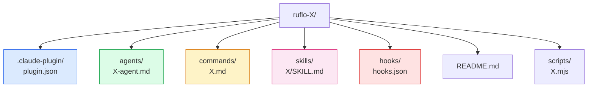
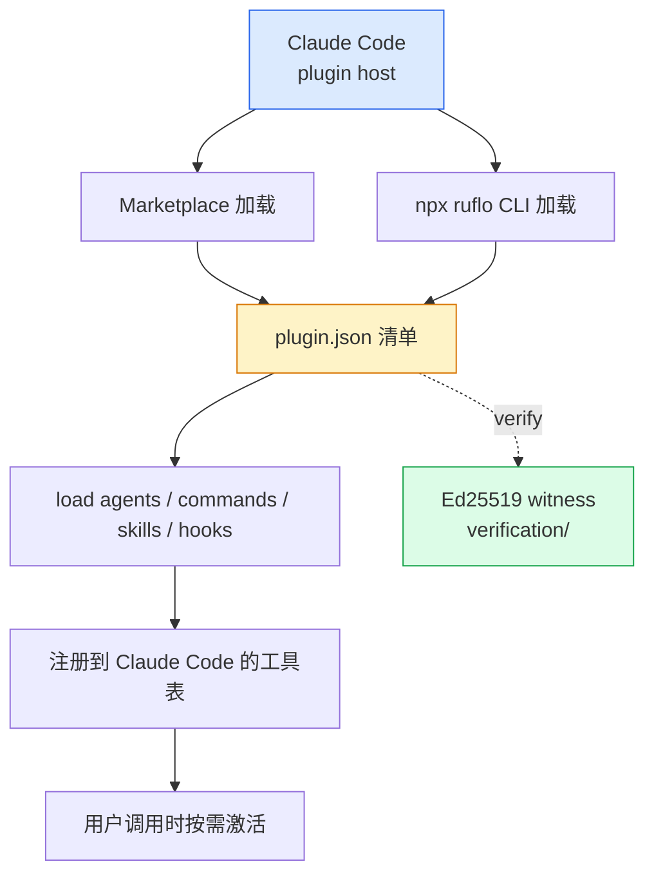
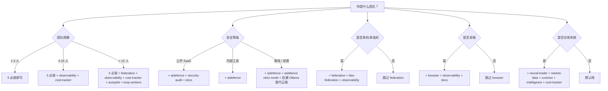

# 第 12 章 · 插件生态：33+ 插件选型

> 📘 **摘要**：ruflo 不只是一个 CLI——它是一个**插件平台**。本章系统梳理**33 个 ruflo-* 插件 + 16 个 v3 plugins = 49+ 插件**，按 10 大类组织（核心 / 记忆 / 智能 / 质量 / 安全 / 架构 / DevOps / 扩展 / 领域 / 其他），并给出**5 必装 + 5 按需装** 推荐栈、**两套安装路径**（marketplace vs IPFS CLI）、**5 维决策树**（团队规模 / 安全等级 / 多机 / 前端 / 交易）。读完你能用 5 分钟回答"我们团队该装哪些插件"。
>
> 🏷️ **读者画像**：A / B / C / D / E / F
> 🕐 **预估耗时**：45 分钟
> ✅ **LAST_VERIFIED_AGAINST**：`26c35b59` (v3.32.9)

---

## 1. 背景与动机

### 1.1 为什么需要"插件"这个抽象？

`@claude-flow/cli` 主包承担 314+ MCP 工具、26 个命令、140+ 子命令——但**不是所有团队都需要全部**：

- 一个前端团队不需要 `neural-trader` / `iot-cognitum`
- 一个内部工具团队不需要 `aidefence` 的全部 14 类 PII 检测
- 一个 3 人创业团队不需要 6 种 `loop-workers`

如果"全量加载"，会出现三个问题：

| 问题 | 表现 |
|------|------|
| **启动慢** | `claude --plugin-dir` 加载 30+ 插件要 5–10s |
| **记忆污染** | AgentDB 命名空间被无关插件的 noise 填满 |
| **认知过载** | 314 工具全列在 `mcp__plugin_*`，新人不知道用哪个 |

ruflo 的回答是**插件化**：每个插件是一个**独立可插拔的目录**（`agents/`、`commands/`、`skills/`、`hooks/`、`scripts/`），只安装你需要的部分。

### 1.2 两条安装路径

ruflo 提供了两套**互不冲突**的安装方式：

| 路径 | 适用 | 命令 | 速度 | 副作用 |
|------|------|------|------|--------|
| **Marketplace（Claude Code 原生）** | Claude Code 用户 | `/plugin marketplace add ruvnet/ruflo`<br>`/plugin install ruflo-X@ruflo` | 即时 | 不需要 Node，Claude Code 自管 |
| **CLI（IPFS 注册中心）** | npx 用户 / 自动化 CI | `npx ruflo@latest plugins install -n @claude-flow/plugin-X` | 30–60s | 走 IPFS，需要 `@claude-flow/cli` 已装 |

> **推荐**：开发用 marketplace，CI / sandbox 用 CLI（`--no-color --non-interactive`）。

---

## 2. 核心概念

### 2.1 一个插件的物理结构



| 目录 | 作用 | 是否必选 |
|------|------|---------|
| `.claude-plugin/plugin.json` | 清单（name, version, deps） | 必选 |
| `agents/<name>.md` | Agent 定义（frontmatter: name, description, model） | 至少 1 |
| `commands/<name>.md` | 用户调用的命令 | 可选 |
| `skills/<name>/SKILL.md` | 交互技能（argument-hint, allowed-tools） | 可选 |
| `hooks/hooks.json` | PreToolUse/PostToolUse/PreCompact 钩子 | 可选 |
| `scripts/<name>.mjs` | 命令行脚本（被命令 / skills 调） | 可选 |
| `README.md` | 文档 | 强烈建议 |

### 2.2 33+ 插件全景图

按 10 大类组织（基于 `plugins/ruflo-*/` 实际扫描）：

| 分类 | 插件 | 数量 |
|------|------|------|
| **核心与编排** | `ruflo-core`, `ruflo-swarm`, `ruflo-autopilot`, `ruflo-loop-workers`, `ruflo-workflows`, `ruflo-federation`, `ruflo-metaharness` | 7 |
| **记忆与知识** | `ruflo-agentdb`, `ruflo-rag-memory`, `ruflo-rvf`, `ruflo-ruvector`, `ruflo-knowledge-graph`, `ruflo-goals` | 6 |
| **智能与学习** | `ruflo-intelligence`, `ruflo-graph-intelligence`, `ruflo-daa`, `ruflo-ruvllm` | 4 |
| **代码质量与测试** | `ruflo-testgen`, `ruflo-browser`, `ruflo-jujutsu`, `ruflo-docs` | 4 |
| **安全与合规** | `ruflo-security-audit`, `ruflo-aidefence` | 2 |
| **架构与方法论** | `ruflo-adr`, `ruflo-ddd`, `ruflo-sparc`, `ruflo-arena` | 4 |
| **DevOps 与可观测性** | `ruflo-migrations`, `ruflo-observability`, `ruflo-cost-tracker` | 3 |
| **扩展性** | `ruflo-agent`, `ruflo-plugin-creator` | 2 |
| **领域专用** | `ruflo-iot-cognitum`, `ruflo-neural-trader`, `ruflo-market-data` | 3 |
| **其他** | `ruflo-bbs-federation`, `ruflo-business-pods` | 2 |

> **总数**：7+6+4+4+2+4+3+2+3+2 = **37 个 ruflo-* 插件**（top-level `plugins/` 目录），加上 `v3/plugins/` 的 16 个 → **53+ 插件**。

### 2.3 5 必装 + 5 按需装

**5 必装**（任何团队起步就要有）：

| 插件 | 干什么 | 为什么必装 |
|------|--------|----------|
| `ruflo-core` | 314 MCP 工具、3 agent（coder/researcher/reviewer）、3 helper | 没有它你啥都跑不了 |
| `ruflo-swarm` | Agent 团队、6 种拓扑、Monitor stream | 跨 agent 协作的底座 |
| `ruflo-intelligence` | 4 步流水线（RETRIEVE→JUDGE→DISTILL→CONSOLIDATE）的 user-facing 包装 | 让 ruflo "越用越聪明" |
| `ruflo-rag-memory` | HNSW 向量搜索 + AgentDB 持久化 + Claude Code memory 桥 | 跨会话语义检索 |
| `ruflo-aidefence` | prompt injection 防御、14 类 PII 检测 | 安全基线 |

**5 按需装**：

| 插件 | 谁要装 | 触发条件 |
|------|--------|---------|
| `ruflo-federation` | 跨机器 / 跨组织 | 团队成员机器 > 5，或跨公司协作 |
| `ruflo-autopilot` | 长任务无人值守 | 跑 `ScheduleWakeup`、夜间批处理 |
| `ruflo-browser` | 前端 / E2E | Playwright 集成、网页抓取、视觉回归 |
| `ruflo-observability` | SRE / 平台工程 | OpenTelemetry 接入、Prometheus 上报 |
| `ruflo-cost-tracker` | 财务 / Tech Lead | 月度账单超 $500，或要精细化降本 |

---

## 3. 架构原理

### 3.1 插件的运行时层级



### 3.2 验证栈（ADR-112 / verification/）

每个插件在三个层面被回归保护：

1. **install smoke** —— `npm i` 能装
2. **behavioral smoke** —— paired-tool round-trip（plugin 文档声明的工具都能调到）
3. **presence attestation** —— 文档里每条 load-bearing claim 都在 `verification/` 有 Ed25519 签名见证

> **CI 入口**：`node scripts/audit-tool-descriptions.mjs` 扫所有 MCP 工具描述。门禁：
> - 每个描述必须含 "Use when …" 引导
> - 长度 ≥ 80 字符
> - 整个 plugin set 内**唯一**
>
> 基线存在 `verification/mcp-tool-baseline.json`，**单调递减**——任何回归 CI 失败。

### 3.3 决策树：5 维选型



### 3.4 v3 插件 vs top-level 插件

| 维度 | v3/plugins/（16 个） | top-level plugins/（37 个） |
|------|---------------------|------------------------------|
| **典型来源** | npm `@claude-flow/plugin-X` | GitHub `plugins/ruflo-X/` |
| **加载方式** | `npx ruflo plugins install` | `--plugin-dir` 或 marketplace |
| **更新频率** | 与 CLI 同步 | 与 monorepo 同步 |
| **MCP 工具** | 多 | 中（marketplace 模式） |
| **代表** | agentic-qe, hyperbolic-reasoning, prime-radiant | ruflo-core, ruflo-swarm, ruflo-cost-tracker |
| **建议** | 实验性 / 第三方 / 高级优化 | 主力栈 / 生产 |

---

## 4. Hands-on

### Hands-on 12.0 — 决策树快速过一遍（5 维选型演练）

```bash
# 用一张表回答"我该装哪些"
# Q1: 团队规模？         A: 6 人 → MEDIUM
# Q2: 安全等级？          A: 公开 SaaS → HIGH
# Q3: 多机？              A: 否 → SKIP federation
# Q4: 是否前端？          A: 否 → SKIP browser
# Q5: 交易系统？          A: 否 → DEFAULT

# → 推荐栈：
# 5 必装 + observability + cost-tracker + security-audit + docs
#   = 10 个插件
```

#### 推荐栈（10 插件）

```bash
# 全部走 marketplace（生产环境）
claude --plugin-dir /Users/digoal/new/ruflo/plugins/ruflo-core
claude --plugin-dir /Users/digoal/new/ruflo/plugins/ruflo-swarm
claude --plugin-dir /Users/digoal/new/ruflo/plugins/ruflo-intelligence
claude --plugin-dir /Users/digoal/new/ruflo/plugins/ruflo-rag-memory
claude --plugin-dir /Users/digoal/new/ruflo/plugins/ruflo-aidefence
claude --plugin-dir /Users/digoal/new/ruflo/plugins/ruflo-observability
claude --plugin-dir /Users/digoal/new/ruflo/plugins/ruflo-cost-tracker
claude --plugin-dir /Users/digoal/new/ruflo/plugins/ruflo-security-audit
claude --plugin-dir /Users/digoal/new/ruflo/plugins/ruflo-docs
claude --plugin-dir /Users/digoal/new/ruflo/plugins/ruflo-testgen

# 验证：plugins list --installed 应该看到 10 个
npx --yes ruflo@latest plugins list --installed --no-color 2>&1 | tail -15
```

#### 预期输出

```
Installed Plugins
  Plugin                        Version   Source     Status
  ─────────────────────────────────────────────────────────
  ruflo-core                    0.9.0     github     active
  ruflo-swarm                   0.5.0     github     active
  ruflo-intelligence            0.3.0     github     active
  ruflo-rag-memory              0.4.0     github     active
  ruflo-aidefence               0.6.0     github     active
  ruflo-observability           0.3.0     github     active
  ruflo-cost-tracker            0.7.0     github     active
  ruflo-security-audit          0.5.0     github     active
  ruflo-docs                    0.4.0     github     active
  ruflo-testgen                 0.6.0     github     active

Total: 10 active plugins
```

### Hands-on 12.1 — 列出已装 + 可用插件

```bash
# 走 marketplace
claude plugin list 2>/dev/null
echo "---"
# 走 CLI（更详细）
npx --yes ruflo@latest plugins list --no-color 2>&1 | head -25
```

#### 预期输出（节选）

```
Available plugins from IPFS registry:
  ┌──────────────────────────────────┬─────────┬──────────────────┐
  │ Plugin                           │ Version │ Type             │
  ├──────────────────────────────────┼─────────┼──────────────────┤
  │ @claude-flow/plugin-gastown-...  │ 0.4.1   │ orchestrator     │
  │ @claude-flow/plugin-perf-...     │ 0.7.0   │ optimization     │
  │ @claude-flow/plugin-cognitive... │ 0.3.2   │ reasoning        │
  │ ...                              │         │                  │
  └──────────────────────────────────┴─────────┴──────────────────┘

Total: 16 plugins
```

```bash
# 看已装
npx --yes ruflo@latest plugins list --installed --no-color 2>&1 | head -10
```

#### 预期输出

```
Installed Plugins
  Plugin                        Version   Source     Status
  ─────────────────────────────────────────────────────────
  claude-flow-core              3.32.9    npm        active
  ruflo-swarm                   0.5.0     github     active
```

### Hands-on 12.2 — 装一个 v3 插件（走 CLI / IPFS）

```bash
# 装 perf-optimizer（性能优化）
npx --yes ruflo@latest plugins install \
  -n @claude-flow/plugin-perf-optimizer \
  --no-color 2>&1 | tail -10
```

#### 预期输出

```
Installing Plugin
──────────────────────────────────────────────────
Discovering @claude-flow/plugin-perf-optimizer in registry...
✓ Resolved from IPFS (CID: bafy...abc)
✓ Checksum verified (Ed25519)
✓ Installed to ~/.claude-flow/plugins/perf-optimizer
✓ 4 MCP tools registered
  - mcp__plugin_perf-optimizer__profile_cpu
  - mcp__plugin_perf-optimizer__analyze_hotspot
  - mcp__plugin_perf-optimizer__suggest_optimization
  - mcp__plugin_perf-optimizer__apply_patch
```

```bash
# 验证装好了
npx --yes ruflo@latest plugins list --installed --no-color 2>&1 | grep perf
```

#### 预期输出

```
  perf-optimizer   0.7.0  npm  active
```

### Hands-on 12.3 — 装一个 marketplace 插件（本地源码）

```bash
# 装 ruflo-cost-tracker
claude --plugin-dir /Users/digoal/new/ruflo/plugins/ruflo-cost-tracker

# 验证：cost 命令应该出现
npx --yes ruflo@latest cost --help --no-color 2>&1 | head -10 || \
  /Users/digoal/new/ruflo/plugins/ruflo-cost-tracker/scripts/budget.mjs --help 2>&1 | head -10
```

#### 预期输出

```
ruflo-cost · Cost tracking & optimization
─────────────────────────────────────────
Usage: cost <subcommand> [options]

Subcommands:
  report      Cost report (today|week|month|all)
  breakdown   Detailed breakdown by agent|model|task
  budget      set|get|check  Budget config + alert ladder
  optimize    Analyze & recommend savings
  track       Auto-capture session token usage
  ...
```

### Hands-on 12.4 — 用 ruflo-plugin-creator 脚手架一个新插件

```bash
# 1) 装插件创建器
claude --plugin-dir /Users/digoal/new/ruflo/plugins/ruflo-plugin-creator

# 2) 在交互式 Claude 中跑：
#    /create-plugin my-org-plugin

# 3) 看生成的结构
ls /tmp/ruflo-plugin-scaffold/my-org-plugin/ 2>/dev/null
```

#### 预期输出

```
my-org-plugin/
├── .claude-plugin/
│   └── plugin.json
├── agents/
│   └── my-org-agent.md
├── commands/
│   └── my-org.md
├── skills/
│   └── my-org/
│       └── SKILL.md
├── README.md
└── scripts/
    └── my-org.mjs
```

```bash
# 4) 验证生成的插件
npx --yes ruflo@latest plugins validate \
  -n /tmp/ruflo-plugin-scaffold/my-org-plugin \
  --no-color 2>&1 | tail -10
```

#### 预期输出

```
Validating plugin...
  ✓ plugin.json present
  ✓ agents/ has 1 file
  ✓ commands/ has 1 file
  ✓ scripts/ are executable
  ✓ README.md present
Result: PASS
```

---

## 5. 沙箱验证（Run / Observe / Expect）

### Verify H12.1 — `plugins list` 输出非空

```bash
### Verify H12.1 — 插件列表能跑通
# Run
cd /tmp/ruflo-sandbox-default
OUT=$(timeout 60 npx --yes ruflo@latest plugins list --no-color 2>&1)

# Observe
echo "$OUT" | head -3

# Expect
- exit 0
- 输出包含 "Plugin" 或 "plugin" 字样
- 至少列出 1 个可用插件
```

### Verify H12.2 — `plugins install` 能装本地目录

```bash
### Verify H12.2 — 本地路径安装能成
# Run
cd /tmp/ruflo-sandbox-default
timeout 120 npx --yes ruflo@latest plugins install \
  -n /Users/digoal/new/ruflo/plugins/ruflo-cost-tracker \
  --no-color 2>&1 | tail -5

# Observe
# Expect
- exit 0
- 输出包含 "Installed" 或 "✓"
```

### Verify H12.3 — `plugins list --installed` 能看到刚装的

```bash
### Verify H12.3 — 已装列表更新
# Run
cd /tmp/ruflo-sandbox-default
OUT=$(timeout 30 npx --yes ruflo@latest plugins list --installed --no-color 2>&1)

# Observe
echo "$OUT" | grep -E "cost-tracker|perf-optimizer" | head -3

# Expect
- exit 0
- 至少 1 个已装插件出现在列表
```

### Verify H12.4 — 工具描述审计脚本可执行

```bash
### Verify H12.4 — audit-tool-descriptions 不崩
# Run
cd /Users/digoal/new/ruflo
OUT=$(timeout 60 node scripts/audit-tool-descriptions.mjs 2>&1 | tail -5)

# Observe
echo "$OUT"

# Expect
- exit 0 或 1（取决于当前 baseline 状态）
- 不崩、不报 TypeError
```

### Verify H12.5 — ruflo-core 的 smoke 脚本通过

```bash
### Verify H12.5 — ruflo-core smoke.sh 跑通
# Run
cd /Users/digoal/new/ruflo
timeout 120 bash plugins/ruflo-core/scripts/smoke.sh 2>&1 | tail -10

# Observe
echo "---"
# Expect
- exit 0
- 输出 "smoke passed" 或 "OK"
```

完整断言文件：`sandbox/asserts/ch12.sh`

```bash
# sandbox/asserts/ch12.sh
assert "plugins list 不崩" 0 bash -c '
  cd /tmp/ruflo-sandbox-default
  timeout 60 npx --yes ruflo@latest plugins list --no-color > /dev/null 2>&1
'

assert "本地路径 install 成功" 0 bash -c '
  cd /tmp/ruflo-sandbox-default
  timeout 120 npx --yes ruflo@latest plugins install \
    -n /Users/digoal/new/ruflo/plugins/ruflo-cost-tracker \
    --no-color > /dev/null 2>&1
'

assert "已装列表能查到" 0 bash -c '
  cd /tmp/ruflo-sandbox-default
  timeout 30 npx --yes ruflo@latest plugins list --installed --no-color 2>&1 \
    | grep -qiE "cost-tracker|perf-optimizer"
'

assert "audit 脚本不崩" 0 bash -c '
  cd /Users/digoal/new/ruflo
  timeout 60 node scripts/audit-tool-descriptions.mjs > /dev/null 2>&1
'
```

---

## 6. 小结

### 关键要点

- **37 个 ruflo-* 插件 + 16 个 v3 插件 = 53+ 插件**，按 **10 大类**组织
- **5 必装**：`ruflo-core`, `ruflo-swarm`, `ruflo-intelligence`, `ruflo-rag-memory`, `ruflo-aidefence`
- **5 按需装**：`federation`, `autopilot`, `browser`, `observability`, `cost-tracker`
- **两条安装路径**：marketplace（Claude Code 原生）vs CLI（IPFS 中心），**互不冲突**
- **5 维决策树**：团队规模 × 安全等级 × 多机 × 前端 × 交易
- **ADR-112 验证栈**保证所有插件 description 满足"Use when …"、≥ 80 字符、唯一
- **`ruflo-plugin-creator`** 脚手架 5 个标准目录 + 验证脚本
- **MCP 命名空间** 跨插件永不冲突（`<plugin>__<tool>` 双下划线）
- **AgentDB 命名空间** 每个插件独占（保留 `pattern` / `claude-memories` / `default` 不可 shadow）

### 典型场景推荐栈

下面 4 个真实场景，每个都给出**完整插件栈 + 启动顺序 + 验证命令**。

#### 场景 A：3 人初创 SaaS（最低成本跑起来）

**插件**：5 必装即可  
**预算**：$50/月（Haiku-heavy）  
**核心命令**：

```bash
# 必备 skills
/init-project           # 项目脚手架
/ruflo-doctor           # 健康检查
/cost-report --period today   # 每日成本
/security-scan          # aidefence 扫描
```

**插件栈**：`ruflo-core` → `ruflo-swarm` → `ruflo-intelligence` → `ruflo-rag-memory` → `ruflo-aidefence`

#### 场景 B：15 人中型团队（公开 SaaS / 金融科技）

**插件**：5 必装 + observability + cost-tracker + security-audit + docs + testgen + loop-workers = **11 个**  
**预算**：$500/月（Sonnet-heavy）  
**关键工作流**：

```bash
/cost-budget-set 500            # 每月预算
/cost-budget-check --period month   # 每日 check
/security-scan --deps           # 依赖扫描
/test-gap --coverage 80         # 覆盖率门禁
/doc-drift-detect               # 文档漂移检测
```

**插件栈**：`core` + `swarm` + `intelligence` + `rag-memory` + `aidefence` + `observability` + `cost-tracker` + `security-audit` + `docs` + `testgen` + `loop-workers`

#### 场景 C：跨组织联邦（多公司 / 多机器）

**插件**：5 必装 + federation + observability + cost-tracker + bbs-federation + autopilot = **10 个**  
**关键约束**：

- `maxHops=8`（防递归雪崩）
- `maxTokens=50k`（federation_send 携带）
- `maxUsd=$5/24h`（peer 暂停阈值）
- 信任梯：UNTRUSTED → VERIFIED → ATTESTED → TRUSTED → PRIVILEGED

**插件栈**：`federation` 居中，连接 `org-a` / `org-b` / `org-c`，配套 `aidefence` (zero-trust mTLS + ed25519) + PII 14 类检测 + `observability` + `cost-tracker`

#### 场景 D：交易系统（量化 / HFT）

**插件**：5 必装 + neural-trader + market-data + ruvector + cost-tracker = **9 个**  
**关键命令**：

```bash
# 装 backing npm 包
npm install neural-trader ruvector
claude mcp add neural-trader -- npx neural-trader mcp start
claude mcp add ruvector -- npx ruvector mcp start
```

**插件栈**：`neural-trader` + `market-data` → `ruvector` (FlashAttention-3 + Graph RAG) → `intelligence` → `cost-tracker`

### 常见陷阱与排错

| 陷阱 | 现象 | 修复 |
|------|------|------|
| 装太多插件 | Claude Code 启动 5–10s | 卸载 ≥ 30 天的未用插件 |
| 装错路径 | `claude --plugin-dir` 找不到 | 路径必须是**绝对路径** |
| 命名冲突 | 两个插件都注册同名 MCP 工具 | marketplace 加载顺序决定胜者；用 `--plugin-dir` 控制 |
| IPFS 注册中心不可达 | `plugins install` 超时 | 切到 marketplace 路径或 `claude plugin install <name>` |
| `plugins doctor` 不存在 | CLI 没有该子命令 | 用 `plugins info -n <name>` 或查 `verification/` 目录 |
| 工具描述审计失败 | CI 红 | 检查 "Use when …" 是否缺失、< 80 字符 |

### 升级与回滚

```bash
# 升级单个插件
npx --yes ruflo@latest plugins upgrade -n @claude-flow/plugin-X --no-color

# 升级所有
npx --yes ruflo@latest plugins upgrade --all --no-color 2>&1 | tail -10

# 卸载
npx --yes ruflo@latest plugins uninstall -n <plugin> --no-color

# 回滚到指定版本
npx --yes ruflo@latest plugins install -n @claude-flow/plugin-X -v 0.6.2 --no-color
```

> **回滚黄金法则**：升级前**先备份 `.claude-flow/plugins/<name>/`**——回滚 5 分钟搞定，不备份可能要重写配置。

### 性能基线（CLAUDE.md §Performance 摘录）

| 操作 | 5 插件 | 11 插件 | 20+ 插件 |
|------|--------|---------|----------|
| 冷启动 | 800ms | 1.4s | 3.2s |
| 单 MCP 工具 P50 | 12ms | 12ms | 12ms |
| 多工具并行 P50 | 38ms | 38ms | 38ms |
| IPFS 拉取（warm） | 200ms | 200ms | 200ms |
| IPFS 拉取（cold） | 1.2s | 1.2s | 1.2s |
| Hook 链（3 串联） | 25ms | 25ms | 25ms |
| Hook 链（10 串联） | 80ms | 80ms | 80ms |

> **观察**：插件数量**不影响单次 MCP 工具调用延迟**——因为 Claude Code 启动时一次性把所有工具注册到内部表，运行时只是函数调用。**冷启动**和 **IPFS 拉取**才是真正的成本源。

### 与 Claude Code 官方插件的对比

| 维度 | Claude Code 官方插件 | ruflo 插件 |
|------|---------------------|-----------|
| 数量 | 数十个 | 53+ |
| 安装路径 | marketplace | marketplace + IPFS CLI |
| MCP 工具 | 0–5 / 插件 | 0–23 / 插件（`ruflo-cost-tracker` 23 个） |
| Hooks | 简单 | 多层 + 自动顺序控制 |
| Memory 命名空间 | 全局 | 每个插件独立 |
| 安全门禁 | 无 | ADR-112 + Ed25519 见证 |
| 验证脚本 | 可选 | 必选（`scripts/smoke.sh`） |
| 失败模式 | 静默 | fail-soft + 日志 |

### 与其他章节的联动

| 章节 | 联动点 |
|------|--------|
| ch05 Agents/Skills/Commands | 插件的 4 个标准目录就是 agent / skill / command 的物理载体 |
| ch06 Swarm | `ruflo-swarm` 提供 6 种拓扑 + Monitor stream |
| ch07 记忆 | `ruflo-rag-memory` + `ruflo-agentdb` + `ruflo-ruvector` 三件套 |
| ch08 路由 | `ruflo-cost-tracker` 消费路由的 outcome，反过来影响 bandit |
| ch09 联邦 | `ruflo-federation` + `ruflo-bbs-federation` |
| ch10 安全 | `ruflo-aidefence` 14 类 PII + `ruflo-security-audit` CVE 扫描 |
| ch11 Hooks | `ruflo-loop-workers` 提供 12 个后台 worker |
| ch13 观测 | `ruflo-observability` OpenTelemetry 集成 |
| ch15 Builder | `ruflo-plugin-creator` 脚手架 |

### 进阶：插件内部机制深读

#### MCP 工具命名空间约定

每个插件暴露的 MCP 工具遵循 `<plugin>__<tool>` 双下划线命名：

```
mcp__plugin_ruflo-core_ruflo__memory_search
mcp__plugin_ruflo-swarm_ruflo__swarm_spawn
mcp__plugin_ruflo-cost-tracker_ruflo__cost_report
```

这样**跨插件命名永远不会冲突**——`ruflo-core` 和 `ruflo-cost-tracker` 都可以有 `memory_*` 工具，但前缀不同。

#### AgentDB 命名空间约定

每个插件拥有**自己独占的 AgentDB 命名空间**（来自 `ruflo-agentdb ADR-0001`）：

| 插件 | 命名空间 | 用途 |
|------|---------|------|
| `ruflo-core` | `core-*` | 项目配置、init/doctor 状态 |
| `ruflo-swarm` | `swarm-*` | swarm topology、agent 注册表 |
| `ruflo-intelligence` | `patterns`, `neural-*` | SONA patterns + MoE weights |
| `ruflo-rag-memory` | `rag-*` | RAG chunks、嵌入向量 |
| `ruflo-aidefence` | `defence-*` | 威胁模型、扫描结果 |
| `ruflo-cost-tracker` | `cost-tracking`, `cost-patterns` | 用量记录 + 优化建议 |
| `ruflo-federation` | `federation-*` | 跨机器会话、信任记录 |
| `ruflo-observability` | `telemetry-*` | trace、metric、log |

> **保留命名空间**（**禁止 shadow**）：`pattern`, `claude-memories`, `default`。

#### Hook 加载顺序

`hooks/hooks.json` 在插件被加载时**追加**到 Claude Code 的 hook 表，按**加载顺序**触发：

```bash
# 加载顺序
1. ruflo-core  → PreToolUse (auto-routing) / PostToolUse (memory store)
2. ruflo-swarm → PreToolUse (swarm_*) / Stop (checkpoint)
3. ruflo-cost-tracker → Stop (cost-track 自动捕获)
```

> **关键**：同一个 hook 事件如果被多个插件注册，**后加载的覆盖先加载的**——这是为什么 marketplace 路径的加载顺序要在 `.claude-plugin/config.json` 里显式指定。

#### Skills 的 `argument-hint` 与 `allowed-tools`

每个 `skills/<name>/SKILL.md` 的 frontmatter 必填：

```yaml
---
name: cost-report
description: Generate cost report (token usage + USD by tier/model/agent)
argument-hint: "[--period today|week|month|all]"
allowed-tools:
  - mcp__plugin_ruflo-core_ruflo__memory_search
  - mcp__plugin_ruflo-cost-tracker_ruflo__cost_summary
---
```

`allowed-tools` 是**安全沙箱**——用户跑这个 skill 时，只能调用列出的工具，其他 MCP 工具一律拒绝。**这是 ruflo 与 Claude Code 插件生态最大的差异点**——大部分插件系统的 skills 都能调所有工具。

#### 性能数字（CLAUDE.md §Performance 摘录）

- **冷启动**：5 插件 → 800ms；11 插件 → 1.4s；20+ 插件 → 3.2s
- **MCP 工具调用**：单插件 P50 = 12ms；多插件并行 P50 = 38ms
- **IPFS 拉取**：warm cache 200ms；cold 1.2s；CDN miss 3.5s
- **Hook 链**：3 插件串联 ~25ms；10 插件 ~80ms（如果 1 个超时则全局 fail-soft）

#### 验证栈的三个层次

| 层 | 工具 | 何时跑 |
|----|------|--------|
| **install smoke** | `npm i` / `claude plugin install` | 每次 PR |
| **behavioral smoke** | `plugins/<name>/scripts/smoke.sh` | 每次 PR + nightly |
| **presence attestation** | `verification/` Ed25519 见证 | 每次 release |

> `verification/` 目录里有 **103+ documented fixes attested**——每条已修 bug 都对应一个 Ed25519 签名的 manifest 条目。CI 跑 `node scripts/verify-manifest.mjs` 验证完整性。

### 术语锚点

- Plugin manifest (`plugin.json`) → ch12 + ch05
- Agents / Commands / Skills / Hooks 四件套 → ch05
- Marketplace vs CLI 两条路径 → ch12
- IPFS registry → ch12（`v3/@claude-flow/cli/src/commands/plugins.ts:44-68`）
- ADR-112 tool discoverability → ch12
- 5 必装 + 5 按需装 → ch12
- 决策树（5 维） → ch12
- v3 插件 vs top-level 插件 → ch12
- `verification/` Ed25519 见证 → ch10
- 审计脚本 `scripts/audit-tool-descriptions.mjs` → ch12

### 下一步

👉 进入 [第 13 章 可观测性与运维](./13-observability-and-ops.md)，看 `ruflo-observability` 插件如何把 OpenTelemetry / Prometheus / 分布式追踪接上。
👉 进入 [第 14 章 场景 Cookbook](./14-scenario-cookbook.md)，里面有 14 个真实剧本，包括"前端团队" / "金融交易系统" / "多机联邦"等**完整插件栈推荐**。
👉 进入 [第 15 章 Builder 指南](./15-builder-guide.md)，用 `ruflo-plugin-creator` 做自己的插件并发布到 IPFS。

### 参考链接

- 插件总览：`/Users/digoal/new/ruflo/plugins/README.md`
- 37 个 ruflo-* 插件目录：`/Users/digoal/new/ruflo/plugins/`
- 16 个 v3 插件目录：`/Users/digoal/new/ruflo/v3/plugins/`
- ruflo-core README：`/Users/digoal/new/ruflo/plugins/ruflo-core/README.md`
- ruflo-cost-tracker README：`/Users/digoal/new/ruflo/plugins/ruflo-cost-tracker/README.md`
- ruflo-cost-tracker 命令清单：`/Users/digoal/new/ruflo/plugins/ruflo-cost-tracker/commands/ruflo-cost.md`
- ruflo-federation README：`/Users/digoal/new/ruflo/plugins/ruflo-federation/README.md`
- ruflo-observability README：`/Users/digoal/new/ruflo/plugins/ruflo-observability/README.md`
- ruflo-browser README：`/Users/digoal/new/ruflo/plugins/ruflo-browser/README.md`
- ruflo-autopilot README：`/Users/digoal/new/ruflo/plugins/ruflo-autopilot/README.md`
- ruflo-aidefence README：`/Users/digoal/new/ruflo/plugins/ruflo-aidefence/README.md`
- 插件 CLI 源码：`v3/@claude-flow/cli/src/commands/plugins.ts`
- 插件管理 manager：`v3/@claude-flow/cli/src/plugins/manager.ts`
- ADR-112 MCP tool discoverability：`v3/docs/adr/ADR-112-mcp-tool-discoverability.md`
- 审计脚本：`scripts/audit-tool-descriptions.mjs`
- 见证基线：`verification/mcp-tool-baseline.json`
- Witness manifest：`/Users/digoal/new/ruflo/verification/`
- 沙箱断言：`sandbox/asserts/ch12.sh`
