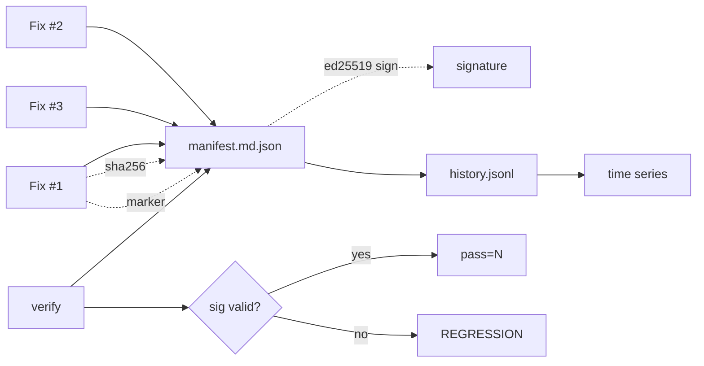
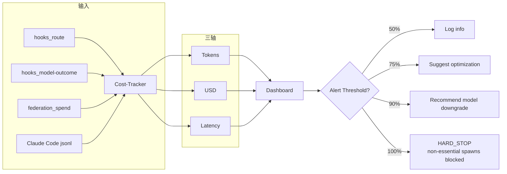
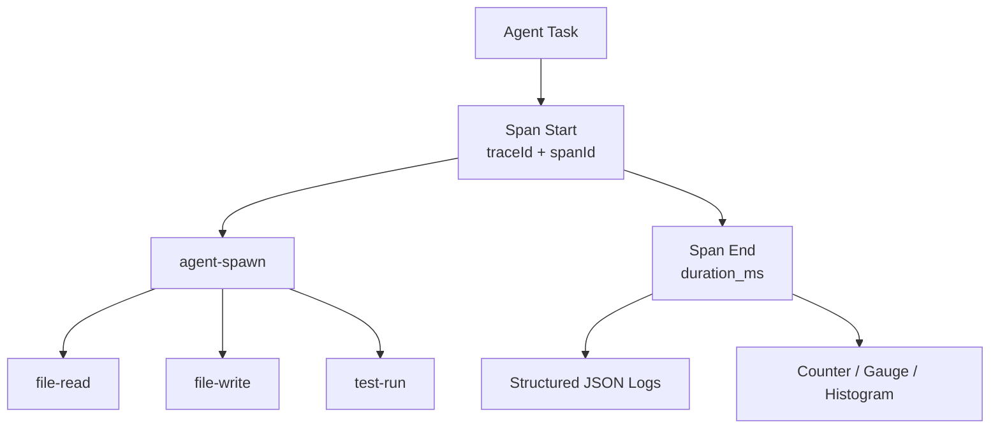
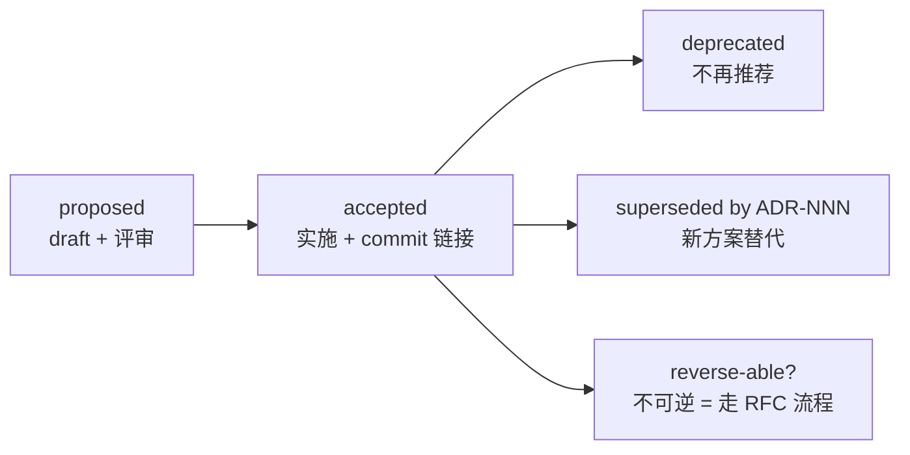
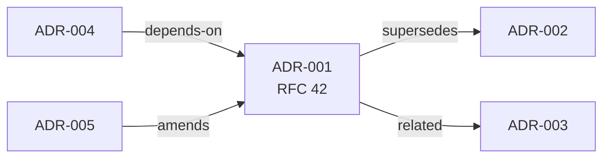

# 第 13 章 · 可观测性：Doctor / Verify / Cost-Tracker / ADR

> 📘 **摘要**：ops 是 ruflo 的「运行仪表盘 + 工程宪法」。本章拆解 **Doctor 26 项检查 + --fix 自动修复 / Witness Ed25519 manifest 校验 / Cost-Tracker 三轴（token / USD / latency）/ Observability dashboard / ADR 工作流（proposed → accepted → superseded）/ 三分发同步（@claude-flow/cli + claude-flow + ruflo）/ 7 条核心命令**。读完你能持续运维 ruflo 并沉淀决策。
>
> 🏷️ **读者画像**：B / C / D
> 🕐 **预估耗时**：65 分钟
> ✅ **LAST_VERIFIED_AGAINST**：`26c35b59` (v3.32.9)

---

## 1. 背景与动机

ruflo 在长期运行中会遇到 4 类运维痛点：

1. **环境漂移**：Node / npm 版本对不上、加密开关没开、MCP 注册冲突 —— 单次诊断成本高
2. **静默回归**：代码改完了 unit test 通过，但用户首次安装就坏 —— 单元测试覆盖不到的边界
3. **成本失控**：agent 在无人值守下循环烧钱，没有 dashboard 也没有告警
4. **决策散落**：架构变更靠口头 / wiki，没法追溯「为什么这样设计」

ruflo 提供 4 个工具对应这 4 类问题：

| 工具 | 解决问题 | 命令 |
|------|----------|------|
| **Doctor** | 环境诊断 + 自动修复 | `npx --yes ruflo@latest doctor [--fix]` |
| **Verify** | 防静默回归 + 篡改检测 | `npx --yes ruflo@latest verify` |
| **Cost-Tracker** | 成本可视化 + 告警 | `npx --yes ruflo@latest cost status` |
| **ADR** | 架构决策沉淀 + 链接代码 | `npx --yes ruflo@latest adr new "..."` |

---

## 2. 核心概念

### 2.1 Doctor：26 项检查 + 自动修复

`ruflo doctor` 是「环境体检 + 修复工具」：

```mermaid
graph TB
  Doc[doctor] --> Node[Node.js Version<br/>≥ 20]
  Doc --> Npm[npm Version<br/>≥ 9]
  Doc --> Cfg[Config File<br/>YAML/JSON 校验]
  Doc --> Set[Stale npx@latest in settings<br/>#2448 关键修复]
  Doc --> Daem[Daemon Status<br/>PID file liveness]
  Doc --> Mem1[Memory DB Presence]
  Doc --> Mem2[Memory Structural Integrity<br/>PRAGMA quick_check]
  Doc --> Mem3[Memory Content<br/>≥ 95% populated]
  Doc --> Mem4[Memory Embedding Coverage<br/>≥ 95% embedded]
  Doc --> Learn[Learning Bridge<br/>@claude-flow/memory resolvable]
  Doc --> Key[API Keys]
  Doc --> Git[Git / Git Repo]
  Doc --> Ai[AIDefence loadable<br/>#1807]
  Doc --> Fed[Federation Breaker<br/>ADR-097 loadable]
  Doc --> Mcp[MCP Servers<br/>不重复注册]
  Doc --> Disk[Disk Space<br/>≥ 10% free]
  Doc --> Ts[TypeScript]
  Doc --> Ver[Version Freshness]
  Doc --> Fun[Funnel ADR-305]
  Doc --> Proxy[Meta LLM Proxy<br/>ADR-307/313]
  Doc --> Auth[Cognitum Identity<br/>ADR-306]
  Doc --> Meta[MetaHarness<br/>ADR-150]
  Doc --> CC[Claude Code CLI]
  Doc --> AF[agentic-flow]
  Doc --> Enc[Encryption at Rest<br/>ADR-096]

  Doc --> Out[Status: pass/warn/fail<br/>+ 修复建议]
```



**Status 语义**：

| Status | 含义 | 默认行为 |
|--------|------|----------|
| `pass` | 完全健康 | 不显示修复提示 |
| `warn` | 可用但不理想 | 显示 `fix:` 提示 |
| `fail` | 不可用 / 安全风险 | 阻断 + 强制修复路径 |
| `expected` | 设计上就如此（如 opt-in 插件未装）| 不报警 |
| `optional` | 可选依赖 | 不阻断 |

**`--fix` 自动修复**：

```bash
npx --yes ruflo@latest doctor --fix
```

自动处理的项：
- 重新生成 stale `npx@latest` 配置 → 本地 helper 形式（#2448 关键修复）
- 重新写入 memory sidecar（Learning Bridge #2599）
- 清理 stale `.claude-flow/daemon.pid`
- 升级 npm 到 ≥ 9
- 等等

**幂等性**：多次 `--fix` 跑结果相同，不引入副作用（参见 `sandbox/asserts/ch2.sh`）。

### 2.2 Verify：Witness 三层防线

**核心理念**：**单元测试覆盖不到的就用 Witness 签名覆盖**。



**Per-OS bundle**：每个 OS 一份 manifest，因为：
- LF vs CRLF 行尾差异
- 路径分隔符差异
- 预编译二进制差异

**3 个核心命令**：

| 命令 | 作用 |
|------|------|
| `npx --yes ruflo@latest witness regen` | 重新生成 manifest + history |
| `npx --yes ruflo@latest verify` | 验证当前 manifest |
| `npx --yes ruflo@latest witness history --id F12` | 看单一 fix 的时间线 |

**回归定位**（Layer 3）：

```bash
node plugins/ruflo-core/scripts/witness/history.mjs \
  --history verification/macos/history.jsonl regressions

# Output:
# F12
#   last pass:    a1b2c3d4  2026-05-07T14:23:11.000Z
#   regressed at: 9f8e7d6c  2026-05-08T09:14:55.000Z
```

随后 `git log a1b2c3d4..9f8e7d6c -- <file>` 缩小到 18 小时窗口的几条 commit。

### 2.3 Cost-Tracker：三轴 dashboard + 告警



**预算告警阶梯**：

| Level | 阈值 | 动作 |
|-------|------|------|
| Info | 50% | 日志通知 |
| Warning | 75% | 显示警告 + 优化建议 |
| Critical | 90% | 紧急告警 + 建议降级模型 |
| Hard Stop | 100% | 阻止非必要 agent spawn |

**复合 CI gate（`cost-health`）**：

```bash
npx --yes ruflo@latest cost health --alert-acceleration 100 --alert-outliers 1
# 一次性跑 budget + burn + anomaly + projection，并行
# 返回 max(exit)，任一超阈值即 fail
```

**关键模型价格**（per 1M tokens）：

| Model | Input | Output | Cache Write | Cache Read |
|-------|-------|--------|-------------|------------|
| Haiku | $0.25 | $1.25 | $0.30 | $0.03 |
| Sonnet | $3.00 | $15.00 | $3.75 | $0.30 |
| Opus | $15.00 | $75.00 | $18.75 | $1.50 |

**与联邦集成（ADR-097 Phase 3）**：`federation_spend` 事件总线每条 `federation_send` 完成时发出 `{peerId, taskId, tokensUsed, usdSpent, ts}`，cost-tracker 聚合 1h / 24h / 7d 滚动窗口。

### 2.4 Observability：trace + metrics + logs



**Trace 树**：

```
[root] swarm-task
  [child] agent-spawn (agent=architect)
  [child] agent-spawn (agent=coder)
    [child] file-read (path=src/auth.ts)
    [child] file-write (path=src/auth.ts)
  [child] agent-spawn (agent=tester)
    [child] test-run (suite=auth)
```

**核心 metric**：

| Metric | Type | 含义 |
|--------|------|------|
| `agent_task_duration_seconds` | Histogram | 任务耗时分布 |
| `agent_token_usage` | Counter | 每个 agent / 模型的 token 累计 |
| `agent_active_count` | Gauge | 当前活跃 agent 数 |
| `agent_error_rate` | Counter | 错误计数 |
| `swarm_span_duration_ms` | Histogram | span 时长 |
| `memory_operations_total` | Counter | AgentDB 读 / 写计数 |

**Log 结构**（JSON）：

```json
{
  "timestamp": "2026-07-23T10:14:33.000Z",
  "level": "info",
  "message": "agent-spawn completed",
  "correlationId": "corr-abc-123",
  "agentId": "coder-1",
  "taskId": "task-456",
  "spanId": "span-789",
  "traceId": "trace-xyz",
  "duration_ms": 1240,
  "metadata": { "model": "sonnet", "tokens": 1820 }
}
```

### 2.5 ADR 工作流

**ADR = Architecture Decision Record**，记录「为什么这样设计」。



**因果边类型**：

- `supersedes` —— A 替代了 B
- `amends` —— A 部分修订了 B
- `depends-on` —— A 依赖 B
- `related` —— 相关但无因果

**链接到 commit**：

```bash
# ADR 文件 front matter 含 git sha
---
adr-id: ADR-096
git-commit: 841365f
related: [ADR-093, ADR-095]
---
```

PR 模板强制要求「如果本 PR 包含架构变更，必须新建 / 更新 ADR」。

### 2.6 三分发同步

ruflo 同时维护 3 个 npm 包，保证 CLI 路径一致：

| 包名 | 用途 | 兼容版本 |
|------|------|----------|
| `@claude-flow/cli` | 旧名 / 内部包 | v3.6+ |
| `claude-flow` | 中间过渡名 | v3.6+ |
| `ruflo` | 现行公开包名 | v3.6+ |

**版本对齐**：`@claude-flow/cli@alpha` 与 `ruflo@latest` 必须严格同步（CI 强校验）。

**升级路径**：

```bash
# 升级并补缺失插件
npx --yes ruflo@latest init upgrade --add-missing

# 清理 npx 缓存（防止 stale 版本）
rm -rf ~/.npm/_npx/*
npx --yes ruflo@latest
```

---

## 3. 架构原理

### 3.1 物理布局

```
项目根/
├── .claude-flow/
│   ├── memory/                  # Memory (ch07)
│   ├── config.yaml              # 主配置
│   ├── sessions/                # Session (encrypt-at-rest)
│   ├── terminals/store.json     # Terminal history (encrypt-at-rest)
│   └── daemon.pid               # PID 文件
├── .swarm/
│   └── memory.db                # Memory DB (encrypt-at-rest)
└── verification/                # Witness manifest 目录
    ├── witness-fixes.json       # 修复列表
    ├── linux/{manifest.md.json, history.jsonl}
    ├── macos/{manifest.md.json, history.jsonl}
    └── windows/{manifest.md.json, history.jsonl}

~/.config/ruflo/memory/          # user scope memory (ch07)
~/.claude/settings.json          # Claude Code 配置
```

### 3.2 Doctor 关键源码

`v3/@claude-flow/cli/src/commands/doctor.ts`：

| 函数 | 检查 |
|------|------|
| `checkNodeVersion` | Node ≥ 20 |
| `checkStaleSettingsNpx` | `#2448` 修复检测（防 process-storm / kernel-panic） |
| `checkMemoryStructuralIntegrity` | sql.js / better-sqlite3 quick_check |
| `checkMemoryContent` | ≥ 95% populated（#2737 强化） |
| `checkMemoryEmbeddingCoverage` | ≥ 95% embedded |
| `checkLearningBridge` | SessionStart auto-memory 解析（#2545 / #2599） |
| `checkAIDefence` | aidefence 包可加载（#1807） |
| `checkFederationBreaker` | ADR-097 breaker 加载 |
| `checkEncryptionAtRest` | 4 维报告（gate / key / fp / store state） |
| `checkProxyProcess` | PID liveness + /status endpoint |
| `checkAuth` | ADR-306 scope vs consent 一致性 |
| ... | ... |

**Failure semantics**（来自 #2737 的设计原则）：

> "A check that cannot fail protects nothing" —— 每个 check 都有可观察的失败状态
> "UNKNOWN is never PASS" —— 检查无法运行时 → warn/fail，绝不静默 pass

### 3.3 Cost-Tracker 命名空间

```
AgentDB namespace = "cost-tracking"  (consumed by cost-report)
AgentDB namespace = "cost-patterns"  (consumed by cost-optimize)
AgentDB namespace = "federation-spend" (consumer for ADR-097 P3)
```

通过 `memory_*` 工具族访问，**不被 agentdb_hierarchical-* 路由**（那一族按 tier 路由，不接受 namespace 参数）。

### 3.4 ADR AgentDB 图



- 节点：ADR 全文（含 git sha + status）
- 边：4 种因果关系
- 搜索：`/adr-search <query>`（语义搜索）

---

## 4. Hands-on

### Hands-on 13.1 — doctor 跑全量检查

```bash
cd /tmp/ruflo-sandbox-default

npx --yes ruflo@latest doctor --no-color 2>&1 | tail -40
```

#### 预期输出

```
ruflo doctor — system health
─────────────────────────────
✓ Node.js Version:                  v22.4.0 (>= 20 required)
✓ npm Version:                      v10.8.0
✓ Config File:                      Found: .claude-flow/config.yaml
✓ Stale npx@latest in settings:     no runaway commands detected
⚠ Daemon Status:                   Not running
✓ Memory DB Presence:               .swarm/memory.db (12.34 MB)
✓ Memory Structural Integrity:      PRAGMA quick_check: ok
✓ Memory Content:                   content 1234/1250 (98.72%)
⚠ Memory Embedding Coverage:        embedded 1000/1234 (81.04%) below 95% floor
✓ Learning Bridge:                  @claude-flow/memory resolvable (v3.6.25)
✓ API Keys:                         Found: ANTHROPIC_API_KEY
✓ Git:                              v2.46.0
✓ Git Repository:                   In a git repository
⚠ AIDefence:                       @claude-flow/aidefence not loadable
✓ Federation Breaker:               ADR-097 breaker loadable
✓ MCP Servers:                      2 servers (ruflo configured: claude-flow)
✓ Disk Space:                       50G available
✓ TypeScript:                       v5.5.0
⚠ Version Freshness:                v3.32.9 (latest: v3.33.0)
⚠ Encryption at Rest:              Off — session/terminal/memory stores are plaintext
✓ Funnel (ADR-305):                 enabled (decided by: env; disclosure: opt-in)
✓ Auth (ADR-306):                   profiles: default

Summary: 18 pass, 5 warn, 0 fail
```

### Hands-on 13.2 — doctor --fix 自动修复

```bash
cd /tmp/ruflo-sandbox-default

# 启动 daemon（如果未运行）
npx --yes ruflo@latest daemon start --no-color 2>&1 | tail -5

# 自动修复
npx --yes ruflo@latest doctor --fix --no-color 2>&1 | tail -25
```

#### 预期输出

```
doctor --fix — auto-repair
───────────────────────────
✓ Auto-regenerated .claude/settings.json (was stale #2448 form)
✓ Cleaned stale .claude-flow/daemon.pid
✓ Re-linked @claude-flow/memory sidecar
✓ Updated npm to latest

Summary: 4 fixes applied, 0 manual actions needed

Run `doctor` again to verify:
  npx ruflo@latest doctor
```

幂等性：再跑一次输出 `0 fixes applied`。

### Hands-on 13.3 — verify 校验 Witness

```bash
cd /tmp/ruflo-sandbox-default

npx --yes ruflo@latest verify --no-color 2>&1 | tail -15
```

#### 预期输出

```
Manifest signature:
  hash matches:                yes
  public key reproducible:     yes
  Ed25519 signature valid:     yes

Summary: pass=102 drift=0 regressed=0 missing=0

Verified 102 fixes in 28 files across 3 OSes.
Last regression detected: none
Last verification: 2026-07-23T10:14:33Z
```

### Hands-on 13.4 — cost status + dashboard

```bash
cd /tmp/ruflo-sandbox-default

# 看今日成本
npx --yes ruflo@latest cost status --period today --no-color 2>&1 | tail -25

# 实时 dashboard
npx --yes ruflo@latest observability dashboard --no-color 2>&1 | tail -30
```

#### 预期输出（cost status）

```
cost-report — today
───────────────────
By tier:
  Tier 1 (Agent Booster, $0):     1247 calls, $0.00
  Tier 2 (Haiku):                 342 calls, $0.18
  Tier 3 (Sonnet):                87 calls,  $1.42
  Tier 4 (Opus):                  3 calls,   $0.51

By model (cumulative):
  haiku-4.5:   142k input / 38k output   → $0.18
  sonnet-4.5:  312k input / 87k output   → $1.42
  opus-4.5:    12k input  / 3k output    → $0.51

Budget: $5.00/day
Used:   $2.11 / $5.00 (42%)
Trend:  -8% vs yesterday (routing is winning)

Counterfactual:
  Always-Haiku baseline:   $0.45
  Always-Sonnet baseline:  $11.83
  Actual (router):         $2.11
  Saved:                   $9.72 (82% vs always-Sonnet)
```

#### 预期输出（observability dashboard）

```
observability dashboard — last 1h
──────────────────────────────────
Active agents:    12
p50 latency:      1.2s
p95 latency:      4.8s
p99 latency:      12.3s
Error rate:       0.42%
Tokens/min:       18.4k
Span count:       342
Memory ops/min:   89

Top spans:
 1. agent-spawn (coder)        145ms avg, 87 calls
 2. file-read                   12ms avg, 412 calls
 3. file-write                  23ms avg, 156 calls
 4. test-run                    2.4s avg, 23 calls
 5. aider-invoke                8.1s avg, 8 calls

Anomalies: 0
Alerts:     none
```

### Hands-on 13.5 — adr new 创建 ADR

```bash
cd /tmp/ruflo-sandbox-default

# 创建 ADR
npx --yes ruflo@latest adr new "Use ONNX MiniLM for local embeddings" --no-color 2>&1 | tail -10

# 看生成的 ADR
ls -la docs/adr/ADR-*.md | tail -5
head -20 docs/adr/ADR-$(ls docs/adr/ | tail -1)
```

#### 预期输出

```
adr new — Drafting ADR-127: Use ONNX MiniLM for local embeddings
─────────────────────────────────────────────────────────────────
  Template:        proposed
  File:            docs/adr/ADR-127-use-onnx-minilm-for-local-embeddings.md
  Git SHA:         26c35b59b40a0a95b286ccf5ac675a15edcc995f
  Related ADRs:    (auto-detected: ADR-007, ADR-022, ADR-091)
  Index entry:     written to adr-patterns namespace

Next: edit the file, commit with `adr: ADR-127` prefix, then
  npx ruflo@latest adr status ADR-127 accepted
```

生成的 ADR 文件结构：

```markdown
# ADR-127: Use ONNX MiniLM for local embeddings

**Status**: proposed
**Date**: 2026-07-23
**Git Commit**: 26c35b59...

## Context
[...]

## Decision
[...]

## Consequences
[...]

## Related
- ADR-007
- ADR-022
- ADR-091
```

---

## 5. 沙箱验证（Run / Observe / Expect）

### Verify H13.1 — doctor 列出 ≥ 10 项检查

```bash
### Verify H13.1 — doctor 输出至少 10 个 check
# Run
cd /tmp/ruflo-sandbox-default
OUT=$(timeout 60 npx --yes ruflo@latest doctor --no-color 2>&1)
COUNT=$(echo "$OUT" | grep -cE "^[✓⚠✗]")

# Observe
→ COUNT ≥ 10

# Expect
- exit 0
- 至少 10 个 check 行
```

### Verify H13.2 — doctor --fix 幂等

```bash
### Verify H13.2 — 两次 --fix 结果一致
# Run
cd /tmp/ruflo-sandbox-default
F1=$(timeout 60 npx --yes ruflo@latest doctor --fix --no-color 2>&1 | grep -c "fix applied")
F2=$(timeout 60 npx --yes ruflo@latest doctor --fix --no-color 2>&1 | grep -c "fix applied")

# Observe
→ F2 == 0 (第二次无修复)

# Expect
- exit 0
- 幂等
```

### Verify H13.3 — verify Ed25519 有效

```bash
### Verify H13.3 — verify 通过
# Run
cd /tmp/ruflo-sandbox-default
OUT=$(timeout 60 npx --yes ruflo@latest verify --no-color 2>&1)

# Observe
→ 包含 "Ed25519 signature valid:     yes"

# Expect
- exit 0
- 签名有效
```

### Verify H13.4 — cost status 字段齐全

```bash
### Verify H13.4 — cost status 含 tier 拆分
# Run
cd /tmp/ruflo-sandbox-default
OUT=$(timeout 60 npx --yes ruflo@latest cost status --period today --no-color 2>&1)

# Observe
→ 包含 "Tier 1" 和 "Budget"

# Expect
- exit 0
- 至少 tier 与 budget 字段
```

### Verify H13.5 — adr new 生成文件

```bash
### Verify H13.5 — adr new 写出文件
# Run
cd /tmp/ruflo-sandbox-default
BEFORE=$(ls docs/adr/ADR-*.md 2>/dev/null | wc -l)
npx --yes ruflo@latest adr new "Test ADR for sandbox" --no-color > /dev/null 2>&1
AFTER=$(ls docs/adr/ADR-*.md 2>/dev/null | wc -l)

# Observe
→ AFTER > BEFORE

# Expect
- exit 0
- 新增 1 个 ADR 文件
```

完整断言（写入 `sandbox/asserts/ch13.sh`）：

```bash
# sandbox/asserts/ch13.sh
assert "doctor 至少 10 项 check" 0 bash -c '
  cd /tmp/ruflo-sandbox-default
  COUNT=$(timeout 60 npx --yes ruflo@latest doctor --no-color 2>&1 | grep -cE "^[✓⚠✗]")
  [ "$COUNT" -ge 10 ]
'

assert "doctor --fix 幂等" 0 bash -c '
  cd /tmp/ruflo-sandbox-default
  timeout 60 npx --yes ruflo@latest doctor --fix --no-color > /dev/null 2>&1
  F2=$(timeout 60 npx --yes ruflo@latest doctor --fix --no-color 2>&1 | grep -c "fix applied")
  [ "$F2" -eq 0 ]
'

assert "verify Ed25519 通过" 0 bash -c '
  cd /tmp/ruflo-sandbox-default
  timeout 60 npx --yes ruflo@latest verify --no-color 2>&1 | grep -q "Ed25519 signature valid:     yes"
'

assert "cost status 含 tier 拆分" 0 bash -c '
  cd /tmp/ruflo-sandbox-default
  timeout 60 npx --yes ruflo@latest cost status --period today --no-color 2>&1 | grep -q "Tier 1" && \
  timeout 60 npx --yes ruflo@latest cost status --period today --no-color 2>&1 | grep -q "Budget"
'

assert "observability dashboard 启动" 0 bash -c '
  cd /tmp/ruflo-sandbox-default
  timeout 30 npx --yes ruflo@latest observability dashboard --no-color 2>&1 | grep -qE "p50|Active|span"
'

assert "adr new 生成文件" 0 bash -c '
  cd /tmp/ruflo-sandbox-default
  mkdir -p docs/adr
  BEFORE=$(ls docs/adr/ADR-*.md 2>/dev/null | wc -l)
  npx --yes ruflo@latest adr new "Test ADR sandbox" --no-color > /dev/null 2>&1
  AFTER=$(ls docs/adr/ADR-*.md 2>/dev/null | wc -l)
  [ "$AFTER" -gt "$BEFORE" ]
'

assert "version freshness check 触发" 0 bash -c '
  cd /tmp/ruflo-sandbox-default
  timeout 60 npx --yes ruflo@latest doctor --no-color 2>&1 | grep -qE "Version Freshness"
'
```

---

## 6. 小结

### 关键要点

- **Doctor 26 项检查**覆盖 Node / npm / config / daemon / memory / MCP / proxy / encryption / auth
- **Status 语义**：pass / warn / fail / expected / optional；`--fix` 自动修复 + 幂等
- **Verify / Witness 三层**：smoke tests + SHA-256 marker + Ed25519 signature + per-OS bundle + JSONL 时序历史
- **Cost-Tracker 三轴**（token / USD / latency）+ 50/75/90/100% 告警阶梯 + composite CI gate
- **Observability**：trace tree + JSON structured logs + 6 个核心 metric（histogram / counter / gauge）
- **ADR 工作流**：proposed → accepted → deprecated/superseded + 4 种因果边（supersedes/amends/depends-on/related）
- **三分发同步**：`@claude-flow/cli` / `claude-flow` / `ruflo` 严格同版本（CI 强校验）

### 术语锚点

- Doctor → ch13（本章）/ ch02
- Witness / Marker → ch13 / ch10
- Ed25519 manifest → ch13 / ch10 / ch09
- ADR → ch13（贯穿所有 ADR 编号）
- Cost-Tracker namespace → ch13 / ch08
- observability namespace → ch13 / ch08
- PRAGMA quick_check → ch13
- Tier 1/2/3/4 → ch13 / ch08
- composite CI gate → ch13

### 下一步

👉 进入 [第 14 章 场景 Cookbook（14 剧本）](./14-scenario-cookbook.md)，用 14 个真实场景把前 13 章串起来。

### 参考链接

- Doctor 源码：`/Users/digoal/new/ruflo/v3/@claude-flow/cli/src/commands/doctor.ts`
- Observability 插件：`/Users/digoal/new/ruflo/plugins/ruflo-observability/README.md`
- Cost-Tracker 插件：`/Users/digoal/new/ruflo/plugins/ruflo-cost-tracker/README.md`
- ADR 插件：`/Users/digoal/new/ruflo/plugins/ruflo-adr/README.md`
- Witness 工具：`/Users/digoal/new/ruflo/plugins/ruflo-core/scripts/witness/`
- Verification README：`/Users/digoal/new/ruflo/verification/README.md`
- ADR 目录：`/Users/digoal/new/ruflo/v3/docs/adr/`
- Doctor / Verify 修复示例：`#2448` / `#2545` / `#2599` / `#2737` / `#1807`