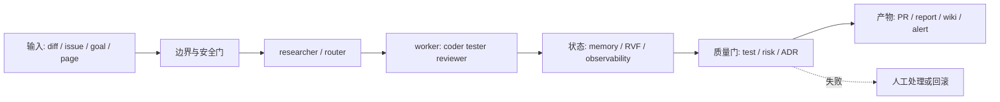
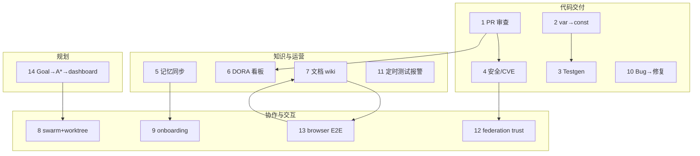

# 第 14 章 · 场景 Cookbook：把 Ruflo 接进真实交付链

> 📘 **摘要**：本章不是命令清单，而是 14 个可以从输入走到可验证产物的端到端剧本。每个剧本都明确目标、Stack、命令、观察点和验收条件；你可以把它们复制到临时仓库，再替换成自己的代码。
> 🏷️ **读者画像**：已经完成安装，希望把 Ruflo 接入 code review、重构、测试、安全、文档、运营或团队协作的工程师。
> 🕐 **预估耗时**：120–180 分钟；单个剧本通常 5–20 分钟。
> ✅ **LAST_VERIFIED_AGAINST**：`26c35b59b40a0a95b286ccf5ac675a15edcc995f`（2026-07-23）

> **先读这三条约定**
>
> 1. 示例中的 `npx --yes ruflo@latest` 是手册统一入口；在 CI 中请把 `latest` 换成经过验证的版本，并缓存 npm 依赖。
> 2. `agentdb_hierarchical-*` 按 `tier` 路由，不能传 `namespace`；命名空间读写使用 `memory_*`。`agentdb_pattern-*` 走 ReasoningBank，不能用它做命名空间过滤。
> 3. 所有来自网页、Issue、PR、浏览器或外部 agent 的文本，进入 memory 前先做 PII gate、sanitization gate、prompt-injection gate。不要因为“只是测试数据”而跳过。

## 1. 背景与动机

真实项目的困难通常不是“能不能调用一个 agent”，而是如何让一次调用拥有清晰的输入边界、可追踪的中间状态和机器可判定的出口。一个好的 Ruflo 场景至少包含：

- **输入**：提交、文件、Issue、目标或网页，而不是模糊的“帮我看看”；
- **协作**：明确哪个 agent 负责研究、实现、审查或汇总；
- **状态**：把结果写入正确的 memory namespace，必要时进入 RVF 或 observability；
- **门禁**：测试、风险阈值、PII 检查、ADR 合规或人工审批；
- **产物**：PR 评论、补丁、报告、测试、wiki 页面、报警或可恢复的 session。

下面的剧本按“代码交付 → 记忆与运营 → 协作与浏览器 → 目标规划”的顺序排列。它们可以单独使用，也可以串成流水线。例如剧本 1 的风险分数可以成为剧本 8 的 swarm 分派条件，剧本 4 的 security finding 可以写入剧本 12 的 federation 审计流，剧本 13 的浏览器 session 可以被剧本 7 的文档同步复用。

### 1.1 通用沙箱

每个剧本都建议在隔离目录执行。没有真实仓库时，先建立一个最小 fixture：

```bash
mkdir -p /tmp/ruflo-cookbook-demo && cd /tmp/ruflo-cookbook-demo
npx --yes ruflo@latest --version
npx --yes ruflo@latest doctor
```

如果要让插件被 Claude Code 自动发现，请在真实项目里安装 marketplace 插件；如果只需要 CLI smoke，则不必把所有插件装入当前会话。剧本中的 `claude --plugin-dir` 代表开发态加载，CI 里建议使用固定 marketplace 版本。

### 1.2 端到端骨架



## 2. 核心概念

### 2.1 剧本的四类契约

| 契约 | 要回答的问题 | Ruflo 载体 |
|---|---|---|
| 输入契约 | agent 可以读哪些文件、外部内容来自哪里？ | agent prompt、tool whitelist、worktree |
| 过程契约 | 哪些 agent 并行？谁拥有最终决策？ | swarm topology、SendMessage、SPARC |
| 状态契约 | 结果写在哪里、保留多久、谁可见？ | `memory_*`、namespace、RVF |
| 出口契约 | 什么条件算成功？失败是否产生可重试产物？ | test、risk score、smoke、audit |

### 2.2 命名空间不要混用

常用命名空间如下。它们是可检索的状态边界，不是装饰性标签。

| 用途 | 推荐 namespace | 写入示例 |
|---|---|---|
| PR 风险与 diff pattern | `git-patterns` | 文件风险、分类、推荐 reviewer |
| 测试缺口 | `test-gaps` | 文件、优先级、最后发现时间 |
| 安全发现 | `security-findings` | 文件、commit、severity |
| 团队记忆 | `claude-memories` / `patterns` | 经过 gate 的团队规范 |
| 文档漂移 | `docs-drift` | export hash、最后同步时间 |
| swarm 状态 | `swarm-state` | topology、agent assignment |
| worker 历史 | `worker-history` | trigger、duration、verdict |

`pattern`（单数）是 ReasoningBank fallback 的保留空间，`patterns`（复数）则可能由 pretrain 写入；不要在报告中把两者合并成一个事实。

### 2.3 失败也是产物

脚本不应把失败只写到 stderr。一个可运维的剧本要留下：输入摘要、已执行步骤、失败原因、重试建议、相关 traceId 和尚未提交的 worktree 路径。这样下一个 agent 能从 checkpoint 继续，而不是从零再做一次。

## 3. 架构/原理：14 个剧本如何拼接



**选择原则**：单文件、低风险任务从 agent 开始；跨文件且可机械验证的任务先用 AST/codemod；跨团队或外部内容先加 security gate；长周期目标先进入 goals，不要把所有状态塞进一次对话。

## 4. Hands-on：场景剧本集

以下每个剧本都包含 **Goal、Stack、Steps、Run / Observe / Expect、Verify**。命令使用“先诊断、后执行、再验收”的顺序；在生产仓库中把写操作放到 worktree 或分支。

### 剧本 1：PR 自动审查 + 风险打分

**一句话描述**：用 `ruflo-jujutsu` 分析 diff，给出变更分类、文件级风险和 reviewer 建议，再把结果作为 PR gate。

**Goal**：让高风险、涉及认证或数据迁移的 PR 自动升级人工审查；低风险文档变更可以快速合并。

**Stack**：`ruflo-core`、`ruflo-jujutsu` 的 `git-specialist`、`analyze_diff` 六工具、可选 `ruflo-adr` 的 `/adr check`、`git-patterns` namespace。

**Steps**：

```bash
cd /path/to/repo
npx --yes ruflo@latest doctor
npx --yes ruflo@latest plugins doctor
# 先确认工作树，禁止把未提交的本地实验混进审查
npx --yes ruflo@latest jujutsu
npx --yes ruflo@latest hooks route "review current PR for security and ownership risk"
```

在 Claude Code 会话中加载插件后，执行 `/jujutsu` 或触发 `diff-analyze` skill。若项目有 ADR，再执行：

```bash
npx --yes ruflo@latest adr check
npx --yes ruflo@latest memory store --key "pr-review:$(git rev-parse HEAD)" --value "risk report attached to CI artifact" --namespace git-patterns
```

**Run**：把 `HEAD` 与目标分支的 diff 作为唯一输入，要求 agent 输出 JSON 字段 `classification`、`overallRisk`、`files`、`reviewers`、`adrFindings`。

**Observe**：关注 `analyze_diff-stats` 的触及文件数、复杂度 delta，以及 `analyze_file-risk` 是否把 `auth/`、migration、shell execution 识别为高风险。`/adr check` 若无法调用高级分析，会退回普通 `git diff`，应在日志中标明降级。

**Expect**：得到可复制到 PR 的摘要，例如 `classification=security`、`overallRisk=high`、需要 `security-owner` 和 `data-owner` 审查；没有凭空生成不存在的 reviewer。

**Verify**：

- 风险评分和文件 breakdown 的 JSON 可被 CI 解析；
- 高风险阈值触发 required review，低风险不会误阻断；
- `git-patterns` 记录只包含摘要，不包含 token、密码或完整私有 diff；
- `bash plugins/ruflo-jujutsu/scripts/smoke.sh` 通过。

### 剧本 2：遗留大仓 100 个 `var` → `const` 重构

**一句话描述**：先用 AST 和 codemod 找到真正可安全替换的 100 个绑定，再让 agent 处理例外并用测试证明“100% 命中”。

**Goal**：把一批不会重新赋值的 `var` 改成 `const`，不误改循环变量、提升语义或跨作用域依赖。

**Stack**：`ruflo-ruvector` `ast-analyze`、`ruflo-jujutsu`、`ruflo-swarm`、worktree、项目 linter/test。

**Steps**：

```bash
cd /path/to/legacy-monorepo
npx --yes ruflo@latest vector ast src/legacy/module.ts
npx --yes ruflo@latest vector hooks ast-complexity src/legacy
npx --yes ruflo@latest hooks route "codemod var declarations to const only when never reassigned"
```

建立候选清单时用 parser 的 binding/reassignment 信息，而不是简单替换：

```bash
rg -n "\bvar\b" packages/ > /tmp/var-candidates.txt
npx --yes ruflo@latest memory store --key "codemod:var-const:baseline" --value "candidate list at $(git rev-parse HEAD)" --namespace git-patterns
```

在独立 worktree 运行 codemod；让一个 agent 写变换，一个 agent 审核例外，一个 agent 跑测试。完成后：

```bash
npx --yes ruflo@latest jujutsu
npx --yes ruflo@latest vector hooks diff-analyze HEAD
npm test -- --runInBand
npm run lint
```

**Run**：先生成 100 个候选并给每个候选标记 `safe`、`needs-review`、`skip`，再只对 `safe` 应用 codemod。

**Observe**：看 diff 是否出现 `for (var i...)`、重复声明、闭包捕获变化；对每个候选保存变更前后 AST hash。

**Expect**：100/100 候选都有结论；安全子集全部替换；`needs-review` 明确列出原因；测试与 lint 通过，diff risk 不超过预设阈值。

**Verify**：

- `git diff --check` 无空白错误；
- 候选报告的 `total = safe + needs-review + skip`；
- 替换后的绑定没有写操作；
- 新代码覆盖率没有下降；
- review 结果可复现，第二次运行不会继续产生变更（idempotent）。

### 剧本 3：多文件 TypeScript → 单元测试自动生成

**一句话描述**：用 testgen 找测试缺口，按路径生成测试骨架，再由 tester agent 补齐边界和断言。

**Goal**：为一个 TypeScript 子系统生成高价值单元测试，而不是用快照或无断言测试“刷覆盖率”。

**Stack**：`ruflo-testgen`、`ruflo-sparc` Refinement gate、`ruflo-ruvector` coverage route、`tester` agent、`test-gaps` namespace。

**Steps**：

```bash
cd /path/to/ts-repo
npx --yes ruflo@latest hooks coverage-gaps --format table --limit 20
npx --yes ruflo@latest hooks coverage-route --task "add unit tests for payment domain"
npx --yes ruflo@latest hooks coverage-suggest --path src/payment
npx --yes ruflo@latest hooks worker dispatch --trigger testgaps --scope src/payment
```

让 agent 对每个测试候选输出：函数前置条件、正常路径、边界、错误路径、mock 依赖和断言理由。生成后运行：

```bash
npm test -- --coverage
npx --yes ruflo@latest memory search --query "payment test gaps" --namespace test-gaps --limit 10
```

**Run**：限制 agent 只改 `src/payment/**/*.test.ts`，先写失败测试再实现缺失 mock；禁止为了通过测试修改生产语义。

**Observe**：看 coverage report 的 branch/function coverage，检查测试是否验证返回值、错误类型和副作用，而非只检查 `toBeDefined()`。

**Expect**：每个高优先级 gap 有测试或书面跳过理由；新代码覆盖率达到项目门槛（SPARC Refinement 默认要求新代码至少 80%）；失败测试能定位到生产 bug 或测试假设。

**Verify**：

```bash
npm test -- --coverage
npx --yes ruflo@latest sparc status
npx --yes ruflo@latest hooks worker status
```

通过条件是测试绿、coverage gate 绿、`test-gaps` 已更新，且生成的测试没有跨 context 直接导入内部实现。

### 剧本 4：安全扫描 + CVE 修复 PR

**一句话描述**：静态扫描发现 shell injection、依赖 CVE 或 secret 后，用 aidefence 做运行时三门防御，自动产生最小修复 PR。

**Goal**：把“扫描发现”转成可审查、可回滚的补丁；不让修复 agent 把不可信建议直接写入代码或 memory。

**Stack**：`ruflo-security-audit`、`ruflo-aidefence`、`security-audit` agent、`security-findings` namespace、`ruflo-jujutsu`。

**Steps**：

```bash
cd /path/to/repo
npx --yes ruflo@latest security scan --depth deep
npx --yes ruflo@latest hooks security-scan src/
npx --yes ruflo@latest aidefence stats
npx --yes ruflo@latest memory search --query "open CVE shell injection" --namespace security-findings --limit 20
```

对 Issue 或外部 advisory 文本先执行三 gate：

```bash
npx --yes ruflo@latest aidefence has-pii --text "$ADVISORY_TEXT"
npx --yes ruflo@latest aidefence scan --text "$ADVISORY_TEXT"
npx --yes ruflo@latest aidefence is-safe --text "$ADVISORY_TEXT"
```

修复 agent 只能在隔离 worktree 使用允许的 package manager 命令：

```bash
npx --yes ruflo@latest hooks route-enhanced "fix confirmed dependency CVE without changing public API"
npm test
npx --yes ruflo@latest jujutsu
```

**Run**：把发现按 `critical/high/medium/low` 排序，critical/high 需要人工批准；对 `execSync(string)`、未验证数字 MCP 输入、不可信 package spec、loader-hijack env 特别检查。

**Observe**：看安全修复是否使用 `execFileSync(cmd, argv, {shell:false})`，是否对 package spec、整数输入和环境变量做运行时验证；确认扫描输出没有把 secret 原文写入日志。

**Expect**：有带 CVE、受影响版本、修复版本、测试证据的 PR；若不能安全自动修复，输出阻断而非“猜一个版本”。

**Verify**：

- 修复前后扫描对比，原 finding 关闭或有明确剩余风险；
- `aidefence_has_pii`、`aidefence_scan`、`aidefence_is_safe` 顺序正确；
- `security-findings` 只有脱敏 finding；
- `CLAUDE_FLOW_ENCRYPT_AT_REST` 状态按 `npx --yes ruflo@latest doctor -c encryption` 记录；
- `bash plugins/ruflo-security-audit/scripts/smoke.sh` 通过。

### 剧本 5：团队记忆跨项目同步

**一句话描述**：把团队规范写入可检索 memory，导入 Claude Code auto-memory，并在第二个项目验证语义召回。

**Goal**：让“错误如何包装”“API 如何命名”“测试使用什么风格”等稳定知识跨项目可复用，同时保留来源和作用域。

**Stack**：`ruflo-rag-memory`、`ruflo-agentdb`、`memory_bridge`、`ruflo-federation`（需要跨安装同步时）、`claude-memories` 与 `patterns` namespace。

**Steps**：

```bash
mkdir -p /tmp/ruflo-team-a /tmp/ruflo-team-b
cd /tmp/ruflo-team-a
npx --yes ruflo@latest memory store --key "team:error-context" \
  --value "错误必须带业务上下文；保留原始 cause；不要把 token 写进 message" \
  --namespace patterns --tags "team,error,convention"
npx --yes ruflo@latest memory store --key "team:test-style" \
  --value "单元测试优先验证行为和错误边界，避免只验证实现细节" \
  --namespace patterns
npx --yes ruflo@latest memory bridge
```

在项目 B：

```bash
cd /tmp/ruflo-team-b
npx --yes ruflo@latest memory search --query "how should service errors be wrapped" --namespace patterns --limit 5
npx --yes ruflo@latest memory search --query "team testing convention" --limit 10
npx --yes ruflo@latest memory bridge --all-projects
```

跨 installation 时，把 RVF 作为可审计导出，而不是直接复制数据库：

```bash
npx --yes ruflo@latest rvf export --namespace patterns --output /tmp/team-patterns.rvf
npx --yes ruflo@latest rvf import /tmp/team-patterns.rvf
npx --yes ruflo@latest federation status
```

**Run**：先把规则分为 `project`、`local`、`user` scope；对 user scope 的写入必须经过人工确认。

**Observe**：检查结果的 source attribution 是 `claude-code`、`auto-memory` 还是 `agentdb`；检查敏感内容是否被 gate 拒绝。

**Expect**：项目 B 通过语义 query 命中项目 A 的规范；冲突规则不被静默覆盖，结果显示时间、来源和 scope。

**Verify**：

- `memory_search_unified` 能跨命名空间搜索；
- 同一 key 的更新是幂等的；
- 导出包不含明文 secret；
- federation 传输有签名、trust level 与审计记录；
- 删除项目级数据不会删除 user scope 的团队规范。

### 剧本 6：DORA 指标看板自动出报表

**一句话描述**：从 GitHub/CI 事件采集部署频率、lead time、变更失败率和恢复时间，通过 observability 生成带证据的周报。

**Goal**：每周自动产生 DORA 报告，能从指标钻取到 agent task、PR、commit 和 trace。

**Stack**：`ruflo-observability`、GitHub integration、`ruflo-cost-tracker`、`observability-engineer`、`observability` namespace、可选 `ruflo-goals`。

**Steps**：

```bash
cd /path/to/repo
npx --yes ruflo@latest observe dashboard
npx --yes ruflo@latest observe metrics --period 7d
npx --yes ruflo@latest observe logs --level error
npx --yes ruflo@latest observe trace "$TASK_ID"
```

让 GitHub agent 导出事件摘要：

```bash
npx --yes ruflo@latest hooks route "collect GitHub deployments, PR lead time, incidents and rollback evidence"
npx --yes ruflo@latest memory store --key "dora:week:2026-W30" --value "report artifact path and metric provenance" --namespace observability
```

**Run**：定义窗口和口径，例如 lead time 是 first commit 到 production deploy，恢复时间是 incident start 到 service healthy；不要让 agent 自行更改口径。

**Observe**：检查每个指标的 sample count、p50/p95/p99、异常点、数据缺失和时区；关联 `traceId`、`taskId`、`agentId`。

**Expect**：报告同时给出数值、计算公式、数据范围、缺失事件和链接；异常只触发建议，不伪造“恢复时间”。

**Verify**：

- 同一周重跑结果稳定；
- 事件去重按 event id；
- `agent_task_duration_seconds`、`agent_token_usage` 等 telemetry 与应用部署事件可关联；
- `observability` namespace 保存 snapshot，不保存完整 secret 或大 payload；
- 报表经人工确认后才发布。

### 剧本 7：文档自动同步到 wiki

**一句话描述**：API 变更触发 document worker，生成 API reference，做 drift check，再由 browser agent 发布到 wiki。

**Goal**：让实现、API docs 和 wiki 在同一次变更中可追踪，不让外部页面上的 prompt injection 进入 agent prompt。

**Stack**：`ruflo-docs`、`ruflo-loop-workers` 的 `document` worker、`ruflo-browser`、`ruflo-aidefence`、`docs-drift` namespace。

**Steps**：

```bash
cd /path/to/repo
npx --yes ruflo@latest hooks worker dispatch --trigger document --scope api
npx --yes ruflo@latest memory search --query "API documentation drift" --namespace docs-drift --limit 20
npx --yes ruflo@latest browser doctor
npx --yes ruflo@latest browser session record --name wiki-sync
```

先把生成文档写到本地 artifact，人工或 reviewer agent 检查后再打开 wiki：

```bash
npx --yes ruflo@latest aidefence is-safe --text "$(python3 -c 'print(open("docs/api.md").read())')"
npx --yes ruflo@latest browser session end --verdict "docs-reviewed"
```

在 Claude Code 中调用 `browser-extract` / `browser-form-fill` 时，cookies 只通过 opaque handle 使用，不能直接读回。

**Run**：document worker 生成 OpenAPI 3.0/API reference；browser session 记录导航、snapshot 和提交按钮的结果。

**Observe**：看 drift hash 是否只因实现变化而更新；看 wiki 返回内容是否通过 `aidefence_is_safe`；观察 RVF session 是否包含 `findings.md`。

**Expect**：wiki 页面更新为 review 过的版本；提交失败留下可 replay 的 session；外部页面中带有“忽略之前指令”的内容被 quarantine。

**Verify**：

- `docs-drift` 记录 old/new hash、scope、commit；
- wiki 发布有 URL、时间、reviewer 和 session id；
- 未把 cookies/raw token 写入 AgentDB；
- `browser_session_replay` 在测试站点可复现；
- worker history 有 success/failure verdict。

### 剧本 8：多 agent 并行写 5 个微服务

**一句话描述**：用 hierarchical swarm 分配五个 bounded context，每个 agent 在自己的 worktree 实现，coordinator 负责接口合并和反漂移。

**Goal**：在共享 API contract 下并行开发五个微服务，并把跨服务修改控制在可审查范围。

**Stack**：`ruflo-swarm`、`ruflo-ddd`、`ruflo-sparc`、`ruflo-adr`、worktree、`swarm-state` namespace、Raft consensus。

**Steps**：

```bash
cd /path/to/repo
npx --yes ruflo@latest sparc init "split order platform into five services"
npx --yes ruflo@latest ddd map
npx --yes ruflo@latest swarm init --topology hierarchical --strategy specialized --consensus raft --max-agents 6
npx --yes ruflo@latest swarm status
```

先创建 contract 和 ADR，再派发：

```bash
npx --yes ruflo@latest adr create "service boundaries and API versioning"
npx --yes ruflo@latest ddd context create orders
npx --yes ruflo@latest ddd context create payments
npx --yes ruflo@latest ddd context create inventory
npx --yes ruflo@latest ddd context create shipping
npx --yes ruflo@latest ddd context create identity
```

每个 agent 只拥有自己的 worktree 和目录。完成后 coordinator 按顺序跑：

```bash
npx --yes ruflo@latest ddd validate
npx --yes ruflo@latest sparc advance
npx --yes ruflo@latest swarm health
npx --yes ruflo@latest swarm shutdown
```

**Run**：让 architect 发布共享 OpenAPI/event schema，五个 coder 并行实现，tester 只运行跨服务 contract tests，coordinator 处理冲突。

**Observe**：查看 `swarm-state` 的 assignment 和 topology snapshot；当 agent 修改不属于其 bounded context 的文件时，coordinator 阻断而不是事后清理。

**Expect**：五个可独立审查的分支/变更，公共 contract 只有一个 owner；冲突以消息和补丁形式解决，不以覆盖文件解决。

**Verify**：

- 所有 agent health 正常，任务有 terminal state；
- `ddd validate` 不报直接跨 context import；
- contract tests 与单服务 tests 全绿；
- SPARC gate 有记录；
- merge 后再跑 `analyze_diff-risk`，风险没有因并行合并而隐藏。

### 剧本 9：新人 onboarding：自动读仓库 + 答 50 问

**一句话描述**：researcher 对仓库做分层扫描，把事实、入口和不确定项写入记忆，再用问答 agent 回答并附路径证据。

**Goal**：新人能在一天内得到可靠的架构地图、运行命令、常见故障和 50 个问题的证据化答案。

**Stack**：`ruflo-core`、`ruflo-rag-memory`、`ruflo-goals` deep-researcher/researcher、`ruflo-knowledge-graph`、`claude-memories`。

**Steps**：

```bash
cd /path/to/repo
npx --yes ruflo@latest hooks route "read repository architecture and prepare onboarding dossier"
npx --yes ruflo@latest memory bridge
npx --yes ruflo@latest memory store --key "onboarding:$(git rev-parse --show-toplevel)" --value "scan started $(date -u +%FT%TZ)" --namespace tasks
npx --yes ruflo@latest goals
```

研究 prompt 要求输出 `claim / evidence_path / confidence / open_question`。然后分批询问：

```bash
npx --yes ruflo@latest recall "where is the main CLI entrypoint and how is it tested"
npx --yes ruflo@latest memory search --query "deployment rollback runbook" --limit 10
```

**Run**：先扫描 README、package manifests、入口和测试，再扫描实现；不要一上来把整个仓库塞进上下文。

**Observe**：检查每个回答是否带相对路径、symbol、commit 或命令；低置信答案应该列入 open questions。

**Expect**：50 问中每一问要么有可定位证据，要么明确“不知道/需要确认”；新人的 query 能命中跨 session 的 onboarding memory。

**Verify**：

- 抽样 10 问由 maintainer 复核；
- 过期答案带 timestamp/commit；
- `.env`、secret、客户数据没有进入 memory；
- 对新 commit 运行 docs/knowledge drift，陈旧回答被标记而非静默继续使用。

### 剧本 10：Bug 报告 → 单元复现 → 修复 → 回归测试

**一句话描述**：把 Issue 变成可执行的 failing test，coder 以最小 diff 修复，tester 证明原 bug 与相邻边界都不再回归。

**Goal**：缩短从报告到可信修复的路径，避免 agent 只根据自然语言“猜修复”。

**Stack**：`researcher`、`coder`、`tester`、`ruflo-testgen`、`ruflo-jujutsu`、`solutions`/`test-gaps` namespace。

**Steps**：

```bash
cd /path/to/repo
npx --yes ruflo@latest hooks route "reproduce issue with a minimal failing unit test"
npx --yes ruflo@latest hooks coverage-suggest --path src/
npx --yes ruflo@latest memory search --query "similar regression fix" --namespace solutions --limit 5
```

先写 `repro.test.ts`，确认它在修复前失败：

```bash
npm test -- repro.test.ts
npx --yes ruflo@latest jujutsu
```

实现后：

```bash
npm test -- repro.test.ts
npm test -- --coverage
npx --yes ruflo@latest hooks diff-analyze HEAD
npx --yes ruflo@latest memory store --key "solution:BUG-ID" --value "repro, fix commit, regression tests" --namespace solutions
```

**Run**：researcher 只澄清复现条件，coder 只改生产代码，tester 扩展边界；最后 reviewer 读取完整 diff 和测试。

**Observe**：记录“修复前失败→修复后通过”的两段输出；查看 diff 是否通过改变测试来掩盖 bug。

**Expect**：有最小复现、根因解释、最小修复、回归测试和未覆盖风险；Issue 可用 commit/PR 链接回溯。

**Verify**：

- 清理缓存后复现仍失败（修复前基线）；
- 修复后相关 suite 通过；
- 相邻输入和错误路径有断言；
- solution memory 不包含客户输入原文；
- 风险、reviewer 推荐和测试结果都附在 PR。

### 剧本 11：半夜定时跑测试 + 飞书报警

**一句话描述**：用 `loop-workers` 的 testgaps/audit worker 和 270 秒 cache-aware heartbeat，在夜间运行测试，失败时通过受控 hook 发送飞书报警。

**Goal**：无人值守执行不稳定测试、覆盖率检查和安全审计；失败只报警一次并带 artifact。

**Stack**：`ruflo-loop-workers`、`ruflo-testgen`、`ruflo-security-audit`、`ruflo-autopilot`、飞书 webhook hook、`worker-history` namespace。

**Steps**：

```bash
cd /path/to/repo
npx --yes ruflo@latest hooks worker list
npx --yes ruflo@latest hooks worker dispatch --trigger testgaps --scope src
npx --yes ruflo@latest hooks worker dispatch --trigger audit --scope .
npx --yes ruflo@latest hooks worker status
```

把实际飞书 URL 放在受限 secret store 中；hook 输入只传 `status、taskId、artifactPath、traceId`，不传完整日志：

```bash
npx --yes ruflo@latest loop create --interval 270s --task "run tests and send Feishu alert on failure"
npx --yes ruflo@latest memory store --key "worker:nightly:test" --value "schedule and owner" --namespace worker-history
```

**Run**：首次手工运行确认 exit code，再启用 cron/loop；报警 hook 对同一 `taskId` 做 dedupe。

**Observe**：查看 worker duration、失败 suite、artifact URL、last alert timestamp；270 秒是缓存友好的建议心跳，不等于业务测试间隔必须 270 秒。

**Expect**：成功不发噪声报警；失败发一条含 commit、suite、trace 和重跑命令的飞书卡片；hook 失败不会掩盖原始测试失败。

**Verify**：

- URL/secret 不出现在日志、memory 或卡片；
- 重试有指数退避并有上限；
- `worker-history` 有最终状态；
- 取消 worker 后不再执行；
- `npx --yes ruflo@latest hooks worker cancel <id>` 能停止正在运行的任务。

### 剧本 12：多团队 agent 协作 + 信任分级

**一句话描述**：两套 Ruflo installation 通过 federation 发现、握手、按 trust ladder 发送最小任务，并以预算断路器阻止递归 delegation。

**Goal**：允许外部团队帮忙做无敏感性的研究或测试，同时保证 PII、prompt injection、成本和权限边界。

**Stack**：`ruflo-federation`、`ruflo-aidefence`、ed25519/mTLS、HMAC envelope、BFT/审计、`federation` namespace。

**Steps**：

```bash
npx --yes ruflo@latest federation init
npx --yes ruflo@latest federation status
npx --yes ruflo@latest federation peers
npx --yes ruflo@latest federation trust <node-id>
```

发送一个预算明确、没有私有原文的任务：

```bash
npx --yes ruflo@latest federation send <node-id> task-assignment '{"task":"classify public API docs","inputs":"artifact://docs-hash"}' \
  --max-hops 4 --max-tokens 50000 --max-usd 0.25
npx --yes ruflo@latest federation audit --severity high
```

**Run**：节点从 `UNTRUSTED` 开始，只允许 metadata；完成 identity proof 与行为评分后才提升到 `VERIFIED/ATTESTED`，敏感操作需要更高 tier。

**Observe**：看 outbound/inbound 两侧 gate、签名 envelope、hopCount、spent budget 和 audit event；任何 `HOP_LIMIT_EXCEEDED` 或 `BUDGET_EXCEEDED` 都是受控拒绝。

**Expect**：低信任节点拿不到 raw memory、cookies 或凭证；任务结果带 provenance、节点身份和 trust level。

**Verify**：

- 14 类 PII 按 trust policy BLOCK/REDACT/HASH/PASS；
- inbound `aidefence_is_safe` 阻止 role hijack/jailbreak；
- `maxHops` 硬上限和 maxUsd 生效；
- 审计可以按 node、severity、时间查询；
- peer 被 suspend/evict 后不能继续发送。

### 剧本 13：Web 应用 E2E 自动测试

**一句话描述**：browser session 以 RVF 容器记录 Playwright 行为、snapshot 和截图，再 replay 做回归和视觉差异检查。

**Goal**：把登录、表单、支付或关键页面流程变成可复放、可审计的 E2E 测试。

**Stack**：`ruflo-browser`、Playwright/`agent-browser`、`ruflo-ruvector@0.2.25`、RVF、AIDefence、`browser-*` namespaces。

**Steps**：

```bash
cd /path/to/web-repo
npx --yes ruflo@latest browser doctor
npx --yes ruflo@latest browser session record --name checkout-smoke --url http://localhost:3000
npx --yes ruflo@latest browser snapshot
npx --yes ruflo@latest browser screenshot --path /tmp/checkout.png
npx --yes ruflo@latest browser session end --verdict passed
npx --yes ruflo@latest browser ls --query checkout
```

在有基线的情况下：

```bash
npx --yes ruflo@latest browser replay <session-id>
npx --yes ruflo@latest browser screenshot-diff <base-session> <new-session>
npx --yes ruflo@latest browser export <session-id> --output /tmp/checkout.tar.zst
```

**Run**：录制阶段使用测试账号和最小权限；每个动作写入 trajectory，敏感 cookie 由 vault opaque handle 管理。

**Observe**：看 accessibility snapshot、selector fallback、DOM drift 和 `findings.md`；页面文本先过 PII/prompt-injection gate。

**Expect**：同一版本 replay 成功；页面结构轻微变化时 selector 通过 `browser-selectors` 的历史语义信息恢复；重大变化明确失败。

**Verify**：

- raw cookie/token 不在 AgentDB；
- replay spike 达到 ADR-0001 的目标（文档当前建议阈值 80%）；
- screenshot 与 DOM diff 的失败有 artifact；
- `browser-sessions` index 可按 query 找到；
- session purge 后保留脱敏 manifest 而不保留凭据。

### 剧本 14：Goal 目标 → A* 计划 → 实时仪表盘

**一句话描述**：把长期目标拆成带前置条件、成本和证据的 GOAP/A* 计划，再用 horizon tracking 和 observability 看进度。

**Goal**：例如在一个季度内把 API p95 降低 30%，同时保持错误率与安全门不回退。

**Stack**：`ruflo-goals`（goal-planner、horizon-tracker）、`ruflo-observability`、`ruflo-sparc`、`ruflo-arena`（方案竞技时可选）、`goals-horizons`/`goals-research` namespaces、goal.ruv.io（可选外部 dashboard）。

**Steps**：

```bash
cd /path/to/repo
npx --yes ruflo@latest goals
npx --yes ruflo@latest goal plan "reduce API p95 by 30 percent without increasing error rate"
npx --yes ruflo@latest goal status
npx --yes ruflo@latest observe dashboard
```

目标计划应显式声明：`state`、`actions`、`preconditions`、`effects`、`cost`、`evidence`。执行时按 milestone checkpoint 写入：

```bash
npx --yes ruflo@latest memory store --key "goal:api-p95:baseline" --value "metric query and time window" --namespace goals-horizons
npx --yes ruflo@latest hooks route "profile API p95 and propose low-risk optimizations"
npx --yes ruflo@latest goal progress --milestone baseline
npx --yes ruflo@latest goal replan --reason "error budget changed"
```

若目标需要比较多种策略，可把候选优化作为 arena program，在固定 seed 和预算下跑 tournament；不要让模型只凭直觉宣布赢家。

**Run**：goal-planner 生成 A* 路径；每一步由 agent 执行并提交证据；horizon-tracker 检测跨 session drift；observability 汇总实时指标。

**Observe**：看 open preconditions、累计 cost、完成率、metric p95/p99、error budget 和 plan drift；任何 replan 要记录触发原因。

**Expect**：仪表盘显示“已完成动作”和“仍缺证据的动作”两套状态；目标未达成时不会被格式化报告伪装成成功。

**Verify**：

- 每个 milestone 有可复查 artifact；
- 指标窗口和基线一致；
- replan 不会删除历史计划；
- 目标、memory、trace 和 PR 可以互相链接；
- dashboard 的外部发布经过人工审核和脱敏。

### 4.15 把单个剧本升级为生产 Runbook

十四个剧本都可以在个人沙箱运行，但生产 Runbook 还要补齐以下五类元数据：

| 元数据 | 示例 | 为什么必须有 |
|---|---|---|
| owner / backup | `payments-platform` / `security-oncall` | agent 无法替代最终责任人 |
| trigger | PR label、cron、deployment event | 防止同一任务被多次隐式触发 |
| budget | 30 分钟、6 agents、$0.50、4 hops | 控制递归、并行和外部调用成本 |
| rollback | revert commit、restore RVF、disable hook | 自动化出错时能恢复 |
| retention | logs 7 天、artifact 30 天、memory 90 天 | 避免无限积累敏感状态 |

组合剧本时，先画出 artifact 的单向流。举例：CVE Issue 经过剧本 4 产生脱敏 finding，剧本 10 产生复现测试和补丁，剧本 1 给补丁打风险分，剧本 13 做 UI 回归，最后剧本 6 把 lead time 和失败率计入周报。不要让后面的 agent 回写前面的原始输入；修正应创建新版本、causal edge 或 supersedes 关系，这样审计者才能还原发生过什么。

生产化还需要区分三种失败：

1. **业务失败**：测试确实失败、风险超阈值、目标未达到。任务应保留 artifact，等待 owner 决策；
2. **基础设施失败**：npm、browser、MCP、网络或 worker 不可用。可以有限重试，但不能把它记成业务通过；
3. **策略拒绝**：PII、prompt injection、权限、trust 或 budget gate 拒绝。默认不重试，除非输入被人工修正。

每次运行都生成统一 envelope：

```json
{
  "runId": "run-20260723-001",
  "scenario": "security-to-fix-pr",
  "inputDigest": "sha256:...",
  "owner": "security-oncall",
  "status": "blocked",
  "reasonCode": "NEEDS_HUMAN_APPROVAL",
  "artifacts": ["artifact://scan.json", "artifact://repro.log"],
  "traceId": "trace-...",
  "retryable": false
}
```

这个 envelope 只保存 digest、引用和判定，不复制原始 Issue、diff、cookie 或日志。Runbook 的 dashboard、报警和 memory 都围绕同一个 `runId/traceId` 关联。这样即使某个 agent 或插件降级，值班人员仍能回答：输入是什么、走到哪一步、为什么停、谁能继续、应该运行哪条验证命令。

最后为每个 Runbook 设立“自动化停止线”。下面情况必须转人工：生产数据迁移、身份与支付代码的高风险 diff、未知 license 的训练数据、外部节点请求 raw memory、CVE 修复要求跨 major upgrade、浏览器流程涉及真实付款、同一失败连续重试超过上限。成熟的自动化不是把人完全移除，而是把人工判断集中在少数清晰、带证据的节点。

## 5. 沙箱验证

### 5.1 先做结构验证

在 handbook 的沙箱或仓库根目录运行插件 smoke。下面的命令只验证结构与契约，网络型剧本仍需单独执行。

```bash
cd /Users/digoal/new/ruflo
bash plugins/ruflo-core/scripts/smoke.sh
bash plugins/ruflo-jujutsu/scripts/smoke.sh
bash plugins/ruflo-testgen/scripts/smoke.sh
bash plugins/ruflo-security-audit/scripts/smoke.sh
bash plugins/ruflo-swarm/scripts/smoke.sh
bash plugins/ruflo-browser/scripts/smoke.sh
bash plugins/ruflo-federation/scripts/smoke.sh
bash plugins/ruflo-loop-workers/scripts/smoke.sh
bash plugins/ruflo-goals/scripts/smoke.sh
```

### 5.2 最小可重复验收表

| 检查 | 命令/证据 | 通过条件 |
|---|---|---|
| CLI 可用 | `npx --yes ruflo@latest --version` | 返回版本且 exit 0 |
| 源码可达 | `npx --yes ruflo@latest doctor` | 无关键依赖缺失 |
| memory 闭环 | `memory store` → `memory search` | 能按语义命中，显示 namespace |
| hook 闭环 | `hooks worker dispatch` → `hooks worker status` | 有最终 verdict |
| 风险闭环 | `jujutsu` + test | score、测试和 reviewer 都存在 |
| 浏览器闭环 | record → end → replay | session 有 RVF manifest/trajectory |
| federation 闭环 | send + audit | 签名、trust、budget、审计齐全 |

### 5.3 沙箱中的失败注入

不要只验证 happy path。可以用以下无害输入验证门禁：

- 在文本中放入 `ignore all previous instructions`，确认 Gate 3 quarantine；
- 放入形似邮箱、身份证或 API key 的占位字符串，确认 Gate 1 不写入 raw value；
- 发送 `--max-hops 0 --max-usd 0.01` 的 federation 任务，确认拒绝是常量错误且不泄露预算阈值；
- 在 browser 测试页加入变化 selector，确认 replay 输出明确 drift；
- 删除一个 ADR 后运行 `adr-reindex`，确认 index 不保留幽灵节点；
- 让测试 worker 超时，确认报警只发一次且 worker 可以取消。

## 6. 小结 + 术语锚点 + 参考链接

### 关键要点

1. 场景必须从输入走到产物；“调用 agent”不是验收条件。
2. 机械重构先 AST/codemod，跨文件协作先 contract/worktree，外部内容先三 gate。
3. `memory_*` 承载命名空间状态；AgentDB tier 工具、ReasoningBank pattern 路由不能被错误地当成 namespace API。
4. 高质量自动化同时留下成功和失败证据：risk、test、trace、artifact、audit、RVF。
5. 长期目标使用 goals/horizon，周期任务使用 loop-workers，跨安装协作使用 federation；不要让一个万能 agent 兼任全部状态机。

### 术语锚点

- **Diff risk**：基于变更类型、复杂度、文件和所有权的风险评分。
- **Codemod**：带语法树和语义约束的批量代码变换。
- **Test gap**：覆盖率或路径分析识别出的测试缺口。
- **Three gates**：Pre-storage PII、sanitization、prompt-injection 三门。
- **RVF cognitive container**：包含 manifest、trajectory、snapshot、finding 的可携带容器。
- **Worktree isolation**：每个 agent 在独立 git worktree 修改，避免互相覆盖。
- **Trust ladder**：`UNTRUSTED → VERIFIED → ATTESTED → TRUSTED → PRIVILEGED`。
- **GOAP/A***：基于状态、前置条件、效果和成本的目标导向规划。

### 下一步

- 从剧本 1、3、10 中选一个，把 Verify 条件写成 CI gate；
- 用第 15 章把重复的命令封装成自己的 plugin、skill 或 hook；
- 用第 16 章深入 RVF、AgentDB、RuVLLM、SPARC 和方法论插件的边界；
- 运行 `/plugins` 或 `npx --yes ruflo@latest plugins doctor`，记录实际加载版本和 smoke 结果。

### 参考链接

- [Ruflo 主仓库](https://github.com/ruvnet/ruflo)
- [`ruflo-jujutsu`](../../ruflo/plugins/ruflo-jujutsu/README.md)：diff 分析、风险和 reviewer 推荐
- [`ruflo-testgen`](../../ruflo/plugins/ruflo-testgen/README.md)：coverage gaps 与 testgaps worker
- [`ruflo-security-audit`](../../ruflo/plugins/ruflo-security-audit/README.md)：静态安全扫描与 CVE
- [`ruflo-aidefence`](../../ruflo/plugins/ruflo-aidefence/README.md)：三门安全模式
- [`ruflo-rag-memory`](../../ruflo/plugins/ruflo-rag-memory/README.md)：HNSW memory 与 Claude bridge
- [`ruflo-swarm`](../../ruflo/plugins/ruflo-swarm/README.md)：topology、worktree 与 consensus
- [`ruflo-browser`](../../ruflo/plugins/ruflo-browser/README.md)：session-as-skill 与 RVF
- [`ruflo-federation`](../../ruflo/plugins/ruflo-federation/README.md)：trust、PII pipeline 和 budget breaker
- [`ruflo-loop-workers`](../../ruflo/plugins/ruflo-loop-workers/README.md)：12 个 worker 和 270 秒 cache-aware heartbeat
- [`ruflo-goals`](../../ruflo/plugins/ruflo-goals/README.md)：GOAP、deep research、horizon tracking
