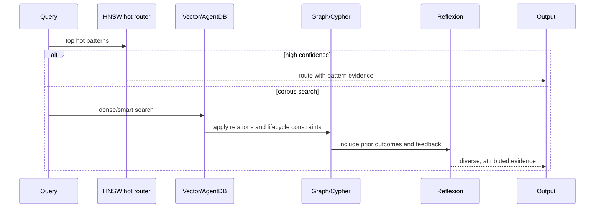
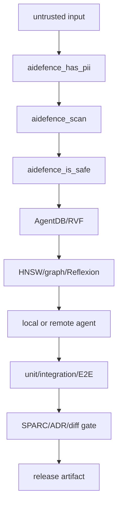

# 第 16 章 · 进阶模块深读：从向量容器到方法论插件

> 📘 **摘要**：本章把 Ruflo 的“进阶”拆成可组合的底层模块：RuVector/RVF、AgentDB、RuVLLM、Jujutsu 工作流、SPARC 质量门，以及 ADR、DDD、Goals、Arena 方法论插件。重点是边界、数据流、失败模式和什么时候不该启用某个模块。
> 🏷️ **读者画像**：需要调优检索和学习、设计跨项目记忆、运行本地模型、建立可审计开发流程，或维护 Ruflo 插件生态的高级工程师。
> 🕐 **预估耗时**：100–140 分钟。
> ✅ **LAST_VERIFIED_AGAINST**：`26c35b59b40a0a95b286ccf5ac675a15edcc995f`（2026-07-23）

## 1. 背景与动机

“进阶模块”不是把所有功能一起打开。它们解决的是不同问题：

- **RuVector/RVF** 解决向量索引、可携带容器、trajectory 和 crash-safe 持久化；
- **AgentDB** 解决多层记忆、图关系、控制器、反馈和反思；
- **RuVLLM** 解决本地小模型、上下文路由和轻量适配；
- **Jujutsu** 解决 DAG 式变更、diff 风险和冲突工作流；
- **SPARC** 解决从规格到完成的阶段性质量门；
- **ADR/DDD/Goals/Arena** 解决决策记录、领域边界、长期目标和策略实验。

一个常见错误是把“更底层”误认为“更可靠”：向量数据库不能替代测试，local model 不能自动获得正确性，planner 不能替代 owner 决策，arena 的胜者也不等于生产方案。下面每个模块都用“职责—接口—证据—限制”四个问题来读。

## 2. 核心概念

### 2.1 RuVector 与 RVF：检索引擎不是记忆语义

`ruflo-ruvector` 固定使用 `ruvector@0.2.25`。它提供 HNSW、384-dim ONNX embedding（需要额外 WASM add-on）、代码图聚类、hooks、SONA/brain diagnostics 和 RVF tooling。`ruflo-rvf` 则在其上提供 portable memory/session 的高层 skill。

**职责分工**：

| 层 | 负责 | 不负责 |
|---|---|---|
| Embedding | 把文本/代码映射到向量 | 判断事实是否正确 |
| HNSW | 近似最近邻检索 | 保证 top-k 没有重复/过期内容 |
| RVF | manifest、segments、trajectory、lineage、compact/export | 自动消除 PII |
| AgentDB bridge | namespace、controller、memory policy | 让任意字符串天然安全 |
| SONA/Brain | 模式/知识学习与路由 | 替代人工批准高风险变更 |

### 2.2 AgentDB：层级记忆、图边和 Reflexion

AgentDB 插件包装三类工具家庭：`agentdb_*` controller bridge、`embeddings_*` RuVector ONNX engine、`ruvllm_hnsw_*` WASM hot-pattern router。文档把 controller bridge 描述为 15 个 MCP tools；runtime controller registry 的 controller name 则是另一件事，当前源码按 init levels 有约 29 个名字，不能混为“工具数”。

AgentDB 有两种互补的关系表达：

- **层级记忆**：`working / episodic / semantic`，适合按生命周期和 tier 组织；
- **图记忆**：因果边、supersedes、depends-on、related 等关系，适合解释“为什么命中”；
- **Reflexion Memory**：保存任务失败/成功后的反思、反馈与可复用策略，把结果从一条向量提升为“情境—行动—结果—教训”轨迹。

在有 graph backend 时，Cypher/图查询适合表达多跳约束，例如“找到依赖某个 deprecated ADR 的服务，再找其最近失败的测试”；向量搜索适合表达模糊语义，例如“类似的 OAuth 迁移”。生产检索通常需要 hybrid：dense recall → graph constraint → recency/MMR → evidence rendering。

### 2.3 RuVLLM：local model、MicroLoRA、SONA

RuVLLM plugin 的三个核心能力分别对应不同时间尺度：

| 能力 | 时间尺度 | 适合 | 风险 |
|---|---|---|---|
| Local small model | 单次推理 | 分类、摘要、路由、脱网开发 | 能力和上下文窗口有限 |
| MicroLoRA | 离线/批量适配 | 固定任务格式和领域风格 | 数据污染、遗忘和错误迁移 |
| SONA | 在线反馈适配 | 快速路由和模式更新 | 反馈噪声造成策略漂移 |

`ruvllm_hnsw_*` 是最多约 11 个 hot patterns 的 WASM router；大语料搜索要走 AgentDB 的 `embeddings_search`，不要把两个 HNSW 路径当成同一个索引。

### 2.4 Jujutsu：DAG 工作流与风险分析

`ruflo-jujutsu` 在 Ruflo 中的可验证职责是 diff analysis、change classification、file-level risk 和 reviewer recommendation。它把变更看作可分析的图与补丁，而不只是一个“合并前的文本”。将其理解为 git replacement 时要保留一个边界：Jujutsu/DAG 的版本控制操作与 Ruflo 的分析插件可以组合，但分析插件的六个 MCP tools（`analyze_diff`、risk、classify、reviewers、file-risk、stats）才是本插件的明确契约。

DAG 思维带来三点收益：

1. 一个工作可以从任意 checkpoint 分叉，而不是把未完成修改压成一个大分支；
2. 冲突是图上两条变更路径的关系，可单独分析和解决；
3. 每个变更节点都能关联测试、ADR、reviewer 和风险证据。

### 2.5 SPARC：阶段状态机而非五个 prompt

SPARC 五阶段是：Specification、Pseudocode、Architecture、Refinement、Completion。每个阶段有 gate：

- Specification：至少 3 个 acceptance criteria、constraints、edge cases；
- Pseudocode：覆盖 AC、显式错误路径、复杂度标注；
- Architecture：约束已解决、typed API contract、无 circular dependency；
- Refinement：AC 有 passing tests、review approved、新代码 coverage 至少 80%；
- Completion：测试、文档和部署 checklist 完成。

SPARC state 不是把五个标题写进报告；它必须保存 phase、gate history、artifact、owner 和下一步。失败 gate 仍然保留，避免后续 agent 误以为已通过。

### 2.6 四种方法论插件的边界

| 插件 | 主要问题 | 典型输出 |
|---|---|---|
| ADR | 为什么做这个架构决策 | `docs/adr/`、status、causal edges |
| DDD | 领域边界如何组织 | bounded context、aggregate、event、ACL |
| Goals | 多步骤长期目标如何达成 | GOAP/A* plan、milestone、research dossier |
| Arena | 多策略谁在固定游戏中更好 | tournament、competitive array、fitness curve |

它们是互补关系：DDD 产生结构，ADR 记录关键取舍，Goals 排长期路线，Arena 对可模拟策略做实验。不要让 Arena 替代 ADR，也不要让 Goals 的计划状态取代代码测试。

## 3. 架构/原理

### 3.1 进阶数据流


### 3.2 记忆检索的分层路径



### 3.3 质量与安全的位置



## 4. Hands-on

### Hands-on 16.1 — RuVector + RVF：创建、写入、查询、派生

#### Run

先安装和诊断固定版本：

```bash
mkdir -p /tmp/ruflo-rvf-lab && cd /tmp/ruflo-rvf-lab
npm install ruvector@0.2.25
npx --yes ruflo@latest vector doctor
npx --yes ruflo@latest vector rvf examples
```

创建一个 384 维 cosine 数据库并插入 embedding。embedding add-on 不一定随主包提供，出现 ONNX WASM 缺失时，安装文档指定的 add-on：

```bash
npm install ruvector-onnx-embeddings-wasm
npx --yes ruflo@latest vector db create project.db --dimensions 384 --metric cosine
npx --yes ruflo@latest vector embed "JWT refresh-token rotation" --output /tmp/query.json
npx --yes ruflo@latest vector stats project.db
```

要使用 RVF lineage：

```bash
npx --yes ruflo@latest vector rvf create project.rvf
npx --yes ruflo@latest vector rvf ingest project.rvf corpus.json
npx --yes ruflo@latest vector rvf status project.rvf
npx --yes ruflo@latest vector rvf query project.rvf
npx --yes ruflo@latest vector rvf compact project.rvf
npx --yes ruflo@latest vector rvf export project.rvf --output project.rvf.tar
```

#### Observe

观察 `status` 的 manifest、segments、dimension、metric 和 lineage；观察 compact 前后查询结果和 artifact digest。故意中断写入或在副本上写入后重新打开，验证容器不会悄悄返回半条记录。RVF 的 crash-safety 取决于实现版本和操作路径，生产中仍应使用备份和校验。

#### Expect

向量数据库可创建、查询和统计；RVF 能保留自描述 metadata 并被导出/重新 ingest；派生容器有 parent lineage，而不是覆盖原容器。若 embedding backend 缺失，命令应给出结构化依赖错误。

#### 原理深读

HNSW 通过多层近邻图把搜索从全量扫描变成近似导航。`M`、`efConstruction` 和 `efSearch` 是速度、内存和 recall 的三角：调大 `efSearch` 通常提高 recall，但增加延迟；调大 `M` 增加图连接和构建成本。小数据集不一定值得 ANN，RAG memory 的审计也提示在 index crossover 之前 brute force 可能相当甚至更快。

RVF 的价值不只是“换一个后缀”：它把 manifest、向量块、metadata、trajectory、derived lineage 和 compact/export 变成同一个可携带单元。browser session 可以包含 `manifest.yaml`、`trajectory.ndjson`、screenshots、snapshots、sanitized cookies 和 `findings.md`。但 RVF 不会自动做 PII scrub；scrub 必须在写入之前通过 AIDefence 和应用策略完成。

### Hands-on 16.2 — AgentDB：15 tools、图边与 Reflexion 回路

#### Run

检查 runtime controllers，不要从旧 README 猜数量：

```bash
cd /path/to/repo
npx --yes ruflo@latest agentdb controllers
npx --yes ruflo@latest agentdb status
npx --yes ruflo@latest memory store --key "reflexion:demo:failure" \
  --value "query timed out; reduce fan-out and add timeout evidence" \
  --namespace feedback
npx --yes ruflo@latest memory search --query "what did we learn from query timeout" --namespace feedback --limit 5
```

层级记忆使用 tier 语义，命名空间使用 memory API：

```bash
npx --yes ruflo@latest agentdb hierarchical-store --tier episodic --data '{"task":"demo","outcome":"retry"}'
npx --yes ruflo@latest agentdb hierarchical-recall --tier episodic --query "demo outcome"
npx --yes ruflo@latest memory store --key "graph:service-a" --value "depends on service-b" --namespace knowledge
```

如果 CLI/host 暴露图工具，先读取工具 schema，再创建因果边；不要为 `agentdb_pattern-store` 加 namespace：

```bash
npx --yes ruflo@latest mcp list
npx --yes ruflo@latest memory search --query "service dependency and timeout" --limit 10
npx --yes ruflo@latest agentdb consolidate
```

#### Observe

观察控制器 health、tier 和 memory namespace 的差异；看 recall 是否带 source、score、timestamp 和反馈；看 consolidate 是否产生 artifact 和可追踪的 mutation。开启安全审计时，检查 attestation log 是否记录了状态写入。

#### Expect

一条失败经验能在相似任务检索中被召回，但不会无条件成为答案；图关系可以过滤或解释语义命中；controller bridge 不可用时，`agentdb_*` 返回结构化 bridge unavailable，并提示用 `memory_store/search` fallback，而不是 crash。

#### 原理深读：Reflexion 不是“把错误再存一遍”

最小 Reflexion 记录包含：任务上下文、尝试过的 action、结果、失败原因、反思、下一次可执行策略、confidence 和 provenance。检索时先按语义召回，再按新鲜度、多样性和任务类型重排。成功 pattern 也需要 judge，不是成功一次就进入高信任路由。

“15 tools”是 MCP surface 的可用性说法；controller registry 的名字数量和初始化级别是运行时实现细节。文档、agent prompt 和测试应调用 `agentdb_controllers` 读取当前列表，避免 hard-code “19 controllers”。这类数量混淆是扩展漂移的典型来源。

### Hands-on 16.3 — RuVLLM：local model + MicroLoRA + SONA

#### Run

先查看可用模型和 provider，再决定是否真的在本机加载模型：

```bash
cd /tmp/ruflo-rvf-lab
npx --yes ruflo@latest ruvllm status
npx --yes ruflo@latest ruvllm models
npx --yes ruflo@latest ruvllm info
```

创建一个小而明确的配置和 adapter；实际参数名以当前 MCP schema 为准：

```bash
npx --yes ruflo@latest ruvllm config --model local-small --task classification
npx --yes ruflo@latest ruvllm microlora create --name release-classifier --rank 4
npx --yes ruflo@latest ruvllm microlora adapt --name release-classifier --data /tmp/labels.jsonl
npx --yes ruflo@latest ruvllm sona status
npx --yes ruflo@latest ruvllm sona stats
```

如果需要 `ruvector` 的 SONA CLI，补装可选依赖并固定版本：

```bash
npm install @ruvector/ruvllm
npx --yes ruflo@latest vector sona status
npx --yes ruflo@latest vector sona patterns "release classification"
```

#### Observe

MicroLoRA 的评估要分为训练集、未见项目、对抗样本和旧任务回归；SONA 要看反馈前后的路由置信度、延迟和错误率。检查模型输出是否带“仅建议”标记，不能因为本地推理便跳过 security、test 或 human approval。

#### Expect

local model 在明确的低风险任务上减少网络和成本；MicroLoRA 只改变目标任务的 adapter，不覆盖基础模型；SONA feedback 有可回滚 checkpoint，错误反馈不会永久污染主策略。

#### 原理深读

MicroLoRA 的价值是低秩适配：用少量可训练参数表达领域偏移，适合固定格式、分类标签或团队术语。它不是通用 fine-tune，也不是把隐私数据直接烘进模型的许可证。训练数据要先做 PII 与 license 检查，并记录 dataset hash。

SONA 是更快的在线适应路径，适合把结果反馈到路由、pattern 选择或小型策略，而不是让模型在每个请求上重新训练。把 SONA 与 ReasoningBank 的 `RETRIEVE → JUDGE → DISTILL → CONSOLIDATE` 对齐时，必须保留 judge 和 rollback：只把“模型说自己成功”当 reward 会造成 reward hacking。

### Hands-on 16.4 — Jujutsu DAG + SPARC + ADR/DDD/Goals/Arena

#### Run

初始化一个带架构和领域边界的功能：

```bash
cd /path/to/repo
npx --yes ruflo@latest sparc init "add idempotent payment capture"
npx --yes ruflo@latest sparc status
npx --yes ruflo@latest adr create "payment capture idempotency strategy"
npx --yes ruflo@latest ddd context create payments
npx --yes ruflo@latest ddd aggregate payments Capture
npx --yes ruflo@latest ddd validate
```

按阶段推进并分析每个 checkpoint：

```bash
npx --yes ruflo@latest sparc phase spec
npx --yes ruflo@latest sparc advance
npx --yes ruflo@latest sparc phase pseudo
npx --yes ruflo@latest sparc advance
npx --yes ruflo@latest sparc phase arch
npx --yes ruflo@latest adr index
npx --yes ruflo@latest sparc advance
npx --yes ruflo@latest sparc phase refine
npx --yes ruflo@latest hooks coverage-gaps --format table --limit 20
npx --yes ruflo@latest jujutsu
npx --yes ruflo@latest sparc report
```

把季度级目标交给 goals，而不是藏在 SPARC prompt：

```bash
npx --yes ruflo@latest goal plan "reduce duplicate payment captures to zero"
npx --yes ruflo@latest goal status
npx --yes ruflo@latest goal progress --milestone contract
```

对两种可模拟的重试策略做实验时，使用 arena 固定 seed：

```bash
cd /path/to/ruflo/plugins/ruflo-arena
npm test
node dist/cli.js tournament --game pd --rounds 200 --seed 1
node dist/cli.js evolve --game pd --generations 300 --seed 42
```

#### Observe

观察：

- SPARC 当前 phase、gate history 和阻断理由；
- ADR status 是否是 `proposed/accepted/deprecated/superseded` 的合法迁移；
- DDD context map 是否出现直接跨 context import；
- Jujutsu diff 的 classification、risk、reviewer 和复杂度 delta；
- Goals 的 precondition/effect/cost 是否有证据；
- Arena 的 competitive array、seed、strategy 和 persistence artifact。

#### Expect

一个功能同时拥有可回溯的决策、领域结构、计划状态和代码质量证据。SPARC gate 失败时工作流停在失败阶段；ADR supersede 通过 causal edge 表达；Arena 只把固定游戏中的实验结果报告为实验结果。

#### 原理深读

**ADR** 的核心不是写一篇长文，而是把“上下文—决策—后果—状态—关系”变成可查询图。`adr-index` 是 add/update，删除 ADR 后要用 `adr-reindex` reconcile，避免 AgentDB 留下幽灵节点；`adr-verify` 应检查 dangling refs、supersede cycle 和 status mismatch。

**DDD** 用 bounded context 防止一个“共享 domain”逐渐变成耦合泥团。aggregate root 的 invariant 应由 domain 代码和测试共同保护；ACL 是跨 context 的翻译边界。`ddd validate` 发现直接 import 时，正确反应是重画边界或加 published language，而不是把 validator 关掉。

**Goals** 的 GOAP/A* 计划用状态空间寻找低成本路径。A* 的 heuristic 必须是可接受或至少可解释的估计；目标会受真实指标、依赖和预算影响，因此 `replan` 应附 reason 并保留旧路径。`dossier-investigator` 适合从 seed entity 递归展开，要求 hop/token/time budget 和每条 claim 的 provenance。

**Arena** 把 strategy 当作可执行程序，在固定 game、rounds、seed 下做 tournament、hill-climb 或 co-evolution。它的优势是可重复实验和 competitive array；它的限制是游戏模型的外推性。Arena v1 明确把 LLM strategy、资源治理和完整 dashboard 置于后续范围，不能在生产支付策略上把 toy PD ranking 当作证明。

## 5. 沙箱验证

### 5.1 模块 smoke 与最小顺序

```bash
cd /Users/digoal/new/ruflo
bash plugins/ruflo-ruvector/scripts/smoke.sh
bash plugins/ruflo-agentdb/scripts/smoke.sh
bash plugins/ruflo-ruvllm/scripts/smoke.sh
bash plugins/ruflo-jujutsu/scripts/smoke.sh
bash plugins/ruflo-sparc/scripts/smoke.sh
bash plugins/ruflo-adr/scripts/smoke.sh
bash plugins/ruflo-ddd/scripts/smoke.sh
bash plugins/ruflo-goals/scripts/smoke.sh
```

Arena 是独立 TypeScript plugin，另行运行：

```bash
cd /Users/digoal/new/ruflo/plugins/ruflo-arena
npm install
npm run build
npm test
npm run lint
```

### 5.2 进阶模块故障注入

| 故障 | 注入方式 | 期望结果 |
|---|---|---|
| Embedding add-on 缺失 | 不安装 ONNX WASM | 结构化依赖错误，不 crash |
| HNSW 小数据集 | 只插入少量向量 | 允许 brute-force/性能不夸大 |
| RVF 中断 | 在副本写入时终止 | reopen 可检测状态，不能静默损坏 |
| bridge 不可用 | 缺少 memory package | agentdb 返回 fallback 指引 |
| pattern namespace 错误 | 给 pattern tool 传 namespace | validator/文档阻止错误用法 |
| MicroLoRA 数据污染 | 加入敏感或错误 label | gate 拒绝或隔离 dataset |
| SONA 错误反馈 | 注入低质量 reward | checkpoint/rollback，指标告警 |
| ADR 删除 | 删除已索引文件后 reindex | 无 dangling node |
| DDD 跨边界 import | 直接 import 另一个 context | validate fail |
| SPARC gate 失败 | 让测试不通过 | phase 不推进 |
| Goal drift | 修改 metric/budget | replan 有 reason 和历史 |
| Arena 非确定 | 改 seed | 报告显示不同 seed，不宣称同一实验 |

### 5.3 可观测性与数据留存

给每个模块定义最小 telemetry：

- vector：维度、metric、index size、query latency、recall sample；
- RVF：container id、parent、segments、compact/export digest；
- AgentDB：namespace/tier、controller、mutation id、source、feedback；
- RuVLLM：model、adapter、latency、tokens、task accuracy、rollback checkpoint；
- Jujutsu：change id、risk、files、reviewers、classification；
- SPARC：feature、phase、gate、owner、artifact；
- Goals：goal、milestone、preconditions、cost、evidence、drift；
- Arena：game、strategies、rounds、seed、fitness、run id。

Telemetry 本身也可能包含敏感内容。只保存摘要、hash、ID 和可复现路径，不把完整 prompt、cookie、源代码 diff 或 API response 无期限写进 observability namespace。

## 6. 小结 + 术语锚点 + 参考链接

### 关键要点

1. HNSW 负责近似检索，RVF 负责可携带容器；两者都不替代安全 gate 和证据审查。
2. AgentDB 的 MCP tool 数量、controller registry 数量、tier 和 namespace 是不同维度；以 runtime tool/schema 为准。
3. Reflexion 把“上下文—行动—结果—教训”保存下来，必须有 provenance、反馈质量和 rollback。
4. RuVLLM 的 local model、MicroLoRA、SONA 分别对应推理、离线适配和在线路由适应；都需要评估与回滚。
5. Jujutsu/DAG 让变更和冲突更可解释；Ruflo jujutsu plugin 的明确 contract 是 diff/risk/classification/reviewer 分析。
6. SPARC 是带质量门的状态机；ADR/DDD/Goals/Arena 分别记录决策、边界、长期计划和可重复实验。
7. 进阶能力的正确顺序是：定义边界 → 记录状态 → 运行实验 → 通过 gate → 发布可验证 artifact。

### 术语锚点

- **HNSW**：Hierarchical Navigable Small World，近似最近邻图索引。
- **RVF**：RuVector Format，自描述、可导出、可派生的向量/认知容器格式。
- **AgentDB**：Ruflo 记忆、embedding、controller、graph 和 feedback 的桥接层。
- **Cypher graph**：用图查询表达节点、关系和多跳约束的查询方式；实际 backend 能力以运行时为准。
- **Reflexion Memory**：把任务结果和反思沉淀为可检索策略的记忆形式。
- **MicroLoRA**：轻量低秩 adapter，面向任务/领域适配。
- **SONA**：Self-Optimizing Neural Architecture，面向实时模式/路由适应。
- **DAG workflow**：有向无环图上的变更、checkpoint 和冲突关系。
- **Quality gate**：推进到下一阶段前必须满足的机器或人工条件。
- **Bounded context**：DDD 中拥有边界、语言和模型责任的领域上下文。
- **GOAP/A***：用前置条件、效果和成本搜索目标路径的方法。
- **Competitive array**：Arena round-robin 结果的策略对阵矩阵/排名视图。

### 下一步

- 想优化检索：先读 `ruflo-agentdb` 和 `ruflo-rag-memory` 的 namespace/routing，再测 HNSW recall；
- 想做跨机器 session：读 `ruflo-rvf`、`ruflo-browser` 的 RVF ownership 和 federation trust；
- 想降低成本：先在小任务上比较 local model 与远程 model，再用 MicroLoRA/SONA，不要直接替换关键路径；
- 想建立工程流程：SPARC + ADR + DDD 先做一个 bounded context，再接 Goals；
- 想比较策略：用 Arena 固定 seed、预算和 game，记录它适用的实验边界；
- 想扩展能力：回到第 15 章，把模块封装成 plugin、MCP、hook 和 smoke contract。

### 参考链接

- [`ruflo-ruvector/README.md`](../../ruflo/plugins/ruflo-ruvector/README.md)：`ruvector@0.2.25`、HNSW、RVF、hooks、SONA
- [`ruflo-rvf/README.md`](../../ruflo/plugins/ruflo-rvf/README.md)：portable memory/session 与 RVF ownership
- [`ruflo-agentdb/README.md`](../../ruflo/plugins/ruflo-agentdb/README.md)：15 个 AgentDB MCP tools、controller registry、namespace routing
- [`ruflo-rag-memory/README.md`](../../ruflo/plugins/ruflo-rag-memory/README.md)：SmartRetrieval、HNSW crossover 与 memory bridge
- [`ruflo-ruvllm/README.md`](../../ruflo/plugins/ruflo-ruvllm/README.md)：local inference、MicroLoRA、SONA、HNSW hot router
- [`ruflo-jujutsu/README.md`](../../ruflo/plugins/ruflo-jujutsu/README.md)：六个 diff analysis tools 与 ADR integration
- [`ruflo-sparc/README.md`](../../ruflo/plugins/ruflo-sparc/README.md)：五阶段与 quality gates
- [`ruflo-adr/README.md`](../../ruflo/plugins/ruflo-adr/README.md)：ADR lifecycle、graph、verify/reindex
- [`ruflo-ddd/README.md`](../../ruflo/plugins/ruflo-ddd/README.md)：bounded context、aggregate、event、ACL
- [`ruflo-goals/README.md`](../../ruflo/plugins/ruflo-goals/README.md)：GOAP、deep research、horizon、dossier
- [`ruflo-arena/README.md`](../../ruflo/plugins/ruflo-arena/README.md)：tournament、evolve、coevolve 与 persistence
- [Ruflo 主仓库](https://github.com/ruvnet/ruflo)
- [RuVector npm package](https://www.npmjs.com/package/ruvector)
- [RuVector RVF 示例](../../ruflo/v3/@claude-flow/plugins/examples/ruvector/README.md)
- [Claude Flow Plugins 实现](../../ruflo/v3/@claude-flow/plugins/README.md)
