# 0.2 三种形态：嵌入式 / 单机 Server / 集群

> **一句话**：同一份代码、同一个二进制，靠一个 `--embedded` 开关和部署方式的不同，
> 覆盖从"进程内库"到"分布式集群"的三种形态。



---

## 为什么这件事重要

AI 应用的部署形态跨度极大：

- 本地跑一个 IDE 插件 / 桌面 Agent —— 不想让用户装数据库
- 一台云主机上的小服务 —— 装个 server 就行
- 企业级生产 —— 要高可用、要扩容

大多数数据库只擅长其中一档。seekdb 的策略是**同一份内核，三种壳**，
让你从原型到生产不用换存储引擎、不用重写查询。

---

## 形态一：嵌入式（embedded）

### 它到底做了什么

`--embedded` 不是"另一个精简版"，而是同一个 `seekdb` 二进制上的一个开关。
它在源码里的影响面其实很窄，可以完整列举：

| 影响点 | 源码位置 | 效果 |
|---|---|---|
| 命令行开关 | `src/observer/ob_command_line_parser.cpp:202` | 注册 `--embedded` 长选项 |
| 置位 | `src/observer/ob_command_line_parser.cpp:366` | `opts.embedded_ = true` |
| 存入全局上下文 | `src/observer/ob_server.cpp:185` | `gctx_.set_embedded_mode(opts.embedded_)` |
| 状态查询 | `src/share/ob_server_struct.h:152` | `bool is_embedded_mode() const` |
| **关闭 TCP 监听** | `src/observer/ob_srv_network_frame.cpp:88` | `const bool disable_tcp = gctx_.is_embedded_mode();` |
| **打开进程内通道** | `src/observer/ob_server.cpp:201-202` | 创建 `./run/seekdb.clients` fd |

也就是说，嵌入式模式的本质是两句话：

> **不监听 TCP 端口，改用一个本地文件描述符 `run/seekdb.clients` 作为进程内通信通道。**

其余的 SQL 引擎、存储引擎、事务、向量索引——**一模一样**。
你不会因为用了嵌入式模式而失去 ACID 或者向量检索。

### 怎么构建

`build.sh` 提供了专门的构建模式（`build.sh:243`）：

```bash
bash build.sh release_embedded --init --make
```

### 用户侧长什么样

对 Python 用户而言，嵌入式就是给 `Client` 传一个路径：

```python
import pyseekdb
client = pyseekdb.Client(path="./agent_state.db")   # 嵌入式
```

*（来源：`README.md` 与 `images/demo.py`。⚠️ 未实机验证。）*

### 什么时候用

- 桌面应用、IDE 插件、端侧/车载设备
- 单元测试里要一个真数据库但不想起服务
- Agent 原型开发，追求零运维

---

## 形态二：单机 Server（默认）

不加 `--embedded` 直接启动，就是单机 Server：

```bash
./bin/seekdb
```

监听两个端口（默认值来自 `src/share/parameter/ob_parameter_seed.ipp`）：

| 端口 | 参数名 | 用途 |
|---|---|---|
| 2881 | `mysql_port` | MySQL 协议，客户端连这个 |
| 2882 | `rpc_port` | 内部 RPC |

> ⚠️ **一个常见困惑**：用 `tools/deploy/obd.sh` 以非 root 用户部署时，
> 端口不是 2881，而是按 `100*(uid%500)+10000` 计算得出，通常落在 **10000**。
> 开发者指南里的连接命令 `mysql -uroot -h127.0.0.1 -P10000` 就是这么来的。
> 详见 [1.7 部署与配置](../10-user/07-deploy-config.md)。

单机形态下有几个"分布式特性被固定住"的点，值得架构师留意：

- **只接受 PRIMARY 角色的数据目录**。`ObService::start()` 对 STANDBY 直接返回
  `OB_NOT_SUPPORTED`——seekdb 不做主备。
- **DDL 角色硬编码为 LEADER**。`ObDDLServiceLauncher` 里
  `get_sys_palf_role_and_epoch` 直接返回 `role=LEADER, proposal_id=1`，
  跳过选举。
- **RootServer 的集群管控被 `ObLocalManagementService` 取代**，
  负载均衡、unit 迁移这些代码在，但不走。

详见 [2.9 palf 与单副本裁剪](../20-architect/09-palf.md)。

---

## 形态三：OceanBase 集群

代码里完整保留了多副本 palf（Paxos）、分布式 DDL、并行执行（PX）、
数据传输层（DTL）等全套分布式能力——毕竟它就是从 OceanBase 来的。

但对 seekdb 的目标场景（AI Agent 状态存储）而言，这条路径不是默认选择，
文档与打包也主要围绕前两种形态。**本书以单机/嵌入式为主线**，
分布式部分只在解释"为什么代码长这样"时提及。

---

## 三种形态怎么选

| 你的场景 | 选 |
|---|---|
| 桌面 / 端侧 / 测试 / Agent 原型 | 嵌入式 |
| 单机服务、容器部署、多客户端共享 | 单机 Server |
| 需要高可用与水平扩展 | OceanBase 集群 |

好消息是**迁移成本很低**：三种形态都说 MySQL 协议，
SQL、schema、向量索引定义完全一致。README 的说法是"switch with one line"。

---

## 代码锚点

| 文件:行 | 职责 |
|---|---|
| `src/observer/main.cpp` | 进程入口，解析参数并驱动 init/start/wait/destroy |
| `src/observer/ob_command_line_parser.cpp:202` | 注册 `--embedded` |
| `src/observer/ob_command_line_parser.cpp:366` | `opts.embedded_ = true` |
| `src/observer/ob_command_line_parser.cpp:516` | `--embedded` 帮助文本 |
| `src/observer/ob_server.cpp:185` | `gctx_.set_embedded_mode(...)` |
| `src/observer/ob_server.cpp:201-225` | 打开 `run/seekdb.clients`（Linux / Windows 分支） |
| `src/observer/ob_srv_network_frame.cpp:88` | `disable_tcp = gctx_.is_embedded_mode()` |
| `src/share/ob_server_struct.h:152-153` | `is_embedded_mode()` / `set_embedded_mode()` |
| `build.sh:243` | `release_embedded` 构建模式 |
| `src/share/parameter/ob_parameter_seed.ipp` | `mysql_port=2881`、`rpc_port=2882` 等默认值 |

---

## 动手验证

确认 `--embedded` 确实只影响这几处（在仓库根目录执行）：

```bash
grep -rn "is_embedded_mode\|embedded_" src/observer/ src/share/ob_server_struct.h | grep -v "^Binary"
```

查看构建模式全集：

```bash
grep -nE '^\s+x?(debug|release|rpm|deb|tgz|package|ccls|clangd|perf|errsim)' build.sh
```

---

## 延伸阅读

- 下一章：[0.3 代码地图](03-code-map.md)
- [2.1 分层与启动生命周期](../20-architect/01-layering-and-startup.md) —— `ObServer::init` 的完整顺序
- [1.7 部署与配置](../10-user/07-deploy-config.md) —— 端口、目录、参数
