# 0.3 代码地图：一张图看懂 1GB 仓库

> **一句话**：不用猜测代码该怎么分层——仓库自己在 `cmake/module_check/module_layers.conf`
> 里写死了模块依赖 DAG，而且有 CI 守卫强制执行。照着它读就对了。



---

## 先看规模

| 指标 | 数值 |
|---|---|
| 仓库体积 | ~1.0 GB |
| `src/` 源文件数 | 5,434（`.cpp/.h/.ipp/.y/.l`） |
| `src/` + `deps/oblib` 代码行数 | ~2,812,000 |
| 最大子目录 | `src/sql` 47 MB、`src/storage` 26 MB、`src/share` 13 MB |

面对这个体量，"从 main 函数开始逐行读"是行不通的。你需要一张地图。

---

## 权威地图：仓库自带的模块分层 DAG

大多数项目的架构图是人画的，画完就过期。seekdb 不一样——
它把分层规则写成了**配置文件 + CI 检查**：

`cmake/module_check/module_layers.conf` 开头就写明了规则：

> Module-layering DAG guard config. Each line = `<identity(path)> <layer>`;
> smaller layer = more foundational; a module may only include modules with
> `layer <= its own` (same-layer mutual deps allowed); upward edges = violations.

分层注册表如下：

| 层 | 模块 | 职责 |
|---|---|---|
| **0** | `deps/oblib/src/lib` | 最基础：内存分配器、容器、哈希、日志、错误码 |
| **1** | `deps/oblib/src/common`<br/>`deps/oblib/src/rpc`<br/>`deps/oblib/src/grpc` | 公共类型、RPC 框架、MySQL 协议包结构 |
| **2** | `src/share` | schema、参数、系统变量、KV Cache、内部表、SCN |
| **3** | `src/sql`<br/>`src/storage`<br/>`src/logservice`<br/>`src/objit` | 内核三大件 + JIT |
| **4** | `src/pl`<br/>`src/libtable` | 存储过程、系统包 |
| **5** | `src/observer`<br/>`src/rootserver` | 进程入口、协议接入、DDL 与本地管控 |

`CMakeLists.txt` 里 `seekdb` 目标自动依赖 `module_layer_check`，
**违反分层会让构建失败**。这份表因此始终与代码同步——比任何手绘架构图都可靠。

### 怎么用这张表读代码

1. **自底向上读**：先看懂 layer 0 的内存与容器（`ObSEArray`、`ObMemAttr`），
   再往上走。跳过这一步，你会在每个文件里被基础设施细节绊住。
2. **判断"这个功能该放哪"**：想加一个功能，先问它依赖谁——依赖决定它的层。
3. **看到"purified"注释别慌**：文件里有一批单文件被"下沉"标记，
   例如 `src/share/ai_service/ob_ai_model_info.h 2`，注释写明
   "ai model pure value type, depends only on lib, logically marked L2"。
   这是渐进式治理的痕迹：物理位置还没动，逻辑层级先标对。

---

## 各目录职责速查

### `src/` —— 数据库内核

| 目录 | 体量 | 职责 |
|---|---|---|
| `sql/` | 47 MB | 解析、改写、优化、代码生成、向量化执行、计划缓存、DAS、DTL |
| `storage/` | 26 MB | LSM-Tree、事务 MVCC、SSTable、合并、全文与向量检索存储 |
| `share/` | 13 MB | schema、参数、内部表、缓存、SCN、AI 模型元信息 |
| `observer/` | 6.8 MB | 进程入口、MySQL 协议、虚拟表、Change Stream、向量索引调度、AI Service |
| `rootserver/` | 5.4 MB | DDL 服务、fork_table、本地管控、合并调度 |
| `pl/` | 2.3 MB | 存储过程引擎、DBMS_* 系统包 |
| `logservice/` | 1.5 MB | palf（Paxos 日志）、回放、应用 |
| `objit/` | 76 KB | JIT 编译支持 |

### 仓库其余部分

| 目录 | 职责 |
|---|---|
| `deps/oblib/` | 基础库：内存、容器、哈希、日志、网络、VSAG 向量库适配 |
| `deps/init/` | 依赖清单与拉取脚本（按 OS/架构分文件） |
| `cmake/` | 构建配置、打包（RPM/DEB/TGZ/WiX）、模块分层检查 |
| `rust/sql-nio/` | Rust 重写的 MySQL 协议网络引擎（静态库） |
| `unittest/` | gtest 单元测试，目录结构镜像 `src/` |
| `tools/deploy/` | OBD 部署包装 + mysqltest 集成测试（53 个套件） |
| `tools/macpkg/`、`tools/windows/` | macOS 菜单栏 App、Windows WPF 配置器 |
| `docs/developer-guide/` | 官方开发者指南（中英双语，14 篇） |
| `script/` | 运维小工具：导入、执行计划、SQL 审计 |
| `gdb-macros/` | GDB 辅助宏与 core 自动分析 |

---

## ⚠️ README 源码链接勘误表

**这是本章最实用的一节。** `README.md` 里指向源码的链接**已经失效**，
照着找会直接扑空。实际位置如下：

| README 中的链接 | 实际情况 |
|---|---|
| `src/share/change_stream/` | ❌ 不存在。实际在 **`src/observer/change_stream/`** |
| `src/share/vector_index/` | ❌ 不存在。实际分布在 **`src/observer/vector_index/`**（插件适配、调度、IVF、KMeans）和 **`src/storage/vector_index/`**（刷新、调度作业） |

补充几个 README 完全没提、但很重要的位置：

| 目录 | 为什么重要 |
|---|---|
| `src/sql/engine/expr/ob_expr_ai/` | `AI_EMBED`/`AI_COMPLETE`/`AI_RERANK`/`AI_PROMPT` 四个库内 AI 函数 |
| `src/observer/ai_service/` | AI 模型 endpoint 的生命周期管理 |
| `src/sql/hybrid_search/` | 混合检索的 JSON DSL 解析与 SQL 翻译 |
| `src/storage/retrieval/` | 稀疏检索、BM25、block-max 迭代器 |
| `src/storage/vector_type/` | SIMD 距离函数（L2 / 内积 / 余弦 / L1） |
| `src/storage/fts/` | 全文分词器（ik / ngram / beng / space） |
| `src/rootserver/fork_table/` | FORK DATABASE / TABLE 实现 |

> 结论：**README 适合了解产品，不适合导航代码。** 用这张表。

---

## 一个实用技巧：按能力找代码

想读某个能力，从这里入手：

| 我想看… | 从这里开始 |
|---|---|
| 一条 SQL 怎么被执行 | `src/sql/ob_sql.cpp` → `src/sql/resolver/dml/ob_select_resolver.cpp` |
| 向量索引怎么建 | `src/sql/resolver/ddl/ob_vec_index_builder_util.cpp` |
| 向量查询怎么跑 | `src/sql/das/iter/ob_das_hnsw_scan_iter.h` |
| 两级索引怎么合并 | `src/observer/vector_index/ob_plugin_vector_index_adaptor.h` |
| 异步索引管线 | `src/observer/change_stream/ob_change_stream_fetcher.h` |
| FORK 怎么不拷数据 | `src/storage/ddl/ob_tablet_fork_task.cpp` |
| AI 函数怎么发 HTTP | `src/sql/engine/expr/ob_expr_ai/ob_ai_func_client.cpp` |
| 参数默认值是多少 | `src/share/parameter/ob_parameter_seed.ipp` |
| 错误码什么含义 | `src/share/ob_errno.def` + `tools/ob_error/` |

---

## 代码锚点

| 文件 | 职责 |
|---|---|
| `cmake/module_check/module_layers.conf` | 模块分层 DAG 注册表（权威） |
| `cmake/module_check/module_layer_check.py` | 分层检查脚本 |
| `cmake/module_check/module_layer_baseline.txt` | 存量违规基线 |
| `CMakeLists.txt` | `seekdb` 目标依赖 `module_layer_check` |
| `src/README` | （空文件，无内容） |

---

## 动手验证

看完整分层表：

```bash
sed -n '1,40p' cmake/module_check/module_layers.conf
```

统计各目录体量，自己排个序：

```bash
du -sh src/* | sort -rh
```

验证 README 的链接确实失效：

```bash
ls src/share/change_stream src/share/vector_index    # 报错，不存在
ls src/observer/change_stream src/observer/vector_index  # 存在
```

---

## 延伸阅读

- 第 1 篇起点：[1.1 30 秒上手](../10-user/01-quickstart.md)
- 第 2 篇起点：[2.1 总体分层与启动生命周期](../20-architect/01-layering-and-startup.md)
- 第 3 篇起点：[3.1 环境与构建](../30-developer/01-build.md)
- 附录 A：[目录速查表](../90-appendix/A-directory-map.md)
