# 2.1 总体分层与启动生命周期

> **一句话**：seekdb 是一个六层的单体进程；`main()` 之后
> `ObServer::init` 按固定顺序把十来个子系统串起来，
> 第一步就是把自己注册成全局模块提供者。



---

## 六层结构

分层不是我的归纳，是仓库自己在
`cmake/module_check/module_layers.conf` 里定义并由 CI 强制执行的
（详见 [0.3 代码地图](../00-orientation/03-code-map.md)）：

```
layer 5  observer, rootserver          进程入口 / 协议 / DDL
layer 4  pl, libtable                  存储过程
layer 3  sql, storage, logservice, objit   内核三大件
layer 2  share                         公共服务
layer 1  oblib/{common,rpc,grpc}       通信与公共类型
layer 0  oblib/lib                     基础库
```

规则是：**只能依赖同层或更低层**。向上依赖 = 构建失败。

这条规则塑造了整个代码库的形态。理解它，很多"为什么这个类要放在这里"
的疑问就自然消解了。

---

## 进程入口

`src/observer/main.cpp`：

```
main()                     858 行
  → inner_main()           645 行
      → observer.init(*opts, log_cfg)   798 行
      → observer.start()                810 行
      → observer.wait()                 821 行
      → observer.destroy()              828 行
```

`main` 本身很薄，主要处理：
- 命令行解析（`--nodaemon` / `--initialize` / `--embedded`）
- 打开 `log/seekdb.log`
- 按需 daemonize
- 用 `CALL_WITH_NEW_STACK` 在更大的栈上跑 `inner_main`（885 行）
  —— 数据库代码调用层次深，默认栈不够

---

## `ObServer::init`：启动顺序

`src/observer/ob_server.cpp:183`。这个函数的**顺序**本身就是一张依赖图：

| 阶段 | 做什么 |
|---|---|
| 0 | **`g_mp = this`** —— 发布全局模块提供者（见下节） |
| 1 | 配置 `ObServerConfig`，`gctx_.set_embedded_mode()` |
| 2 | IO 与设备 |
| 3 | KV Cache |
| 4 | Schema 服务 |
| 5 | 网络框架（embedded 模式下跳过 TCP 监听） |
| 6 | 存储 `ObLSService` |
| 7 | 日志服务 palf |
| 8 | 事务 `ObTransService` |
| 9 | `ObServerRuntime` 工作线程池 |
| 10 | SQL 引擎工厂 |
| 11 | PL 引擎 |

后续还有自增服务、合并、冻结、DAG 调度器等。

关键函数：

| 函数 | 行 |
|---|---|
| `ObServer::init` | 183 |
| `ObServer::start` | 626 |
| `ObServer::stop` | 967 |
| `ObServer::wait` | 1139 |
| `ObServer::init_config` | 1168 |

`ObService::start()`（`src/observer/ob_service.cpp:211`）负责
bootstrap 和角色恢复——**只接受 PRIMARY 角色的数据目录**，
STANDBY 直接返回 `OB_NOT_SUPPORTED`。

---

## 核心设计：`ObIModuleProvider` 与 `g_mp`

这是 seekdb 相对 OceanBase 最重要的架构改动之一，值得完整引用源码注释
（`src/share/rc/ob_module_provider.h:20-27`）：

> Low-layer module-access facade. ObServer owns the module instances and
> implements ObIModuleProvider; the global `g_mp` (set to `&OBSERVER` at boot)
> lets low-layer code (storage/share/lib) reach modules **WITHOUT** including
> `observer/ob_server.h` (no reverse dependency). Accessors return pointers so
> a module can later be exposed via a base-class pointer without touching call sites.

### 它解决什么问题

分层规则说：低层不能依赖高层。但现实是，
`src/storage`（layer 3）经常需要调用 `ObLSService`、`ObTransService`
这些由 `ObServer`（layer 5）持有的模块实例。

直接 `#include "observer/ob_server.h"` 会造成 layer 3 → layer 5 的反向依赖，
被 CI 拦下。

### 解法

在 layer 2（`src/share/rc/`）定义一个纯接口：

```cpp
class ObIModuleProvider {
  virtual storage::ObLSService *ls_service() = 0;
  virtual transaction::ObTransService *trans_service() = 0;
  virtual logservice::ObLogService *log_service() = 0;
  virtual omt::ObAiService *ai_service() = 0;
  // ...
};

extern ObIModuleProvider *g_mp;      // 214 行
```

`ObServer` 实现这个接口，启动时把自己赋给 `g_mp`。
低层代码这样用：

```cpp
storage::ObLSService *ls_svc = share::g_mp->ls_service();
```

只依赖 layer 2 的头文件，分层规则得以保持。

还提供了模板化的便捷访问：

```cpp
template <class T> T server_module();
// server_module<storage::ObLSService *>()
```

### 代价

这是一个**全局单例 + 虚函数间接层**。好处是解耦，
代价是：任何时刻只能有一个 `ObServer` 实例，
单元测试要 mock 就得替换 `g_mp`（`unittest/mock_gctx.h` 就是干这个的）。

---

## 线程模型

### `ObServerRuntime`

`src/observer/omt/ob_server_runtime.h:173`。
在 OceanBase 里这个位置是"租户"，seekdb 单租户化后它就是"服务运行时"。

```cpp
class ObServerRuntime : public share::ObServerRuntimeState,
                        public lib::ObAdaptiveWorkerPool<ObServerRuntime>
```

持有：
- `ReqQueue` —— 请求队列，分高优先级 / 普通优先级
- 工作线程列表
- 重试队列（`ob_retry_queue.cpp`）

线程数在 `min_worker_cnt()` 和 `max_worker_cnt()` 之间**自适应伸缩**。

### `ObThWorker`

`src/observer/omt/ob_th_worker.cpp` —— 实际的工作线程。循环是：

```
recv_request → get_new_request → handle
```

`ObWorkerProcessor`（`ob_worker_processor.cpp`）负责把
`ObRequest` 分派给对应的处理器。

### PX 线程池

并行执行有独立的 `ObPxPool`（基于 `ObThreadPool` + 优先级队列），
按 DFO（数据流对象）分配线程。

---

## 请求的完整旅程

把各层串起来（详见 [2.3](03-select-lifecycle-1.md) / [2.4](04-select-lifecycle-2.md)）：

```
客户端 TCP
  → ObSrvNetworkFrame            accept
  → ObSrvMySQLXlator::translate  按 pcode 建 ObMP* 处理器
  → ObMPQuery::deserialize       从 ObMySQLRawPacket 取 SQL 文本
  → ObMPQuery::do_process → ObSql::stmt_resolve / handle
  → parser → resolver → rewrite → optimizer → code_generator
  → ObOperator 树（向量化执行）
      ├─ DAS  → storage: ObTableScanIterator
      ├─ DTL  → 并行执行的数据交换
      └─ expr → ObExpr::eval_batch_func
  → access → blocksstable（SSTable）+ memtable（MVCC）
  → tx（快照一致性）
  → ObMPPacketSender             编码回包
  → 客户端
```

---

## 代码锚点

| 文件:行 | 职责 |
|---|---|
| `src/observer/main.cpp:858` | `main` |
| `src/observer/main.cpp:645` | `inner_main` |
| `src/observer/main.cpp:798-828` | init / start / wait / destroy 序列 |
| `src/observer/ob_server.cpp:183` | `ObServer::init` |
| `src/observer/ob_server.cpp:626` | `ObServer::start` |
| `src/observer/ob_server.cpp:967` | `ObServer::stop` |
| `src/observer/ob_server.cpp:1139` | `ObServer::wait` |
| `src/observer/ob_service.cpp:211` | `ObService::start`，拒绝 STANDBY |
| `src/share/rc/ob_module_provider.h:20-27` | 设计意图注释 |
| `src/share/rc/ob_module_provider.h:214` | `extern ObIModuleProvider *g_mp` |
| `src/observer/omt/ob_server_runtime.h:173` | `ObServerRuntime` |
| `src/observer/omt/ob_th_worker.cpp` | 工作线程 |
| `src/observer/ob_srv_xlator.cpp` | 请求分发 |
| `cmake/module_check/module_layers.conf` | 分层定义 |

---

## 动手验证

看启动顺序（`ObServer::init` 的主体）：

```bash
sed -n '183,280p' src/observer/ob_server.cpp
```

看模块提供者的设计说明与接口：

```bash
sed -n '18,30p'   src/share/rc/ob_module_provider.h
sed -n '210,240p' src/share/rc/ob_module_provider.h
```

看请求分发的 switch：

```bash
grep -n "case OB_MYSQL_COM" src/observer/ob_srv_xlator.cpp | head -20
```

---

## 延伸阅读

- 下一章：[2.2 seekdb 裁掉了什么：MTL 之死](02-what-seekdb-removed.md)
- [0.3 代码地图](../00-orientation/03-code-map.md) —— 分层的完整表格
- [2.3 一条 SELECT 的一生（上）](03-select-lifecycle-1.md)
