# 2.2 seekdb 裁掉了什么：MTL 之死

> **一句话**：OceanBase 的多租户框架（MTL）在 seekdb 里被**整体删除**——
> `src/` 中 `MTL_` 出现 **0 次**。带 OceanBase 经验来读 seekdb，这里最容易踩空。



---

## 为什么这一章要单独写

如果你熟悉 OceanBase，你会习惯性地找这些东西：

```cpp
MTL_NEW(ObLSService, ...);      // 创建租户级模块
MTL(ObLSService*)               // 获取当前租户的模块
MTL_ID()                        // 当前租户 ID
ObTenantBase                    // 租户基类
```

**在 seekdb 里，这些一个都不存在。**

亲自验证：

```bash
grep -rlo "MTL_" src/ | wc -l
# 输出：0
```

如果你按 OceanBase 的心智模型去读 seekdb 代码，
会在"租户上下文在哪初始化"这个问题上卡很久——答案是根本没有。

---

## OceanBase 的 MTL 是什么

MTL = Multi-Tenant Library。OceanBase 是多租户数据库：
一个进程里跑多个租户，每个租户有独立的内存、线程、schema、存储。

实现方式是：每个租户一个 `ObTenantBase` 实例，里面装着该租户的
所有模块实例；线程有个"当前租户"的线程局部变量；
`MTL(T*)` 宏就是"取当前租户的 T 模块"。

这是个精巧的设计，代价是**所有模块访问都要经过租户上下文**，
而且线程必须正确设置租户身份，否则取到错的实例。

---

## seekdb 的替代方案

seekdb 是**单实例**的——嵌入式、单机 server 都只服务一份数据。
多租户的复杂度没有收益，于是被整个拿掉。

替代品是 [2.1](01-layering-and-startup.md) 讲过的
`ObIModuleProvider` + 全局 `g_mp`：

```cpp
// src/share/rc/ob_module_provider.h:214
extern ObIModuleProvider *g_mp;

// 用法
storage::ObLSService *ls = share::g_mp->ls_service();
transaction::ObTransService *tx = share::g_mp->trans_service();
```

对照一下：

| | OceanBase | seekdb |
|---|---|---|
| 模块归属 | 每租户一份 | 全局一份 |
| 访问方式 | `MTL(T*)` 宏 + 线程局部变量 | `g_mp->xxx()` 虚函数 |
| 上下文切换 | 线程需切换租户身份 | 无 |
| 隔离性 | 租户间强隔离 | 无租户概念 |
| 心智负担 | 高 | 低 |

`ObServerRuntime`（`src/observer/omt/ob_server_runtime.h:173`）
占据了 OceanBase 里 `ObTenantBase` 的生态位——
但它是**唯一**的，不是每租户一个。
注意它仍在 `omt/` 目录下（omt = OceanBase Multi-Tenant），
**目录名是历史遗留**。

---

## 其他被固定或裁剪的部分

MTL 只是最大的一处。还有几个"分布式能力被写死"的点：

### 1. 只支持 PRIMARY 角色

`ObService::start()`（`src/observer/ob_service.cpp:211`）
对 STANDBY 数据目录直接返回 `OB_NOT_SUPPORTED`。
**没有主备切换。**

### 2. DDL 角色硬编码

`ObDDLServiceLauncher::get_sys_palf_role_and_epoch`
（`src/rootserver/ob_ddl_service_launcher.cpp`）直接返回
`role = LEADER, proposal_id = 1`——跳过选举。

单节点没有选举的必要，但这也意味着相关代码路径未被真正行使。

### 3. RootServer 被本地化

OceanBase 的 RootServer 负责集群管控（负载均衡、unit 迁移、
副本调度）。seekdb 里这些由 `ObLocalManagementService`
（`src/rootserver/ob_local_management_service.cpp`）取代，
只做本地的 schema 刷新、序列号分配、统计收集。

分布式管控代码还在 `src/rootserver/` 里，但默认不走。

### 4. MajorFreeze 简化

`ObMajorFreezeService` 的 `flush()` / `get_rec_scn()` / replay
在单副本下基本是桩实现，实际的合并由
`ObLocalMajorFreeze`（`src/rootserver/freeze/ob_local_major_freeze.cpp`）
在 tablet 层面触发。

### 5. GV$ / V$ 视图折叠

单租户没有"集群全局 vs 本节点"的区别，
所以 **81 个 GV$/V$ 视图被删除**，统一走 `__all_virtual_*`。
详见 [1.8 可观测性](../10-user/08-observability.md)。

---

## 什么**没有**被裁掉

同样重要——别以为 seekdb 是个"精简版玩具"：

| 保留 | 说明 |
|---|---|
| **完整 SQL 优化器** | 代价模型、join 重排、计划缓存，一样不少 |
| **完整 LSM-Tree** | MemTable / 转储 / 合并 / 多版本 |
| **完整 MVCC 事务** | 快照读、2PC 框架 |
| **palf 日志** | Paxos 实现在，只是单副本运行 |
| **并行执行 PX / DTL** | 单机内的并行查询仍然有效 |
| **PL 引擎** | 存储过程、DBMS_* 系统包 |
| **分布式代码路径** | 都在，只是默认不激活 |

所以 seekdb 的定位不是"删功能"，而是**"把分布式的可选项固定成单机的确定值"**。

---

## 对架构决策的影响

如果你在评估 seekdb，这些裁剪意味着：

**优势**：
- 部署运维极简，没有租户/副本/选举的概念
- 请求路径更短，没有租户上下文切换开销
- 代码更好读（对新人友好）

**限制**：
- **没有高可用**。单节点挂了就是挂了，要靠外部方案（快照、备份、主从复制在外层做）
- **没有水平扩展**。单机容量就是上限
- **没有租户隔离**。多个应用共用一个实例时无法做资源隔离

对 AI Agent 的状态存储场景——尤其是嵌入式和单机形态——
这些限制大多可以接受。但如果你的场景需要 HA，
就要考虑 OceanBase 集群形态，或者在 seekdb 外面自己做冗余。

---

## 代码锚点

| 文件:行 | 职责 |
|---|---|
| `src/share/rc/ob_module_provider.h:214` | `extern ObIModuleProvider *g_mp` |
| `src/share/rc/ob_module_provider.h:20-27` | 设计意图注释 |
| `src/observer/omt/ob_server_runtime.h:173` | `ObServerRuntime`（原租户位） |
| `src/observer/ob_service.cpp:211` | 拒绝 STANDBY |
| `src/rootserver/ob_ddl_service_launcher.cpp` | 硬编码 LEADER |
| `src/rootserver/ob_local_management_service.cpp` | 本地管控 |
| `src/rootserver/freeze/ob_local_major_freeze.cpp` | 本地合并触发 |
| `src/share/inner_table/ob_inner_table_schema_def.py` | 81 处 GV/V 折叠注释 |
| `unittest/mock_gctx.h` | 测试里替换 `g_mp` |

---

## 动手验证

**这一章最重要的验证**——确认 MTL 真的一个都没有：

```bash
grep -rlo "MTL_" src/ | wc -l          # 0
grep -rn "ObTenantBase" src/ | head    # 只在 ob_tenant_base.h 留了个占位
```

看模块提供者提供了哪些模块：

```bash
sed -n '210,250p' src/share/rc/ob_module_provider.h
```

确认 STANDBY 被拒绝：

```bash
grep -n "STANDBY\|OB_NOT_SUPPORTED" src/observer/ob_service.cpp | head
```

数一数视图折叠：

```bash
grep -c "single-tenant GV/V collapse" src/share/inner_table/ob_inner_table_schema_def.py
```

---

## 延伸阅读

- 下一章：[2.3 一条 SELECT 的一生（上）](03-select-lifecycle-1.md)
- [2.1 总体分层与启动](01-layering-and-startup.md) —— `g_mp` 在启动时怎么装配
- [2.9 palf 与单副本裁剪](09-palf.md) —— 日志层的裁剪细节
- [0.2 三种形态](../00-orientation/02-three-modes.md)
