# 2.3 一条 SELECT 的一生（上）：协议到 resolve

> **一句话**：从 TCP 字节流到一棵 `ObSelectStmt` 语法树——
> 中间经过分发器、命令处理器、词法语法分析、以及一个**顺序严格固定**的 resolver。



---

## 第 1 站：网络接入

`ObSrvNetworkFrame`（`src/observer/ob_srv_network_frame.cpp`）
负责 accept 连接。注意第 88 行：

```cpp
const bool disable_tcp = gctx_.is_embedded_mode();
```

嵌入式模式下不监听 TCP，走 `run/seekdb.clients` 的进程内通道
（见 [0.2 三种形态](../00-orientation/02-three-modes.md)）。

连接建立时，`ObSMConnectionCallback`
（`src/observer/mysql/obsm_conn_callback.cpp`）创建
`ObSqlSockSession` 和 `ObSMConnection`。

---

## 第 2 站：命令分发

`ObSrvMySQLXlator::translate`（`src/observer/ob_srv_xlator.cpp`）
是中央分发器：按 MySQL 协议的 command code 建对应的处理器。

| pcode | 处理器 |
|---|---|
| `COM_QUERY` | `ObMPQuery` |
| `COM_CONNECT` | `ObMPConnect` |
| `COM_STMT_PREPARE` | `ObMPStmtPrepare` |
| `COM_STMT_EXECUTE` | `ObMPStmtExecute` |
| `COM_STMT_FETCH` | `ObMPStmtFetch` |
| `COM_QUIT` | `ObMPQuit` |
| `COM_PING` | `ObMPPing` |
| `COM_INIT_DB` | `ObMPInitDB` |
| `COM_FIELD_LIST` | `ObMPQuery`（特殊路径） |
| `COM_CHANGE_USER` | `ObMPChangeUser` |
| ... | `src/observer/mysql/obmp_*.cpp` |

所有处理器继承 `ObMPBase`（`obmp_base.h`）。

协议包结构在 layer 1：`deps/oblib/src/rpc/obmysql/ob_mysql_packet.h`
（`ObMySQLPacket`、`ObMySQLRawPacket`、`ObMySQLRow`）。

---

## 第 3 站：`ObMPQuery`

`src/observer/mysql/obmp_query.cpp`：

| 阶段 | 位置 |
|---|---|
| `deserialize()` | 1214 行，从 `ObMySQLRawPacket` 取出 SQL 文本到 `sql_` |
| `do_process()` | 818 行，主流程 |

`do_process` 会调用 `ObSql::stmt_resolve` / `ObSql::handle`，
拿到结果后交给 driver 回包。

### Driver 的四种形态

`src/observer/mysql/` 下有一组 driver，按"同步/异步 × 命令/计划"分成四类：

| 类 | 场景 |
|---|---|
| `ObSyncPlanDriver` | 同步执行查询计划 |
| `ObAsyncPlanDriver` | 异步执行查询计划 |
| `ObSyncCmdDriver` | 同步执行命令 |
| `ObAsyncCmdDriver` | 异步执行命令 |

基类 `ObQueryDriver` 里还包含重试控制（`ObQueryRetryCtrl`）——
数据库里很多错误是可重试的（比如快照过旧、位置缓存失效）。

---

## 第 4 站：解析（Parse）

`src/sql/parser/`：

| 文件 | 作用 |
|---|---|
| `sql_parser_mysql_mode.y` | Bison 语法（**约 1.7 万行以上**，seekdb 全部 SQL 语法都在这） |
| `sql_parser_mysql_mode.l` | Flex 词法 |
| `ob_parser.cpp` | `ObParser::parse` 入口 |
| `ob_fast_parser.cpp` | **快速路径**，用 SIMD 加速常见 SQL 的参数化 |
| `parse_node.h` | `ParseNode` 定义与各语句的槽位常量 |

输出是一棵 `ParseNode` 树——纯语法结构，还不知道表在哪、列是什么类型。

### `ObFastParser` 值得一提

对于高频重复的 SQL，完整走 bison 太贵。
`ObFastParser` 用 SIMD 指令快速扫描，把字面量替换成 `?` 做参数化，
直接去计划缓存里查——命中就跳过整个解析优化流程。
这是 OLTP 性能的关键优化。

---

## 第 5 站：Resolve

这是"语法 → 语义"的转换：把 `ParseNode` 变成 `ObSelectStmt`，
过程中查 schema、解析列引用、推导类型。

入口 `ObSql::stmt_resolve`（`src/sql/ob_sql.cpp`）按语句类型
建对应的 resolver。SELECT 走
`ObSelectResolver`（`src/sql/resolver/dml/ob_select_resolver.cpp`）。

### 顺序是硬约束

源码里有一段注释把顺序写得明明白白
（`ob_select_resolver.cpp` 约 1138 行）：

```
The later resolve may need some information resolved by the former one,
so please follow the resolving orders:

 0. with clause
 1. set clause
 2. from clause
 3. start with clause
 4. connect by clause
 5. where clause
 6. select clause
 7. group by clause
 8. having clause
 9. order by clause
10. limit clause
11. fetch clause
```

**为什么必须是这个顺序**：
`FROM` 必须先解析，否则 `WHERE` 里的列引用无从查起；
`SELECT` 要在 `WHERE` 之后，因为 `SELECT` 里可能引用别名；
`ORDER BY` 最晚，因为它能引用 `SELECT` 的别名。

这段注释是理解 resolver 的钥匙——它解释了整个函数为什么长成那样。

### 向量检索的插入点

`APPROXIMATE` 关键字在这里被处理（998 行）：

```cpp
OZ( resolve_approx_clause(parse_tree.children_[PARSE_SELECT_APPROX]));
```

（`OZ` 是错误处理宏，等价于 `if (OB_FAIL(...)) { LOG_WARN(...); }`。）

它对应 `ParseNode` 里的 `PARSE_SELECT_APPROX` 槽位——
也就是说，`APPROXIMATE` 是 SELECT 语句的一个**一等成分**，
和 `WHERE`、`ORDER BY` 平级，而不是某个表达式的修饰。

---

## 产物：`ObSelectStmt`

resolve 完成后得到 `ObSelectStmt`（继承 `ObDMLStmt`），
里面装着：

| 成员 | 内容 |
|---|---|
| `TableItem` 列表 | 涉及哪些表 / 视图 / 子查询 |
| `ObSelectItem` 列表 | SELECT 列表 |
| `ObRawExpr` 树 | 所有表达式（条件、投影、排序键） |
| GROUP BY / HAVING / ORDER BY | 各子句的表达式引用 |
| `ObQueryCtx` | 查询级上下文（提示、参数等） |

### `ObRawExpr` vs `ObExpr`

初学者最容易混的两个类：

| | `ObRawExpr` | `ObExpr` |
|---|---|---|
| 位置 | `src/sql/resolver/expr/ob_raw_expr.h` | `src/sql/engine/expr/ob_expr.h` |
| 阶段 | 解析 / 优化期 | 执行期 |
| 形态 | 树，携带类型信息、依赖关系 | 扁平结构，带函数指针 |
| 用途 | 供优化器改写、推导 | 供执行引擎快速求值 |

代码生成阶段（[2.4](04-select-lifecycle-2.md)）负责把前者编译成后者。

---

## 代码锚点

| 文件:行 | 职责 |
|---|---|
| `src/observer/ob_srv_network_frame.cpp:88` | `disable_tcp`（嵌入式） |
| `src/observer/mysql/obsm_conn_callback.cpp` | 连接建立回调 |
| `src/observer/ob_srv_xlator.cpp` | `translate`，按 pcode 分发 |
| `src/observer/mysql/obmp_query.cpp:818` | `ObMPQuery::do_process` |
| `src/observer/mysql/obmp_query.cpp:1214` | `ObMPQuery::deserialize` |
| `src/observer/mysql/ob_query_driver.cpp` | driver 基类与重试 |
| `deps/oblib/src/rpc/obmysql/ob_mysql_packet.h` | 协议包结构 |
| `src/sql/parser/sql_parser_mysql_mode.y` | Bison 语法 |
| `src/sql/parser/ob_fast_parser.cpp` | SIMD 快速解析 |
| `src/sql/parser/parse_node.h` | `ParseNode` 与槽位常量 |
| `src/sql/ob_sql.cpp` | `ObSql::stmt_resolve` / `handle` |
| `src/sql/resolver/dml/ob_select_resolver.cpp:998` | `resolve_approx_clause` |
| `src/sql/resolver/dml/ob_select_resolver.cpp:1138` | **子句顺序注释** |
| `src/sql/resolver/expr/ob_raw_expr.h` | `ObRawExpr` |
| `src/sql/session/ob_sql_session_info.cpp` | `ObSQLSessionInfo` |

---

## 动手验证

看那段决定 resolver 结构的顺序注释：

```bash
sed -n '1136,1160p' src/sql/resolver/dml/ob_select_resolver.cpp
```

看命令分发都支持哪些 MySQL command：

```bash
ls src/observer/mysql/obmp_*.h | sed 's|.*/obmp_||;s|\.h||'
```

看语法文件有多大（感受一下 SQL 语法的复杂度）：

```bash
wc -l src/sql/parser/sql_parser_mysql_mode.y
```

---

## 延伸阅读

- 下一章：[2.4 一条 SELECT 的一生（下）](04-select-lifecycle-2.md)
- [2.5 计划缓存与执行框架](05-plancache-das-dtl.md)
- [1.3 混合检索](../10-user/03-hybrid-search.md) —— `APPROXIMATE` 的用户视角
