# 2.6 一行数据的一生：LSM-Tree

> **一句话**：写入先进内存的 MVCC 链表，冻结后转储成 Minor SSTable，
> 再合并成 Major SSTable。读取时多路归并——**这套多版本机制正是 FORK 能秒级完成的基础**。



---

## 为什么用 LSM 而不是 B+ 树

| | B+ 树（InnoDB） | LSM-Tree（seekdb） |
|---|---|---|
| 写入 | 原地更新，随机 IO | 追加写内存，顺序刷盘 |
| 读取 | 一次定位 | 多路归并 |
| 空间 | 页内碎片 | 需要后台合并 |
| 适合 | 读多写少 | **写多、持续写入** |

Agent 场景是持续写入 + 立刻读取，LSM 的写入优势正对路。
代价是读要归并多个数据源，以及后台合并的开销。

---

## 阶段 1：写入内存 MemTable

### `ObMemtable`

`src/storage/memtable/ob_memtable.h`，继承 `ObITabletMemtable`。
内部有 `query_engine_`（索引）和 `mvcc_engine_`（多版本引擎）。

### 多版本的物理形态

每一行（按 rowkey）对应一个 `ObMvccRow`，
它是一条 `ObMvccTransNode` 的**链表**——每次修改追加一个节点。

`ObMvccTransNode`（`src/storage/memtable/mvcc/ob_mvcc_row.h:64`）的关键字段：

```cpp
ObTransID  tx_id_;                    // 哪个事务写的
share::SCN trans_version_;            // 提交版本（提交时才填）
share::SCN scn_;                      // 写入时的日志序号
ObTxSEQ    seq_no_;                   // 事务内序号
share::SCN tx_end_scn_;
ObMvccTransNode *prev_, *next_;       // 链表指针
int64_t    modify_count_;
int64_t    snapshot_version_barrier_; // 安全读屏障
uint8_t    type_;
uint8_t    flag_;                     // committed / aborted / ELR / ...
```

**关键点**：写入时 `trans_version_` 还是 `min_scn()`——
因为事务还没提交，提交版本未知。
提交时才由 `trans_commit()` 回填。

这解释了 MVCC 读的逻辑：读取者拿着自己的快照版本，
沿链表往下走，跳过 `trans_version_` 大于快照的节点。

### 回调机制

`ObMvccRowCallback`（`src/storage/memtable/mvcc/ob_mvcc_trans_ctx.h:425`）
把 mvcc 节点挂到事务上下文的回调链表里。事务生命周期的每个节点
（`before_append` / `log_submitted` / `trans_commit` / `trans_abort` /
`clean` / `checkpoint_callback`）都会触发对应处理。

这是"事务提交时批量回填所有修改行的版本号"的实现方式。

---

## 阶段 2：冻结（Freeze）

MemTable 内存用量到阈值后被**冻结**——变成只读，
同时创建一个新的活跃 MemTable 接收后续写入。

冻结的 MemTable 等待转储。相关组件：`ObFreezer`、
`ObFreezeCheckpoint`、`ObMemstoreFreezer`。

---

## 阶段 3：转储（Mini Merge）→ Minor SSTable

冻结的 MemTable 被写成磁盘上的 **Minor SSTable**。

这一步叫 mini merge / 转储。它释放内存，但产生的 SSTable 数量会累积。

> 💡 `merge_uncommitted` 测试套件（27 个用例）测的就是这个阶段——
> 转储时如何处理**未提交**事务的数据。
> 这是个微妙的问题：数据要落盘，但事务可能还会回滚。

---

## 阶段 4：合并（Major Compaction）→ Major SSTable

多个 Minor SSTable 累积后触发 major compaction，
合并成一个完整有序的 **Major SSTable**。

### 合并框架

`src/storage/compaction/`（约 102 个文件）：

| 组件 | 作用 |
|---|---|
| `ObTabletScheduler` | 挑选需要合并的 tablet |
| `ObMediumChecker` | 判断是否需要中度合并 |
| `ObBasicTabletMergeCtx` | 合并上下文 |
| `ObMergeDag` / `ObBatchExecDag` | DAG 任务 |
| `ObCompactionMemPool` | 专用内存池，有 `NORMAL`/`EMERGENCY`/`CRITICAL` 三档 |

合并走 DAG 调度——因为它是资源密集型后台任务，
需要限流、优先级、可中断。

在 seekdb 单机形态下，合并由
`ObLocalMajorFreeze`（`src/rootserver/freeze/ob_local_major_freeze.cpp`）
在本地触发，不走分布式协调。

---

## SSTable 的组织

一个 tablet 的所有 SSTable 由
`ObTabletTableStore`（`src/storage/tablet/ob_tablet_table_store.h:83`）管理，
分成几个数组：

```cpp
major_tables_        // Major SSTable
minor_tables_        // Minor SSTable
ddl_sstables_        // DDL 产生的
mds_sstables_        // 多源数据（元信息变更）
meta_major_tables_   // 元信息 Major
```

（访问器见该文件 139-143 行。）

---

## 读路径：多路归并

一次读取要合并三类数据源：

```
活跃 MemTable（MVCC 链表）
冻结 MemTable
Minor SSTable × N
Major SSTable
        ↓
   多路归并 + 版本过滤
        ↓
      结果行
```

`src/storage/access/` 负责这件事（`ObMultipleMerge`、`ObBlockRowStore` 等）。

加速手段：

| 缓存 | 作用 |
|---|---|
| `ObRowCache` | 行级缓存 |
| `ObMicroBlockCache` | 微块缓存 |
| `ObBloomFilterCache` | 布隆过滤器，快速排除不含目标 key 的 SSTable |
| `ObFuseRowCache` | 融合行缓存 |

---

## 与 FORK 的关系（重要）

这是本章和 seekdb 特色能力的连接点。

LSM-Tree 天然保留**多版本数据**——为了 MVCC 快照读，
老版本不会立刻被删除。

`FORK TABLE` 正是利用了这一点：
它不复制数据，只记录一个 `fork_snapshot_version_`，
之后按这个版本号去扫源 tablet 的多版本 SSTable。

```cpp
// src/storage/ddl/ob_tablet_fork_task.cpp
// ObForkSnapshotRowScan：按 fork_snapshot_version 扫描，
// 过滤 trans_version > fork_snapshot_version_ 的行
```

**所以 FORK 的秒级性能是 LSM 架构的副产品**，
不是额外加的机制。反过来，这也意味着 FORK 依赖多版本数据仍然存在——
如果 major compaction 已经把老版本合并掉了，快照就取不到了。

详见 [2.13 FORK / MERGE 的 COW 实现](13-fork-merge-cow.md)。

---

## Tablet 与 LS

两个基础抽象：

| 概念 | 类 | 含义 |
|---|---|---|
| **Tablet** | `ObTablet` | 表的一个分区，是数据组织的基本单元 |
| **LS**（Log Stream） | `ObLS` | 日志流，一组 tablet 共享的复制单元 |

`ObLS`（`src/storage/ls/ob_ls.cpp:57`）持有：
`ls_tx_svr_`（事务）、`replay_handler_`（回放）、
`ls_freezer_`（冻结）、`ls_ddl_log_handler_`。

`ObLSService`（`src/storage/tx_storage/ob_ls_service.cpp:45`）是全局单例，
管理所有 LS。

`ObLSTabletService`（`src/storage/ls/ob_ls_tablet_service.h:97`）
负责 LS 内的 tablet 增删改查。

单机形态下 LS 的"复制"语义弱化了，但它仍是日志与检查点的组织单元。

---

## 代码锚点

| 文件:行 | 职责 |
|---|---|
| `src/storage/memtable/ob_memtable.h` | `ObMemtable` |
| `src/storage/memtable/mvcc/ob_mvcc_row.h:64` | `ObMvccTransNode` |
| `src/storage/memtable/mvcc/ob_mvcc_trans_ctx.h:425` | `ObMvccRowCallback` |
| `src/storage/tablet/ob_tablet.h` | `ObTablet` |
| `src/storage/tablet/ob_tablet_table_store.h:83` | `ObTabletTableStore` |
| `src/storage/ls/ob_ls.cpp:57` | `ObLS` |
| `src/storage/ls/ob_ls_tablet_service.h:97` | `ObLSTabletService` |
| `src/storage/tx_storage/ob_ls_service.cpp:45` | `ObLSService` |
| `src/storage/compaction/ob_tablet_scheduler.cpp` | 合并调度 |
| `src/storage/compaction/ob_compaction_memory_pool.h` | 合并内存池 |
| `src/storage/access/` | 读路径多路归并 |
| `src/storage/ddl/ob_tablet_fork_task.cpp` | FORK 快照扫描 |
| `src/rootserver/freeze/ob_local_major_freeze.cpp` | 本地合并触发 |

---

## 动手验证

看 MVCC 节点的字段（理解多版本的关键）：

```bash
sed -n '64,110p' src/storage/memtable/mvcc/ob_mvcc_row.h
```

看 SSTable 的分类：

```bash
grep -n "get_major_sstables\|get_minor_sstables\|get_ddl_sstables" src/storage/tablet/ob_tablet_table_store.h
```

看合并相关的存储子目录规模：

```bash
for d in memtable blocksstable compaction tablet ls tx access; do
  echo "$d: $(ls src/storage/$d/*.cpp 2>/dev/null | wc -l) cpp"
done
```

看转储未提交数据的测试：

```bash
ls tools/deploy/mysql_test/test_suite/merge_uncommitted/t/
```

---

## 延伸阅读

- 下一章：[2.7 存储格式](07-storage-format.md)
- [2.8 事务与 MVCC](08-transaction-mvcc.md) —— `trans_version_` 怎么被填上
- [2.13 FORK / MERGE 的 COW 实现](13-fork-merge-cow.md) —— 多版本数据的另一种用法
