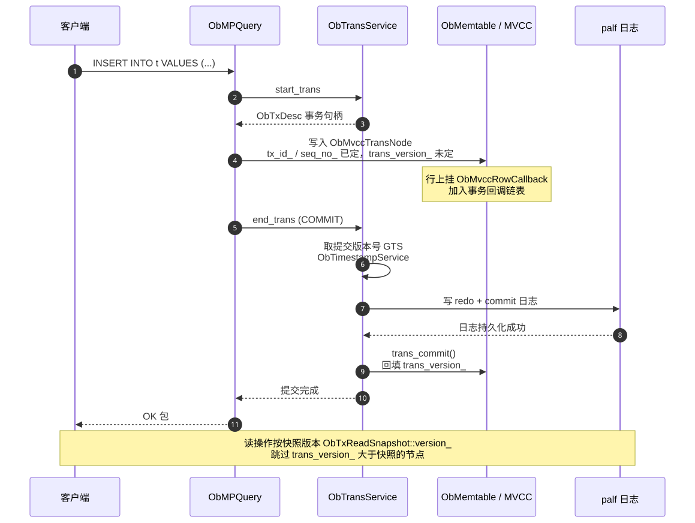

# 2.8 事务与 MVCC

> **一句话**：写入时事务号已定、提交版本未定；提交时取一个全局时间戳回填到所有修改行。
> 读取者拿快照版本沿多版本链表过滤——这就是 MVCC 的全部。



---

## 两个版本号

理解 seekdb 的 MVCC，先分清 `ObMvccTransNode`
（`src/storage/memtable/mvcc/ob_mvcc_row.h:64`）里两个容易混的字段：

| 字段 | 初值 | 何时确定 | 含义 |
|---|---|---|---|
| `scn_` | `max_scn()` | 写日志时 | **写入**时的日志序号 |
| `trans_version_` | `min_scn()` | **提交**时 | **提交**版本，即可见性判据 |

写入时 `trans_version_` 是 `min_scn()`——因为事务还没提交，
提交版本无从谈起。这正是 MVCC 的核心：
**数据先写下去，可见性稍后决定**。

---

## 事务流程

### 1. 开始

`ObTransService::start_trans`（`src/storage/tx/ob_trans_service.cpp:40`）
创建事务上下文，返回 `ObTxDesc`（用户侧句柄）。

事务 ID 是 `ObTransID`，事务内的操作序号是 `ObTxSEQ`
（用于 savepoint 和语句级回滚）。

### 2. 写入

每次修改：
1. 在对应 `ObMvccRow` 的链表上追加一个 `ObMvccTransNode`
2. 填 `tx_id_`、`seq_no_`，`trans_version_` 留空
3. 挂一个 `ObMvccRowCallback` 到事务的回调链表上

### 3. 提交

```
取全局提交版本（GTS）    ObTimestampService
    ↓
写 redo + commit 日志到 palf
    ↓
日志持久化成功
    ↓
遍历回调链表，调用 trans_commit()
回填 trans_version_ 到每个节点
```

**回填是关键一步**。提交前所有节点的 `trans_version_` 都是 `min_scn()`，
对其他事务不可见；回填后立刻可见。

`ObTimestampService`（`src/storage/tx/ob_timestamp_service.cpp`）
提供全局单调递增的时间戳。单机形态下这是个本地服务，
不需要分布式协调——这也是单机版延迟低的原因之一。

### 4. 回滚

`trans_abort()` 标记节点为 aborted，后续清理。

---

## 读取：快照隔离

读操作持有一个 `ObTxReadSnapshot`，里面是一个版本号。
遍历 `ObMvccRow` 链表时：

```
对每个 ObMvccTransNode：
  if (节点未提交)                → 跳过（除非是自己的事务）
  if (trans_version_ > 快照版本)  → 跳过（太新，我不该看见）
  else                           → 这就是我要的版本，返回
```

`snapshot_version_barrier_` 字段用于加速——
它记录了一个屏障值，避免每次都遍历整条链表。

### 隔离级别

seekdb（MySQL 模式）默认 **Read Committed**。
标志位定义在 `ob_mvcc_row.h`：
`WEAK_READ_BIT`、`COMPACT_READ_BIT`、`SNAPSHOT_VERSION_BARRIER_BIT`。

---

## 事务模块的组成

`src/storage/tx/`（约 114 个文件）：

| 组件 | 职责 |
|---|---|
| `ObTransService` | 事务服务总入口 |
| `ObPartTransCtx` | 单个事务的状态机 |
| `ObTxCtxMgr` | 事务上下文管理 |
| `ObTimestampService` | 全局时间戳（GTS） |
| `ObTxDesc` | 用户侧事务句柄 |
| `ObTransID` / `ObTxSEQ` | 标识与排序 |

相关模块：

| 模块 | 位置 | 职责 |
|---|---|---|
| 行锁等待 | `ObLockWaitMgr`（memtable） | 行锁冲突排队 |
| 表锁 | `src/storage/tablelock/` | 表级锁、DDL 锁 |
| 死锁检测 | `src/storage/deadlock/` | 等待图检测环 |
| 事务数据表 | `src/storage/tx_table/` | 持久化提交版本信息 |

---

## 两阶段提交

`ObPartTransCtx` 里实现了标准 2PC 状态机，
参与者通过 palf 写 prepare / commit 日志。

在 seekdb 单机形态下，通常只有一个参与者，
2PC 退化成一阶段——但代码路径保留着。

---

## `tx_table`：提交信息的持久化

一个微妙问题：MemTable 转储成 SSTable 时，
里面可能有**未提交**事务的数据（见 `merge_uncommitted` 测试套件）。
这些数据落盘后，怎么知道它后来提交了没有？

答案是 `src/storage/tx_table/`——
它把事务的提交版本信息单独持久化。
读 SSTable 遇到不确定的行时，回查 tx_table 确定可见性。

这是 LSM + MVCC 组合必须解决的问题。

---

## 与向量索引的关系

这里有个重要的架构决策，值得单独指出。

**向量索引的更新不在事务路径上。**

普通索引（B+ 树）的更新是事务的一部分——
事务提交，索引就更新了。但向量索引不是：

```
事务提交（写 redo）→ 立即返回
                ↓ 异步
       Change Stream 消费 redo
                ↓
        更新增量 HNSW 索引
```

这意味着**向量索引是最终一致的**，不是事务一致的。
写入提交后，向量索引可能还有几毫秒才追上。

这是用一致性换吞吐的典型取舍——
pyseekdb 的 `refresh_index()` 和
`ObChangeStreamMgr::wait_refresh_scn` 就是给需要强一致的场景准备的。

详见 [2.11 Change Stream](11-change-stream.md)。

---

## 代码锚点

| 文件:行 | 职责 |
|---|---|
| `src/storage/tx/ob_trans_service.cpp:40` | `ObTransService` |
| `src/storage/tx/ob_part_trans_ctx.cpp` | 事务状态机、2PC |
| `src/storage/tx/ob_timestamp_service.cpp` | 全局时间戳 |
| `src/storage/tx/ob_trans_id.cpp` | `ObTransID` |
| `src/storage/memtable/mvcc/ob_mvcc_row.h:64` | `ObMvccTransNode` |
| `src/storage/memtable/mvcc/ob_mvcc_trans_ctx.h:425` | `ObMvccRowCallback` |
| `src/storage/tx_table/` | 提交信息持久化 |
| `src/storage/tablelock/` | 表锁 |
| `src/storage/deadlock/` | 死锁检测 |
| `src/share/scn.h` | `SCN` 类型 |

---

## 动手验证

看两个版本号字段的初值（理解 MVCC 的钥匙）：

```bash
sed -n '64,82p' src/storage/memtable/mvcc/ob_mvcc_row.h
```

看事务模块规模：

```bash
ls src/storage/tx/*.cpp | wc -l
```

看回调的生命周期钩子：

```bash
grep -n "before_append\|log_submitted\|trans_commit\|trans_abort" src/storage/memtable/mvcc/ob_mvcc_trans_ctx.h | head
```

---

## 延伸阅读

- 下一章：[2.9 日志服务 palf 与单副本裁剪](09-palf.md)
- [2.6 一行数据的一生](06-lsm-tree.md) —— 多版本数据的存储
- [2.11 Change Stream](11-change-stream.md) —— 为什么向量索引不走事务路径
