# ★ 2.10 向量索引架构：两级 HNSW 与 VSAG

> **一句话**：一个向量索引 = 5 张辅助表 + 3 份内存索引结构（增量 / 快照 / 位图）。
> 查询永远只命中两个索引再归并——**索引数量恒定为 2，这是 P99 平稳的结构性原因**。


---

## 问题：向量索引与流式写入的矛盾

HNSW 是一种图索引：向量之间构建近邻图，查询时沿图游走。
它的召回率和查询速度都很好，但有个致命特性：

> **构建成本高，且不适合频繁增量修改。**

传统向量数据库的做法是：攒一批数据，批量构建索引。
新写入的数据要等下一轮构建才能被检索到。

Agent 场景不能接受这个——写完就要查。
如果每次写入都触发索引更新，写入延迟会被索引构建拖垮；
如果攒批，新数据就有可见性延迟。

seekdb 的解法是**分层**：借鉴 LSM-Tree 的思路，
把索引分成"小而新"和"大而旧"两级。

---

## 核心数据结构

### `ObVectorIndexMemData` —— 一份内存索引

`src/observer/vector_index/ob_plugin_vector_index_adaptor.h`（约 401 行起）：

```cpp
struct ObVectorIndexMemData
{
  bool     is_init_;
  bool     rb_flag_;
  TCRWLock mem_data_rwlock_;    // 保护 index_
  TCRWLock bitmap_rwlock_;      // 保护 bitmap_
  SCN      scn_;
  uint64_t ref_cnt_;            // 原子引用计数
  ObVidBound vid_bound_;        // vid 范围 [min, max]
  void     *index_;             // 不透明句柄 → VSAG 索引对象
  ObVectorIndexRoaringBitMap *bitmap_;   // 可见性位图
  ObVsagMemContext *mem_ctx_;   // VSAG 专用内存上下文
  SCN last_dml_scn_;
  SCN last_read_scn_;
  // hnsw+sq 专用
  bool has_build_sq_;
  ObVecIdxVidArray *vid_array_;
  ObVecIdxVecArray *vec_array_;
};
```

几个设计细节值得注意：

**`void *index_` 是不透明指针**——seekdb 不关心 HNSW 图的内部结构，
那是 VSAG 的事。这层抽象让底层库可替换。

**`ObVsagMemContext *mem_ctx_`** ——VSAG 的内存分配走 seekdb 自己的
内存上下文，从而被纳入 `ObMemAttr` 统计体系。
外部库的内存也能在 `__all_virtual_memory_info` 里看到。

**`vid_bound_`** 记录该索引持有的 vid 范围，
用原子读写（`get_read_bound_vid` 里的 `ATOMIC_LOAD`）。
查询时可以先用范围快速判断"这个索引里可能有目标吗"。

### `ObPluginVectorIndexAdaptor` —— 容器

同文件 545 行：

```cpp
ObVectorIndexMemData *incr_data_;      // 892 行：增量（delta）
ObVectorIndexMemData *snap_data_;      // 893 行：快照（snapshot）
ObVectorIndexMemData *vbitmap_data_;   // 894 行：可见性位图
```

**这三个成员就是"两级 HNSW"的物理形态。**

| 成员 | 角色 |
|---|---|
| `incr_data_` | 增量索引。Change Stream 持续往里写新向量。小、更新频繁 |
| `snap_data_` | 快照索引。存量数据。大、只读、定期重建 |
| `vbitmap_data_` | 可见性位图。记录哪些 vid 已被删除 |

> 💡 命名提示：源码叫 `incr`（incremental），官方博客叫 delta，
> 是同一个东西。

---

## 并发控制：两把独立的读写锁

这是性能的关键，值得单独讲。

每份 `ObVectorIndexMemData` 有**两把**锁：

```cpp
TCRWLock mem_data_rwlock_;   // 保护索引结构 index_
TCRWLock bitmap_rwlock_;     // 保护可见性位图 bitmap_
```

**为什么要分开**：删除一个向量时，通常只需要改位图
（标记不可见），不需要动图结构。如果共用一把锁，
删除操作会阻塞所有查询。分开之后，删除只锁位图，
查询照常读图结构。

### 引用计数支持无锁交接

```cpp
void inc_ref()  { ATOMIC_INC(&ref_cnt_); }
bool dec_ref_and_check_release() {
  int64_t ref_count = ATOMIC_SAF(&ref_cnt_, 1);
  return (ref_count == 0);
}
```

查询线程取到索引后 `inc_ref()`，用完 `dec_ref()`。
这样**查询期间不需要一直持锁**——只在获取句柄的瞬间加锁。
后台的快照重建可以并发进行，等旧索引引用归零再释放。

### 快照重建时的换手

重建流程大致是：
1. 对旧 `incr_data_` 加**读锁**，读出全部数据
2. 构建新的快照索引
3. 对新 `incr_data_` 加**写锁**，原子替换
4. 旧索引等引用计数归零后释放

整个过程中查询不中断。

---

## 5 张辅助表



一个 HNSW 索引在 schema 层面展开成 5 张表，
索引类型码定义在 `src/share/schema/ob_schema_struct.h`：

| 码 | 常量 | 作用 |
|---|---|---|
| 23 | `INDEX_TYPE_VEC_ROWKEY_VID_LOCAL` | 主键 → 向量 ID（vid） |
| 24 | `INDEX_TYPE_VEC_VID_ROWKEY_LOCAL` | 向量 ID → 主键（反查） |
| 25 | `INDEX_TYPE_VEC_DELTA_BUFFER_LOCAL` | 增量缓冲 |
| 26 | `INDEX_TYPE_VEC_INDEX_ID_LOCAL` | 索引元信息 |
| 27 | `INDEX_TYPE_VEC_INDEX_SNAPSHOT_DATA_LOCAL` | 快照序列化数据 |

其他索引族：IVF 用 28-38，稀疏向量（SPIV）用 40，
混合索引日志 41、混合 embedding 42。

**为什么需要 vid**：HNSW 内部用整数 ID 标识向量，
而表的主键可能是任意类型（复合主键、字符串等）。
所以要有双向映射表。

**为什么快照要持久化（表 27）**：内存索引重启就没了，
重建代价高昂。序列化到表里，重启后反序列化即可恢复。
对应 VSAG 的 `serialize` / `deserialize_bin` 接口。

### DDL 怎么展开

`ObVecIndexBuilderUtil::append_vec_args`
（`src/sql/resolver/ddl/ob_vec_index_builder_util.cpp`）按算法分派：

```
append_vec_hnsw_args()          HNSW → 上述 5 张表
append_vec_ivfflat_args()       IVF-Flat
append_vec_ivfsq8_args()        IVF-SQ8
append_vec_ivfpq_args()         IVF-PQ
append_vec_spiv_args()          稀疏向量
append_hybrid_vec_hnsw_args()   混合（带库内 embedding）
```

---

## 查询路径

`ObDASHNSWScanIter`（`src/sql/das/iter/ob_das_hnsw_scan_iter.h`）
是一个状态机：

```cpp
enum ObVidAdaLookupStatus {
  STATES_INIT,
  QUERY_INDEX_ID_TBL,     // 查索引元信息
  QUERY_SNAPSHOT_TBL,     // 查快照
  QUERY_ROWKEY_VEC,       // vid → 主键 + 原始向量
  STATES_SET_RESULT,
  STATES_ERROR,
  STATES_FINISH,
  STATES_REFRESH
};
```

它持有一串子迭代器，对应那 5 张表：
`delta_buf_iter_`、`snapshot_iter_`、`index_id_iter_`、
`vid_rowkey_iter_`、`com_aux_vec_iter_`、`rowkey_vid_iter_`，
外加 `data_filter_iter_`、`pre_filter_iter_`、`func_lookup_iter_`。

### 归并两路结果

在 `src/observer/vector_index/ob_plugin_vector_index_utils.cpp`：

- `ObPluginVectorIndexHelper::driect_merge_delta_and_snap_vids`
- `sort_merge_delta_and_snap_vids`

流程是：增量索引查 top-k，快照索引查 top-k，
两路结果按距离归并，过滤掉位图里标记删除的，取最终 top-k。

**因为索引恰好是两个，归并成本是恒定的**——
不像 LSM-Tree 的 SSTable 会累积到几十个。

### 5 种执行策略

`ObVecIndexType`（`src/sql/das/ob_das_vec_define.h`）
决定过滤与召回的先后（见 [1.3 混合检索](../10-user/03-hybrid-search.md)）：

`VEC_INDEX_POST_WITHOUT_FILTER` / `VEC_INDEX_PRE` /
`VEC_INDEX_POST_ITERATIVE_FILTER` / `VEC_INDEX_ADAPTIVE_SCAN`

---

## VSAG 集成

`deps/oblib/src/lib/vector/ob_vsag_adaptor.h` 是 C 风格适配层：

```cpp
enum IndexType {
  HNSW_TYPE = 0, HNSW_SQ_TYPE = 1, HNSW_BQ_TYPE = 5,
  HGRAPH_TYPE = 6, IPIVF_TYPE = 8
};

create_index / build_index / add_index / knn_search
serialize / deserialize_bin / fserialize / fdeserialize
delete_index / estimate_memory
```

seekdb 侧的算法枚举（`ObVectorIndexAlgorithmType`）
映射到 VSAG 的 `IndexType`：

| seekdb | VSAG |
|---|---|
| `VIAT_HNSW` | `HNSW_TYPE`（有 extra_info 时用 `HGRAPH_TYPE`） |
| `VIAT_HNSW_SQ` | `HNSW_SQ_TYPE` |
| `VIAT_HNSW_BQ` | `HNSW_BQ_TYPE` |
| `VIAT_IPIVF` | `IPIVF_TYPE` |

> ⚠️ **VSAG 不在本仓库**，是 `deps/init/*.deps` 里拉取的外部依赖
> （`vsag-abiv1`）。HNSW 的图构建、剪枝、量化算法要去 VSAG 项目看。
> seekdb 负责的是：数据供给、持久化、并发控制、查询归并、生命周期。

另有内置实现选项 `VIAL_OB`（`ObVectorIndexAlgorithmLib`），
不依赖 VSAG。

---

## IVF 分支

IVF（倒排文件）是另一族索引，适合超大规模：
先用 KMeans 把向量聚成若干簇，查询时只搜最近的几个簇。

| 组件 | 位置 |
|---|---|
| KMeans | `ob_vector_kmeans_ctx.cpp`（用 Elkan 算法） |
| 异步任务 | `ob_ivf_async_task.cpp`、`ob_ivf_async_task_executor.cpp` |
| 中心点缓存 | `ob_vector_index_ivf_cache_mgr.cpp` |
| 查询迭代器 | `ObDASIvfScanIter` / `ObDASIvfPQScanIter` / `ObDASIvfSQ8ScanIter` |

IVF 需要**先训练**（跑 KMeans 求中心点）才能建索引，
所以它的构建是异步任务驱动的。

---

## 异步任务体系

`ObVecIndexAsyncTaskType`（`ob_vector_index_async_task.h`）：

```cpp
OB_VECTOR_ASYNC_INDEX_BUILT              // 构建
OB_VECTOR_ASYNC_INDEX_OPTINAL            // 优化
OB_VECTOR_ASYNC_INDEX_IVF_LOAD           // IVF 加载
OB_VECTOR_ASYNC_INDEX_IVF_CLEAN          // IVF 清理
OB_VECTOR_ASYNC_HYBRID_VECTOR_EMBEDDING  // 库内 embedding
```

调度器：`ObVectorIndexAsyncTaskScheduler`、
`ObPluginVectorIndexScheduler`。

用户侧可以手动触发：

```sql
call dbms_vector.refresh_index('idx', 't1', 'c3', 1, 'FAST');
call dbms_vector.rebuild_index('idx', 't1', 'c3', 0);
```

---

## 回到最初的问题

**为什么两级结构能同时做到"写完就能查"和"P99 平稳"？**

| 需求 | 机制 |
|---|---|
| 写完就能查 | 新向量进增量索引（小、构建快），立刻可检索 |
| 写入不被索引拖慢 | 索引更新走 Change Stream 异步路径，不在事务里 |
| 查询延迟稳定 | 索引数量**恒定为 2**，归并成本不随数据量增长 |
| 存量数据高效 | 快照索引批量构建，质量高 |
| 并发不打架 | 两把独立读写锁 + 引用计数 |

对比 LSM-Tree：SSTable 会累积到几十个，读放大随之增长，
所以需要 compaction 控制数量。向量索引这里直接把数量钉死在 2，
用定期重建快照代替多层合并。

**代价**：向量索引是**最终一致**的，不是事务一致的
（见 [2.8 事务与 MVCC](08-transaction-mvcc.md)）。

---

## 代码锚点

| 文件:行 | 职责 |
|---|---|
| `src/observer/vector_index/ob_plugin_vector_index_adaptor.h:401` | `ObVectorIndexMemData` |
| `src/observer/vector_index/ob_plugin_vector_index_adaptor.h:455-470` | 两把 `TCRWLock`、`ref_cnt_`、`index_`、`bitmap_` |
| `src/observer/vector_index/ob_plugin_vector_index_adaptor.h:545` | `ObPluginVectorIndexAdaptor` |
| `src/observer/vector_index/ob_plugin_vector_index_adaptor.h:892-894` | `incr_data_` / `snap_data_` / `vbitmap_data_` |
| `src/observer/vector_index/ob_plugin_vector_index_utils.cpp` | 两路归并 |
| `src/observer/vector_index/ob_vector_index_util.h` | 全部枚举 |
| `src/observer/vector_index/ob_vector_kmeans_ctx.cpp` | IVF KMeans |
| `src/observer/vector_index/ob_vector_index_async_task.h` | 异步任务类型 |
| `src/sql/das/iter/ob_das_hnsw_scan_iter.h` | HNSW 查询状态机 |
| `src/sql/das/iter/ob_das_ivf_scan_iter.h` | IVF 查询 |
| `src/sql/das/ob_das_vec_define.h` | 5 种执行策略 |
| `src/sql/resolver/ddl/ob_vec_index_builder_util.cpp` | 辅助表展开 |
| `src/share/schema/ob_schema_struct.h` | 索引类型码 23-27 |
| `deps/oblib/src/lib/vector/ob_vsag_adaptor.h` | VSAG C 接口 |
| `src/storage/vector_type/` | SIMD 距离函数 |

---

## 动手验证

看两级索引的三个成员：

```bash
sed -n '888,900p' src/observer/vector_index/ob_plugin_vector_index_adaptor.h
```

看内存结构与两把锁：

```bash
sed -n '400,475p' src/observer/vector_index/ob_plugin_vector_index_adaptor.h
```

看辅助表类型码：

```bash
grep -n "INDEX_TYPE_VEC_" src/share/schema/ob_schema_struct.h
```

看查询状态机：

```bash
grep -n -A 12 "enum ObVidAdaLookupStatus" src/sql/das/iter/ob_das_hnsw_scan_iter.h
```

---

## 延伸阅读

- 下一章：[★ 2.11 Change Stream：P99 为何是平的](11-change-stream.md)
- [3.7 实战二：扩展向量索引](../30-developer/07-hands-on-vector-index.md)
- [1.2 数据建模](../10-user/02-data-modeling.md) —— 用户侧的索引语法
