# ★ 2.11 Change Stream：P99 为何是平的

> **一句话**：事务提交只写日志就返回，索引构建由一条独立管线异步消费日志完成。
> 写路径和索引路径**物理解耦**——这是官方宣称 P99 抖动仅 1.1× 的架构基础。



---

## 问题：索引构建凭什么不拖慢写入

设想一个朴素实现：`INSERT` 一条带向量的记录，
事务里同时更新 HNSW 图。那么：

- HNSW 插入要做图遍历和邻居选择，**比写一行数据贵得多**
- 图结构是共享的，并发插入要加锁 → 争用
- 写入延迟 = 数据写入 + 索引构建，且方差很大
- 并发一上来，P99 立刻炸

这正是官方博客里 Milvus / ES 在流式负载下 P99 抖动 10 倍的原因假设。

seekdb 的解法是：**让写路径根本不知道索引的存在**。

---

## 核心思路：复用 redo 日志

数据库为了持久化本来就要写日志。
Change Stream 做的事情是——**再消费一遍这份日志**：

```
事务提交 → 写 redo 到 palf → 返回客户端   ← 写路径到此结束
                  │
                  └─ 异步 ─→ ObCSFetcher 消费日志
                                  ↓
                            更新增量 HNSW
```

好处很直接：

1. **写路径零额外开销** —— 日志本来就要写
2. **不丢数据** —— 日志已持久化，索引可以慢慢建
3. **天然有序** —— 日志本身就是串行化的变更流

这就是 [2.9 palf](09-palf.md) 里提到的复用。

---

## 四级流水线

`src/observer/change_stream/`：

```
ObCSFetcher  →  ObCSDispatcher  →  ObCSWorker/ObCSExecutor  →  ObCSPluginAsyncIndex
  消费日志         拆解组批              并行执行                   写入索引
```

### 1. `ObCSFetcher` —— 日志消费者

`ob_change_stream_fetcher.h:119`，继承 `share::ObThreadPool`，**单线程**。

单线程是刻意的：日志有严格顺序，多线程消费会乱序。

它维护每个事务的状态 `ObCSTxInfo`：

```cpp
commit_version_    提交版本
start_lsn_         起始日志位置
schema_version_    schema 版本
is_ddl_            是否 DDL
rollback_list_     回滚的部分
redo_list_         redo 记录
```

处理函数：
`handle_redo_log_`（171 行）、`handle_commit_log_`（175 行）、
`handle_abort_log_`、`handle_rollback_to_log_`、
`extract_ddl_schema_version_`、`get_or_create_tx_info_`。

**为什么要攒事务状态**：日志是流式的，一个事务的 redo 记录
分散在多条日志里，且要等到 commit 日志才知道该不该应用。
所以 Fetcher 要缓存 redo，见到 commit 才下发，见到 abort 就丢弃。

### ⭐ IDLE / ACTIVE 状态机：零成本抽象

`ob_change_stream_fetcher.h:161`：

```cpp
enum RunningMode { IDLE = 0, ACTIVE = 1 };
```

源码注释（193 行）写得很清楚：

```cpp
RunningMode running_mode_;   // IDLE: no async-index tables; ACTIVE: consuming logs.
common::ObThreadCond idle_cond_;  // Condvar for IDLE wait; signaled by publish_schema or stop().
```

以及（55-56 行）：

```cpp
/// Cond wait timeout in IDLE mode (no async-index tables).
/// 10s fallback; schema changes wake immediately.
static constexpr int64_t CS_FETCHER_IDLE_COND_WAIT_MS = 10 * 1000;
```

**含义**：如果库里根本没有需要异步索引的表，
Fetcher 就在条件变量上睡着，完全不消费日志。
一旦有人建了向量索引，`publish_schema` 会立刻唤醒它。

这意味着：**不用向量索引的用户，为 Change Stream 付出的代价是零。**
这是个漂亮的设计——特性不用就不收费。

### 2. `ObCSDispatcher` —— 拆解与组批

`ob_change_stream_dispatcher.h`。关键类型：

```cpp
struct ObCSRow {          // 零拷贝的行视图
  heap_pk_;               // 堆表主键
  dml_flag_;              // INSERT / UPDATE / DELETE
  new_row_, old_row_;     // 指向 redo 缓冲区，不复制
  seq_no_;
};

class ObCSExecSubTask : public LinkTask;   // 一个子任务
class ObCSExecCtx;                         // 批次上下文
```

`ObCSRow` 的 `new_row_` / `old_row_` 是**指向 redo 缓冲区的指针**，
不做数据拷贝。这对吞吐很重要。

### 3. `ObCSWorker` / `ObCSExecutor` —— 并行执行

`ob_change_stream_worker.h`：

```cpp
class ObCSExecutor : public common::ObLinkQueueThreadPool;
```

多个 executor 并行处理子任务。
Fetcher 单线程保证顺序，到了这一层就可以并行了——
因为不同 tablet / 不同行之间没有顺序依赖。

`do_finish_batch_` 是"最后一个 worker 完成时"的收尾路径：
统一提交、推进 SCN、清理。

### 4. `ObCSPluginAsyncIndex` —— 写入索引

`ob_cs_plugin_async_index.h`。插件框架：

```cpp
enum CS_PLUGIN_TYPE { CS_PLUGIN_ASYNC_INDEX = 0 };   // 38 行
class ObCSPlugin;                                     // 43 行：抽象基类
class ObCSPluginRegistry;                             // 67 行：工厂注册表
```

目前只有一个插件类型——异步索引。
但框架是为多种消费者准备的（CDC、物化视图等都可以挂上来）。

异步索引插件的内部：

```cpp
struct ObASyncIndexEvent { ... };   // INSERT='I' | DELETE='D'
struct ObCSVecIndexInfo {           // 缓存的向量索引元信息
  data_table_id_, index_id_table_id_, delta_buffer_table_id_,
  vec_column_id_, vec_col_idx_, index_type_, dim_, part_key_col_ids_
};
```

主要方法：
`resolve_table_id_from_tablet_id_` → `resolve_vector_index_info_`
→ `build_event_from_row_` → `extract_vector_data_`
→ `insert_vector_index_log_batch_` → `write_to_vsag_`

最后一步 `write_to_vsag_` 就是调用 VSAG 的 `add_index`，
把向量插进增量 HNSW。

---

## 一致性：`refresh_scn`

异步意味着延迟。需要强一致的场景怎么办？

`ObChangeStreamMgr::wait_refresh_scn`
（`ob_change_stream_mgr.h:53`）——等待索引追上指定的 SCN。

这就是 pyseekdb 里 `memory.refresh_index()` 背后的机制：

```python
memory.upsert(ids=["4"], documents=["..."])
memory.refresh_index()          # ← 等索引追上
results = memory.query(...)     # 保证能查到刚写的
```

用户侧也有 SQL 接口：

```sql
call dbms_vector.refresh_index('idx', 't1', 'c3', 1, 'FAST');
```

**批次原子提交**：一个批次的所有子任务成功后才调 `commit()`，
然后把 `refresh_scn` 推进到该批次的 `commit_version_`。
所以 `refresh_scn` 的语义是"这个版本之前的写入都已进索引"。

---

## 完整时序

```
t0  客户端 INSERT
t1  事务写 MemTable，挂 MVCC 回调
t2  事务提交：取 GTS → 写 redo+commit 到 palf
t3  ← 客户端收到 OK        【写路径结束，延迟到此为止】
    ─────────────────────────────────
t4  ObCSFetcher 读到 commit 日志，取出缓存的 redo
t5  ObCSDispatcher 拆成 ObCSRow，组批
t6  ObCSExecutor 并行处理
t7  ObCSPluginAsyncIndex 提取向量 → write_to_vsag_
t8  批次提交，refresh_scn 推进
    ← 此时新向量可被检索
```

t3 到 t8 之间就是索引可见性延迟。
官方设计目标是毫秒级——足够支撑"写完立刻查"的 Agent 循环。

---

## 为什么 P99 是平的

把结构性原因列清楚：

| 因素 | 传统方案 | seekdb |
|---|---|---|
| 索引构建在写路径上？ | 是 | **否**（异步） |
| 写入延迟受索引影响？ | 是，且方差大 | 否 |
| 并发时索引锁争用影响写？ | 是 | 否 |
| 查询要归并几个索引？ | 随数据量增长 | **恒定 2 个** |
| 不用向量索引的开销 | — | **零**（IDLE 模式） |

官方数据是 P99 抖动 1.1×（ES 10.3×、Milvus 9.7×）。
本书不复现这个数字，但上面的结构差异能解释它为什么可能成立。

> ⚠️ **代价要说清楚**：向量索引是**最终一致**的。
> 写入提交后到索引可见之间有一个窗口。
> 需要强一致就必须调 `refresh_index`——那会重新引入等待。
> 这不是"免费的午餐"，而是把一致性的选择权交给了应用。

---

## 代码锚点

| 文件:行 | 职责 |
|---|---|
| `src/observer/change_stream/ob_change_stream_mgr.h:34` | `ObChangeStreamMgr` |
| `src/observer/change_stream/ob_change_stream_mgr.h:53` | `wait_refresh_scn` |
| `src/observer/change_stream/ob_change_stream_fetcher.h:55` | IDLE 等待超时常量与注释 |
| `src/observer/change_stream/ob_change_stream_fetcher.h:119` | `ObCSFetcher` |
| `src/observer/change_stream/ob_change_stream_fetcher.h:161` | `RunningMode { IDLE, ACTIVE }` |
| `src/observer/change_stream/ob_change_stream_fetcher.h:171-182` | 日志处理函数 |
| `src/observer/change_stream/ob_change_stream_fetcher.h:193-197` | `running_mode_` / `idle_cond_` |
| `src/observer/change_stream/ob_change_stream_dispatcher.h` | `ObCSRow`、`ObCSExecSubTask` |
| `src/observer/change_stream/ob_change_stream_worker.h` | `ObCSExecutor` |
| `src/observer/change_stream/ob_change_stream_plugin.h:38` | `CS_PLUGIN_ASYNC_INDEX` |
| `src/observer/change_stream/ob_change_stream_plugin.h:43` | `ObCSPlugin` 抽象基类 |
| `src/observer/change_stream/ob_change_stream_plugin.h:67` | `ObCSPluginRegistry` |
| `src/observer/change_stream/ob_cs_plugin_async_index.cpp` | 异步索引插件 |

---

## 动手验证

看 IDLE / ACTIVE 的设计注释（本章最值得读的几行）：

```bash
sed -n '50,60p'   src/observer/change_stream/ob_change_stream_fetcher.h
sed -n '155,200p' src/observer/change_stream/ob_change_stream_fetcher.h
```

看插件框架：

```bash
sed -n '30,80p' src/observer/change_stream/ob_change_stream_plugin.h
```

看整个模块有多大（比想象中小）：

```bash
wc -l src/observer/change_stream/*.h src/observer/change_stream/*.cpp | tail -1
```

---

## 延伸阅读

- 下一章：[★ 2.12 混合检索的算子融合](12-hybrid-search-internals.md)
- [★ 2.10 向量索引架构](10-vector-index.md) —— 数据被写进了什么结构
- [2.9 palf](09-palf.md) —— 日志从哪来
- [2.8 事务与 MVCC](08-transaction-mvcc.md) —— 为什么索引不在事务里
