# ★ 2.12 混合检索的算子融合

> **一句话**：向量召回和全文召回各自是一棵迭代器树，
> 在同一个执行计划里并行推进，最后用加权求和或 RRF 融合成一个排序。



---

## 两条召回路

### 全文路：稀疏检索

`src/storage/retrieval/` 实现了信息检索领域的标准技术栈：

| 概念 | 类 |
|---|---|
| 稀疏检索接口 | `ObISparseRetrievalIter` |
| DAAT（Document-at-a-Time） | `ObISRDaaTIter`、`ObTextRetrievalDaaTTokenIter` |
| TAAT（Term-at-a-Time） | `ObSparseTAATIter` |
| **block-max 剪枝** | `ObBlockMaxScoreIter`、`ObBlockStatCollector` |
| 稀疏向量 | `ObSPIVDaaTIter`、`ObSPIVDimIter` |
| BM25 打分 | `ObExprBM25`（`src/sql/engine/expr/ob_expr_bm25.cpp`） |

**DAAT vs TAAT** 是检索引擎的经典二选一：
DAAT 按文档推进（适合 top-k，可提前终止），
TAAT 按词推进（适合需要完整打分的场景）。
seekdb 两种都实现了，按查询特征选。

**block-max** 是 top-k 检索的关键优化：
预先记录每个块的最大可能得分，如果一个块的上界
低于当前 top-k 的门槛，整块跳过——不用逐条打分。

DAS 侧的入口：

| 迭代器 | 位置 |
|---|---|
| `ObDASTextRetrievalIter` | `src/sql/das/iter/ob_das_text_retrieval_iter.cpp` |
| `ObDASTRMergeIter` | `src/sql/das/iter/sparse_retrieval/ob_das_tr_merge_iter.cpp` |
| `ObDASMatchIter` | `src/sql/das/iter/sparse_retrieval/ob_das_match_iter.cpp` |

`ObDASTRMergeIter` 有几个模式标志：
`function_lookup_mode` / `topk_mode` / `daat_mode` / `taat_mode`。

`ObDASMatchIter` 内部用 `ObDASMatchMergeLoserTree`（败者树）
做多路归并——这是多路归并的标准高效结构。

### 向量路

见 [2.10 向量索引架构](10-vector-index.md)：
`ObDASHNSWScanIter` 查增量 + 快照两个索引再归并。

---

## 分词与文本分析

`src/storage/fts/` 提供分词器（X-macro `FTS_BUILD_IN_PARSER_LIST`）：

| 名称 | 实现 |
|---|---|
| `space` | `ob_whitespace_ft_parser.cpp` |
| `ngram` | `ob_ngram_ft_parser.cpp` |
| `ngram2` | `ob_ngram2_ft_parser.cpp` |
| `beng` | `ob_beng_ft_parser.cpp` |
| `ik` | `ob_ik_ft_parser.cpp`（中文智能分词） |

配套设施：

- `ObFTParseHelper` —— `init(allocator, parser_name, parser_properties)` + `segment(...)`
- `ObFTParserProperty` —— JSON 参数：`min_token_size`、`max_token_size`、
  `ngram_token_size`、`stopword_table`、`dict_table`、`quantifier_table`
- `ObStopWordChecker` —— 停用词
- `ObFTDictHub`（`src/storage/fts/dict/`）—— IK 用户词典
- `ObFTParserName` —— 带版本的分词器名（如 `default_parser.1`）

分词器名带版本号是个细节：分词规则变了会影响已建索引，
版本号让系统能识别不兼容。

---

## 融合层：`src/sql/hybrid_search/`

### 调用链

```
dbms_hybrid_vector.SEARCH(table, json)
        ↓
ObHybridSearchExecutor          ob_hybrid_search_executor.cpp
        ↓
ObESQueryParser                 ob_query_parse.cpp       解析 JSON DSL
        ↓
ObQueryReqFromJson              ob_query_request.h       中间表示
        ↓
ObQueryTranslator               ob_query_translator.cpp  翻译成单条 SQL
        ↓
普通 SQL 执行流程（走优化器和执行引擎）
```

关键在最后一步：**混合检索最终被翻译成一条普通 SQL**，
里面包含 KNN 子查询和全文子查询，然后走标准的优化执行路径。

这个设计的好处是复用——不需要为混合检索单独写一套执行引擎。
`GET_SQL` 接口让你能看到翻译结果：

```sql
SELECT dbms_hybrid_vector.GET_SQL('docs', '<查询 JSON>');
```

调试混合检索时这是最有用的工具。

### 融合算法

`ObFusionMethod`（`ob_query_parse.h`）：

```cpp
enum ObFusionMethod { WEIGHT_SUM = 0, RRF };

class ObRankFusion {
  method;       // 用哪种
  rank_const;   // RRF 的常数
  size;
};
```

**`WEIGHT_SUM`（加权求和）**：
`score = w1 * 语义分 + w2 * 关键词分`。
问题是两个分数量纲不同——BM25 分数可能是 0~30，
向量距离是 0~2，直接加权需要仔细调参。

**`RRF`（Reciprocal Rank Fusion）**：
`score = Σ 1 / (rank_const + rank_i)`。
只用**排名**不用分数，天然免疫量纲问题。
`rank_const`（常见取 60）控制头部结果的权重衰减。

实践中 RRF 通常是更稳健的默认选择。

### 内部列

融合过程中可用的列（`is_inner_column` 白名单，`ob_query_parse.h` 约 353 行）：

| 列 | 含义 |
|---|---|
| `_keyword_score` | 全文相关性分数 |
| `_semantic_score` | 向量相似度分数 |
| `_keyword_rank` | 全文召回排名 |
| `_semantic_rank` | 向量召回排名 |

RRF 用后两个，WEIGHT_SUM 用前两个。

### 查询项类型

`ObEsQueryItem` 枚举里有 `QUERY_ITEM_KNN`、`QUERY_ITEM_HYBRID` 等——
DSL 支持纯向量、纯全文、以及混合三种形态。

---

## 直接写 SQL 的路径

不走 DSL，直接写：

```sql
SELECT id, title, l2_distance(emb, '[...]') AS dist
FROM docs
WHERE MATCH(content) AGAINST('quarterly report')
  AND author_id = 42
ORDER BY dist APPROXIMATE LIMIT 10;
```

这条路径下**没有显式的融合步骤**——
全文匹配作为 `WHERE` 过滤条件，向量距离作为排序键。
语义是"在全文匹配的结果里，按向量距离排序"，
而不是"两路召回融合"。

**两种写法语义不同**，选型时要注意：

| 写法 | 语义 |
|---|---|
| SQL `WHERE MATCH + ORDER BY APPROXIMATE` | 全文作过滤，向量作排序 |
| `dbms_hybrid_vector.SEARCH` + RRF | 两路独立召回后融合 |

后者的召回率通常更高（两路互补），前者更可控。

---

## 语法层面

`src/sql/parser/sql_parser_mysql_mode.y`：

| 语法 | 产生式 |
|---|---|
| `MATCH (cols) AGAINST (expr [mode])` | `T_FUN_MATCH_AGAINST`（约 1595 行） |
| `MATCH (cols_with_boost, expr, es_opt)` | `T_FUN_ES_MATCH`（约 1602 行，ES 风格变体） |
| `FULLTEXT INDEX` | 约 4690 行 |
| `WITH PARSER <name>` | 约 7771 行 |

DAS 定义在 `src/sql/das/ob_das_ir_define.h`：
`ObDASIRScanCtDef` / `ObDASIREsMatchCtDef`。

---

## 代码锚点

| 文件 | 职责 |
|---|---|
| `src/sql/hybrid_search/ob_hybrid_search_executor.cpp` | `SEARCH` / `GET_SQL` |
| `src/sql/hybrid_search/ob_query_parse.cpp` | JSON DSL 解析、`ObFusionMethod` |
| `src/sql/hybrid_search/ob_query_request.h` | `ObQueryReqFromJson` |
| `src/sql/hybrid_search/ob_query_translator.cpp` | DSL → SQL |
| `src/storage/retrieval/ob_i_sparse_retrieval_iter.h` | 稀疏检索接口 |
| `src/storage/retrieval/ob_block_max_iter.cpp` | block-max 剪枝 |
| `src/storage/retrieval/ob_text_retrieval_token_iter.cpp` | DAAT 词迭代 |
| `src/storage/retrieval/ob_spiv_daat_iter.cpp` | 稀疏向量 DAAT |
| `src/storage/fts/ob_ik_ft_parser.cpp` | IK 中文分词 |
| `src/storage/fts/ob_fts_parser_helper.cpp` | `ObFTParseHelper` |
| `src/storage/fts/dict/ob_ft_dict_hub.cpp` | 词典中枢 |
| `src/sql/engine/expr/ob_expr_bm25.cpp` | BM25 |
| `src/sql/das/iter/sparse_retrieval/ob_das_tr_merge_iter.cpp` | 全文归并 |
| `src/sql/das/iter/sparse_retrieval/ob_das_match_iter.cpp` | MATCH top-k、败者树 |
| `src/sql/das/ob_das_ir_define.h` | 全文 DAS 定义 |
| `src/share/inner_table/sys_package/dbms_hybrid_vector_mysql.sql` | PL 包声明 |
| `src/pl/sys_package/ob_dbms_hybrid_vector_mysql.cpp` | PL 包实现 |

---

## 动手验证

看融合方法与内部列：

```bash
grep -n "WEIGHT_SUM\|RRF\|_keyword_score\|_semantic_score\|_keyword_rank\|_semantic_rank" \
  src/sql/hybrid_search/ob_query_parse.h
```

看分词器注册表：

```bash
grep -rn "FTS_BUILD_IN_PARSER_LIST" -A 10 src/storage/fts/ | head -15
```

看稀疏检索的迭代器家族：

```bash
ls src/storage/fts/ src/storage/retrieval/ | head -40
```

看全文检索的官方用例：

```bash
ls tools/deploy/mysql_test/test_suite/fts_index/t/
```

---

## 延伸阅读

- 下一章：[★ 2.13 FORK / MERGE 的 COW 实现](13-fork-merge-cow.md)
- [1.3 混合检索](../10-user/03-hybrid-search.md) —— 用户视角
- [★ 2.10 向量索引架构](10-vector-index.md) —— 向量召回路的细节
