# ★ 2.13 FORK / MERGE 的 COW 实现

> **一句话**：FORK 不复制数据，只记录 `(源表 ID, 快照版本号)` 两个数字；
> 读副本时按这个版本号去扫源表的多版本 SSTable。
> **COW 是 LSM-Tree 多版本能力的副产品。**



---

## 核心洞察

大多数数据库要"秒级复制一张表"很难，因为数据是**单版本原地存储**的——
你必须真的把字节拷一份。

但 LSM-Tree 为了 MVCC，本来就**保留着多个历史版本**
（见 [2.6 一行数据的一生](06-lsm-tree.md)）。
既然历史版本就在那儿，"分叉"就退化成了一个问题：

> 记住"从哪个版本开始分叉"，读的时候按那个版本过滤。

这就是全部。没有数据拷贝，没有引用计数的页表，
只有两个整数。

---

## 元信息：两个小结构

`src/share/ob_fork_table_info.h`：

### `ObForkTableInfo`（32 行）—— 表级

```cpp
class ObForkTableInfo final
{
  OB_UNIS_VERSION(1);
public:
  ObForkTableInfo() : fork_src_table_id_(OB_INVALID_ID), fork_snapshot_version_(0) {}
  bool is_valid() const {
    return OB_INVALID_ID != fork_src_table_id_ && fork_snapshot_version_ > 0;
  }
private:
  uint64_t fork_src_table_id_;      // 源表是谁
  int64_t  fork_snapshot_version_;  // 在哪个版本分叉
};
```

**整个 COW 机制的元信息就这两个字段。**

### `ObForkTabletInfo`（52 行）—— 分区级

```cpp
class ObForkTabletInfo final
{
  uint32_t   fork_info_;               // 位域，含 is_complete_
  int64_t    fork_snapshot_version_;
  ObTabletID fork_src_tablet_id_;      // 源 tablet
};
```

表可能分区，所以每个 tablet 也要记一份，指向对应的源 tablet。

`is_complete_` 标志表示这个 tablet 的数据是否已经"实体化"完成——
说明 fork 之后还有一个后台的数据构建过程（见下文 BUILD_DATA）。

---

## 读路径：按版本过滤

`src/storage/ddl/ob_tablet_fork_task.h:70`：

```cpp
class ObForkSnapshotRowScan : public ObIStoreRowIterator
{
  // ...
  int64_t fork_snapshot_version_;   // 101 行
};
```

它是个 `ObIStoreRowIterator`——也就是说，它**伪装成一个普通的行迭代器**，
上层代码不需要知道自己在读一个 fork 出来的表。

内部逻辑：

1. 扫描**源 tablet** 的 SSTable
2. 把 `trans_version_range.snapshot_version_` 设为 `fork_snapshot_version`
3. 过滤掉 `trans_version > fork_snapshot_version_` 的行

第 3 步是关键：源表在 fork 之后继续被修改，
那些新版本对副本**不可见**——正是快照隔离的语义。

---

## DDL 流程

```
FORK TABLE t_src TO t_fork
      ↓
ObForkTableResolver              src/sql/resolver/ddl/ob_fork_table_resolver.cpp
      ↓  T_FORK_TABLE
ObForkTableStmt
      ↓
ObForkTableService               src/rootserver/fork_table/ob_fork_table_service.cpp
      ↓
建目标表 schema + 写 ObForkTableInfo
      ↓
ObForkTableTask（异步 DDL 任务）  src/rootserver/fork_table/ob_fork_table_task.cpp
      ↓
BUILD_DATA 阶段：ObForkSnapshotRowScan 扫源表 → 写目标 tablet
```

`ObTableForkInfo`（`src/storage/ddl/ob_table_fork_info.cpp`）
承载存储层需要的参数：

```
table_id_, schema_version_, task_id_,
source_tablet_ids_, dest_tablet_ids_,
fork_snapshot_version_, data_format_version_
```

`generate_fork_params` 生成每个 tablet 的 `ObTabletForkParam`。

### 辅助表也要跟着 fork

一张表可能带索引、LOB、全文索引、向量索引。
`ob_fork_table_util.cpp` 里的助手负责收集这些：

- `collect_complete_domain_index_schemas` —— 域索引（全文/向量）
- `collect_index_tablet_ids` —— 普通索引
- `collect_lob_aux_tablet_ids` —— LOB 辅助表

这解释了为什么 `fork_table` 测试套件里有
`fork_table_fulltext.test` 这样的用例——
带域索引的表 fork 是特殊路径。

---

## 一个微妙问题：fork 遇上 compaction

COW 依赖源表的**历史版本仍然存在**。
但 major compaction 的职责恰恰是把历史版本合并掉。

如果 fork 的 BUILD_DATA 阶段正在扫源表，
此时触发了 major merge，会怎么样？

这正是 `fork_table_merge.test` 测试的场景，
它的描述写得很直白：

```
##description: Fork Table在BUILD_DATA阶段触发major merge
##tags: fork_table major_merge build_data
```

测试用 debug sync 精确控制时序：

```sql
alter system set debug_sync_timeout = '60s';
set ob_global_debug_sync = 'FORK_TABLE_BUILD_DATA wait_for build_data_signal execute 10000';
```

让 fork 停在 BUILD_DATA，然后手动触发 major freeze，再放行——
验证数据正确性。

> 💡 这也是理解 fork 局限性的关键：
> **fork 不是无限期的引用**，而是一个需要尽快完成的数据构建过程。
> `is_complete_` 标志追踪的就是这件事。

---

## MERGE TABLE

### 实现方式：翻译成 DML

`ObMergeTableStmt`（`src/sql/resolver/cmd/ob_merge_table_stmt.h`）
持有三段 SQL：

```cpp
ObString insert_sql_;
ObString update_sql_;
ObString conflict_check_sql_;
```

由 `ObMergeTableResolver::build_merge_sqls_` 合成
（`src/sql/resolver/cmd/ob_merge_table_resolver.cpp`）。
过程中 `collect_and_validate_columns_` 提取主键列和值列。

**所以 `MERGE TABLE` 不是存储层原语，而是 SQL 层的语法糖**——
它被展开成常规的 INSERT / UPDATE / 冲突检查组合。

### 三种策略

```cpp
enum ObMergeTableStrategy {
  MERGE_STRATEGY_FAIL   = 0,   // 冲突报错（默认）
  MERGE_STRATEGY_THEIRS = 1,   // 沙箱覆盖主线
  MERGE_STRATEGY_OURS   = 2,   // 主线保留
};
```

语法（`sql_parser_mysql_mode.y:4439-4460`）：

```
MERGE TABLE a INTO b                    → 默认 FAIL
MERGE TABLE a INTO b STRATEGY FAIL
MERGE TABLE a INTO b STRATEGY THEIRS
MERGE TABLE a INTO b STRATEGY OURS
```

### ⚠️ 测试覆盖缺口

如 [1.4 FORK / MERGE 沙箱](../10-user/04-fork-merge.md) 所述，
我在 `tools/deploy/mysql_test/` 全量搜索后确认：

| 语句 | 测试用例数 |
|---|---|
| `FORK TABLE` | 17 |
| `FORK DATABASE` | **0** |
| `MERGE TABLE ... INTO ...` | **0** |
| `STRATEGY FAIL/THEIRS/OURS` | **0** |

语法、resolver、枚举都存在且完整，但没有集成测试行使它们。
架构评估时应把 `MERGE TABLE` 视为**未经充分验证的功能**。

自行核对：

```bash
grep -rniE "fork database|merge +[a-z_.]+ +into|strategy +(fail|theirs|ours)" tools/deploy/mysql_test/
```

---

## 架构评价

**优点**：
- 元信息极简（两个整数），实现复杂度低
- 复用 LSM 已有的多版本能力，没有引入新的存储机制
- fork 本身是秒级的（只写元信息 + 异步构建）

**限制**：
- 依赖历史版本存在，与 compaction 有交互复杂度
- fork 后有 BUILD_DATA 阶段，不是纯粹的"零成本"
- `MERGE` 是 SQL 层展开，大表合并的性能取决于 DML 效率
- `MERGE`/`FORK DATABASE` 缺测试覆盖

对 Agent 沙箱场景（表通常不大、沙箱生命周期短），
这套设计的取舍是合理的。

---

## 代码锚点

| 文件:行 | 职责 |
|---|---|
| `src/share/ob_fork_table_info.h:32` | `ObForkTableInfo` |
| `src/share/ob_fork_table_info.h:52` | `ObForkTabletInfo` |
| `src/storage/ddl/ob_tablet_fork_task.h:70` | `ObForkSnapshotRowScan` |
| `src/storage/ddl/ob_tablet_fork_task.h:101` | `fork_snapshot_version_` |
| `src/storage/ddl/ob_table_fork_info.cpp` | `ObTableForkInfo`、`generate_fork_params` |
| `src/storage/ddl/ob_ddl_replay_executor.cpp` | fork 相关回放 |
| `src/storage/tablet/ob_tablet_table_store_iterator.h` | `set_fork_infos` / `get_fork_infos` |
| `src/sql/parser/sql_parser_mysql_mode.y:4402-4460` | FORK / MERGE 语法 |
| `src/sql/resolver/ddl/ob_fork_table_resolver.cpp` | FORK TABLE 解析 |
| `src/sql/resolver/ddl/ob_fork_database_resolver.cpp` | FORK DATABASE 解析 |
| `src/sql/resolver/cmd/ob_merge_table_stmt.h:28` | `ObMergeTableStrategy` |
| `src/sql/resolver/cmd/ob_merge_table_resolver.cpp` | `build_merge_sqls_` |
| `src/rootserver/fork_table/ob_fork_table_service.cpp` | FORK 服务 |
| `src/rootserver/fork_table/ob_fork_table_task.cpp` | 异步 DDL 任务 |
| `src/rootserver/fork_table/ob_fork_table_util.cpp` | 辅助表收集 |

---

## 动手验证

看整个 COW 的元信息（真的只有两个字段）：

```bash
sed -n '30,70p' src/share/ob_fork_table_info.h
```

看快照扫描器：

```bash
sed -n '65,105p' src/storage/ddl/ob_tablet_fork_task.h
```

看 fork 遇上 compaction 的测试：

```bash
sed -n '1,40p' tools/deploy/mysql_test/test_suite/fork_table/t/fork_table_merge.test
```

确认 MERGE TABLE 无测试覆盖：

```bash
grep -rniE "merge +[a-z_.]+ +into" tools/deploy/mysql_test/ || echo "确实没有"
```

---

## 延伸阅读

- 下一章：[★ 2.14 库内 AI Service 架构](14-ai-service.md)
- [1.4 FORK / MERGE 沙箱](../10-user/04-fork-merge.md) —— 用户视角
- [2.6 一行数据的一生](06-lsm-tree.md) —— 多版本数据从哪来
